# 0. 교육 환경 구성하기

EKS 교육 진행을 위해 먼저, 사용하실 AWS 계정에 `code-server` 및 관련 기초 인프라를 생성해야 합니다.

AWS에 로그인 한 후, CloudShell로 이동하여 다음 명령어를 입력해 주세요.

## 1. 환경 생성
1. 지역 선택
   
   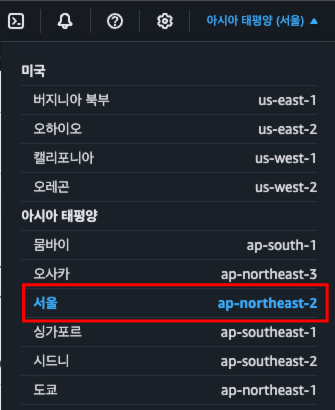

2. CloudShell로 이동
   
   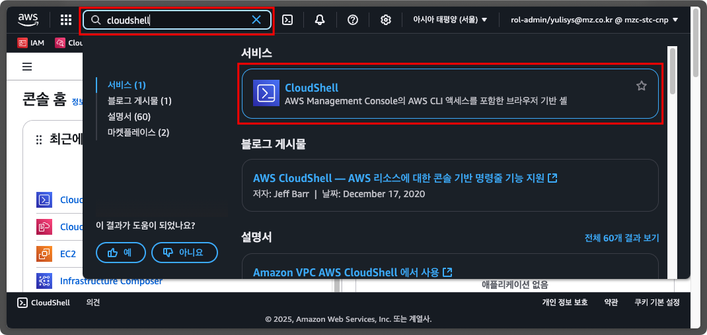

3. `code-server` 생성용 CloudFormation 실행

   `IDE_NAME` 환경 변수에 사용하기를 원하는 ID를 지정합니다.
   `IDE_NAME` 변수는 `code-server` 생성용 CloudFormation에 사용됩니다.
   ```shell
   export IDE_NAME=mzc-kjh
   ```

   CloudShell 에서 아래 명령을 실행하여 `code-server` 생성을 위한 CloudFormation Stack을 생성합니다. (대략 10분 정도 소요됩니다.)

   ```shell
   aws cloudformation create-stack \
       --stack-name eks-workshop-${IDE_NAME} \
       --template-body "$(curl -fsSL https://raw.githubusercontent.com/megazone-stc-cnp/eks-edu/refs/heads/main/00_Setup/eks-workshop-vscode-cfn.yaml)" \
       --capabilities CAPABILITY_NAMED_IAM \
       --region ${AWS_REGION}
   ```
   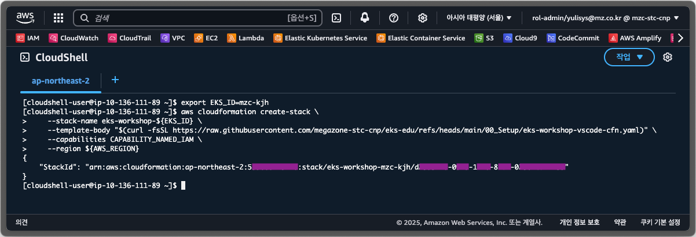

   CloudFormation으로 이동하여 `eks-workshop-${IDE_NAME}` 스택의 상태를 확인하여 `CREATE_COMPLETE`가 될때까지 기다립니다.

   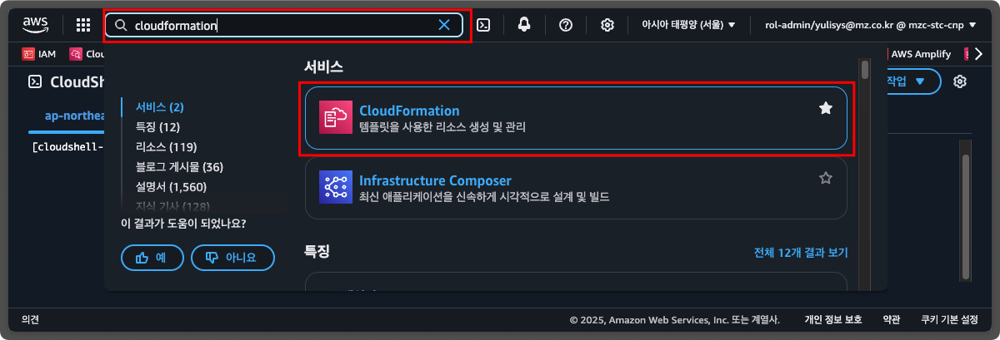

   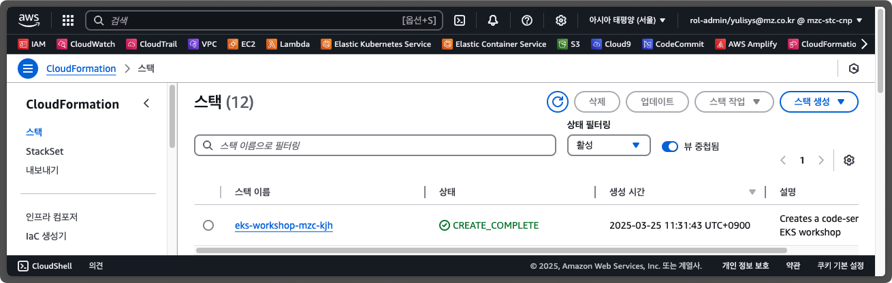
   
   CloudFormation의 출력(Outputs) 탭에서 code-server 접속을 위한 정보를 확인할 수 있습니다.

   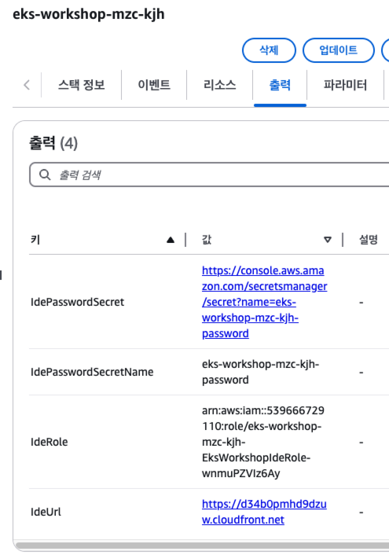

   - `IdeUrl`에는 `code-server` IDE를 접속할 수 있는 URL입니다.
   
   - `IdePasswordSecret`에는 `code-server` IDE 접속 시 사용할 비밀번호가 저장된 AWS Secrets Manager의 보안 암호를 확인할 수 있는 링크입니다.

4. `code-server` 접속
   
   `code-server` 접속 비밀번호를 얻기위해 `IdePasswordSecret` 링크를 클릭하여 AWS Secrets Manager로 이동한 후, `개요` 탭에서 `보안 암호 값 검색`(Retrieve secret value) 버튼을 클릭합니다.

   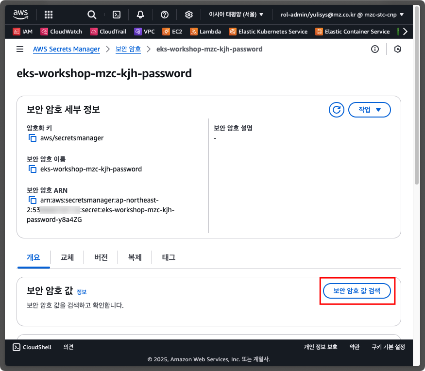

   화면에 표시된 비밀번호를 복사합니다.

   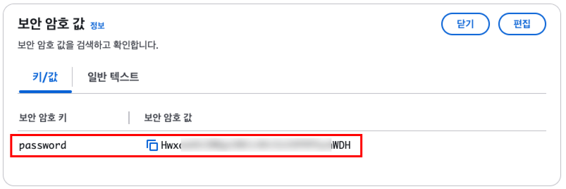

   CloudFormation의 `IdeUrl` 링크를 클릭한 후, 비밀번호에 이전에 복사한 비밀번호를 붙여넣기 한 후, `SUBMIT` 버튼을 클릭합니다.

   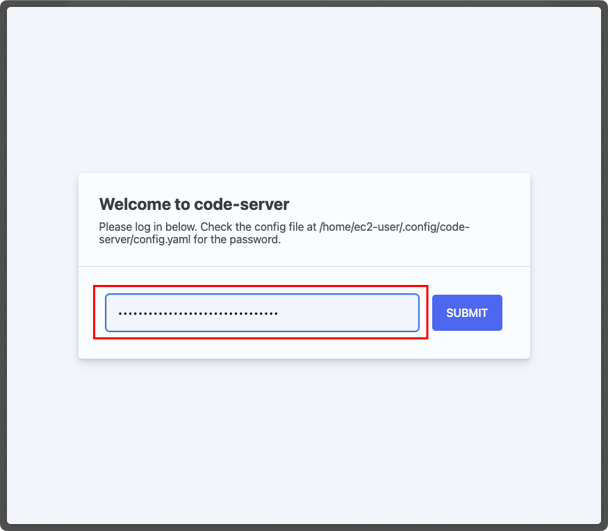

   접속 후, 아래와 같은 화면이 뜨면 실습 환경이 정상적으로 생성된 것입니다.🎉🎉🎉
   
   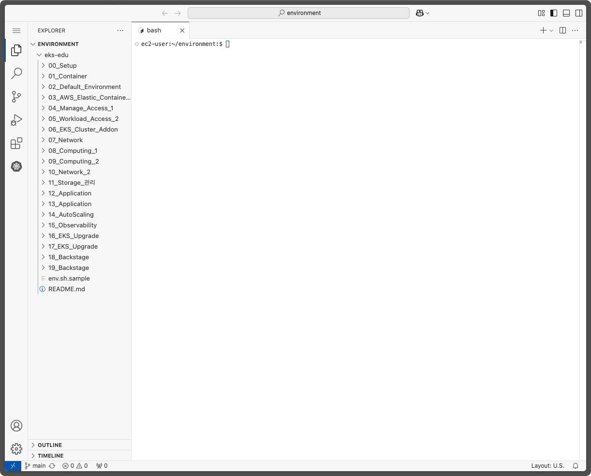

### 참고-1. `code-server` 에 기본으로 설치되는 프로그램

| Tool | version | release date |
| ---- | ------- | ------------ |
| [docker](https://github.com/moby/moby) | 25.0.8 | 2025-02-05 |
| [docker-compose](https://github.com/docker/compose) | 2.34.0 | - |
| [kubectl](https://kubernetes.io/docs/reference/kubectl/) | 1.31.6 | 2025-02-11 |
| [helm](https://helm.sh) | 3.17.2 | 2025-03-14 |
| [eksctl](https://github.com/eksctl-io/eksctl) | 0.206.0 | 2025-03-23 |
| [kubeseal](https://github.com/bitnami-labs/sealed-secrets) | 0.28.0 | 2025-01-16 |
| [argocd](https://github.com/argoproj/argo-cd) | 2.14.8 | 2025-03-25 |
| [AWS CLI](https://aws.amazon.com/ko/cli/) | v2 | - |
| [yq](https://github.com/mikefarah/yq) | 4.45.1 | 2025-01-12 |
| [fzf](https://github.com/junegunn/fzf) | 0.60.3 | 2025-03-03 |
| [terraform](https://www.terraform.io/) | 1.11.2 | 2025-03-12 |

## 2. 환경 정리 (삭제)

생성된 자원을 삭제하려면 CloudShell 에서 아래 명령어어를 입력해 주세요.

```shell
export IDE_NAME=mzc-kjh

aws cloudformation delete-stack --stack-name eks-workshop-${IDE_NAME}
```

CloudShell이 아닌 CloudFormation에서 직접 Stack 을 선택하여 삭제하셔도 됩니다.

## 3. 정리하지 않고 계속 사용하기 (EC2 중지 후 재시작)

생성된 자원을 삭제하지 않고 `code-server`가 설치된 EC2만 중지 후 재시작하여 사용할 수도 있습니다.

다음의 절차에 따라 CloudFront 정보를 업데이트하시면 됩니다.

1. EC2 Instance 의 퍼블릭 IP DNS 복사
   
   EC2가 재시작될 경우, 퍼블릭 IP 주소가 변경되기 때문에 이와 관련된 퍼블릭 IP DNS 주소를 CloudFront 에 업데이트해 주어야 합니다.

   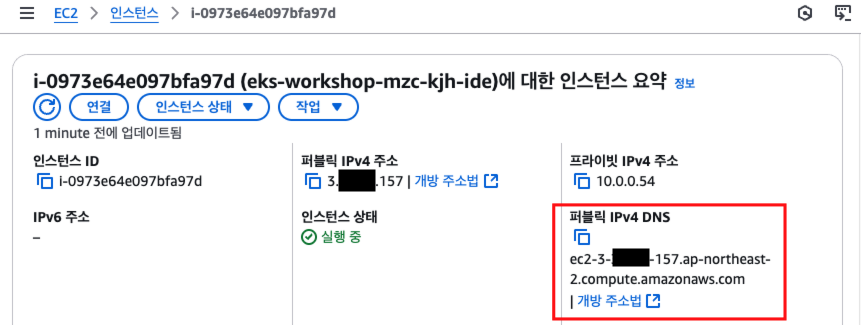

2. CloudFront의 Origin 주소 업데이트
   
   복사한 EC2의 퍼블릭 IP DNS를 CLoudFront 에 업데이트해 주세요.
   
   1. CloudFront 에서 생성된 배포 ID를 선택합니다.
      
      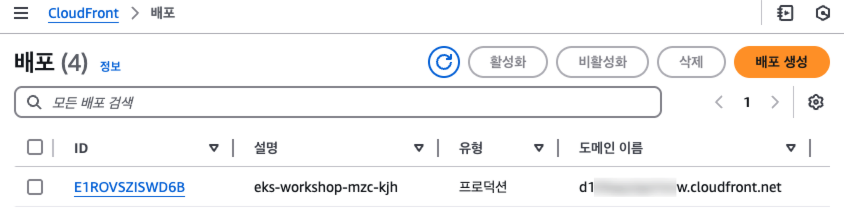

   2. 원본(Origins) 탭을 누르고 생성된 원본 선택 후 "편집" 버튼을 클릭합니다.
      
      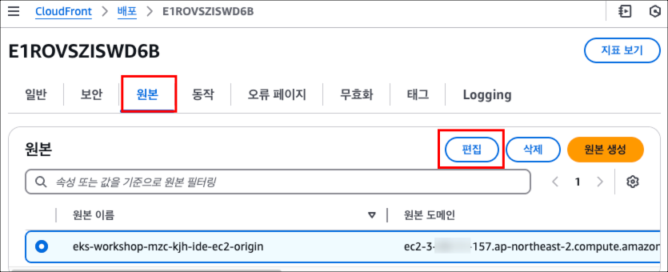

   3. "Origin domain" 입력란에 복사한 EC2의 퍼블릭 IP DNS를 붙여넣기 한 후, "변경 사항 저장" 버튼을 클릭하여 적용합니다.
      
      

CloudFront 정보 업데이트 후, 약 2~3분 기다리시면 다시 접속이 가능합니다.