# Container 기술 일반

## 사전 조건
- [0. 교육 환경 구성하기](/00_Setup/README.md)를 이용해 생성된 `code-server`에 접속한 상태여야 합니다.

---

## 학습 목표
- Docker
    - 컨테이너 기술 대중화의 시작이 된 Docker 에 대한 기본 지식 습득
    - 기본적인 Docker 명령어 및 Docker 이미지 생성방법 실습
- Kubernetes (이후 K8s)
    - K8s 기본 지식 습득
    - Kind 를 이용한 K8s Cluster 생성 실습
    - kubectl 을 이용한 pod,ingress 배포 실습

---

## 1. Docker
### 1-1. Container

컨테이너는 호스트 머신에서 실행되는 샌드박스 프로세스를 뜻하며, 해당 호스트 머신에서 실행되는 다른 모든 프로세스와 `격리되어(Isolated)` 있습니다.

이러한 프로세스 격리를 구현하기 위해 [kernel namespace와 cgroup](https://www.44bits.io/ko/keyword/linux-namespace)을 사용하며 이 기술은 Linux 에 이미 오래전부터 탑재되어 있었지만 대중화되지는 못하였습니다.

---

Docker는 이 격리 기술을 사용하기 쉽게 만들어 대중에 공개하였고, 이후 컨테이너 기술에 대한 사용 및 발전이 비약적으로 증가하게 되어, 표준 기술 중 하나로 자리를 잡게 되었습니다.

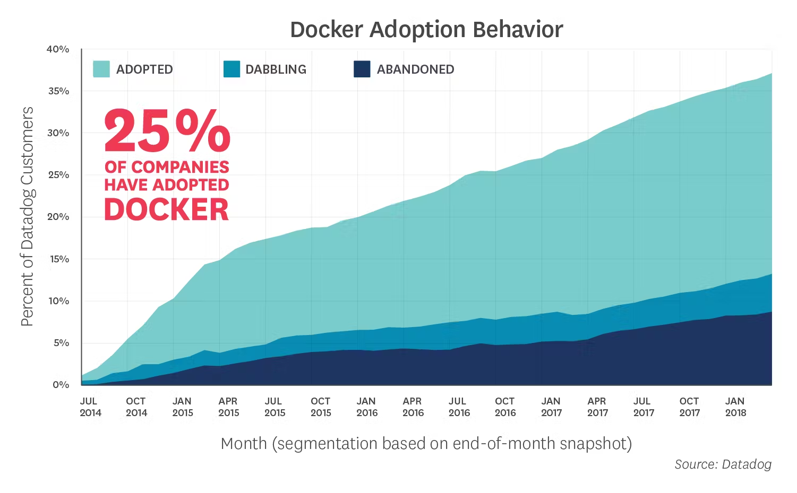
(Source: [Datadog Report(2018)](https://www.datadoghq.com/docker-adoption/))

---

### 1-2. Container Image

컨테이너 이미지는 애플리케이션을 실행하는 데 필요한 모든것(Application 실행에 필요한 시스템 라이브러리, 환경변수, 스크립트 등)이 포함되어 있습니다.
실행 중인 컨테이너는 컨테이너 이미지를 통해 격리된 파일 시스템을 사용합니다.

예전부터 Docker 가 하나의 표준으로 사용되었기 때문에 컨테이너 이미지라는 용어보다는 Docker 이미지라는 용어를 사용합니디만, Docker 이미지와 컨테이너 이미지는 동일한 용어입니다.

---

### 1-3. Container Image Registry

컨테이너 이미지를 보관하고 관리하는 중앙 집중식 저장소를 뜻합니다. 

대표적으로는 [Docker Hub](https://hub.docker.com/)가 있으며, 다음과 같이 자체 관리형으로 직접 구축해 사용하거나 Cloud 사업자가 제공하는 서비스를 이용할 수도 있습니다.

| Registry | Pricing | Repo Type | 
| -------- | ------- | ------------ |
| [Docker Hub](https://hub.docker.com/) | Free & Paid | Public/Private |
| [GitHub Package Registry](https://docs.github.com/ko/enterprise-cloud@latest/packages/working-with-a-github-packages-registry) | Paid | Public/Private |
| [AWS Elastic Container Registry](https://aws.amazon.com/ko/ecr/) | Paid | Public/Private |
| [Google Cloud Artifact Registry](https://cloud.google.com/artifact-registry/docs?hl=ko) | Paid | Private |
| [Azure Container Registry](https://azure.microsoft.com/ko-kr/products/container-registry) | Paid | Public/Private |
| [Habor](https://goharbor.io/) | Free(OSS) | Private |

---

### 1-4. Docker 이후,

Docker의 인기가 날로 높아지게 되면서, Docker를 포함한 여러 회사들이 모여 Docker의 내부 기술을 여러가지 표준 기술들로 정립하게 되는데, 대표적으로는 다음과 같습니다.

- [containerd](https://containerd.io/): Container Runtime, Kubernetes 의 Container Runtime 으로 채택되었음.
- [OCI Image Spec](https://github.com/opencontainers/image-spec): Container Image를 만들기 위한 표준 포맷.<br>이 표준을 이용하여 Docker 없이도 Container Image를 생성하는 여러 도구가 존재함.<br>([Buildpacks](https://buildpacks.io/), [BuildKit](https://github.com/moby/buildkit), [Buildah](https://buildah.io/), [Jib](https://github.com/GoogleContainerTools/jib), [Kaniko](https://github.com/GoogleContainerTools/kaniko) )
- [compose spec](https://compose-spec.io/): Container Compose(=docker-compose) 표준

---

### 1-5. Dockerfile 이해하기

Docker 이미지를 생성하기 위해서는 이미지에 어떤 내용을 포함해야 할지 알려주어야 합니다.
이때 사용하는 파일을 `Dockerfile` 이라고 부르며 다음과 같은 형태를 갖습니다.

```dockerfile
# syntax=docker/dockerfile:1

FROM node:lts-alpine
WORKDIR /app
COPY . .
RUN yarn install --production
CMD ["node", "src/index.js"]
EXPOSE 3000
```

위 `Dockerfile`의 내용은 다음과 같습니다.

---

<style scoped>
   table {
      font-size: 22px;
   }
</style>

| Instruction | Description |
| ----------- | ----------- |
| [FROM](https://docs.docker.com/reference/dockerfile/#from) | Docker 이미지로 만들기 위한 `base image`를 지정합니다.<br/> 위 예제에서는 Node.js의 최신 Alpine LInux 기반 이미지를 사용합니다. |
| [WORKDIR](https://docs.docker.com/reference/dockerfile/#workdir) | 컨테이너 내부의 작업 디렉토리를 지정합니다.<br/> 이후의 모든 명령(COPY,RUN,CMD)은 이 디렉토리 안에서 실행되고, `COPY` 지시문을 이용해 파일을 복사하면 이 `WORKDIR`에 지정한 곳을 기준으로 복사됩니다. |
| [COPY](https://docs.docker.com/reference/dockerfile/#copy) | 로컬(호스트 머신) 파일을 컨테이너 내부로 복사합니다. |
| [RUN](https://docs.docker.com/reference/dockerfile/#run) | Docker 이미지를 생성할 때 지정된 명령어를 실행합니다.<br/> 지정한 명령어는 `FROM` 지시문을 통해 지정된 이미지안에 존재하거나, `COPY` 등을 통해 새롭게 생성된 이미지내에 존재해야 합니다.<br/> `RUN` 지시문을 통해 명령어가 실행될 경우, 이때 생성되는 파일들은 만들고자 하는 최종 Docker Image에 포함됩니다. |
| [CMD](https://docs.docker.com/reference/dockerfile/#cmd) | 생성된 Docker 이미지가 구동될 때 실행할 명령어를 지정합니다. |
| [EXPOSE](https://docs.docker.com/reference/dockerfile/#expose) | 컨테이너에서 사용할 포트를 개방합니다.<br/> `EXPOSE`를 사용하지 않으면 컨테이너 외부에서 컨테이너 내부의 Application으로 통신이 되지 않습니다. |

---

<style scoped>
   table {
      font-size: 21px;
   }
</style>

Dockerfile 에서 사용할 수 있는 전체 지시문([Dockerfile reference](https://docs.docker.com/reference/dockerfile/))은 아래와 같으며 자세한 내용은 각 지시문의 링크를 확인해 주세요. 

| 지침 | 설명 | 지침 | 설명 |
|-----|-----|-----|-----|
[ADD](https://docs.docker.com/reference/dockerfile/#add) | 로컬 또는 원격 파일과 디렉토리를 추가합니다. |[HEALTHCHECK](https://docs.docker.com/reference/dockerfile/#healthcheck) | 시작 시 컨테이너의 상태를 확인합니다. |
[ARG](https://docs.docker.com/reference/dockerfile/#arg) | 빌드 타임 변수를 사용합니다. |[LABEL](https://docs.docker.com/reference/dockerfile/#label) | 이미지에 메타데이터를 추가합니다. |
[CMD](https://docs.docker.com/reference/dockerfile/#cmd) | 기본 명령을 지정합니다. |[MAINTAINER](https://docs.docker.com/reference/dockerfile/#maintainer) | 이미지의 작성자를 지정합니다. |
[COPY](https://docs.docker.com/reference/dockerfile/#copy) | 파일과 디렉토리를 복사합니다. |[ONBUILD](https://docs.docker.com/reference/dockerfile/#onbuild) | 빌드에서 이미지를 사용하는 경우에 대한 지침을 지정합니다. |[RUN](https://docs.docker.com/reference/dockerfile/#run) | 빌드 명령을 실행합니다. |
[ENTRYPOINT](https://docs.docker.com/reference/dockerfile/#entrypoint) | 기본 실행 파일을 지정합니다. |[SHELL](https://docs.docker.com/reference/dockerfile/#shell) | 이미지의 기본 셸을 설정합니다. |[STOPSIGNAL](https://docs.docker.com/reference/dockerfile/#stopsignal) | 컨테이너를 종료하기 위한 시스템 호출 신호를 지정합니다. |
[ENV](https://docs.docker.com/reference/dockerfile/#env) | 환경 변수를 설정합니다. |[USER](https://docs.docker.com/reference/dockerfile/#user) | 사용자 및 그룹 ID를 설정합니다. |
[EXPOSE](https://docs.docker.com/reference/dockerfile/#expose) | 애플리케이션이 어떤 포트에서 수신 대기하고 있는지 알려줍니다. |[VOLUME](https://docs.docker.com/reference/dockerfile/#volume) | 볼륨 마운트를 생성합니다. |
[FROM](https://docs.docker.com/reference/dockerfile/#from) | 기본 이미지에서 새로운 빌드 단계를 만듭니다. |[WORKDIR](https://docs.docker.com/reference/dockerfile/#workdir) | 작업 디렉토리를 변경합니다. |

---

### 1-6. Docker CLI 주요 명령어

Dockerfile 을 이용해 Docker 이미지를 생성할 준비를 마쳤다면, Docker CLI 명령을 이용해 이미지를 만들수 있습니다.

이미지를 만들기 전에 Docker CLI 에서 주로 사용하는 명령어에 대해 살펴보겠습니다.

---

<style scoped>
   table {
      font-size: 17px;
   }
</style>

| **분류**        | **명령어**                                                      | **설명** |
| ---------- | ---------------------------------------------------------- | ---------------------------- | 
| Image      | `docker build -t <image_name> .`                           | Dockerfile로 이미지 빌드 | 
|            | `docker images`                                            | 이미지 목록보기 |
|            | `docker rmi <image_name>`                                  | 선택한 이미지 삭제 |
|            | `docker image prune`                                       | 사용하지 않는 모든 이미지 삭제 |
| Docker Hub | `docker login -u <username>`                               | Docker Hub에 로그인 |
|            | `docker pull <image_name>`                                 | 선택한 이미지를 docker hub 에서 다운로드 |
|            | `docker push <username>/<image_name>`                      | 이미지를 Docker Hub에 Push |
| Container  | `docker run --name <container_name> <image_name>`          | 도커 이미지를 이용해 컨테이너 생성 및 실행 |
|            | `docker run -p <host_port>:<container_port> <image_name>`  | 컨테이너 포트를 호스트 머신의 포트로 개방하여 컨테이너 실행 |
|            | `docker run -d <image_name>`                               | 컨테이너를 백그라운드로 실행(데몬) |
|            | `docker start\|stop <container_name> (또는 <container_id>)` | 기존 컨테이너를 시작하거나 중지 |
|            | `docker rm <container_name>`                               | 중지된 컨테이너 삭제 |
|            | `docker exec -it <container_name> sh`                      | 실행중인 컨테이너 안에서 shell 실행 |
|            | `docker logs -f <container_name>`                          | 컨테이너 로그 출력 |
|            | `docker ps`                                                | 현재 실행 중인 컨테이너 목록 보기 |

---

### 1.7. 실습 #1 - Application을 컨테이너화 하기

#### 실습 목표
1. Docker CLI 의 기본 명령어에 대해 이해합니다.
1. Docker CLI를 이용해 Docker 이미지를 만들고, 실행할 수 있습니다.

> [!NOTE]
> 아래 실습 내용은 docker에서 제공하는 [Docker workshop](https://docs.docker.com/get-started/workshop/)의 내용을 각색해서 제공하였음을 알려드립니다.

---

#### 1.7. 실습 #1-1. 실습용 App 다운로드
Docker 에서 제공하는 실습용 Application인 `todo` App을 이용하여 Docker Image를 생성해 보겠습니다.

1. `code-server`에 접속합니다.

1. `terminal`을 실행하고, `~/environment/01_Container` 디렉토리로 이동합니다.
   ```bash
   cd ~/environment/eks-edu/01_Container
   ```

---

1. [getting-started-app](https://github.com/docker/getting-started-app/tree/main) 앱을 clone합니다.
   ```bash
   git clone https://github.com/docker/getting-started-app.git
   ```
   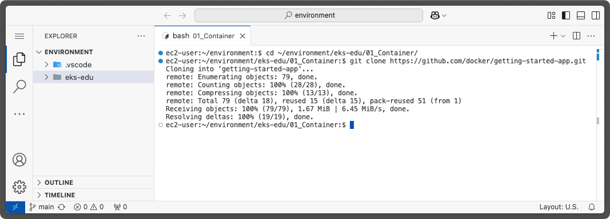

---

1. clone된 repository의 내용을 확인합니다. 아래와 같은 내용이 표시되어야 합니다. 
   ```
   .
   └─ getting-started-app/
      ├── spec/
      ├── src/
      ├── .dockerignore
      ├── package.json
      ├── README.md
      └── yarn.lock
   ```
   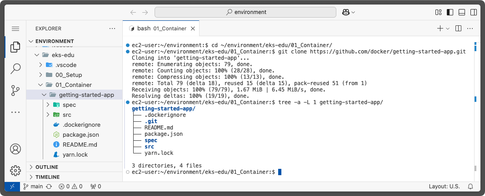

---

#### 1.7. 실습 #1-2. App용 이미지 빌드하기
Docker에서 Docker 이미지를 만들려면, 위에서 설명한 것과 같이 `Dockerfile`이 필요합니다.

1. `Dockerfile` 만들기
   `1-1`에서 clone 한 `getting-started-app` 디렉토리 안에 `Dockerfile`파일을 생성하고 아래 내용을 붙여넣어 주세요.

   ```dockerfile
   FROM node:lts-alpine
   WORKDIR /app
   COPY . .
   RUN yarn install --production
   CMD ["node", "src/index.js"]
   EXPOSE 3000
   ```

---

   

   

---

2. Docker Image 빌드하기
   Terminal 에서 `getting-started-app` 디렉토리로 이동합니다.
   ```bash
   cd ~/environment/eks-edu/01_Container/getting-started-app
   ```

   `code-server` 환경에서 테스트가 가능하도록 `getting-started-app/src/static/js/app.js` 파일의 내용을 아래 명령어를 이용해 변경합니다.
   ```bash
   sed -i 's/\/items/\/proxy\/3000\/items/g' src/static/js/app.js
   ```

   `docker build` 명령을 이용해 이미지를 빌드합니다.
   ```bash
   docker build -t getting-started .
   ```

---

   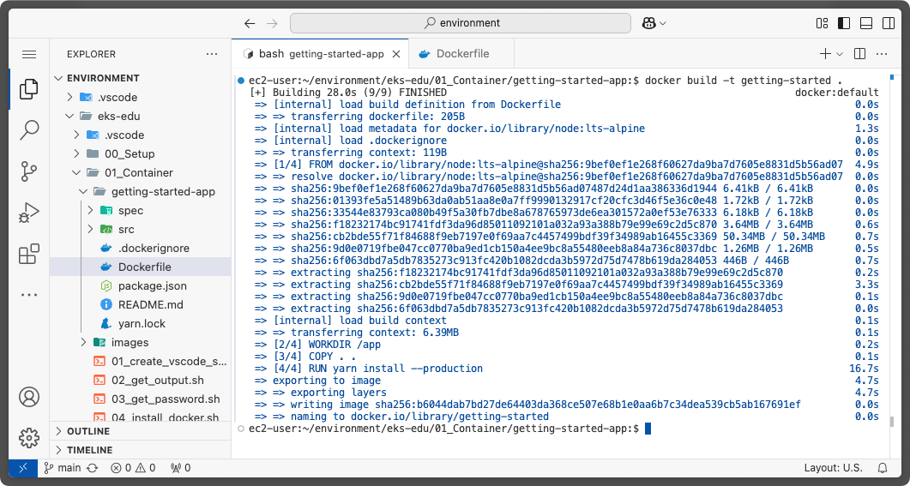

---

3. 생성된 Docker Image 확인

   Docker Image 빌드가 완료되었다면, 해당 이미지가 정상적으로 생성되었는지 확인할 수 있습니다.

   ```bash
   docker images
   ```
   또는
   ```bash
   docker image ls
   ```

---

   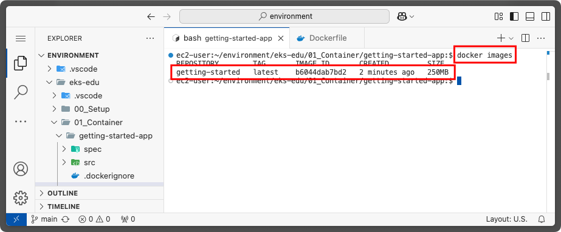

---

#### 1-7. 실습 #1-3. 컨테이너 실행하기

1. 컨테이너 실행하기

   생성한 Docker Image를 이용해 `docker run` 명령으로 컨테이너를 실행해 보겠습니다.

   ```bash
   docker run -d -p 127.0.0.1:3000:3000 getting-started
   ```

   | option | 설명 |
   |--------|------|
   | `-d` (`--detach`의 짧은 표기) | 컨테이너를 백그라운드로 실행합니다. |
   | `-p` (`--public`의 짧은 표기) | 호스트 머신과 컨테이너 사이를 연결해 주는 port를 지정합니다. <br>`HOST:CONTAINER` 형태로 사용할 수 있으며, 위의 예시에서는 `127.0.0.1:3000` 부분이 `HOST` 부분입니다.|

---

   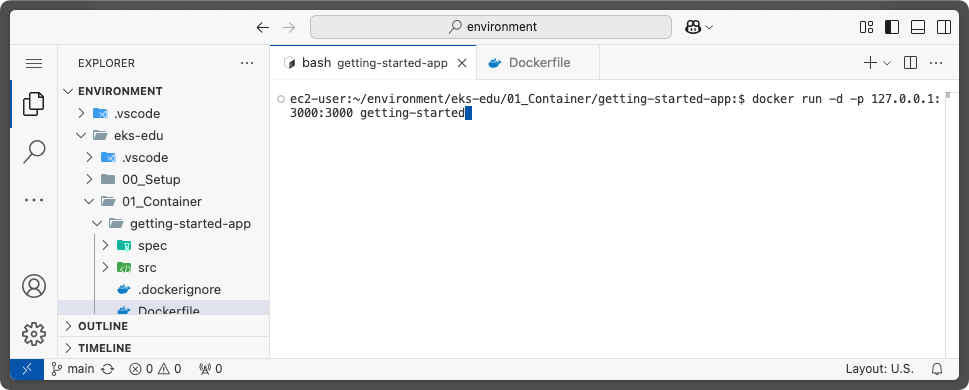

   정상적으로 실행이 완료되면, `code-server`에서 아래와 같은 팝업 창을 보여줍니다. `Open in Browser` 버튼을 클릭해 보겠습니다.
   
---

   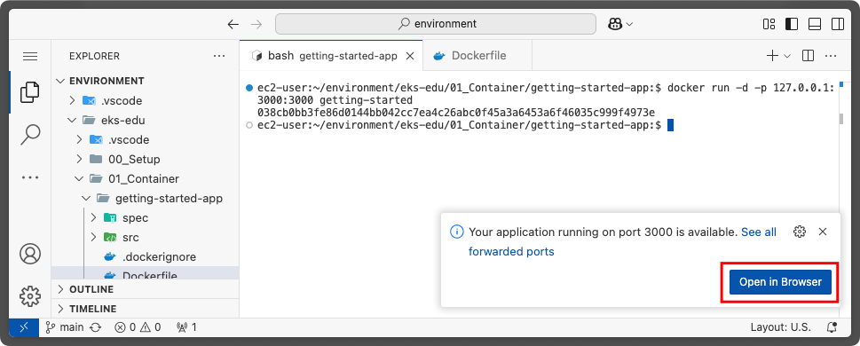

   새로운 탭이 열리면서 아래와 같은 화면이 뜨면 정상적으로 구동이 된 것입니다.🎉🎉

   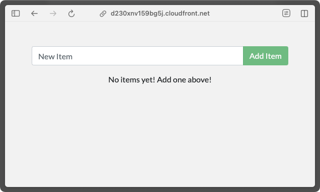

---

   "New Item" 입력란에 새로운 `to-do` 항목을 입력해 추가하여 Application 이 정상 동작하는지 확인해 보세요.<br>
   (새로 등록하거나 완료 처리, 삭제등을 하고, 브라우저를 새로고침해도 데이터가 그대로 유지되는 것을 확인할 수 있습니다.)

   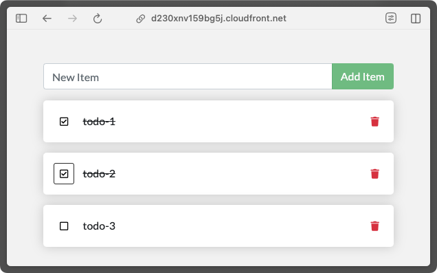

---

2. 실행중인 컨테이너 확인하기

   실행중인 컨테이너는 `docker ps` 명령으로 확인할 수 있습니다.

   ```bash
   docker ps
   ```

   실행된 결과는 아래와 같이 보여집니다.

   ```bash
   ec2-user:~/environment/eks-edu/01_Container/getting-started-app:$ docker ps
   CONTAINER ID   IMAGE             COMMAND                  CREATED         STATUS         PORTS                      NAMES
   8fe40f192a79   getting-started   "docker-entrypoint.s…"   9 minutes ago   Up 9 minutes   127.0.0.1:3000->3000/tcp   inspiring_wing
   ```

---

#### 1.7. 실습 #2-1 - 소스 코드 업데이트하기

제공된 예제 소스의 내용중 일부 메세지를 한글화 해보겠습니다.

1. `src/static/js/app.js` 파일을 열어 `56번째 라인`의 내용을 아래와 같이 수정합니다.
   ```JSX
   // <p className="text-center">No items yet! Add one above!</p>
   <p className="text-center">아직 할 일 항목이 없습니다! 위에 하나 추가하세요!</p>
   ```

   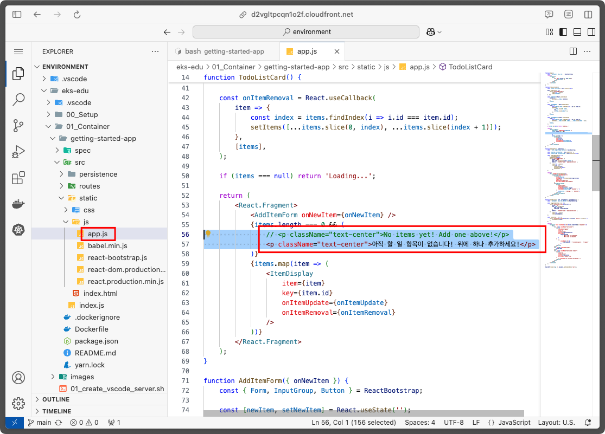

---

2. `docker build` 명령어를 이용해 Docker 이미지를 다시 빌드합니다.
   ```bash
   docker build -t getting-started ~/environment/eks-edu/00_Setup/.
   ```

3. 새로 업데이트된 이미지를 이용해 새로운 컨테이너를 실행합니다.
   ```bash
   docker run -dp 127.0.0.1:3000:3000 getting-started
   ```

4. 실행 결과를 확인합니다.
   docker run 실행 후에는 아래와 같은 오류 메세지를 보셨을 겁니다.
   
   ```bash
   $ docker run -dp 127.0.0.1:3000:3000 getting-started
   06a9ac475f9ad9d60cc05a239c345cdbc2ffb0d41e910b3fd2705bbcc79b354f
   docker: Error response from daemon: driver failed programming external connectivity on endpoint nice_babbage 
   (49157a0c6e5e5ae4ee019a15436b86efcdb1b791d4ca6f2804077646b1b7f802): 
   Bind for 127.0.0.1:3000 failed: port is already allocated.
   ```

---

   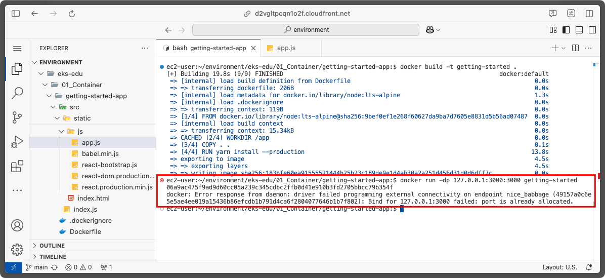

   이 오류가 발생한 원인은 소스 코드를 업데이트하기 이전에 이미 컨테이너가 아직 실행 중이기 때문입니다. 왜냐하면 이전에 실행한 컨테이너가 호스트의 `3000`번 포트를 이미 리스닝 중이기 때문에 새로운 컨테이너를 실행할때에도 `3000`번 포트를 사용하려다가 발생하는 문제입니다.

   이 문제를 해결하려면 이전에 실행했던 컨테이너를 삭제해야 합니다.

---

#### 1.7. 실습 #2-2. 이전에 실행한 컨테이너 삭제하기

1. `docker ps` 명령을 실행하여 실행중인 컨테이너의 ID를 복사합니다.
   ```bash
   docker ps
   ```

   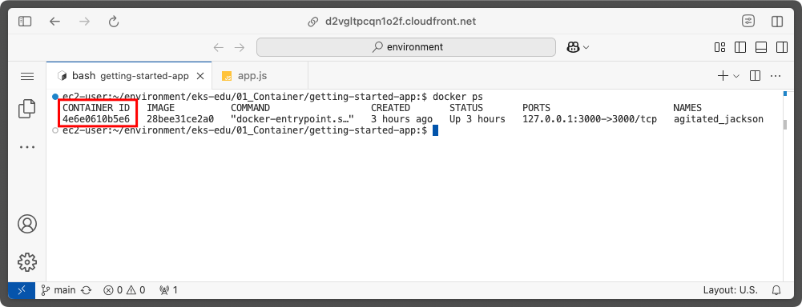

---

2. `docker stop` 명령을 이용해 실행중인 컨테이너를 종료합니다.
   ```bash
   docker stop <컨테이너ID>
   ```

   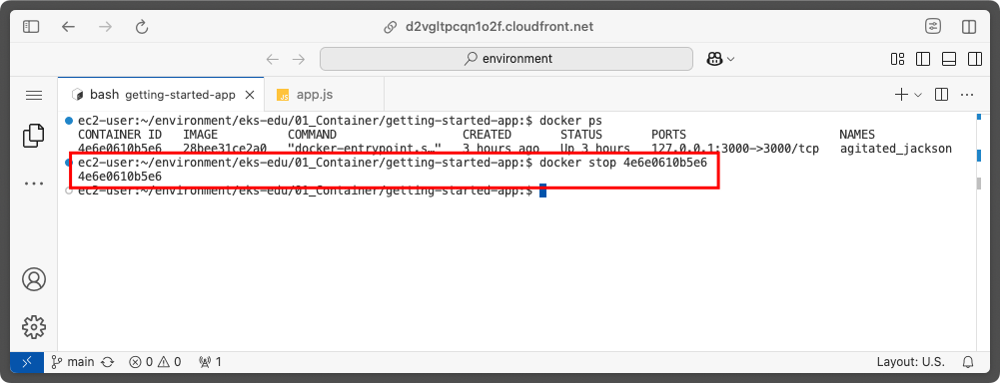

---

3. 컨테이너가 종료된 이후, `docker rm` 명령을 이용해 컨테이너를 삭제합니다.
   ```bash
   docker rm <컨테이너ID>
   ```

   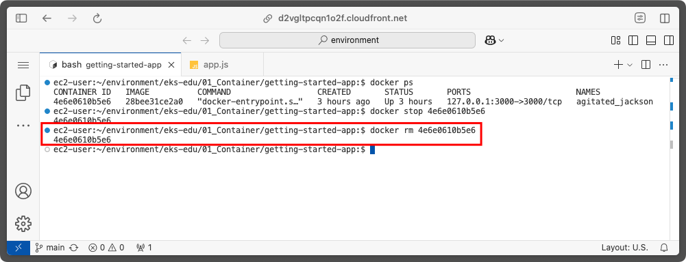

---

#### 1.7. 실습 #2-3. 새로 업데이트했던 컨테이너 실행하기

1. "실습 #2-2"를 이용해 컨테이너를 삭제한 이후에는 새로운 컨테이너를 실행할 수 있습니다.
   ```bash
   docker run -dp 127.0.0.1:3000:3000 getting-started
   ```

   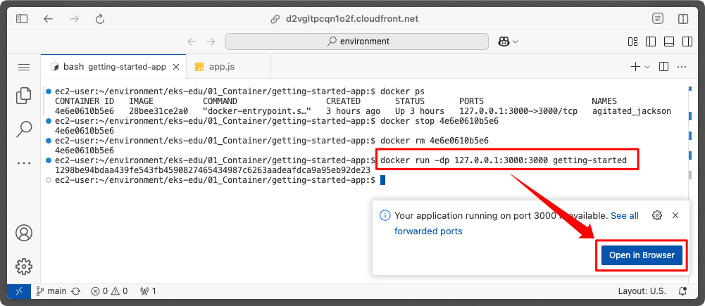

---

   `docker run` 명령이 성공적으로 실행되면 다시 "Open in Browser" 버튼이 표시됩니다. 해당 버튼을 클릭하여 영문 메세지가 한글 메세지로 변경되었는지 확인해 주세요.

   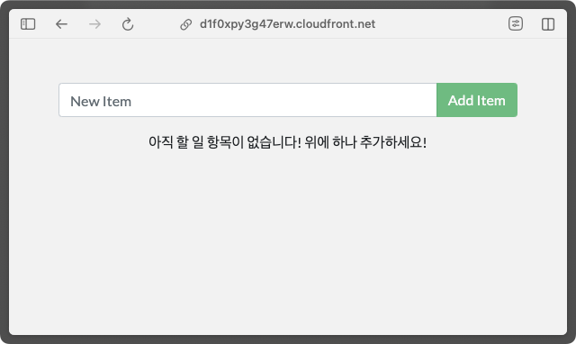

---

## 2. Kubernetes

### 2-1. Kubernetes 란?

Kubernetes 에서는 다음과 같이 정의하고 있습니다.

> [!NOTE]
> Kubernetes는 컨테이너화된 워크로드와 서비스를 관리하기 위한 이식할 수 있고,<br/>
> 확장 가능한 오픈소스 플랫폼으로, 선언적 구성과 자동화를 모두 지원한다.
> 
> Kubernetes란 명칭은 키잡이(helmsman)나 파일럿을 뜻하는 그리스어에서 유래했으며,<br/>
> K8s라는 표기로도 사용되는데, "K"와 "s", 그 사이에 있는 8글자를 나타내는 약식 표기이다.

---

### 2-2. Kubernetes 로의 진화 과정


---

| 배포 세대 | 설명 |
| -------- | --- |
| 전통적인 배포 시대 | <ul><li>물리 서버에서 직접 애플리케이션을 실행 → 리소스 할당 문제 발생</li><li>여러 물리서버로 분산 가장하지만, 비효율적이고 높은 유지 비용 발생</li></ul> |
| 가상화된 배포 시대 | <ul><li>가상화 도입</li><li>가상 머신(VM)으로 애플리케이션을 격리하여 보안성과 리소스 활용도 향상</li><li>물리 서버의 리소스를 효율적으로 활용하여, 확장성과 유연성 증가</li></ul> |
| 컨테이너 배포 시대 | <ul><li>OS를 공유하여 가벼환 환경을 제공하는 컨테이너 기술로 발전 → 배포 및 확장 용이</li><li>VM과 유사한 격리 기능을 가지면서도 더 빠르고 이동성<sup>1)</sup>이 뛰어남</li><ul> |

<sub>1\) 이동성(Portability) : 어떤 환경에서도 동일하게 실행될 수 있는 능력</sub>

---
<style scoped>
   table {
      font-size: 23px;
   }
</style>

### 2-3. Container 기술이 각광 받는 이유

| 항목 | 설명 |
| --- | --- |
| 기민한 애플리케이션 생성과 배포 | VM 이미지보다 컨테이너 이미지 생성이 쉽고, 효율적 |
| **<ins>지속적인 개발, 통합 및 배포</ins>** | **<ins>불변(Immutable) 이미지 덕분에 안정적으로 빌드 및 배포, 빠른 롤백 가능</ins>** |
| **<ins>개발과 운영의 관심사 분리</ins>** | **<ins>배포 시점이 아닌 빌드/릴리즈 시점에 컨테이너 이미지 생성 → 인프라와 분리 → OS에 대해 신경써야 하는 내용 감소</ins>** |
| 가시성 (Observability) | OS 정보뿐만 아니라 애플리케이션 상태와 다양한 시그널을 모니터링 가능 |
| 실행 환경의 일관성 | 개발, 테스트, 운영 환경에서 동일한 방식으로 실행 |
| 이식성 (Portability) | 다양한 OS(Ubuntu, RHEL, CoreOS) 및 온프레미스 또는 클라우드 환경(AWS, Azure, GCP)에서 실행 가능 |
| **<ins>MSA에 적합</ins>** | **<ins>단일 모놀리식 애플리케이션이 아닌, 작고 독립적인 서비스 단위로 배포 및 관리 가능</ins>** |
| **<ins>유연한 자원 관리</ins>** | **<ins><ul><li>각 애플리케이션의 성능을 예측 가능하게 관리</li><li>고효율, 고집적으로 리소스를 활용하여 비용 절감 가능</li></ul></ins>** |

---

### 2-4. Kubernetes Component

Kubernetes는 컨트롤 플레인(Control Plane) 컴포넌트와 워커 노드(Worker node) 컴포넌트들로 구성되며 이러한 컴포너트를 관리하기 위해 클러스터로 관리합니다.

#### 2-4-1. 컨트롤 플레인 컴포넌트

컨트롤 플레인이란, Kubernetes 클러스터의 상태를 관리하고 워크로드를 조정하는 핵심 구성 요소입니다.

---


---

이러한 컨트롤 플레인에는 아래 그림과 같이 아주 많은 콤포넌트들로 구성되어 있으며, 이중에서 가장 중요한 부분은 다음과 같습니다.

| 컴포넌트 | 설명 |
| -------- | --- |
| API 서버 (kube-apiserver) | Kubernetes의 **모든 API 요청을 처리**하는 중앙 인터페이스 |
| 컨트롤러 매니저 (kube-controller-manager) | 다양한 컨트롤러를 실행하여 클러스터의 상태를 **원하는 상태(desired state)** 로 유지 |
| 스케줄러 (kube-scheduler) | CPU, 메모리 등의 리소스 요청과 현재 노드 상태를 고려하여 **최적 노드를 선택하여 파드(Pod)를 배치(Deployment)** |
| 클라우드 컨트롤러 매니저(cloud-controller-manager) | 클라우드 환경(AWS, GCP, Azure 등)과의 연동을 담당 |
| etcd | Kubernetes의 모든 클러스터 데이터를 저장하는 **Key-Value 저장소** |

---

#### 2-4-2. 워커 노드 컴포넌트

워커 노드 또는 노드 컴포넌트는 스케줄러를 통해 파드를 실행하며, 동작 중인 파드를 유지시키고 Kubernetes 런타임 환경을 제공합니다.

워커 노는는 다음과 같은 핵심 컴포넌트로 구성됩니다.

| 컴포넌트 | 설명 |
| -------- | --- |
| **kubelet** | <ul><li>각 노드에서 실행되는 Kubernetes의 핵심 Agent.</li><li>컨트롤 플레인과 통신하여 파드(Pod)를 관리</li></ul> |
| **Container Runtime** | <ul><li>컨테이너 실행 담당</li><li>[CRI(Container Runtime Interface)](https://github.com/kubernetes/community/blob/master/contributors/devel/sig-node/container-runtime-interface.md)를 지원하게 하여, [containerd](https://containerd.io/docs/), [CRI-O](https://cri-o.io/#what-is-cri-o) 와 같은 컨테이너 런타임 구현체들에게 위임</li></ul> |
| **kube-proxy** | <ul><li>클러스터의 각 노드에서 실행되는 네트워크 프록시</li><li>네트워크 라우팅 및 서비스간 통신 담당</li> |

---

### 2-5. Kubernetes 주요 용어

| 용어 | 설명 |
| --- | --- |
| Pod | 하나 이상의 컨테이너를 실행하기 위한 기본 배포 단위 |
| DaemonSet | 클러스터의 모든 노드에 동일한 Pod를 실행하도록 보장하는 배포 단위 |
| Deployment | 파드의 선언적 배포와 업데이트를 관리하며, 아래 ReplicaSet의 기능을 포함 |
| ReplicaSet | 원하는 수의 Pod 복제본을 유지하여 고가용성을 보장. (Deployment를 주로 사용하게 되어 최근에는 잘 사용하지 않음) |
| Job | 지정된 작업을 완료할 때까지 Pod를 실행하고, 완료 후 종료하는 일회성 작업 |
| Service | 클러스터 내에서 Pod간의 네트워크 연결을 추상화하고, 외부에서의 접근을 관리 |
| Namespace | 클러스터 내 리소스들을 논리적으로 그룹화하여 격리하고 관리하는 방법 제공 |
| kubectl | Kubernetes 클러스터를 관리하는 Command Line Tool |

---

### 2-6. 실습 #1. 클러스터 생성

#### 2-6-1. 실습 목표
 - Kind 가 무엇인지 배우기
 - Kind 를 이용하여 Kubernetes 클러스터 생성

---

#### 2-6-2. Kind 란?

<style scoped>
   p {
      font-size: 25px;
   }
</style>

> [!NOTE]
> `kind`는 "Kubernetes in Docker"의 약자이며, Docker를 이용한 컨테이너 노드에서 Kubernetes 클러스터를 실행하는 오픈소스 프로젝트입니다.<br>
> 주로 로컬 개발이나 Kubernetes 테스트 목적으로 경량화된 Kubernetes 클러스터를 생성/관리하는 도구입니다.

> [!WARNING]
> 실습 목적으로 사용하기에는 `kind`가 훌륭한 도구이지만, 실제 서비스 목적의 운영 환경(Production environment)에서는 kind 보다는
> `kubeadm`등을 이용하여 온프레미스에서 직접 Kubernetes 클러스터를 구축하거나, Cloud 사업자(AWS, Azure, GCP)가 제공하는 관리형 >Kubernetes 서비스들(AWS:[EKS](https://aws.amazon.com/ko/eks/), Azure:[AKS](https://azure.microsoft.com/ko-kr/products/kubernetes-service), GCP:[GKE](https://cloud.google.com/kubernetes-engine?hl=ko))을 이용하시는 것을 추천합니다.

> Kubernetes 클러스터 실습을 위해 `kind`를 `code-server`에 미리 설치해 두었습니다. `kind` 설치에 대한 자세한 안내는 [이곳](https://kind.sigs.k8s.io/docs/user/quick-start)에서 확인해 주세요.

---

#### 2-6-3. Kubernets 클러스터 생성

클러스터 생성은 `kind create cluster` 명령을 이용해 간단히 생성이 가능합니다.

```bash
$ kind create cluster

Creating cluster "kind" ...
 ✓ Ensuring node image (kindest/node:v1.32.2) 🖼 
 ✓ Preparing nodes 📦  
 ✓ Writing configuration 📜 
 ✓ Starting control-plane 🕹️ 
 ✓ Installing CNI 🔌 
 ✓ Installing StorageClass 💾 
Set kubectl context to "kind-kind"
You can now use your cluster with:

kubectl cluster-info --context kind-kind

Thanks for using kind! 😊
```

---

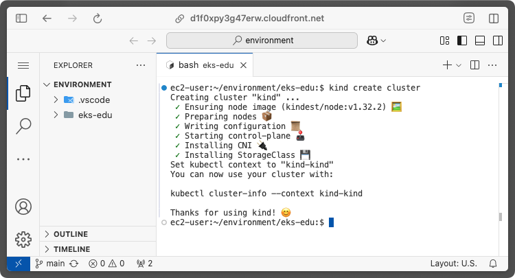

Kubernetes Cluster가 생성되었습니다.🎉🎉🎉

생성된 Kubernetes Cluster를 접근하기 위한 설정은 cluster가 생성될때 자동으로 설정됩니다.

---

생성된 cluster 정보는 `kubectl cluster-info` 명령을 이용해 확인할 수 있습니다.

```bash
kubectl cluster-info
```

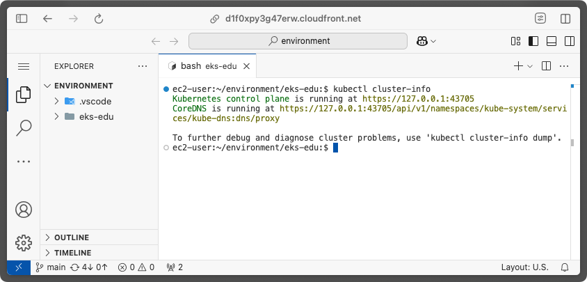

---

생성된 클러스터의 논리적인 모습은 다음과 같습니다.


---

### 2-7. 실습 #2. 앱 배포하기

#### 2-7-1. 실습 목표
- 컨테이너화된 Application을 Kubernetes에 배포하기 위한 Deployment에 대해 학습
- `kubectl`을 이용해 Application을 Kubernetes에 배포 실습

---

#### 2-7-2. Deployment 란?

- Deployment는 Kubernetes에 Application을 배포하기 위한 설정입니다. <br/>
- Deployment에는 Kubernetes가 Applicaiton의 인스턴스를 어떻게 생성하고 업데이트해야 하는지를 명시하며, Application 인스턴스는 **Pod**라는 단위로 관리합니다.
- Deployment를 통해 배포된 Application(Pod)는 지속적으로 모니터링되며, 배포가 된 노드가 다운되거나 삭제되면 Kubernetes 클러스터 내부의 다른 노드로 교체됩니다. (**Self-healing**)

---

Deployment 가 배포된 후에는 다음과 같은 논리적인 모습을 갖게 됩니다.


---

#### 2-7-3. 앱 배포하기

Kubernets 클러스터를 관리하기 위해서는 `kubectl` 이라는 CLI를 사용합니다.

마찬가지로 Application을 배포하려면 `kubectl` 을 이용해 Deployment를 생성하고 관리할 수 있습니다.

Deployment를 생성하기 위해서는 YAML 문법을 이용한 Kubernetes 매니페스트(manifest) 파일을 이용합니다.<br/>
   
---
<style scoped>
   p {
      font-size: 26px;
   }
</style>

실습을 위해 미리 `~/environment/eks-edu/01_Container/manifests/deployment.yaml` 파일을 미리 만들어 준비해 두었습니다.
   ```yaml
1:  apiVersion: apps/v1
2:  kind: Deployment
3:  metadata:
4:  name: nginx-deployment
5:  labels:
6:     app: nginx
7:  spec:
8:    replicas: 3
9:    selector:
10:       matchLabels:
11:          app: nginx
12:    template:
13:       metadata:
14:          labels:
15:          app: nginx
16:       spec:
17:          containers:
18:          - name: nginx
19:          image: nginx:latest
20:          ports:
21:          - containerPort: 80
   ```

---

위 내용은 
- `nginx` 웹서버용 Container 이미지를 사용 (line 19)
- 3개의 Pod를 실행 (line 8)
- `80` 번 포트를 사용 (line 21)

하는 내용입니다.

---

이제 준비된 deployment 용 매니페스트를 kubernetes 클러스터에 생성해 보겠습니다.

```bash
kubectl apply -f ~/environment/eks-edu/01_Container/manifests/deployment.yaml
```

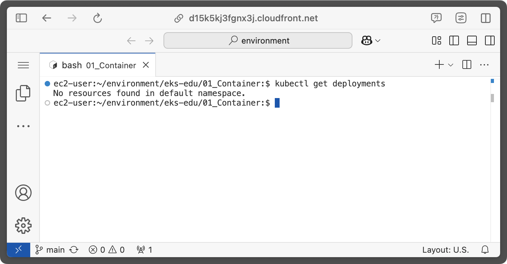

---

kubectl get deployments 명령을 실행해서 Deployment가 생성되었는지 확인합니다.
```bash
kubectl get deployments
```

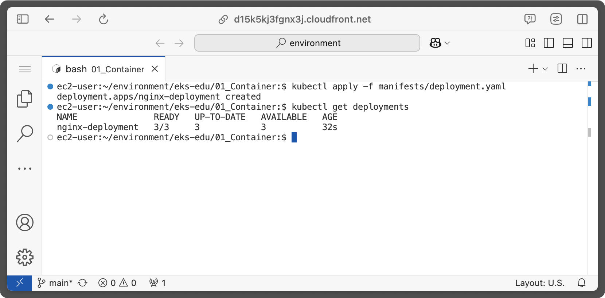

---

출력된 각 필드의 의미는 다음과 같습니다.

| 필드 | 설명 |
| --- | --- |
| `NAME` | Deployment 이름 |
| `READY` | Pod의 복제본 수. "3/3" 이라는 의미는 "ready/desired"를 뜻함 |
| `UP-TO-DATE` | 의도한 상태를 얻기 위해 업데이트된 복제본 수 |
| `AVAILABLE` | 현재 실행 중인 복제본 수 |
| `AGE` | Deployment가 실행된 시간 |

---

### 2-8. 실습 #3. 앱 확인하기

#### 2-8.1. 실습 목표
- Po에 대해 학습
- Node에 대해 학습
- 배포된 Application의 문제 해결 방법 학습

---

#### 2-8-2. Pod 개요

`2-7`에서 Deployment를 생성했을 때, Kubernetes 클러스터에는 Pod라고 불리는 Component가 생성됩니다.

Pod는 

- 하나 이상의 Container들의 그룹을 나타내는 추상적 개념
- 컨테이너의 자원을 일부 공유
- Kubernets 클러스터에서 최소 단위

를 뜻합니다.

---

생성된 Pod의 논리적인 모습은 다음과 같습니다.


---

#### 2-8-3. Pod 배포하기

   Pod 배포는 Deployment manifest 와 마찬가지로 YAML 문법을 이용해 아래와 같은 형태로 정의하여 생성할 수 있습니다.
   (실습을 위해 미리 `~/environment/eks-edu/01_Container/manifests/pod.yaml` 파일을 미리 만들어 준비해 두었습니다.)

   ```yaml
   apiVersion: v1
   kind: Pod
   metadata:
   name: nginx-pod
   labels:
      app: nginx-pod
   spec:
   containers:
      - name: nginx
         image: nginx:latest
         ports:
         - containerPort: 80
   ```

---

   이제 준비된 pod 용 매니페스트를 kubernetes 클러스터에 생성해 보겠습니다.

   ```bash
   kubectl apply -f ~/environment/eks-edu/01_Container/manifests/pod.yaml
   ```

   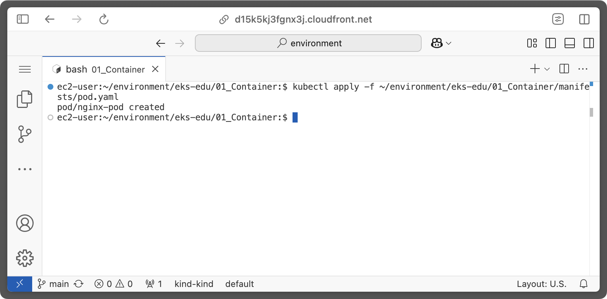

---

#### 2-8-4. 배포된 Pod 확인하기

`pod.yaml` 파일을 통해 생성된 pod 목록을 보기 위해 아래 명령어를 실행합니다.
(manifest 파일에 지정한 `app=nginx-pod` Label을 지정)

```bash
kubectl get pods -l app=nginx-pod
```

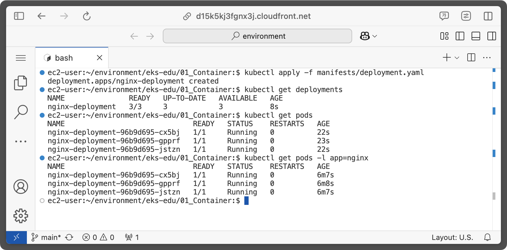

---

### 2-8-5. Node 개요

Node는 Kubernetes 에서 워커 노드를 말하며, Cluster가 구성된 환경에 따라 가상 또는 물리 머신이 될 수 있습니다.

각 Node는 

- 컨트롤 플레인에 의해 관리되며, Pod 스케줄링 등을 자동으로 처리하는 등의 관리를 받습니다.
- 하나의 Node는 여러개의 Pod를 가질 수 있습니다.

---

모든 Kubernetes의 Node들은 최소한 다음과 같이 동작합니다.

- Node에는 `kubelet`과 `Container Runetime`으로 구성
- **Kubelet**은 컨트롤 플레인과 노드 간 통신을 담당
- **Kubelet**은 하나의 머신 상에서 동작하는 파드와 컨테이너를 관리
- **Container runtime**(ex: `containerd`)은 Container Image Registry에서 컨테이너 이미지를 가져와 애플리케이션을 동작시키는 책임을 맡는다.

---

   노드의 논리적인 모습은 다음과 같습니다.

   

---

### 2-8-6. 배포된 Application의 문제 해결 방법

배포된 다양한 자원들(pod,deployment 등)의 동작에 문제가 발생할 경우 주로 다음의 명령을 사용합니다.

| 명령 | 설명 |
| --- | --- |
| `kubectl get <resource>` | resource 목록을 조회 |
| `kubectl describe <resource>` | resource에 대한 상세 정보 조회 |
| `kubectl logs <container>` | Pod 안의 Container 로그를 출력 |
| `kubectl exec <container>` | Pod 안의 COntainer에 대한 명령 실행 |

---

`kubectl exec` 명령을 이용해 Pod의 Container에 명령을 실행해 보겠습니다.