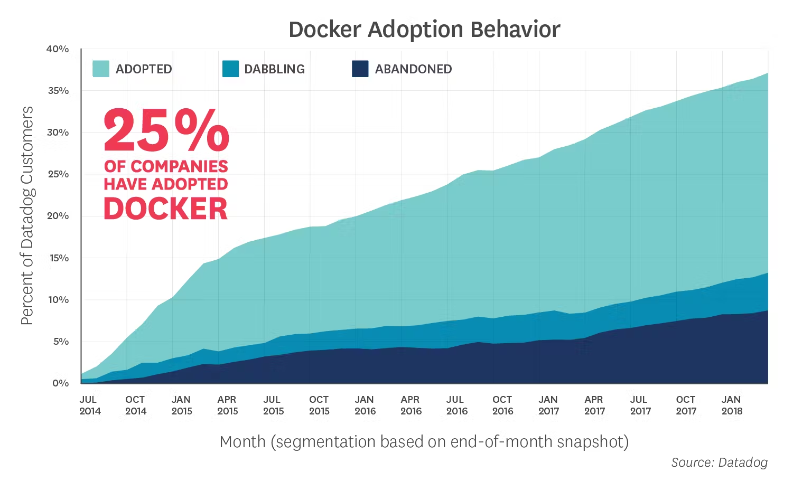

# Container 기술 일반

## 사전 조건
1. [0. 교육 환경 구성하기](00_Setup/)를 이용해 기본 실습 환경 생성이 되어 있어야 합니다.
2. [0. 교육 환경 구성하기](00_Setup/)를 이용해 생성된 `code-server`에 접속한 상태여야 합니다.

## 학습 목표
- Docker
    - 컨테이너 기술 대중화의 시작이 된 Docker 에 대한 기본 지식 습득
    - 기본적인 Docker 명령어 및 Docker 이미지 생성방법 실습
- Kubernetes (이후 K8s)
    - K8s 기본 지식 습득
    - Kind 를 이용한 K8s Cluster 생성 실습
    - kubectl 을 이용한 pod,ingress 배포 실습

## Container

컨테이너는 호스트 머신에서 실행되는 샌드박스 프로세스를 뜻하며, 해당 호스트 머신에서 실행되는 다른 모든 프로세스와 `격리되어(Isolated)` 있습니다.

이러한 프로세스 격리를 구현하기 위해 [kernel namespace와 cgroup](https://www.44bits.io/ko/keyword/linux-namespace)을 사용하며 이 기술은 Linux 에 이미 오래전부터 탑재되어 있었지만 대중화되지는 못하였습니다.

Docker는 이 격리 기술을 사용하기 쉽게 만들어 대중에 공개하였고, 이후 컨테이너 기술에 대한 사용 및 발전이 비약적으로 증가하게 되어, 표준 기술 중 하나로 자리를 잡게 되었습니다.


(Source: [Datadog Report(2018)](https://www.datadoghq.com/docker-adoption/))

## Container Image

컨테이너 이미지는 애플리케이션을 실행하는 데 필요한 모든것(Application 실행에 필요한 시스템 라이브러리, 환경변수, 스크립트 등)이 포함되어 있습니다.
실행 중인 컨테이너는 컨테이너 이미지를 통해 격리된 파일 시스템을 사용합니다.

예전부터 Docker 가 하나의 표준으로 사용되었기 때문에 컨테이너 이미지라는 용어보다는 Docker 이미지라는 용어를 사용합니디만, Docker 이미지와 컨테이너 이미지는 동일한 용어입니다.

## Container Image Registry

컨테이너 이미지를 보관하고 관리하는 중앙 집중식 저장소를 뜻합니다. 

대표적으로는 [Docker Hub](https://hub.docker.com/)가 있으며, 다음과 같이 자체 관리형으로 직접 구축해 사용하거나 Cloud 사업자가 제공하는 서비스를 이용할 수도 있습니다.

| Registry | Pricing | Repo Type | 
| -------- | ------- | ------------ |
| [Docker Hub](https://hub.docker.com/) | Free & Paid | Public/Private |
| [GitHub Package Registry](https://docs.github.com/ko/enterprise-cloud@latest/packages/working-with-a-github-packages-registry) | Paid | Public/Private |
| [AWS Elastic Container Registry](https://aws.amazon.com/ko/ecr/) | Paid | Public/Private |
| [Google Cloud Artifact Registry](https://cloud.google.com/artifact-registry/docs?hl=ko) | Paid | Private |
| [Azure Container Registry](https://azure.microsoft.com/ko-kr/products/container-registry) | Paid | Public/Private |
| [Habor](https://goharbor.io/) | Free(OSS) | Private |

## Docker 이후,

Docker의 인기가 날로 높아지게 되면서, Docker를 포함한 여러 회사들이 모여 Docker의 내부 기술을 여러가지 표준 기술들로 정립하게 되는데, 대표적으로는 다음과 같습니다.

- [containerd](https://containerd.io/): Container Runtime, Kubernetes 의 Container Runtime 으로 채택되었음.
- [OCI Image Spec](https://github.com/opencontainers/image-spec): Container Image를 만들기 위한 표준 포맷.<br>이 표준을 이용하여 Docker 없이도 Container Image를 생성하는 여러 도구가 존재함.<br>([Buildpacks](https://buildpacks.io/), [BuildKit](https://github.com/moby/buildkit), [Buildah](https://buildah.io/), [Jib](https://github.com/GoogleContainerTools/jib), [Kaniko](https://github.com/GoogleContainerTools/kaniko) )
- [compose spec](https://compose-spec.io/): Container Compose(=docker-compose) 표준


## Dockerfile 이해하기

Docker 이미지를 생성하기 위해서는 컨테이너 이미지에 어떤 내용을 포함해야 할지 알려주어야 합니다.
이때 사용하는 파일을 `Dockerfile` 이라고 부르며 다음과 같은 형태를 갖습니다.

```dockerfile
# syntax=docker/dockerfile:1

FROM node:lts-alpine
WORKDIR /app
COPY . .
RUN yarn install --production
CMD ["node", "src/index.js"]
EXPOSE 3000
```

| Instruction | Description |
| ----------- | ----------- |
| [FROM](https://docs.docker.com/reference/dockerfile/#from) | Docker 이미지로 만들기 위한 `base image`를 지정합니다. 위 예제에서는 Node.js의 최신 Alpine LInux 기반 이미지를 사용합니다. |
| [WORKDIR](https://docs.docker.com/reference/dockerfile/#workdir) | 컨테이너 내부의 작업 디렉토리를 지정합니다. 이후의 모든 명령어는 이 디렉토리에서 실행되고, `COPY` 지시문을 이용해 파일을 복사하면 이 `WORKDIR`에 지정한 곳을 기준으로 복사됩니다. |
| [COPY](https://docs.docker.com/reference/dockerfile/#copy) | 로컬 파일을 컨테이너 내부로 복사합니다. |
| [RUN](https://docs.docker.com/reference/dockerfile/#run) | Docker 이미지를 생성할 때 지정된 명령어를 실행합니다. 지정한 명령어는 `FROM` 지시문을 통해 지정된 이미지안에 존재하거나, `COPY` 등을 통해 새롭게 생성된 이미지내에 존재해야 합니다. RUN 지시문을 통해 명령어가 실행될 경우, 이때 생성되는 파일들은 만들고자 하는 최종 Docker Image에 포함됩니다. |
| [CMD](https://docs.docker.com/reference/dockerfile/#cmd) | 생성된 Docker 이미지가 구동될 때 실행할 명령어를 지정합니다. |
| [EXPOSE](https://docs.docker.com/reference/dockerfile/#expose) | 컨테이너에서 사용할 포트를 개방합니다. `EXPOSE`를 사용하지 않으면 컨테이너 외부에서 컨테이너 내부의 Application으로 통신이 되지 않습니다. |


## 실습 #1 - Application을 컨테이너화 하기

### 실습 #1-1. 실습용 App 다운로드

1. 다음 명령을 이용하여 getting-started-app
```shell
git clone https://github.com/docker/getting-started-app.git
```