# 기본 환경 생성

## 사전 조건

1. [0. 교육 환경 구성하기](00_Setup/)를 이용해 기본 실습 환경 생성이 되어 있어야 합니다.
2. [0. 교육 환경 구성하기](00_Setup/)를 이용해 생성된 `code-server`에 접속한 상태여야 합니다.

## 학습 목표

- 기본 인프라
  - EKS 구성을 위한 기본 VPC 구성 실습 ( CloudFormation )
    - VPC 생성 ( 192.168.0.0/24 )
    - 두개의 AZ의 Public / Private Subnet ( /27 cidr )
    - 각 AZ 별로 Nat Gateway 구성
- EKS
  - EKS 구성을 위한 eksctl 지식 습득
  - EKS Cluster 생성 실습 ( eksctl )

## 이론

### VPC 요구 사항 및 고려 사항

- VPC에는 생성하려는 클러스터, 노드 및 기타 **Kubernetes 리소스에 사용 가능한 IP 주소가 충분**해야 합니다. 사용하려는 VPC에 IP 주소가 충분하지 않은 경우 **사용 가능한 IP 주소 수를 늘립**니다.
- VPC의 CIDR 블록보다 많은 IP 주소가 필요한 경우, 추가적인 CIDR(Classless Inter-Domain Routing) 블록을 VPC에 연결하여 CIDR 블록을 추가할 수 있습니다. 클러스터를 생성하기 전이나 후에 프라이빗(RFC 1918) 및 퍼블릭(비RFC 1918) CIDR 블록을 VPC에 연결할 수 있습니다. **클러스터가 VPC와 연결된 CIDR 블록을 인식하는 데 최대 5시간이 걸릴 수** 있습니다.
- Kubernetes가 IPv6 주소를 포드와 서비스에 할당하게 하려는 경우 IPv6 CIDR 블록을 VPC와 연결합니다.
- VPC는 **DNS 호스트 이름과 DNS 확인을 모두 지원**해야 합니다. 그렇지 않으면 노드가 클러스터에 등록할 수 없습니다.
- VPC에는 AWS 프라이빗 링크를 사용하는 VPC 엔드포인트가 필요할 수 있습니다.

### Subnet 요구 사항 및 고려 사항

- 각 서브넷에는 Amazon EKS에서 사용할 IP 주소가 6개 이상 있어야 합니다. 하지만 16개 이상의 IP 주소를 사용하는 것이 좋습니다.
- 서브넷이 서로 다른 가용 영역에 있어야 합니다.
- 서브넷은 AWS Outposts 또는 AWS Wavelength에 상주할 수 없습니다. 그러나 VPC에 있는 경우 자체 관리형 노드 및 Kubernetes 리소스를 이러한 유형의 서브넷에 배포할 수 있습니다.
- 서브넷은 퍼블릭 또는 프라이빗일 수 있습니다. 그러나 가능한 경우 프라이빗 서브넷을 지정하는 것이 좋습니다.
- 서브넷은 다음 가용 영역에 상주할 수 없습니다.

| AWS 리전     | 리전 이름                  | 허용되지 않는 가용 영역 ID |
| ------------ | -------------------------- | -------------------------- |
| us-east-1    | 미국 동부(버지니아 북부)   | use1-az3                   |
| us-west-1    | 미국 서부(캘리포니아 북부) | usw1-az2                   |
| ca-central-1 | 캐나다(중부)               | cac1-az3                   |

### Node 요구 사항

- 서브넷에는 모든 노드와 Kubernetes 리소스를 배포할 수 있는 **IP 주소가 충분**해야 합니다.
- Kubernetes가 IPv6 주소를 포드와 서비스에 할당하도록 하려는 경우 서브넷에 연결된 IPv6 CIDR 블록 하나와 IPv4 CIDR 블록 하나가 있어야 합니다.
- 인터넷에서 포드로 인바운드 액세스가 필요한 경우 **로드 밸런서와 수신를 배포할 수 있는 IP 주소가 충분한 퍼블릭 서브넷이 하나 이상 있어야** 합니다.
- 노드를 퍼블릭 서브넷에 배포하려는 경우 서브넷이 IPv4 퍼블릭 주소 또는 IPv6 주소를 자동 할당해야 합니다
- 노드를 배포하는 서브넷이 프라이빗 서브넷이고 해당 라우팅 테이블에 Network Address Translation(NAT) 디바이스(IPv4) 또는 발신 전용 게이트웨이(IPv6)로 이어지는 경로가 포함되지 않은 경우, AWS를 사용하는 VPC 엔드포인트를 사용자 VPC에 추가합니다. 엔드포인트에는 노드가 있는 서브넷이 포함되어야 합니다.
- 서브넷에 로드 밸런서를 배포하려는 경우 서브넷에는 다음 태그가 있어야 합니다.

  - Private Subnet

  | 키                              | 값 |
  | ------------------------------- | -- |
  | kubernetes.io/role/internal-elb | 1  |


  - Public Subnet

  | 키                     | 값 |
  | ---------------------- | -- |
  | kubernetes.io/role/elb | 1  |

### 기본 클러스터 보안 그룹

| 규칙 유형  | 규약 | 포트 | 원천 | 대상                               |
| ---------- | ---- | ---- | ---- | ---------------------------------- |
| 인바운드   | 모두 | 모두 | 본인 |                                    |
| 아웃바운드 | 모두 | 모두 |      | 0.0.0.0/0( IPv4) 또는 ::/0 ( IPv6) |

### 클러스터 트래픽 제한 보안 그룹

클러스터와 노드 사이에 열린 포트를 제한해야 하는 경우 기본 아웃바운드 규칙을 제거하고 클러스터에 필요한 다음과 같은 최소 규칙을 추가할 수 있습니다.

| 규칙 타입  | 프토토콜   | 포트  | 대상               |
| ---------- | ---------- | ----- | ------------------ |
| 아웃바운드 | TCP        | 443   | 클러스터 보안 그룹 |
| 아웃바운드 | TCP        | 10250 | 클러스터 보안 그룹 |
| 아웃바운드 | TCP 및 UDP | 53    | 클러스터 보안 그룹 |

다음 트래픽에 대한 규칙을 추가해야 합니다.

- 노드에서 노드 간 통신에 사용할 것으로 예상하는 모든 프로토콜 및 포트
- 노드가 실행 시 클러스터 내부 검사 및 노드 등록을 위해 Amazon EKS API에 액세스할 수 있는 아웃바운드 인터넷 액세스. 노드에 인터넷 액세스가 없는 경우 인터넷 액세스가 제한된 프라이빗 클러스터 배포를 검토하여 추가 고려 사항을 확인
- DockerHub와 같이 이미지를 가져오는 데 필요한 Amazon ECR 또는 다른 컨테이너 레지스트리 API에서 컨테이너 이미지를 가져오기 위한 노드 액세스. 자세한 내용은 AWS 일반 참조의 AWS IP 주소 범위를 참조
- Amazon S3에 대한 노드 액세스
- IPv4 및 IPv6 주소에 대해 별도의 규칙이 필요합니다.
- 하이브리드 노드를 사용하는 경우 클러스터에 추가 보안 그룹을 추가하여 온프레미스 노드 및 포드와의 통신을 허용해야 합니다.

### EKS 구축 방법

| 방법                   | 장점                            | 단점                                           |
| ---------------------- | ------------------------------- | ---------------------------------------------- |
| AWS Management Console | 초보자 친화적                   | 자동화 어려움, 버전 관리 불가, 확장성 부족     |
| eksctl                 | 간편화 사용, AWS 네이티브 툴    | 고급 설정 어려움, 대규모 인프라 관리 비효율적  |
| Terraform              | 멀티 클라우드 지원, 모듈화 기능 | 학습 곡선 있음, 초기 설정 복잡, 상태 관리 필요 |
| AWS CLI                | 자동화 가능                     | 각 리소스를 개별적으로 생성해야 함             |

### eksctl이란

eksclt은 관리형 Kubernetes 서비스인 EKS에서 클러스터를 만들고 관리하기 위해 Weaveworks 에서 만든 CLI Tool

Weaveworks가 상업중 운영을 중단한다고 하여, 현재는 AWS에서 인수한 상태

#### eksctl 설치
- [공식 사이트](https://eksctl.io/installation/)

#### eksctl 실행

1. eksctl command 실행
   ```shell
   eksctl create cluster --name=cluster-1 --nodes=4
   ```

2. eksctl config 실행
   ```shell
   eksctl create cluster -f cluster.yaml
   ```

3. cluster.yaml config 내용 ( nodegroup 생성용 )
   ```yaml
   apiVersion: eksctl.io/v1alpha5
   kind: ClusterConfig
   metadata:
     name: eks-edu-cluster-9641173
     region: ap-northeast-1
     version: "1.31"
     tags:
       karpenter.sh/discovery: eks-edu-cluster-9641173
       created-by: eks-workshop-v2
       env: eks-edu-cluster-9641173
   iam:
     withOIDC: true
   vpc:
     id: "vpc-01f7cdb3e68024315"  # (optional, must match VPC ID used for each subnet below)
     controlPlaneSecurityGroupIDs: ["sg-0d7352f1ee837b492"]  
     subnets:
       # must provide 'private' and/or 'public' subnets by availability zone as shown
       private:
         ap-northeast-1a:
           id: "subnet-052d38d1ed9122748"
         ap-northeast-1c:
           id: "subnet-04cd85cab16bfbc8d"
     clusterEndpoints:
       privateAccess: true
       publicAccess: true
   managedNodeGroups:
     - name: ops-nodegroup
       instanceType: t3.medium
       desiredCapacity: 1
       privateNetworking: true # if only 'Private' subnets are given, this must be enabled
       labels: {role: ops}
     - name: app-nodegroup
       instanceType: t3.medium
       desiredCapacity: 2
       privateNetworking: true # if only 'Private' subnets are given, this must be enabled
       labels: {role: app}
   addons:
     - name: vpc-cni # no version is specified so it deploys the default version
       attachPolicyARNs:
         - arn:aws:iam::aws:policy/AmazonEKS_CNI_Policy
     - name: coredns
       version: latest # auto discovers the latest available
     - name: kube-proxy
       version: latest
     - name: aws-ebs-csi-driver
       wellKnownPolicies:      # add IAM and service account
         ebsCSIController: true
     - name: aws-efs-csi-driver
       wellKnownPolicies:      # add IAM and service account  
         efsCSIController: true
   ```

#### 관련 링크

- [Amazon EKS 클러스터에 대한 Amazon VPC 생성](https://docs.aws.amazon.com/ko_kr/eks/latest/userguide/creating-a-vpc.html)
- [eksctl 공식 홈페이지](https://eksctl.io/)

## 실습

### 기본 인프라 생성 ( VPC / Public Subnet / Private Subnet )

1. vpc 인프라 생성
   ```shell
   cd ~/environment/eks-edu/02_Default_Environment/01_create_vpc
   sh 01_default_vpc.sh
   ```

2. 실행 화면
   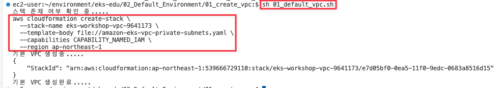

3. 생성 결과 화면
   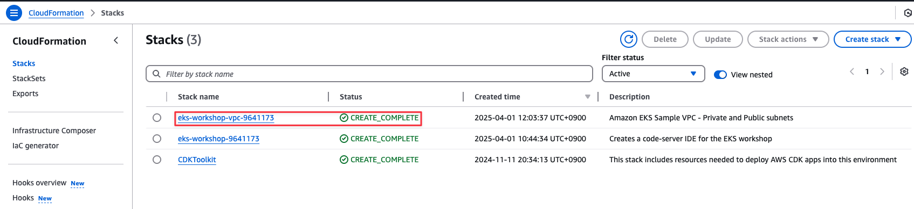

### 생성된 Infra 정보를 env 파일로 저장

1. 생성된 정보를 env 파일로 저장

   ```shell
   sh 02_get_output.sh
   ```

2. 실행 화면
   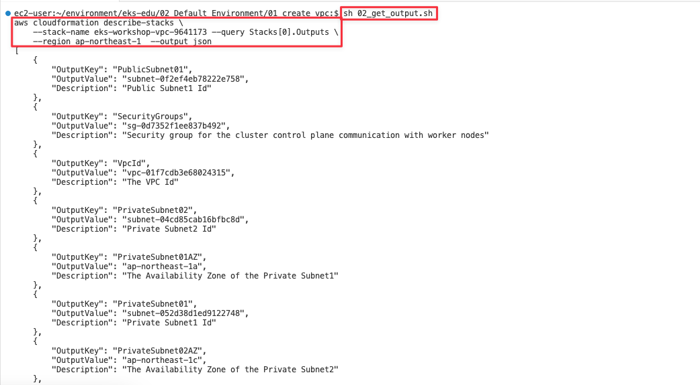

3. 생성 결과 화면
   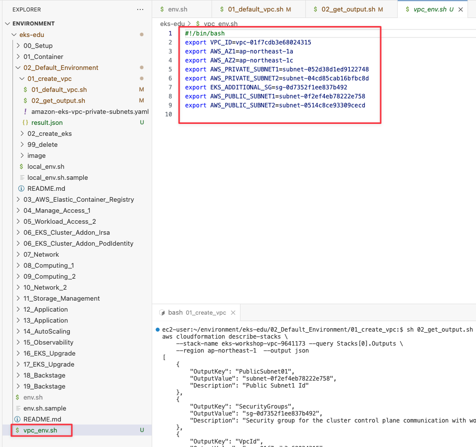

### EKS 생성

1. EKS 생성용 yaml에 vpc 생성 리소스 설정 ( eks cluster + nodegroup + default addon )
   ```shell
   cd ~/environment/eks-edu/02_Default_Environment/02_create_eks
   sh 01_make_eksctl_cluster_nodegroup_template.sh 
   ```

2. 실행 화면

   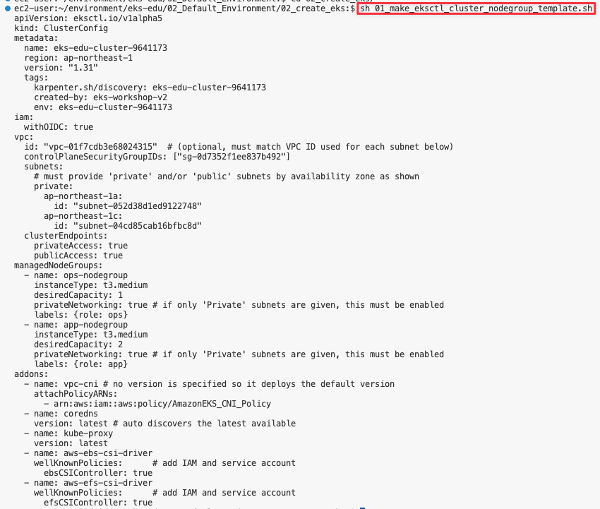

3. 결과 화면

   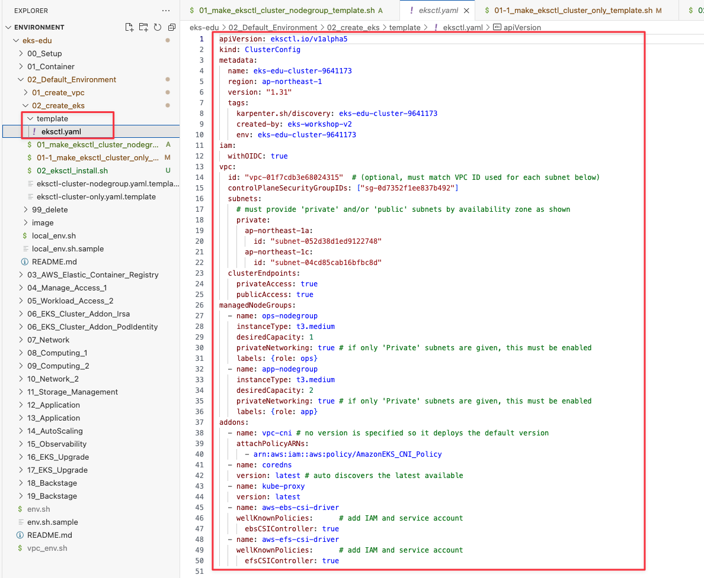

4. EKS 생성

   ```shell
   sh 02_eksctl_install.sh
   ```

5. 실행 화면 ( 15분 소요 )

   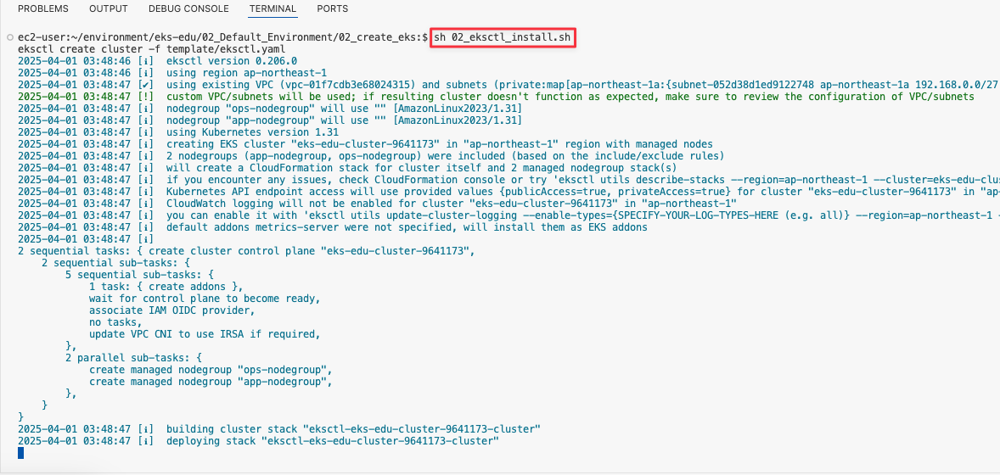

6. 결과 화면

- cloudformation 화면

   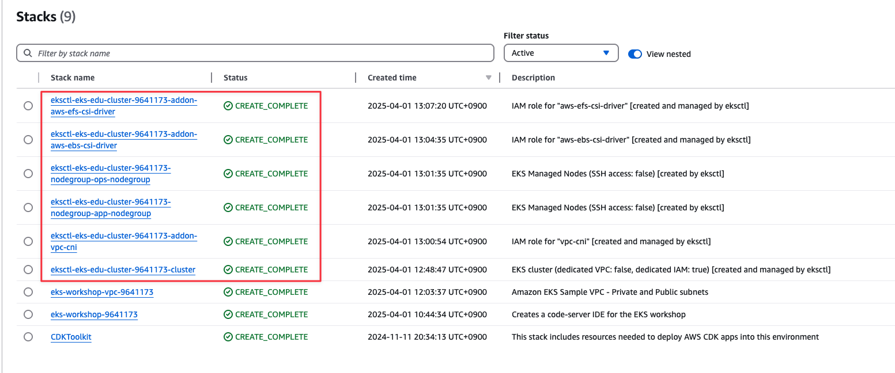

- eks cluster 생성 화면

  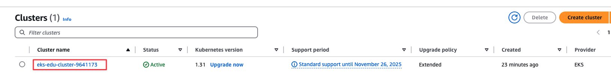

- eks nodegroup 생성 화면

  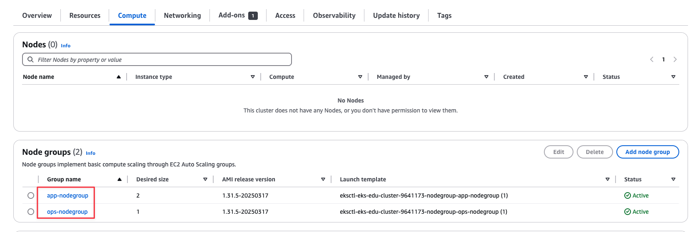

### 관련 링크

## 정리
1. 리소스 삭제
   ```shell
   cd ~/environment/eks-edu/02_Default_Environment/99_delete
   sh 99_delete.sh
   ```

2. 실행 화면

   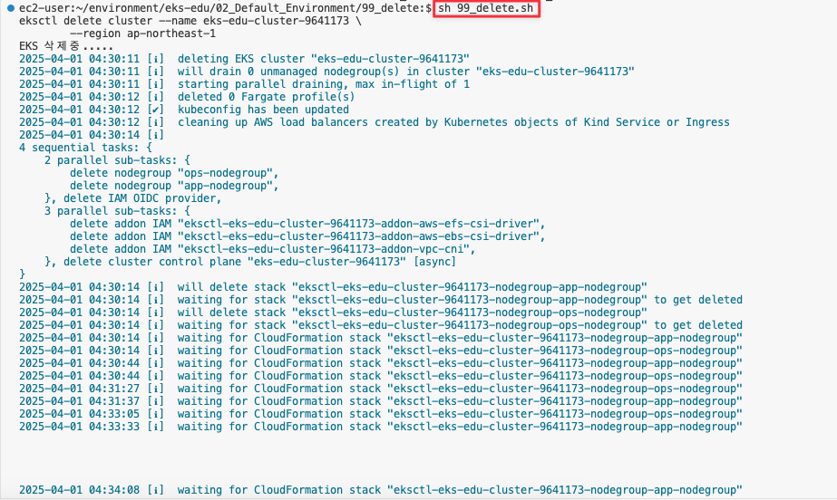

3. 결과 화면

   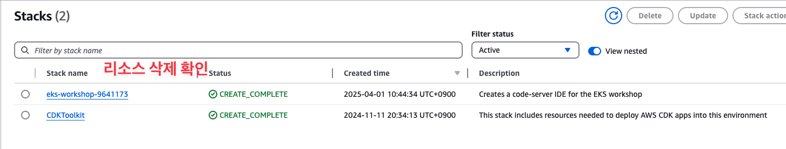