# 기본 환경 생성

## 사전 조건

1. [0. 교육 환경 구성하기](/00_Setup/)를 이용해 기본 실습 환경 생성이 되어 있어야 합니다.
2. [0. 교육 환경 구성하기](/00_Setup/)를 이용해 생성된 `code-server`에 접속한 상태여야 합니다.

## 학습 목표

- 기본 인프라
  - EKS 구성을 위한 기본 VPC 구성 실습 ( CloudFormation )
    - VPC 생성 ( 192.168.0.0/24 )
    - 두개의 AZ의 Public / Private Subnet ( /27 cidr )
    - 하나의 AZ에 Nat Gateway 구성
- EKS
  - EKS 구성을 위한 eksctl 지식 습득
  - EKS Cluster 생성 실습 ( eksctl )

## 이론

### VPC 요구 사항 및 고려 사항

- VPC에는 생성하려는 클러스터, 노드 및 기타 **Kubernetes 리소스에 사용 가능한 IP 주소가 충분**해야 합니다.
- VPC의 CIDR 블록보다 많은 IP 주소가 필요한 경우, 추가적인 CIDR(Classless Inter-Domain Routing) 블록을 VPC에 연결하여 CIDR 블록을 추가할 수 있습니다. 클러스터를 생성하기 전이나 후에 프라이빗(RFC 1918) 및 퍼블릭(비RFC 1918) CIDR 블록을 VPC에 연결할 수 있습니다. **클러스터가 VPC와 연결된 CIDR 블록을 인식하는 데 최대 5시간이 걸릴 수** 있습니다.
- Kubernetes가 IPv6 주소를 포드와 서비스에 할당하게 하려는 경우 IPv6 CIDR 블록을 VPC와 연결합니다.
- VPC는 **DNS 호스트 이름과 DNS 확인을 모두 지원**해야 합니다. 그렇지 않으면 노드가 클러스터에 등록할 수 없습니다.
- VPC에는 AWS 프라이빗 링크를 사용하는 VPC 엔드포인트가 필요할 수 있습니다.

### Subnet 요구 사항 및 고려 사항

- 각 서브넷에는 Amazon EKS에서 사용할 IP 주소가 6개 이상 있어야 합니다. 하지만 **16개 이상의 IP 주소를 사용하는 것이 좋습**니다.
- 서브넷이 **서로 다른 가용 영역에 있어야** 합니다.
- 서브넷은 퍼블릭 또는 프라이빗일 수 있습니다. 그러나 가능한 경우 **프라이빗 서브넷을 지정**하는 것이 좋습니다.
- 서브넷은 다음 **가용 영역에 상주할 수 없습**니다.

| AWS 리전     | 리전 이름                  | 허용되지 않는 가용 영역 ID |
| ------------ | -------------------------- | -------------------------- |
| us-east-1    | 미국 동부(버지니아 북부)   | use1-az3                   |
| us-west-1    | 미국 서부(캘리포니아 북부) | usw1-az2                   |
| ca-central-1 | 캐나다(중부)               | cac1-az3                   |

### Node 요구 사항

- 서브넷에는 모든 노드와 Kubernetes 리소스를 배포할 수 있는 **IP 주소가 충분**해야 합니다.
- Kubernetes가 **IPv6 주소를 포드와 서비스에 할당**하도록 하려는 경우 **서브넷에 연결된 IPv6 CIDR 블록 하나와 IPv4 CIDR 블록 하나가 있어야** 합니다.
- 인터넷에서 포드로 인바운드 액세스가 필요한 경우 **로드 밸런서와 수신를 배포할 수 있는 IP 주소가 충분한 퍼블릭 서브넷이 하나 이상 있어야** 합니다.
- 노드를 퍼블릭 서브넷에 배포하려는 경우 서브넷이 IPv4 퍼블릭 주소 또는 IPv6 주소를 자동 할당해야 합니다
- 노드를 배포하는 서브넷이 프라이빗 서브넷이고 해당 **라우팅 테이블에 Network Address Translation(NAT) 디바이스(IPv4) 또는 발신 전용 게이트웨이(IPv6)로 이어지는 경로가 포함되지 않은 경우, AWS를 사용하는 VPC 엔드포인트를 사용자 VPC에 추가**합니다. **엔드포인트에는 노드가 있는 서브넷이 포함**되어야 합니다.
- 서브넷에 **로드 밸런서를 배포하려는 경우 서브넷에는 다음 태그**가 있어야 합니다.

  - Private Subnet

  | 키                              | 값 |
  | ------------------------------- | -- |
  | kubernetes.io/role/internal-elb | 1  |


  - Public Subnet

  | 키                     | 값 |
  | ---------------------- | -- |
  | kubernetes.io/role/elb | 1  |

### 기본 클러스터 보안 그룹

EKS 생성시에 아래의 기본 보안 그룹이 EKS Cluster에 연결됩니다.

| 규칙 유형  | 규약 | 포트 | 원천 | 대상                               |
| ---------- | ---- | ---- | ---- | ---------------------------------- |
| 인바운드   | 모두 | 모두 | 본인 |                                    |
| 아웃바운드 | 모두 | 모두 |      | 0.0.0.0/0( IPv4) 또는 ::/0 ( IPv6) |

### 클러스터 트래픽 제한 보안 그룹

클러스터와 노드 사이에 열린 포트를 제한해야 하는 경우 기본 아웃바운드 규칙을 제거하고 클러스터에 필요한 다음과 같은 최소 규칙을 추가할 수 있습니다.

| 규칙 타입  | 프토토콜   | 포트  | 대상               |
| ---------- | ---------- | ----- | ------------------ |
| 아웃바운드 | TCP        | 443   | 클러스터 보안 그룹 |
| 아웃바운드 | TCP        | 10250 | 클러스터 보안 그룹 |
| 아웃바운드 | TCP 및 UDP | 53    | 클러스터 보안 그룹 |

다음 트래픽에 대한 규칙을 추가해야 합니다.

- 노드에서 **노드 간 통신에 사용할 것으로 예상하는 모든 프로토콜 및 포트**
- 노드가 실행 시 클러스터 내부 검사 및 노드 등록을 위해 Amazon EKS API에 액세스할 수 있는 **아웃바운드 인터넷 액세스**. 노드에 인터넷 액세스가 없는 경우 인터넷 액세스가 제한된 프라이빗 클러스터 배포를 검토하여 추가 고려 사항을 확인
- **DockerHub와 같이 이미지를 가져오는 데 필요한 Amazon ECR 또는 다른 컨테이너 레지스트리 API에서 컨테이너 이미지를 가져오기 위한 노드 액세스**.
- **Amazon S3에 대한 노드 액세스**

### EKS 구축 방법

| 방법                   | 장점                            | 단점                                           |
| ---------------------- | ------------------------------- | ---------------------------------------------- |
| AWS Management Console | 초보자 친화적                   | 자동화 어려움, 버전 관리 불가, 확장성 부족     |
| eksctl                 | 간편화 사용, AWS 네이티브 툴    | 고급 설정 어려움, 대규모 인프라 관리 비효율적  |
| Terraform              | 멀티 클라우드 지원, 모듈화 기능 | 학습 곡선 있음, 초기 설정 복잡, 상태 관리 필요 |
| AWS CLI                | 자동화 가능                     | 각 리소스를 개별적으로 생성해야 함             |

### eksctl이란

eksctl은 관리형 Kubernetes 서비스인 EKS에서 클러스터를 만들고 관리하기 위해 Weaveworks 에서 만든 CLI Tool

Weaveworks가 상업중 운영을 중단한다고 하여, 현재는 AWS에서 인수한 상태

#### eksctl 설치

- [공식 사이트](https://eksctl.io/installation/)

#### eksctl 실행

1. eksctl command 실행

   ```shell
   eksctl create cluster --name=cluster-1 --nodes=4
   ```
2. eksctl config 실행

   ```shell
   eksctl create cluster -f cluster.yaml
   ```

## 실습

### 기본 설정 파일 세팅

```shell
cd ~/environment/eks-edu
cp env.sh.sample env.sh

# env.sh 파일 설정 필요
```
### 기본 인프라 생성 ( VPC / Public Subnet / Private Subnet )

EKS를 생성하기 위해서는 VPC와 Public Subnet / Private Subnet에 생성되어 있어야 합니다.

생성은 CloudFormation을 이용해서 생성합니다.

1. vpc 인프라 생성
   ```shell
   cd ~/environment/eks-edu/03_Default_Environment/01_create_vpc
   sh 01_default_vpc.sh
   ```

   위 `01_default_vpc.sh`를 실행하면 아래 aws cli 가 실행됩니다.(참고용)

   ```shell
   aws cloudformation create-stack \
       --stack-name eks-workshop-vpc-9641173 \
       --template-body file://amazon-eks-vpc-private-subnets.yaml \
       --capabilities CAPABILITY_NAMED_IAM
   ```

2. 실행 화면
   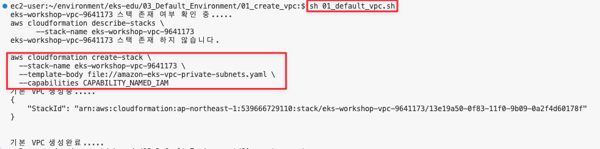

3. 생성 결과 화면
   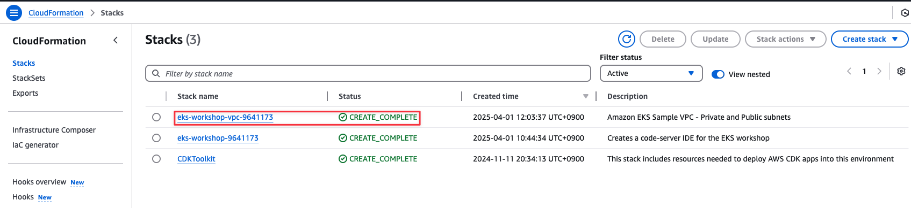

4. VPC용 환경파일(`vpc_env.sh`) 확인
   아래 `vpc_env.sh` 이 자동으로 생성되며, EKS 생성 시 사용됩니다.
   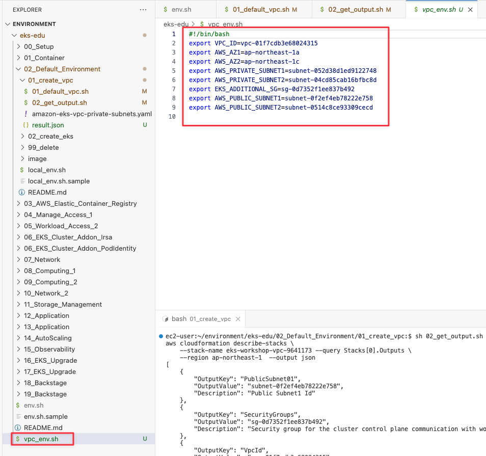

### EKS 생성

1. EKS 생성용 yaml에 vpc value 값 매핑해서 template/eksctl.yaml 생성 ( eks cluster + nodegroup + default addon )

   ```shell
   cd ~/environment/eks-edu/03_Default_Environment/02_create_eks
   sh 01_make_eksctl_cluster_nodegroup_default_template.sh
   ```

   위 `01_make_eksctl_cluster_nodegroup_default_template.sh`를 실행하면 생성된 VPC 정보를 매핑해서 template/eksctl.yaml를 생성합니다. (참고용)

   ```shell
   envsubst < eksctl-cluster-nodegroup-default.yaml.template > template/eksctl.yaml
   ```
2. 실행 화면

   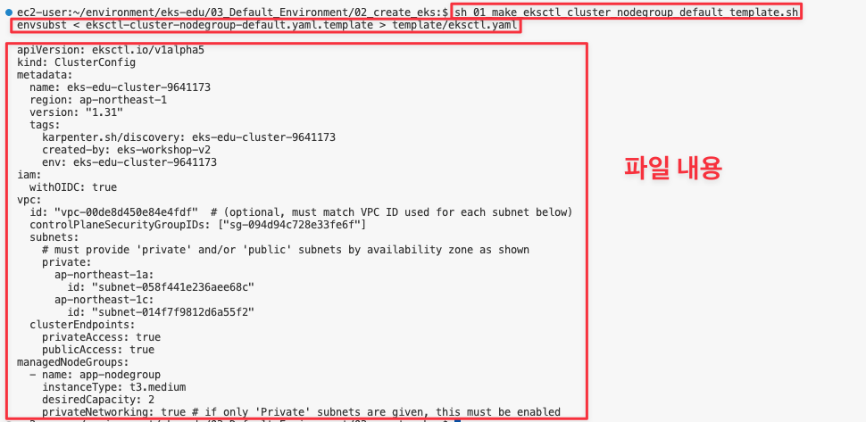
3. 결과 화면

   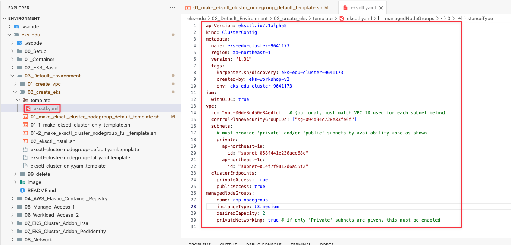
4. cluster.yaml config 내용 ( nodegroup 생성용 )

   ```yaml
   01 apiVersion: eksctl.io/v1alpha5
   02 kind: ClusterConfig
   03 metadata:
   04   name: eks-edu-cluster-9641173
   05   region: ap-northeast-1
   06   version: "1.31"
   07   tags:
   08     karpenter.sh/discovery: eks-edu-cluster-9641173
   09     created-by: eks-workshop-v2
   10     env: eks-edu-cluster-9641173
   11 iam:
   12   withOIDC: true
   13 vpc:
   14   id: "vpc-01f7cdb3e68024315"
   15   controlPlaneSecurityGroupIDs: ["sg-0d7352f1ee837b492"]  
   16   subnets:
   17     private:
   18       ap-northeast-1a:
   19         id: "subnet-052d38d1ed9122748"
   20       ap-northeast-1c:
   21         id: "subnet-04cd85cab16bfbc8d"
   22   clusterEndpoints:
   23     privateAccess: true
   24     publicAccess: true
   25 managedNodeGroups:
   26   - name: app-nodegroup
   27     instanceType: t3.medium
   28     desiredCapacity: 2
   29     privateNetworking: true
   ```

   - 04 lines : EKS Cluster 명칭
   - 05 lines : region 정보
   - 06 lines : EKS Version
   - 11 ~ 12 lines : OIDC 생성
   - 13 ~ 21 lines : 생성된 VPC/Subnet/Add Cluster SecurityGroup 정보를 설정
   - 22 ~ 24 lines : Cluster Endpoint 설정
   - 25 ~ 29 lines : Managed NodeGroup 설정 ( t3.medium * 2대 생성 )
   - 기타 : default addon : kube-proxy, aws-node, coredns 설치됨
5. EKS 생성

   ```shell
   sh 02_eksctl_install.sh
   ```

   위 `02_eksctl_install.sh`를 실행하면 아래 eksctl cli가 실행됩니다. (참고용)

   ```shell
   eksctl create cluster -f template/eksctl.yaml 
   ```
6. 실행 화면 ( 15분 소요 )

   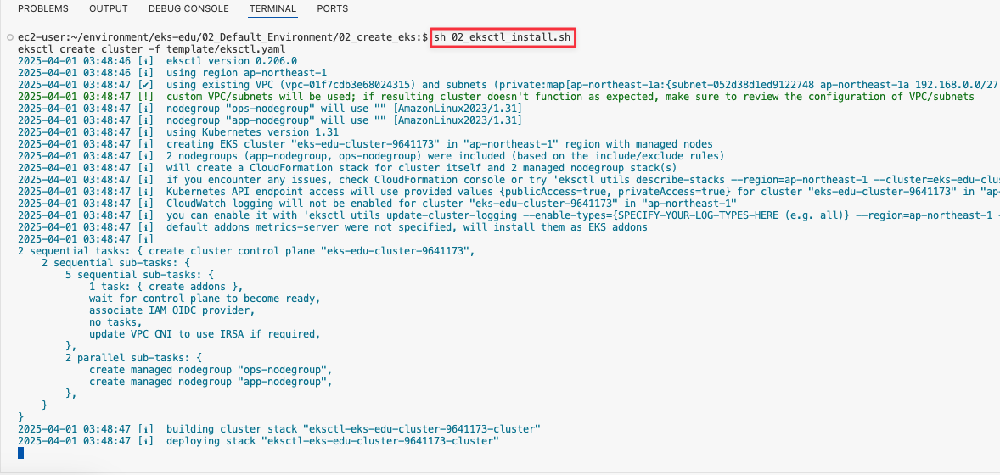
7. 결과 화면

- cloudformation 화면

  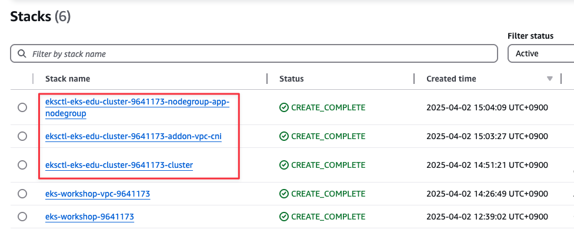
- eks cluster 생성 화면

  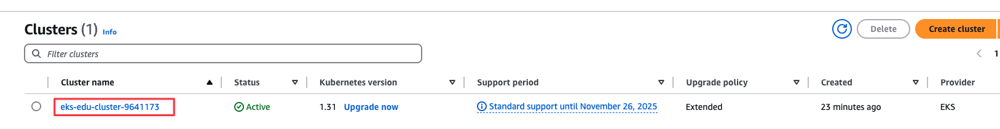
- eks nodegroup 생성 화면

  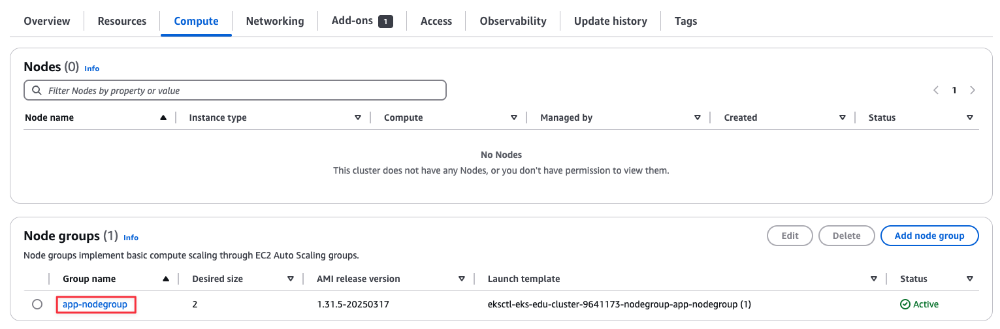

## 정리

1. 리소스 삭제 ( 15분 소요 )

   ```shell
   cd ~/environment/eks-edu/03_Default_Environment/99_delete
   sh 99_delete.sh
   ```

   위 `99_delete.sh`를 실행하면 아래 eksctl cli 와 aws cli가 실행됩니다. (참고용)

   ```shell
   # eks 삭제
   eksctl delete cluster --name eks-edu-cluster-9641173 

   # vpc 정보 삭제
   aws cloudformation delete-stack \
     --stack-name eks-workshop-vpc-9641173
   ```

2. 실행 화면

   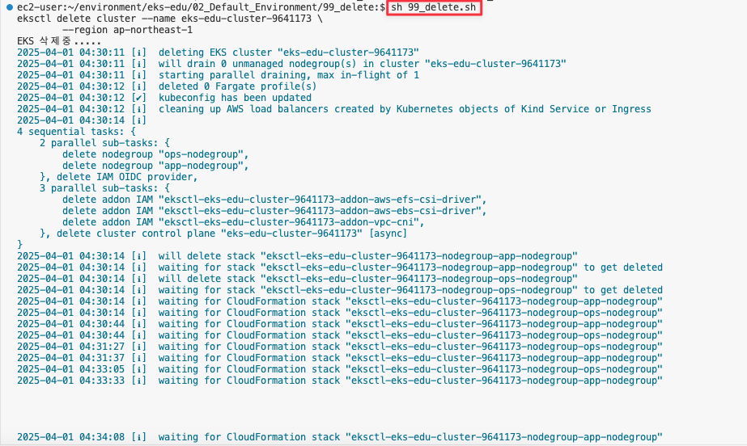

3. 결과 화면

   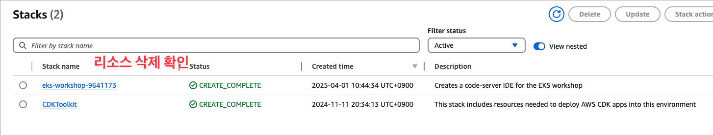

## 관련 링크
- [Amazon EKS 클러스터에 대한 Amazon VPC 생성](https://docs.aws.amazon.com/ko_kr/eks/latest/userguide/creating-a-vpc.html)
- [eksctl 공식 홈페이지](https://eksctl.io/)