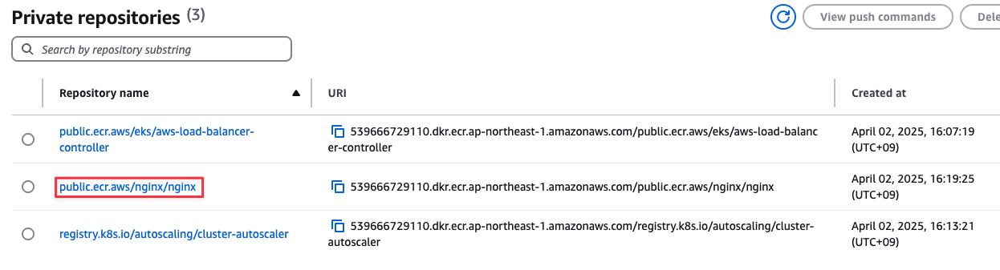

# AWS Elastic Container Registry

## 사전 조건

1. [0. 교육 환경 구성하기](00_Setup/)를 이용해 기본 실습 환경 생성이 되어 있어야 합니다.
2. [0. 교육 환경 구성하기](00_Setup/)를 이용해 생성된 `code-server`에 접속한 상태여야 합니다.

## 학습 목표

- ECR의 사용법을 이해하고, Registry 생성
- pull through cache 에 배우고, 구축 실습
- aws loadbalancer controller 와 cluster autoscaler 퍼블릭 이미지를 Private ECR에 복사 실습

## 이론

### Amazon Elastic Container Registry란?

Amazon Elastic Container Registry(Amazon ECR)는 안전하고 확장 가능하며 안정적인 **AWS 관리형 컨테이너 이미지 레지스트리 서비스**입니다.

Amazon ECR은 **AWS IAM을 사용하여 리소스 기반 권한을 가진 프라이빗 리포지토리를 지원**합니다. 따라서 지정된 사용자 또는 Amazon EC2 인스턴스가 컨테이너 리포지토리 및 이미지에 액세스할 수 있습니다.

원하는 CLI를 사용하여 도커 이미지, Open Container Initiative(OCI) 이미지 및 OCI 호환 아티팩트를 푸시, 풀 및 관리할 수 있습니다.

#### Amazon ECR의 기능

- 수명 주기 정책은 리포지토리에 있는 **이미지의 수명 주기를 관리하는 데 도움**이 됩니다.
- 이미지 **스캔은 컨테이너 이미지의 소프트웨어 취약성을 식별하는 데 도움**이 됩니다. 각 리포지토리는 푸시 시 스캔하도록 구성할 수 있습니다.
- **교차 리전 및 교차 계정 복제를 통해 이미지를 필요한 곳에 쉽게 배치**할 수 있습니다.

### 필수 IAM 권한

1. 이미지 가져오기 필수 권한

```json
{
    "Version": "2012-10-17",
    "Statement": [
        {
            "Effect": "Allow",
            "Action": [
                "ecr:BatchCheckLayerAvailability",
                "ecr:BatchGetImage",
                "ecr:GetDownloadUrlForLayer",
                "ecr:GetAuthorizationToken"
            ],
            "Resource": "*"
        }
    ]
}
```

2. 이미지 푸시 필수 권한
   ```json
   {
     "Version": "2012-10-17",
     "Statement": [
       {
         "Effect": "Allow",
         "Action": [
           "ecr:CompleteLayerUpload",
           "ecr:UploadLayerPart",
           "ecr:InitiateLayerUpload",
           "ecr:BatchCheckLayerAvailability",
           "ecr:PutImage",
           "ecr:BatchGetImage"
          ],
          "Resource": "arn:aws:ecr:region:111122223333:repository/repository-name"
       },
       {
         "Effect": "Allow",
         "Action": "ecr:GetAuthorizationToken",
         "Resource": "*"
       }
     ]
   }
   ```

### Pull Through Cache란?


풀스루 캐시 규칙을 사용하면 업스트림 레지스트리의 콘텐츠를 Amazon ECR 프라이빗 레지스트리와 동기화할 수 있습니다.

Amazon ECR은 현재 다음 업스트림 레지스트리에 대한 풀스루 캐시 규칙 생성을 지원합니다.

- Amazon ECR Public, Kubernetes 컨테이너 이미지 레지스트리 및 Quay(인증 필요 없음)
- Docker Hub, Microsoft Azure 컨테이너 레지스트리, GitHub 컨테이너 레지스트리 및 GitLab 컨테이너 레지스트리(보안 암호로 AWS Secrets Manager 인증 필요)
- Amazon ECR( AWS IAM 역할을 사용한 인증 필요)
- GitLab 컨테이너 레지스트리의 경우 Amazon ECR은 GitLab의 서비스형 소프트웨어(SaaS) 오퍼링에서만 풀스루 캐시를 지원합니다
  ====================================================

## 실습

### ECR Repository 생성

1. AWS Load Balancer Controller Repository 생성

   ```shell
   cd ~/environment/eks-edu/04_AWS_Elastic_Container_Registry/01_create_repository
   sh 01_create_aws_lbc_ecr_cluster.sh
   ```

   위 `01_create_aws_lbc_ecr_cluster.sh`를 실행하면 아래 aws cli 가 실행됩니다.(참고용)

   ```shell
   aws ecr create-repository \
        --repository-name public.ecr.aws/eks/aws-load-balancer-controller 
   ```
2. 실행 화면
   
3. 생성 결과 화면
   
4. Cluster AutoScaler Repository 생성

   ```shell
   aws ecr create-repository \
        --repository-name registry.k8s.io/autoscaling/cluster-autoscaler
   ```
5. 실행 화면
   
6. 생성 결과 화면
   
7. Nginx Repository 생성

   ```shell
   aws ecr create-repository \
        --repository-name public.ecr.aws/nginx/nginx
   ```
8. 실행 화면
   
9. 생성 결과 화면
   

### ECR Repository Image Push

1. AWS Load Balancer Controller Image 업로드

   ```shell
   cd ~/environment/eks-edu/04_AWS_Elastic_Container_Registry/02_image_push
   sh 01_aws_lbc_image_push.sh
   ```

   위 `01_aws_lbc_image_push.sh`를 실행하면 아래 명령을 수행하여 Image를 ECR에 업로드 합니다.(참고용)

   ```shell
   # public ecr에서 aws-load-balancer-controller Image에 v2.9.2 Tag 이미지를 받아옵니다.
   docker pull public.ecr.aws/eks/aws-load-balancer-controller:v2.9.2

   # Private ECR 로그인
   aws ecr get-login-password  | docker login --username AWS --password-stdin 539666729110.dkr.ecr.ap-northeast-1.amazonaws.com

   # Private ECR Repository 경로로 Tagging
   docker tag public.ecr.aws/eks/aws-load-balancer-controller:v2.9.2 539666729110.dkr.ecr.ap-northeast-1.amazonaws.com/public.ecr.aws/eks/aws-load-balancer-controller:v2.9.2

   # Private ECR Repository에 Image Push
   docker push 539666729110.dkr.ecr.ap-northeast-1.amazonaws.com/public.ecr.aws/eks/aws-load-balancer-controller:v2.9.2

   # docker에 존재하는 Image 삭제
   docker rmi 539666729110.dkr.ecr.ap-northeast-1.amazonaws.com/public.ecr.aws/eks/aws-load-balancer-controller:v2.9.2 public.ecr.aws/eks/aws-load-balancer-controller:v2.9.2
   ```
2. 실행 화면
   
3. 생성 결과 화면
   
4. Cluster AutoScaler Image 업로드

   ```shell
   cd ~/environment/eks-edu/04_AWS_Elastic_Container_Registry/02_image_push
   sh 02_autoscaler_image_push.sh
   ```

   위 `02_autoscaler_image_push.sh`를 실행하면 아래 명령을 수행하여 Image를 ECR에 업로드 합니다.(참고용)

   ```shell
   # registry.k8s.io 에서 cluster-autoscaler Image에 v1.32.0 Tag 이미지를 받아옵니다.
   docker pull registry.k8s.io/autoscaling/cluster-autoscaler:v1.32.0

   # Private ECR 로그인
   aws ecr get-login-password  | docker login --username AWS --password-stdin 539666729110.dkr.ecr.ap-northeast-1.amazonaws.com

   # Private ECR Repository 경로로 Tagging
   docker tag registry.k8s.io/autoscaling/cluster-autoscaler:v1.32.0 539666729110.dkr.ecr.ap-northeast-1.amazonaws.com/registry.k8s.io/autoscaling/cluster-autoscaler:v1.32.0   

   # Private ECR Repository에 Image Push
   docker push 539666729110.dkr.ecr.ap-northeast-1.amazonaws.com/registry.k8s.io/autoscaling/cluster-autoscaler:v1.32.0

   # docker에 존재하는 Image 삭제
   docker rmi 539666729110.dkr.ecr.ap-northeast-1.amazonaws.com/registry.k8s.io/autoscaling/cluster-autoscaler:v1.32.0 registry.k8s.io/autoscaling/cluster-autoscaler:v1.32.0
   ```
5. 실행 화면
   
6. 생성 결과 화면
   
7. Nginx Image 업로드

   ```shell
   cd ~/environment/eks-edu/04_AWS_Elastic_Container_Registry/02_image_push
   sh 03_nginx_image_push.sh
   ```

   위 `03_nginx_image_push.sh`를 실행하면 아래 명령을 수행하여 Image를 ECR에 업로드 합니다.(참고용)

   ```shell
   # registry.k8s.io 에서 cluster-autoscaler Image에 1.27 Tag 이미지를 받아옵니다.
   docker pull public.ecr.aws/nginx/nginx:1.27

   # Private ECR 로그인
   aws ecr get-login-password  | docker login --username AWS --password-stdin 539666729110.dkr.ecr.ap-northeast-1.amazonaws.com

   # Private ECR Repository 경로로 Tagging
   docker tag public.ecr.aws/nginx/nginx:1.27 539666729110.dkr.ecr.ap-northeast-1.amazonaws.com/public.ecr.aws/nginx/nginx:1.27

   # Private ECR Repository에 Image Push
   docker push 539666729110.dkr.ecr.ap-northeast-1.amazonaws.com/public.ecr.aws/nginx/nginx:1.27

   # docker에 존재하는 Image 삭제
   docker rmi 539666729110.dkr.ecr.ap-northeast-1.amazonaws.com/public.ecr.aws/nginx/nginx:1.27 public.ecr.aws/nginx/nginx:1.27
   ```
8. 실행 화면
   
9. 생성 결과 화면
   

### Pull Through Cache 실습

1. Public ECR용 Pull Through Cache 생성

   ```shell
   cd ~/environment/eks-edu/04_AWS_Elastic_Container_Registry/03_create_pull_through_cache
   sh 01_create_pull_through_cache.sh
   ```

   위 `01_create_pull_through_cache.sh`를 실행하면 아래 aws cli가 실행이 됩니다.(참고용)

   ```shell
   # ecr-repository-prefix 에 private ECR에 사용할 Prefix
   aws ecr create-pull-through-cache-rule \
       --upstream-registry-url public.ecr.aws \
       --ecr-repository-prefix public-ecr-9641173
   ```
2. 실행 화면
   
3. 생성 결과 화면
   
4. nginx image pull

   docker pull 시에 Private ECR 및 Image가 업로드 됩니다.

   ```shell
   sh 02_nginx_image_pull.sh
   ```

   위 `02_nginx_image_pull.sh`를 실행하면 아래 명령어가 실행이 됩니다.(참고용)

   ```shell
   # ecr login
   aws ecr get-login-password --region ap-northeast-1  | docker login --username AWS --password-stdin 539666729110.dkr.ecr.ap-northeast-1.amazonaws.com

   # image pull
   docker pull 539666729110.dkr.ecr.ap-northeast-1.amazonaws.com/public-ecr-9641173/nginx/nginx:1.27
   ```
5. 실행 화면

   
6. 생성 결과 화면

   

## 정리

1. 리소스 삭제 ( 15분 소요 )

   ```shell
   cd ~/environment/eks-edu/04_AWS_Elastic_Container_Registry/99_delete
   sh 99_delete.sh
   ```

   위 `99_delete.sh`를 실행하면 아래 aws cli가 실행됩니다. (참고용)

   ```shell
   # Pull Through Cache Rule 삭제
   aws ecr delete-pull-through-cache-rule \
    --ecr-repository-prefix public-ecr-9641173

   # public.ecr.aws/eks/aws-load-balancer-controller 리포지토리 내 이미지 삭제 ( 모든 이미지 목록 삭제)
   aws ecr batch-delete-image --repository-name public.ecr.aws/eks/aws-load-balancer-controller --image-ids imageDigest=sha256:165f67c8f8cffbeadb70b51558091cc7fa1c7246ed173de7a5a76a67eec092cc

   # public.ecr.aws/eks/aws-load-balancer-controller repository 삭제
   aws ecr delete-repository --repository-name public.ecr.aws/eks/aws-load-balancer-controller --force

   # registry.k8s.io/autoscaling/cluster-autoscaler, public.ecr.aws/nginx/nginx, public-ecr-9641173/eks/aws-load-balancer-controller 도 위의 항목 삭제 진행
   ```

2. 실행 화면
   

3. 결과 화면
   private repository 목록
   

   Pull Through Cache 목록
   

## 관련 링크
- [Amazon ECR의 프라이빗 이미지](https://docs.aws.amazon.com/ko_kr/AmazonECR/latest/userguide/images.html)
- [Amazon ECR 프라이빗 레지스트리와 업스트림 레지스트리 동기화](https://docs.aws.amazon.com/ko_kr/AmazonECR/latest/userguide/pull-through-cache.html)
