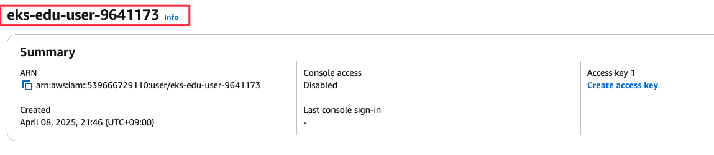

# Access 관리

## 사전 조건

1. [0. 교육 환경 구성하기](00_Setup/)를 이용해 기본 실습 환경 생성이 되어 있어야 합니다.
2. [0. 교육 환경 구성하기](00_Setup/)를 이용해 생성된 `code-server`에 접속한 상태여야 합니다.
3. [3. 기본 환경 생성](03_Default_Environment/)에 vpc와 eks를 배포해야 합니다.
   ```shell
   cd ~/environment/eks-edu/03_Default_Environment/01_create_vpc
   sh 01_default_vpc.sh
   sh 02_get_output.sh
   cd ../02_create_eks
   sh 01-3_make_eksctl_cluster_nodegroup_pod_identity_template.sh
   sh 02_eksctl_install.sh
   ```

## 학습 목표
- AWS IAM 사용자가 Kubernetes API에 인증할 수 있도록 하는 방법 숙지 ( ConfigMap 와 Access Entry )

## 이론

클러스터에는 Kubernetes API 엔드포인트가 있습니다. **Kubectl은 이 API를 사용**합니다. 다음 두 유형의 ID를 사용하여 이 **API에 인증**할 수 있습니다.
- AWS ID 및 액세스 관리(IAM) 보안 주체(역할 또는 사용자)
- 자체 OpenID Connect(OIDC) 제공자의 사용자

### 클러스터 인증 모드 설정
| 인증 모드 | 설명 |
|----------------|-------------|
| ConfigMap만 해당 | 초기 사용자는 **aws-auth ConfigMap**에서 목록에 다른 사용자를 추가하고 클러스터 내 다른 사용자에게 영향을 주는 권한을 할당해야 합니다. |
| EKS API 및 ConfigMap | **두 가지 방법을 모두 사용**하여 클러스터에 IAM 보안 주체를 추가할 수 있습니다. |
| EKS API만 해당 | 각 액세스 항목에는 유형이 있으며, **보안 주체를 특정 네임스페이스로 제한하는 액세스 범위와 사전 구성된 재사용 가능한 권한 정책을 설정하는 액세스 정책을 조합하여 사용**할 수 있습니다. 또는 **STANDARD 유형 및 Kubernetes RBAC 그룹을 사용하여 사용자 지정 권한을 할당**할 수 있습니다. |

### Configmap

**aws-auth ConfigMap는 더 이상 사용되지 않습니다.**

Amazon EKS 클러스터를 생성할 경우, 클러스터를 생성하는 IAM 보안 주체에게는 Amazon EKS 제어 영역의 클러스터 역할 기반 액세스 제어(RBAC) 구성에 system:masters 권한이 자동으로 부여

### EKS Access Entry란 ?

EKS 액세스 항목은 Kubernetes 권한 세트를 IAM 역할과 같은 IAM 자격 증명에 연결

#### 장점
이 기능은 사용자 권한을 관리할 때 AWS 및 Kubernetes API 사이를 전환하지 않아도 되므로 **액세스 관리를 간소화**합니다.

이 기능은 AWS CloudFormation, Terraform 및 AWS CDK와 같은 **코드형 인프라(IaC) 도구와 통합되어 클러스터 생성 중에 액세스 구성을 정의**할 수 있습니다. 잘못 구성된 경우 직접 Kubernetes API에 액세스하지 않고도 Amazon EKS API를 통해 클러스터 액세스를 복원할 수 있습니다. 이러한 **중앙 집중식 접근 방식은 CloudTrail 감사 로깅 및 다중 인증과 같은 기존의 AWS IAM 기능을 활용하여 운영 오버헤드를 줄이고 보안을 개선**합니다.

### Access Entry Permision ([액세스 정책 권한 검토](https://docs.aws.amazon.com/ko_kr/eks/latest/userguide/access-policy-permissions.html))
| Permission Type | Description |
|----------------|-------------|
| AmazonEKSAdminPolicy | 리소스에 대한 대부분의 권한을 IAM 보안 주체에 부여하는 권한이 포함 |
| **AmazonEKSClusterAdminPolicy** | 클러스터에 대한 액세스 권한을 IAM 보안 주체 관리자에게 부여하는 권한이 포함 |
| AmazonEKSAdminViewPolicy | 클러스터의 모든 리소스를 나열하고 볼 수 있는 권한을 IAM 보안 주체에 부여하는 권한이 포함 |
| AmazonEKSEditPolicy | IAM 위탁자가 대부분의 Kubernetes 리소스를 편집할 수 있는 권한이 포함 |
| **AmazonEKSViewPolicy** | IAM 위탁자가 대부분의 Kubernetes 리소스를 볼 수 있는 권한이 포함 |
| AmazonEKSAutoNodePolicy | Amazon EKS 구성 요소가 다음 태스크를 완료할 수 있도록 허용하는 다음과 같은 권한이 포함 |
| AmazonEKSBlockStoragePolicy | Amazon EKS가 스토리지 작업에 대한 리더 선택 및 조정 리소스를 관리하는 권한이 포함 |
| AmazonEKSLoadBalancingPolicy | Amazon EKS가 로드 밸런싱을 위한 리더 선택 리소스를 관리하는 권한이 포함 |
| AmazonEKSNetworkingPolicy | Amazon EKS가 네트워킹을 위한 리더 선택 리소스를 관리하는 권한이 포함 |
| AmazonEKSComputePolicy | Amazon EKS가 컴퓨팅 작업을 위한 리더 선택 리소스를 관리하는 권한이 포함 |
| AmazonEKSBlockStorageClusterPolicy | Amazon EKS Auto Mode의 블록 스토리지 기능에 필요한 권한을 부여 |
| AmazonEKSComputeClusterPolicy | Amazon EKS Auto Mode의 컴퓨팅 관리 기능에 필요한 권한을 부여 |
| AmazonEKSLoadBalancingClusterPolicy | Amazon EKS Auto Mode의 로드 밸런싱 기능에 필요한 권한을 부여 |
| AmazonEKSNetworkingClusterPolicy | Amazon EKS Auto Mode의 네트워킹 기능에 필요한 권한을 부여 |
| AmazonEKSHybridPolicy | 클러스터의 노드에 대한 EKS 액세스 권한을 부여하는 권한이 포함 |
| AmazonEKSClusterInsightsPolicy | Amazon EKS Cluster Insights 기능에 대한 읽기 전용 권한을 부여 |

### ClusterRole/ClusterRoleBinding 과 Role/RoleBinding

1. 구성도

   

2. ClusterRole/ClusterRoleBinding 이란 ?
   
   User/ServiceAccount 에 모든 Cluster에 대해서 설정한 권한을 위임
   ```shell
   kubectl create clusterrole pod-reader-crusterrole \
         --verb=get,list,watch \
         --resource=pods

   # User
   kubectl create clusterrolebinding pod-reader-crusterrolebinding \
         --clusterrole=pod-reader-crusterrole \
         --user=user1 --user=user2 --group=group1

   # ServiceAccount
   kubectl create clusterrolebinding pod-reader-crusterrolebinding \
         --clusterrole=pod-reader-crusterrole \ --serviceaccount=namespace:serviceaccountname
   ```

2. Role/RoleBinding 이란 ?

   User/ServiceAccount 에 모든 Cluster에 대해서 설정한 권한을 위임
   ```shell
   kubectl create role pod-reader-role \
         --verb=get --verb=list --verb=watch \
         --resource=pods \
         -n namespace

   kubectl create rolebinding pod-reader-rolebinding \
         --clusterrole=pod-reader-role --user=user1 --user=user2 \
         --group=group1 \
         -n namespace

   kubectl create rolebinding pod-reader-rolebinding \
         --role=pod-reader-rolebinding \
         --serviceaccount=namespace:serviceaccountname \
         -n namespace
   ```
   
## 실습

### 구성도


### 기본 환경 구성
1. 현재 context 확인
   ```shell
   cd ~/environment/eks-edu/05_Manage_Access_1/01_common
   sh 01_current_context.sh
   ```

   위 `01_current_context.sh`를 실행하면 아래 kubectl 명령이 실행됩니다.(참고용)

   ```shell
   kubectl config current-context
   ```

2. 실행 화면

   

3. 생성 결과 화면

   

4. `eks-edu-cluster-${IDE_NAME}` 이름으로 context 변경

   ```shell
   cd ~/environment/eks-edu/05_Manage_Access_1/01_common
   sh 02_update_kubeconfig.sh
   ```

   위 `02_update_kubeconfig.sh`를 실행하면 아래 aws cli 명령이 실행됩니다.(참고용)

   ```shell
   aws eks update-kubeconfig \
        --name eks-edu-cluster-9641173 \
        --alias eks-edu-cluster-9641173

   # context 목록 출력
   kubectl config get-contexts        
   ```

5. 실행 화면

   

6. 생성 결과 화면

   

7. aws-auth configmaps 내용 확인

   ```shell
   cd ~/environment/eks-edu/05_Manage_Access_1/01_common
   sh 03_get_aws-auth-configmap.sh
   ```

   위 `03_get_aws-auth-configmap.sh`를 실행하면 아래 kubectl 명령이 실행됩니다.(참고용)

   ```shell
   kubectl -n kube-system get configmap aws-auth -oyaml
   ```

5. 실행 화면

   

6. 생성 결과 화면

   

### ConfigMap을 사용하여 사용자 권한 설정

1. `eks-edu-user-<사번>` IAM User 생성

   ```shell
   cd ~/environment/eks-edu/05_Manage_Access_1/02_user_permission_configmap
   sh 01_create_user.sh
   ```

   위 `01_create_user.sh`를 실행하면 아래 aws cli 가 실행됩니다.(참고용)

   ```shell
   aws iam create-user \
    --user-name eks-edu-user-9641173
   ```
   
2. 실행 화면

   

3. 생성 결과 화면

   

4. User에 Access Key 생성

   ```shell
   sh 02_create_access_key.sh
   ```

   위 `02_create_access_key.sh`를 실행하면 아래 aws cli 가 실행됩니다.(참고용)

   ```shell
   aws iam create-access-key \
    --user-name eks-edu-user-9641173 --output json
   ```
   
5. 실행 화면

   

6. 생성 결과 화면

   tmp/access_key.json에 key 정보가 보관되어 있습니다.
   

7. User에 eks:DescribeCluster 권한을 등록 합니다.

   ```shell
   sh 03_attach_policy.sh
   ```

   위 `03_attach_policy.sh`를 실행하면 아래 aws cli 가 실행됩니다.(참고용)

   ```shell
   >> tmp/eks-edu-user-policy.json
   {
     "Version": "2012-10-17",
     "Statement": [
       {
         "Effect": "Allow",
         "Action": "eks:DescribeCluster",
         "Resource": "*"
       }
     ]
   }

   aws iam create-policy --policy-name eks-edu-user-policy-9641173 \
        --policy-document file://tmp/eks-edu-user-policy.json

   aws iam attach-user-policy \
        --user-name eks-edu-user-9641173 \
        --policy-arn arn:aws:iam::539666729110:policy/eks-edu-user-policy-9641173
   ```
   
8. 실행 화면

   

9. 생성 결과 화면

   

10. User에 eks:DescribeCluster 권한을 등록 합니다.

    ```shell
    sh 04_get_iamidentitymapping.sh
    ```

    위 `04_get_iamidentitymapping.sh`를 실행하면 아래 eksctl cli 가 실행됩니다.(참고용)

    ```shell
    # configmap에 등록된 정보 조회
    eksctl get iamidentitymapping --cluster eks-edu-cluster-9641173
    ```
   
11. 실행 화면

    

12. 생성 결과 화면

    

13. User에 권한 할당

    ```shell
    sh 05_create_iamidentitymapping.sh
    ```

    위 `05_create_iamidentitymapping.sh`를 실행하면 아래 eksctl cli 가 실행됩니다.(참고용)

    ```shell
    eksctl create iamidentitymapping \
       --cluster eks-edu-cluster-9641173 \
       --arn arn:aws:iam::539666729110:user/eks-edu-user-9641173 \
       --username eks-edu-user-9641173 
    ```
    - arn는 user의 arn이며 삭제시에 key로 사용됨
    - username은 AWS IAM User
   
14. 실행 화면

    

15. 생성 결과 화면

    

16. User에 할당할 ClusterRole / ClusterRoleBinding 생성

    ```shell
    sh 06_create_cluster_role_binding.sh
    ```

    위 `06_create_cluster_role_binding.sh`를 실행하면 tmp/cluster-role-info.yaml를 만들어서 배포를 합니다.(참고용)

    ```yaml
    apiVersion: rbac.authorization.k8s.io/v1
    kind: ClusterRole
    metadata:
      name: pod-reader
    rules:
      - apiGroups: [""]
        resources: ["pods"]
        verbs: ["get", "list"]
    ---
    apiVersion: rbac.authorization.k8s.io/v1
    kind: ClusterRoleBinding
    metadata:
      name: pod-reader-binding
    subjects:
      - kind: User
        name: eks-edu-user-9641173  # aws-auth에서 매핑한 User명
        apiGroup: rbac.authorization.k8s.io
    roleRef:
      kind: ClusterRole
      name: pod-reader
      apiGroup: rbac.authorization.k8s.io
    ```

    ```shell
    # 배포
    kubectl apply -f tmp/cluster-role-info.yaml
    ```
   
17. 실행 화면

    

18. 생성 결과 화면

    

19. `eks-edu-user-<사번>` 의 aws profile eks-edu-profile-<사번> 생성

    ```shell
    sh 07_create_cli_profile.sh
    ```

    위 `07_create_cli_profile.sh`를 실행하면 아래 aws cli 가 실행됩니다.(참고용)

    ```shell
    aws configure set region ap-northeast-1 --profile eks-edu-profile-9641173
    aws configure set output yaml --profile eks-edu-profile-9641173
    aws configure set aws_access_key_id XXXXXXXXXX --profile eks-edu-profile-9641173
    aws configure set aws_secret_access_key XXXXXXXXXXXXXXXXXXXX --profile eks-edu-profile-9641173
    ```
   
20. 실행 화면

    

21. 생성 결과 화면

    ```shell
    aws sts get-caller-identity --profile eks-edu-profile-9641173
    ```

    

22. `eks-edu-user-<사번>` Profile을 이용해서 kubectl config 설정

    ```shell
    cd ~/environment/eks-edu/05_Manage_Access_1/02_user_permission_configmap
    sh 08_update_kubeconfig-pod-reader.sh
    ```

    위 `08_update_kubeconfig-pod-reader.sh`를 실행하면 아래 kubectl cli 가 실행됩니다.(참고용)

    ```shell
    aws eks update-kubeconfig \
         --name eks-edu-cluster-9641173 \
         --alias pod-reader --profile eks-edu-profile-9641173
    ```

23. 실행 화면

    

24. 생성 결과 화면

    

25. pod get 권한 체크

    ```shell
    cd ~/environment/eks-edu/05_Manage_Access_1/02_user_permission_configmap
    sh 09_get_nodes.sh
    ```

    위 `09_get_nodes-pod-reader.sh`를 실행하면 아래 kubectl cli 가 실행됩니다.(참고용)

    ```shell
    kubectl get nodes
    ```

23. 실행 화면

    

24. 생성 결과 화면

    

### Access Entry를 사용하여 사용자 권한 설정

1. Clusters 를 선택

   
   
2. Addon 메뉴 선택

   

3. Get more add-ons 버튼 클릭

   

4. Amazon EKS Pod Identity Agent 메뉴의 checkbox 선택

   

5. Next 버튼 클릭

   

6. 버전 선택하고 Next 클릭

   

7. Create 버튼 클릭

   

8. admin 권한의 access entry 생성

   ```shell
   cd ~/environment/eks-edu/05_Manage_Access_1/03_user_permission_pod_identity
   sh 02_create_admin_access_entry.sh
   ```

   위 `02_create_admin_access_entry.sh`를 실행하면 아래 aws cli 가 실행됩니다.(참고용)

   ```shell
   # Access Entry 생성
   aws eks create-access-entry \
      --cluster-name eks-edu-cluster-9641173 \
      --principal-arn arn:aws:iam::539666729110:user/eks-edu-user-9641173 \
      --type STANDARD \
      --username eks-edu-user-9641173

   # AmazonEKSClusterAdminPolicy 권한 연동
   aws eks associate-access-policy \
      --cluster-name eks-edu-cluster-9641173 \
      --principal-arn arn:aws:iam::539666729110:user/eks-edu-user-9641173 \
      --access-scope type=cluster \
      --policy-arn arn:aws:eks::aws:cluster-access-policy/AmazonEKSClusterAdminPolicy 
   ```

9. 실행 화면

   

10. 생성 결과 화면

    

11. node 조회 권한 체크

    ```shell
    cd ~/environment/eks-edu/05_Manage_Access_1/03_user_permission_pod_identity
    sh 03_get_nodes.sh
    ```

    위 `03_get_nodes.sh`를 실행하면 아래 kubectl cli 가 실행됩니다.(참고용)

    ```shell
    kubectl get nodes
    ```

12. 실행 화면

    

13. 생성 결과 화면

    

14. cluster role 권한으로 변경

    ```shell
    cd ~/environment/eks-edu/05_Manage_Access_1/03_user_permission_pod_identity
    sh 04_update_pod_reader_access_entry.sh
    ```

    위 `04_update_pod_reader_access_entry.sh`를 실행하면 아래 aws cli 가 실행됩니다.(참고용)

    ```shell
    aws eks update-access-entry \
       --cluster-name eks-edu-cluster-9641173 \
       --principal-arn arn:aws:iam::539666729110:user/eks-edu-user-9641173 \
       --username eks-edu-user-9641173 
    ```

15. 실행 화면

    

16. 생성 결과 화면

    

17. aws get nodes 명령 

    ```shell
    sh 03_get_nodes.sh
    ```

    위 `04_update_pod_reader_access_entry.sh`를 실행하면 아래 aws cli 가 실행됩니다.(참고용)

    ```shell
    kubectl get nodes
    ```

15. 실행 화면

    

16. 생성 결과 화면

    

## 정리

1. 리소스 삭제

   ```shell
   cd ~/environment/eks-edu/05_Manage_Access_1/99_delete
   sh 99_delete.sh
   ```

   위 `99_delete.sh`를 실행하면 아래 aws cli가 실행됩니다. (참고용)

   ```shell
   # eks-edu-user-9641173 IAM 사용자 액세스 키 삭제
   aws iam delete-access-key --user-name eks-edu-user-9641173 --access-key-id XXXXXXX 
   # login Profile 삭제
   aws iam delete-login-profile --user-name eks-edu-user-9641173 
   # eks-edu-user-9641173 연결된 정책 분리
   aws iam detach-user-policy --user-name eks-edu-user-9641173 --policy-arn arn:aws:iam::539666729110:policy/eks-edu-user-policy-9641173 
   # eks-edu-user-9641173 Inline Policy 삭제
   # eks-edu-user-9641173 USER 삭제
   aws iam delete-user --user-name eks-edu-user-9641173 
   ```

2. 실행 화면

   

3. 결과 화면

   

4. EKS 삭제는 03_Default_Environment 에서 삭제 진행

## 관련 링크

- [Full Configuration Format](https://github.com/kubernetes-sigs/aws-iam-authenticator#full-configuration-format)