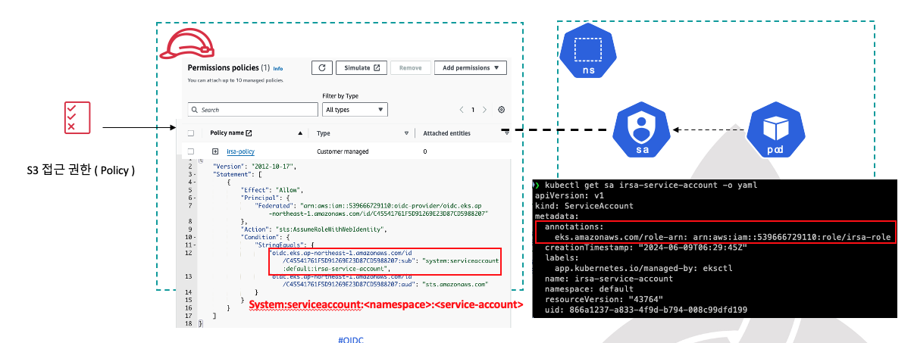
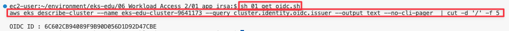
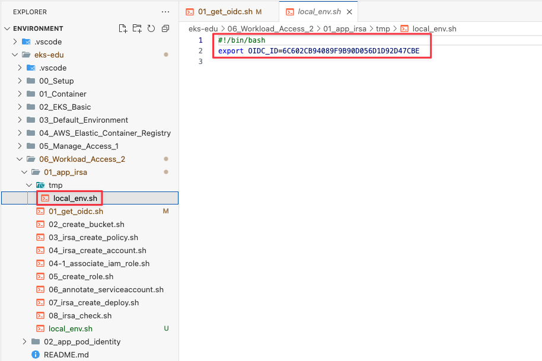
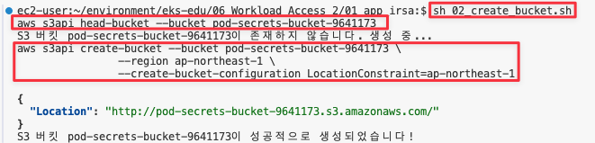
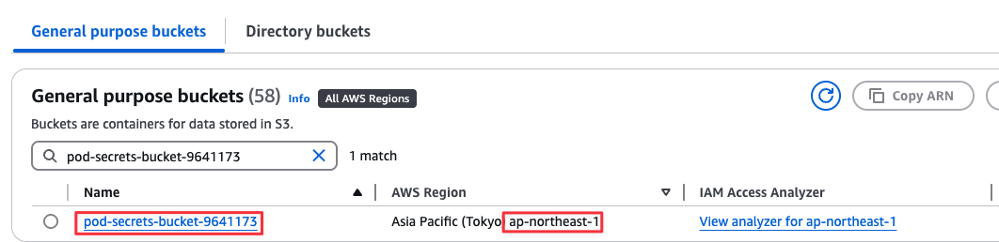
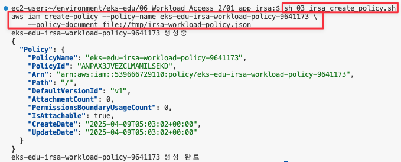
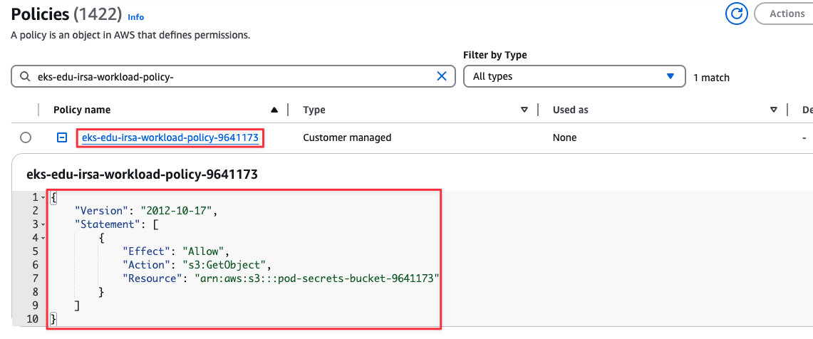
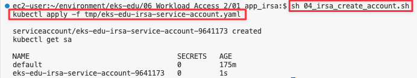
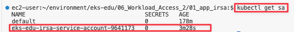

# 워크로드 액세스

## 사전 조건
[5. 보안 1](05_Manage_Access_1/README.md) 의 사전 조건과 동일

## 학습 목표
- Pod에 AWS 리소스 접근 권한을 부여할 수 있다.

## 이론
### IRSA란 ?
- Pod의 컨테이너에 있는 애플리케이션은 **AWS SDK 또는 AWS CLI를 사용하여 AWS ID 및 액세스 관리(IAM) 권한을 사용하여 AWS 서비스에 API 요청**을 할 수 있다.
- 애플리케이션은 **AWS 자격 증명으로 AWS API 요청에 서명**해야 합니다.
- 서비스 계정에 대한 **IAM 역할(IRSA)은 Amazon EC2 인스턴스 프로파일이 Amazon EC2 인스턴스에 자격 증명을 제공하는 것과 비슷한 방식**으로 애플리케이션에 대한 자격 증명을 관리하는 기능을 제공합니다.
- AWS 자격 증명을 생성하여 컨테이너에 배포하거나 **Amazon EC2 인스턴스의 역할을 사용하는 대신에 IAM 역할을 Kubernetes 서비스 계정과 연결하고 서비스 계정을 사용**하도록 포드를 구성합니다.
#### IRSA 이점
- 최소 권한 : **IAM 권한의 범위를 서비스 계정으로 지정**할 수 있습니다. 그러면 해당 서비스 계정을 사용하는 포드만 이 권한에 액세스 할 수 있습니다. 또한 이 기능을 사용하면 kiam, kube2iam 같은 타사 솔루션이 필요 없습니다.
- 자격 증명 격리 : 포드의 컨테이너는 컨테이너가 사용하는 서비스 계정과 연결된 IAM 역할에 대한 자격증명만 검색할 수 있습니다. 컨테이너는 다른 포드의 다른 컨테이너에서 사용하는 자격 증명에 액세스할 수 없습니다. 서비스 계정에 IAM 역할을 사용하는 경우 Amazon EC2 인스턴스 메타데이터 서비스(IMDS)에 대한 포드 액세스를 차단하지 않는 한 컨테이너에도 Amazon EKS 노드 IAM 역할에 할당된 권한이 있습니다.
- 감사 : **AWS CloudTrail을 통한 액세스 및 이벤트 로깅을 사용하여 사후 감사**를 지원합니다.

### Pod Identity 란
- 각 EKS Pod Identity 연결은 지정된 **클러스터의 네임스페이스에 있는 서비스 계정에 역할을 매핑**합니다.
- 여러 클러스터에 동일한 애플리케이션이 있는 경우 **역할의 신뢰 정책을 수정하지 않고도 각 클러스터에서 동일한 연결을 만들수** 있습니다.
- 포드가 연결이 있는 서비스 계정을 사용하는 경우 Amazon EKS는 포드의 컨테이너에 환경 변수를 설정합니다.
- 환경 변수는 **AWS CLI를 포함한 AWS SDK를 구성하여 EKS 포드 ID 자격 증명을 사용**합니다.

#### Pod Identity 이점
- 최소 권한 : IAM 권한을 서비스 계정으로 범위 지정할 수 있으며, 해당 서비스 계정을 사용하는 Pod만 해당 권한에 액세스할 수 있습니다. 이 기능은 **타사 솔루션의 필요성도 없애**줍니다.
- 자가 증명 격리 : Pod의 컨테이너는 컨테이너가 사용하는 서비스 계정과 연결된 IAM 역할에 대한 자격 증명만 검색할 수 있습니다. **컨테이너는 다른 Pod의 다른 컨테이너에서 사용하는 자격 증명에 액세스할 수 없습**니다. Pod ID를 사용할 때 Pod의 컨테이너는 Amazon EC2 Instance Metadata Service(IMDS) 에 대한 Pod 액세스를 차단하지 않는 한 Amazon EKS 노드 IAM 역할 에 할당된 권한도 갖습니다 .
- 감사 가능성 : **AWS CloudTrail을 통해 액세스 및 이벤트 로깅이 가능하여 회고적 감사를 용이**하게 할 수 있습니다.

## 실습
### IRSA 구성도


### Pod에 IRSA 권한 적용
1. OIDC 값 가져오기

   ```shell
   cd ~/environment/eks-edu/06_Workload_Access_2/01_app_irsa
   sh 01_get_oidc.sh
   ```

   위 `01_get_oidc.sh`를 실행하면 아래 aws cli 가 실행됩니다.(참고용)

   ```shell
   aws eks describe-cluster --name eks-edu-cluster-9641173 --query cluster.identity.oidc.issuer --output text --no-cli-pager  | cut -d '/' -f 5
   ```
2. 실행 화면
   

3. 생성 결과 화면
   

4. pod에서 접근하고자 하는 S3 bucket 생성

   ```shell
   cd ~/environment/eks-edu/06_Workload_Access_2/01_app_irsa
   sh 02_create_bucket.sh
   ```

   위 `02_create_bucket.sh`를 실행하면 아래 aws cli 가 실행됩니다.(참고용)

   ```shell
   # s3 bucket 존재 여부 체크
   aws s3api head-bucket --bucket pod-secrets-bucket-9641173

   # s3 bucket 생성
   aws s3api create-bucket --bucket pod-secrets-bucket-9641173 \
                --region ap-northeast-1 \
                --create-bucket-configuration LocationConstraint=ap-northeast-1
   ```
5. 실행 화면
   

6. 생성 결과 화면
   

7. S3에 Object을 읽을 수 있는 Policy 생성

   ```shell
   cd ~/environment/eks-edu/06_Workload_Access_2/01_app_irsa
   sh 03_irsa_create_policy.sh
   ```

   위 `03_irsa_create_policy.sh`를 실행하면 아래 aws cli 가 실행됩니다.(참고용)

   ```shell
   >> tmp/irsa-workload-policy.json
   {
       "Version": "2012-10-17",
       "Statement": [
           {
               "Effect": "Allow",
               "Action": "s3:GetObject",
               "Resource": "arn:aws:s3:::pod-secrets-bucket-9641173"
           }
       ]
   }

   aws iam create-policy --policy-name eks-edu-irsa-workload-policy-9641173 \
    --policy-document file://tmp/irsa-workload-policy.json
   ```
8. 실행 화면
   

9. 생성 결과 화면
   

10. App 배포시 사용할 service account 생성

   ```shell
   cd ~/environment/eks-edu/06_Workload_Access_2/01_app_irsa
   sh 04_irsa_create_account.sh
   ```

   위 `04_irsa_create_account.sh`를 실행하면 아래 kubectl cli 가 실행됩니다.(참고용)

   ```shell
   >> tmp/eks-edu-irsa-service-account.yaml
   apiVersion: v1
   kind: ServiceAccount
   metadata:
     name: eks-edu-irsa-service-account-9641173
     namespace: default

   kubectl apply -f tmp/eks-edu-irsa-service-account.yaml
   ```
11. 실행 화면
   

12. 생성 결과 화면
   

13. Role 생성

   ```shell
   cd ~/environment/eks-edu/06_Workload_Access_2/01_app_irsa
   sh 04_irsa_create_account.sh
   ```

   위 `04_irsa_create_account.sh`를 실행하면 아래 kubectl cli 가 실행됩니다.(참고용)

   ```shell
   >> tmp/eks-edu-irsa-service-account.yaml
   apiVersion: v1
   kind: ServiceAccount
   metadata:
     name: eks-edu-irsa-service-account-9641173
     namespace: default

   kubectl apply -f tmp/eks-edu-irsa-service-account.yaml
   ```
14. 실행 화면
   

15. 생성 결과 화면
   
### Pod에 Pod Identity 권한 적용

### IRSA에서 Pod Identity Migration
# 5. 관련 링크
- [서비스 계정에 대한 IAM 역할](https://docs.aws.amazon.com/ko_kr/eks/latest/userguide/iam-roles-for-service-accounts.html)
- [EKS Pod Identity가 포드에 AWS 서비스에 대한 액세스 권한을 부여하는 방법 알아보기](https://docs.aws.amazon.com/ko_kr/eks/latest/userguide/pod-identities.html)