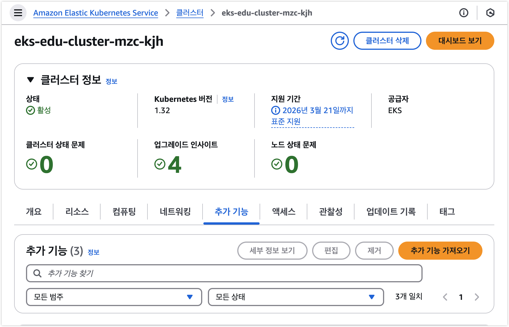
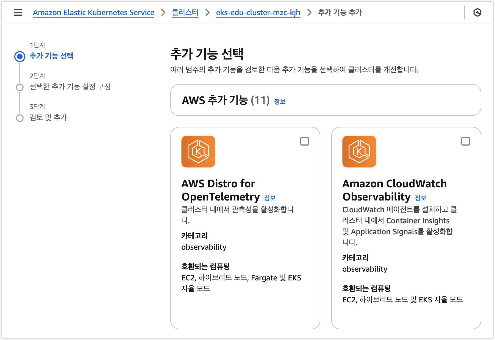
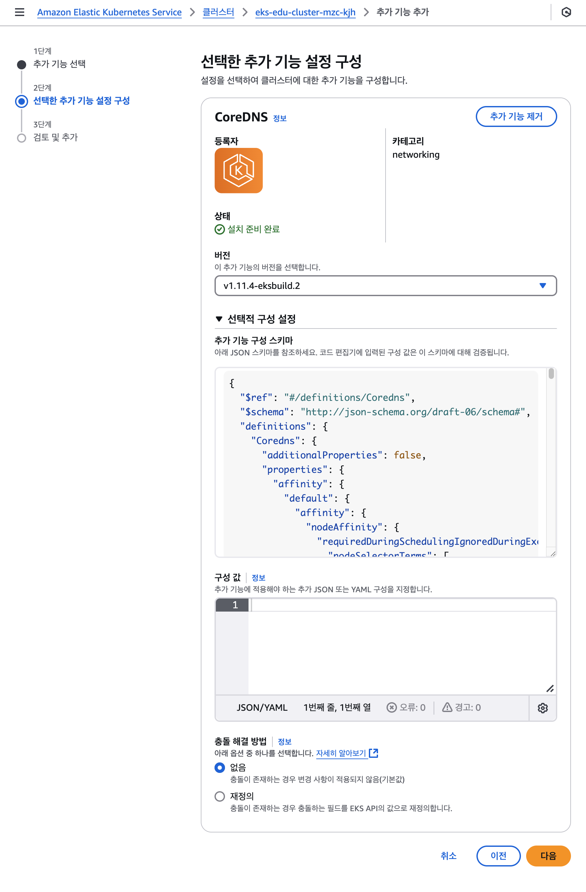
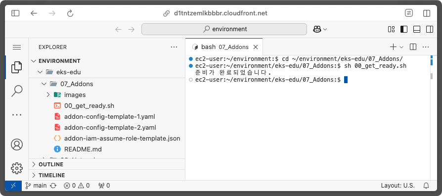
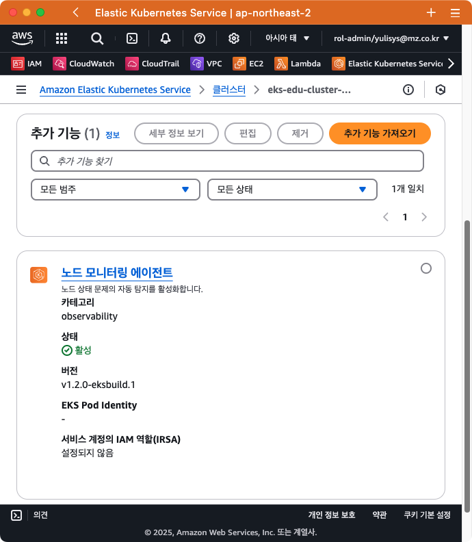
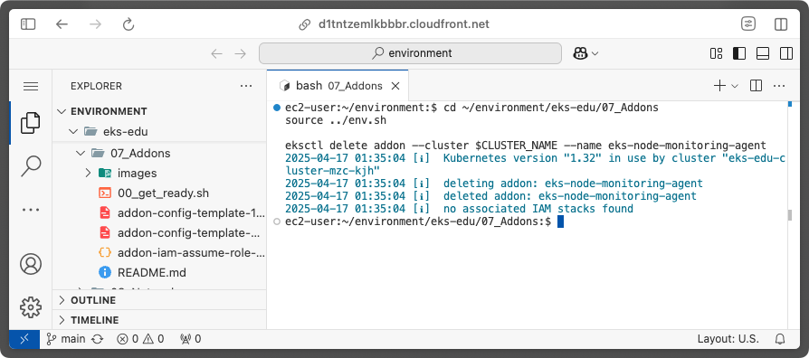
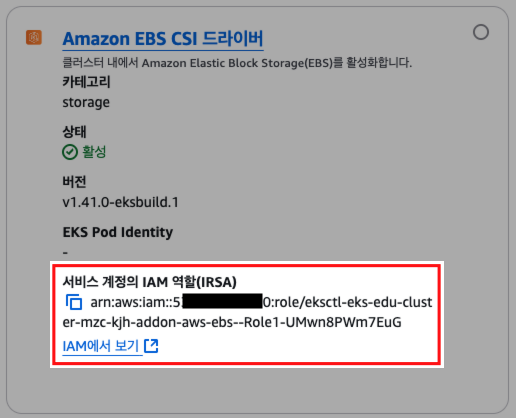
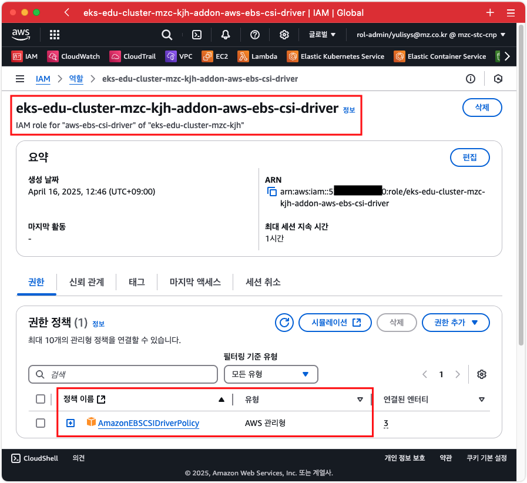
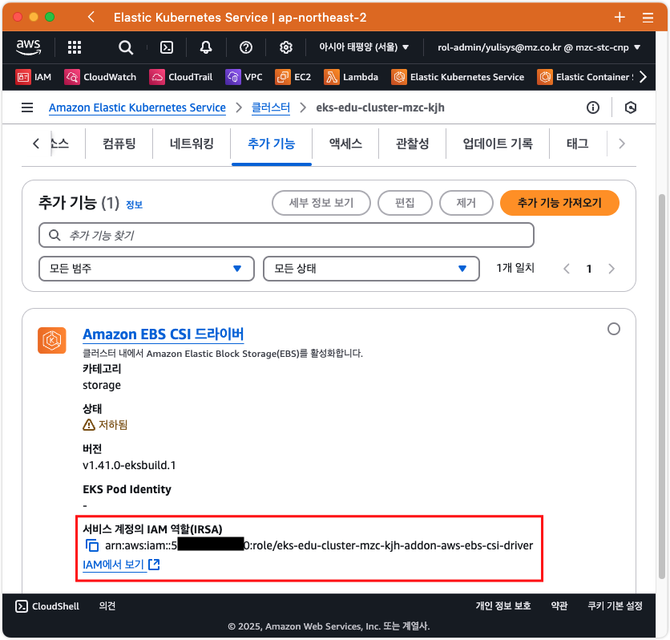

# 추가 기능 (Add-on) 관리

## 0. 사전 조건

1. [0. 교육 환경 구성하기](/00_Setup/)를 이용해 기본 실습 환경 생성이 되어 있어야 합니다.
2. [0. 교육 환경 구성하기](/00_Setup/)를 이용해 생성된 `code-server`에 접속한 상태여야 합니다.
3. [3. 기본 환경 생성](/03_Default_Environment/)을 참고하여 아래와 같이 vpc와 eks를 배포해야 합니다.
   ```shell
   cd ~/environment/eks-edu/03_Default_Environment/01_create_vpc
   sh 01_default_vpc.sh

   cd ../02_create_eks
   sh 01-1_make_eksctl_cluster_only_template.sh
   sh 02_eksctl_install.sh
   ```

## 1. 학습 목표

- 추가 기능을 설치 및 환경 설정하는 방법을 알 수 있습니다.

## 2. 개요

EKS 추가 기능(Add-on)은 EKS 클러스터 생성 후, EKS 관리를 위해 다양한 Application을 손쉽게 설치 및 관리할 수 있도록 해주는 기능입니다.

EKS 추가 기능은 다음의 3가지 유형으로 구분하여 제공합니다.

| 유형                      | 설명                                            |
|---------------------------|-------------------------------------------------|
| AWS 추가 기능             | AWS에서 관리하며 EKS를 완벽하게 지원합니다.     |
| AWS Marketplace 추가 기능 | 독립 AWS 파트너가 관리하고 AWS가 검증합니다.    |
| 커뮤니티 추가 기능        | 오픈 소스 커뮤니티가 관리하고 AWS가 검증합니다. |

다음은 각 추가 기능 유형에 대해 AWS가 지원하는 범위입니다.

| 범주      | Feature                                 | AWS 추가 기능 | AWS Marketplace 추가 기능 | 커뮤니티 추가 기능 |
|-----------|------------------------------------------|---------------|---------------------------|--------------------|
| 개발      | AWS가 빌드함                             | 예            | 아니요                    | 예                 |
| 개발      | AWS가 검증함                             | 예            | 아니요                    | 예 <sup>1)</sup>               |
| 개발      | AWS 파트너가 검증함                      | 아니요        | 예                        | 아니요             |
| 유지 관리 | AWS가 스캔함                             | 예            | 예                        | 예                 |
| 유지 관리 | AWS가 패치를 적용함                      | 예            | 아니요                    | 예                 |
| 유지 관리 | AWS 파트너가 패치를 적용함               | 아니요        | 예                        | 아니요             |
| 배포      | AWS가 게시함                             | 예            | 아니요                    | 예                 |
| 배포      | AWS 파트너가 게시함                      | 아니요        | 예                        | 아니요             |
| 지원      | AWS가 기본 설치 지원을 제공함            | 예            | 예                        | 예                 |
| 지원      | 전체 AWS 지원                            | 예            | 아니요                    | 아니요             |
| 지원      | 전체 AWS 파트너 지원                     | 아니요        | 예                        | 아니요             |

<sup>1)</sup>: 커뮤니터 추가 기능에 대한 검증시 AWS는 EKS 클러스터의 Kubernetes 버전과 호환되는지만 확인함.

이러한 EKS 추가 기능의 관리는 아래 3가지 방식으로 관리할 수 있습니다.
- AWS Management Console
- AWS CLI
- eksctl

## 3. AWS 추가 기능

다음은 AWS가 직접 관리하는 추가 기능들입니다.

| 추가 기능                                                                                                                                                             | 카테고리       | 설치 이름                                  | 네임스페이스         | 설명                                                                                                 | 호환되는 컴퓨팅 유형                              |
| --------------------------------------------------------------------------------------------------------------------------------------------------------------------  | -------------- | ------------------------------------------ | -------------------- | ---------------------------------------------------------------------------------------------------- | ------------------------------------------------- |
| **[Amazon VPC CNI](https://docs.aws.amazon.com/ko_kr/eks/latest/userguide/workloads-add-ons-available-eks.html#add-ons-vpc-cni)** <sup>1),2)</sup>                    | **Networking** | `aws-node`                                 | `kube-system`        | **클러스터를 위한 네이티브 VPC 네트워킹 제공**                                                       | **EC2**                                           |
| **[CoreDNS](https://docs.aws.amazon.com/ko_kr/eks/latest/userguide/workloads-add-ons-available-eks.html#add-ons-coredns)** <sup>1),2)</sup>                           | **Networking** | `coredns`                                  | `kube-system`        | **Kubernetes 클러스터 DNS로 사용할 수 있는 유연하고 확장 가능한 DNS 서버**                           | **EC2, Fargate, EKS Auto Mode, EKS Hybrid Nodes** |
| **[Kube-proxy](https://docs.aws.amazon.com/ko_kr/eks/latest/userguide/workloads-add-ons-available-eks.html#add-ons-kube-proxy)** <sup>1),2)</sup>                     | **Networking** | `kube-proxy`                               | `kube-system`        | **각 Amazon EC2 노드에서 네트워크 규칙 유지 관리**                                                   | **EC2, EKS Hybrid Nodes**                         |
| **[Amazon EBS CSI 드라이버](https://docs.aws.amazon.com/ko_kr/eks/latest/userguide/workloads-add-ons-available-eks.html#add-ons-aws-ebs-csi-driver)**                 | **Storage**    | `aws-ebs-csi-driver`                       | `kube-system`        | **클러스터에 Amazon EBS 스토리지 제공**                                                              | **EC2**                                           |
| **[Amazon EFS CSI 드라이버](https://docs.aws.amazon.com/ko_kr/eks/latest/userguide/workloads-add-ons-available-eks.html#add-ons-aws-efs-csi-driver)**                 | **Storage**    | `aws-efs-csi-driver`                       | `kube-system`        | **클러스터에 Amazon EFS 스토리지 제공**                                                              | **EC2, EKS Auto Mode**                            |
| [Mountpoint for Amazon S3 CSI 드라이버](https://docs.aws.amazon.com/ko_kr/eks/latest/userguide/workloads-add-ons-available-eks.html#mountpoint-for-s3-add-on)         | Storage        | `aws-mountpoint-s3-csi-driver`             | `kube-system`        | 클러스터에 Amazon S3 스토리지 제공                                                                   | EC2, EKS Auto Mode                                |
| [노드 모니터링 에이전트](https://docs.aws.amazon.com/ko_kr/eks/latest/userguide/workloads-add-ons-available-eks.html#add-ons-eks-node-monitoring-agent) <sup>2)</sup> | Observability  | `eks-node-monitoring-agent`                | `-`                  | 추가 노드 상태 문제 감지                                                                             | EC2, EKS Hybrid Nodes                             |
| [CSI 스냅샷 컨트롤러](https://docs.aws.amazon.com/ko_kr/eks/latest/userguide/workloads-add-ons-available-eks.html#addons-csi-snapshot-controller)                     | Storage        | `snapshot-controller`                      | `-`                  | Amazon EBS CSI 드라이버와 같은 호환되는 CSI 드라이버에서 스냅샷 기능의 사용을 활성화                 | EC2, Fargate, EKS Auto Mode, EKS Hybrid Nodes     |
| [Amazon SageMaker HyperPod 작업 거버넌스](https://docs.aws.amazon.com/ko_kr/eks/latest/userguide/workloads-add-ons-available-eks.html#addons-hyperpod)                | Governance     | `amazon-sagemaker-hyperpod-taskgovernance` | `-`                  | 여러 팀 간 컴퓨팅 리소스 할당 및 사용을 최적화하여 작업 우선순위 지정 및 리소스 공유의 비효율성 해소 | EC2, EKS Auto Mode                                |
| [AWS Network Flow Monitor 에이전트](https://docs.aws.amazon.com/ko_kr/eks/latest/userguide/workloads-add-ons-available-eks.html#addons-network-flow)                  | Observability  | `aws-network-flow-monitoring-agent`        | `-`                  | 네트워크 흐름 데이터를 수집하여 Amazon CloudWatch에 보고. 클러스터 노드 간 TCP 연결 모니터링 가능    | EC2, EKS Auto Mode                                |
| [AWS Distro for OpenTelemetry](https://docs.aws.amazon.com/ko_kr/eks/latest/userguide/workloads-add-ons-available-eks.html#add-ons-adot)                              | Observability  | `adot`                                     | `-`                  | 안전하고 프로덕션 준비가 완료된 AWS 지원 OpenTelemetry 프로젝트 배포                                 | EC2, Fargate, EKS Auto Mode, EKS Hybrid Nodes     |
| [Amazon GuardDuty EKS 런타임 모니터링](https://docs.aws.amazon.com/ko_kr/eks/latest/userguide/workloads-add-ons-available-eks.html#add-ons-guard-duty)                | Security       | `aws-guardduty-agent`                      | `-`                  | Kubernetes 감사 로그, 런타임 모니터링 포함 보안 모니터링 서비스                                      | EC2, EKS Auto Mode                                |
| [Amazon CloudWatch Observability](https://docs.aws.amazon.com/ko_kr/eks/latest/userguide/workloads-add-ons-available-eks.html#amazon-cloudwatch-observability)        | Observability  | `amazon-cloudwatch-observability`          | `amazon-cloudwatch`  | CloudWatch 에이전트를 설치하고 CloudWatch Application Signals와 Container Insights 활성화            | EC2, EKS Auto Mode, EKS Hybrid Nodes              |
| [Amazon EKS Pod Identity 에이전트](https://docs.aws.amazon.com/ko_kr/eks/latest/userguide/workloads-add-ons-available-eks.html#add-ons-pod-id) <sup>2)</sup>          | Security       | `eks-pod-identity-agent`                   | `kube-system`        | 애플리케이션에 대한 자격 증명을 관리 (EC2 인스턴스 프로필 방식과 유사)                               | EC2, EKS Hybrid Nodes                             |

<sup>1\)</sup> `eksctl` 의 Default Addon 설치(`addonsConfig.disableDefaultAddons=false`) 를 활성화하면 설치되는 기본 추가 기능입니다.<br/>
<sup>2\)</sup> AWS Management Console을 통해 EKS 클러스터 생성 시, 기본으로 선택되는 Addon 입니다.

## 4. 커뮤니티 추가 기능

다음은 오픈소스 커뮤니티가 관리하고, AWS에서 EKS 로 설치가 가능한 추가 기능들입니다.

| 추가 기능                                                                                                                          | 카테고리      | 설치 이름                  | 네임스페이스               | 설명                                                                                       |
| ---------------------------------------------------------------------------------------------------------------------------------- | ------------- | -------------------------- | -------------------------- | ------------------------------------------------------------------------------------------ |
| **[지표 서버](https://github.com/kubernetes-sigs/metrics-server)** <sup>1\),2\)</sup>                                              | Observability | `metrics-server`           | `kube-system`              | **Kubernetes 클러스터의 리소스 사용량(metrics)를 수집하고 API로 제공하는 핵심 컴포넌트**   |
| [Kube State Metrics](https://kubernetes.io/docs/concepts/cluster-administration/kube-state-metrics/)                               | Observability | `kube-state-metrics`       | `kube-state-metrics`       | 클러스터 오브젝트의 상태를 지표로서 생성하고 노출하는 애드온                               |
| [Prometheus Node Exporter](https://prometheus.io/docs/guides/node-exporter/#monitoring-linux-host-metrics-with-the-node-exporter)  | Observability | `prometheus-node-exporter` | `prometheus-node-exporter` | *Nix용 하드웨어 및 커널 관련 지표를 노출하는 Prometheus Exporter                           |
| [Cert Manager](https://cert-manager.io/docs/)                                                                                      | Security      | `cert-manager`             | `cert-manager`             | Kubernetes 내부에서 HTTPS 통신을 위한 인증서를 생성하고 자동으로 갱신해주는 역할           |
| [External DNS](https://github.com/kubernetes-sigs/external-dns) <sup>2\)</sup>                                                     | Observability | `external-dns`             | `external-dns`             | Kubernetes 리소스(Service,Ingress 등)를 Kubernetes 외부의 DNS 서버(예: AWS Route53)에 등록 |

<sup>1\)</sup> `eksctl` 의 Default Addon 설치(`addonsConfig.disableDefaultAddons=false`) 를 활성화하면 설치되는 기본 추가 기능입니다.<br/>
<sup>2\)</sup> AWS Management Console을 통해 EKS 클러스터 생성 시, 기본으로 선택되는 Addon 입니다.

커뮤니티 추가 기능은 위 목록이외에도 현재 지속적으로 추가 되고 있기 때문에, EKS 클러스터 구축 또는 관리 시에 신규 추가 기능이 있는지 확인하는 것이 좋습니다.

## 5. AWS MarketPlace 추가 기능

Marketplace 추가 기능은 독립 소프트웨어 공급업체가 직접 제공합니다. 자세한 내용은 아래 문서 및 EKS 클러스터 생성 후 "추가 기능(Add-ons)" 메뉴를 통해 확인해 보세요.
- [AWS Marketplace 추가 기능](https://docs.aws.amazon.com/ko_kr/eks/latest/userguide/workloads-add-ons-available-vendors.html)

## 6. IAM 역할 필요

일부 추가 기능들은 IAM 역할이 필요하며 다음과 같습니다.

| 추가 기능                                | IAM 역할 필요? |
| ---------------------------------------- | -------------- |
| Amazon VPC CNI                           | ◯              |
| CoreDNS                                  |                |
| Kube-proxy                               |                |
| Amazon EBS CSI 드라이버                  | ◯              |
| Amazon EFS CSI 드라이버                  | ◯              |
| Mountpoint for Amazon S3 CSI 드라이버    | ◯              |
| 노드 모니터링 에이전트                   |                |
| CSI 스냅샷 컨트롤러                      |                |
| Amazon SageMaker HyperPod 작업 거버넌스  |                |
| AWS Network Flow Monitor Agent           | ◯              |
| AWS Distro for OpenTelemetry             | ◯ <sup>1)</sup>            |
| Amazon GuardDuty EKS 런타임 모니터링     |                |
| Amazon CloudWatch Observability          | ◯              |
| Amazon EKS Pod Identity 에이전트         | ◯              |

<sup>1)</sup> 고급 구성을 통해 옵트인할 수 있는 사전 구성된 사용자 지정 리소스 중 하나를 사용하는 경우에만 IAM 권한 필요.

## 7. 설치 방법

EKS 추가 기능은 아래 3가지 방법으로 설치 및 관리할 수 있습니다.

- AWS Management Console
- `eksctl`
- AWS CLI

### 7-1. AWS Management Console

AWS Management Console을 통한 EKS 추가 기능을 추가하기는 아래 절차와 같습니다.

1. 생성된 클러스터의 **추가 기능** 탭에서 **추가 기능 가져오기** 버튼 클릭
   
2. 추가할 추가 기능 선택 후, **다음** 버튼 클릭
   
3. 선택한 추가 기능 설정 구성
   - `버전` 목록에는 현재 EKS 클러스터에서 사용 가능한 버전 목록을 표시하며, 가장 최신 버전을 선택하시는 것이 좋습니다.
   - `선택적 구성 설정`의 `구성 값`은 각 추가기능마다 사용자 정의가 가능한 환경 설정을 적용할 수 있으며, JSON 포맷을 사용합니다. (Helm 차트의 Values와 같은 역할)
     - `구성 값`은 `추가 기능 구성 스키마`를 참고하여 구성한 JSON 데이터를 입력하면 됩니다.
   - `충돌 해결 방법`은 `없음(None)`, `재정의(Override)`,`보존(Preserve)` 중에서 선택할 수 있습니다.
     - `없음(None)`: 충돌이 존재하는 경우 변경 사항이 적용되지 않음(기본값)
     - `재정의(Override)`: 충돌이 존재하는 경우 충돌하는 필드를 EKS API의 값으로 재정의.
     - `보존(Preserve)`: 충돌이 존재하는 경우 충돌하는 필드를 클러스터에 보존. (설치 후, 수정시에만 노출됨)

   

`선택적 구성 설정`에서 제공하는 스키마를 이용해 데이터를 만들어야 하는데, 아래 사이트를 이용하면 좀 더 간편하게 샘플 데이터를 생성할 수 있습니다.
- https://json-schema-faker.js.org
  1. Addon 스키마 JSON 입력
  2. "Generate" 버튼을 눌러 Fake JSON(Sample) 생성
  3. 생성된 JSON을 확인하여 대략적인 데이터 구조 확인
     

#### 7-1-1. 실습

> [!NOTE]
> 생성된 EKS 클러스터에서 "Kube State Metrics"를 직접 추가해 보세요.

### 7-2. `eksctl`

`eksctl`을 이용한 EKS 추가 기능의 절차는 다음과 같습니다.

1. `eksctl` 용 Config file에 추가할 addon 정보 작성
   Config File 의 내용은 다음과 같습니다. (`vpc-cni`의 예시)
   ```yaml
   apiVersion: eksctl.io/v1alpha5
   kind: ClusterConfig
   metadata:
     name: example-cluster
     region: ap-northeast-2

   addons:
   - name: vpc-cni
     # 아래 프로퍼티들은 모두 선택항목들입니다.(Optional)
     version: v1.19.3-eksbuild.1
     tags:
       team: eks
     resolveConflicts: overwrite
     # IAM Role/Policy 지정릉 위해 아래 3가지 중에 하나를 사용할 수 있습니다.
     # 1. 관리형 IAM Policy 지정. (IAM Role이 자동으로 만들어지면서 아래 IAM Policy를 추가함)
     attachPolicyARNs:
     - arn:aws:iam::account:policy/AmazonEKS_CNI_Policy
     # 2. Service Account 용 IAM Role 지정
     serviceAccountRoleARN: arn:aws:iam::account:role/AmazonEKSCNIAccess
     # 3. IAM policy 직접 지정. (IAM Role이 자동으로 만들어지면서 아래 내용이 Inline Policy로 적용됨)
     attachPolicy:
       Statement:
       - Effect: Allow
         Action:
         - ec2:AssignPrivateIpAddresses
         - ec2:AttachNetworkInterface
         - ec2:CreateNetworkInterface
         - ec2:DeleteNetworkInterface
         - ec2:DescribeInstances
         - ec2:DescribeTags
         - ec2:DescribeNetworkInterfaces
         - ec2:DescribeInstanceTypes
         - ec2:DetachNetworkInterface
         - ec2:ModifyNetworkInterfaceAttribute
         - ec2:UnassignPrivateIpAddresses
         Resource: '*'
   ```

2. `eksctl` CLI 실행

   실행은 상황에 따라 2가지로 구분하여 실행합니다.

   - EKS Cluster를 처음 만들 경우: `eksctl create cluster` 사용.

     ```bash
     eksctl create cluster -f config.yaml
     ```

   - EKS CLuster 생성 후, addon 만 지정하여 추가할 경우: `eksctl create addon` 사용
     - Config 파일 사용시,
       ```bash
       eksctl create addon -f config.yaml
       ```
     - CLI 만 이용해서 생성할 경우,
       ```bash
       eksctl create addon --name vpc-cni --version v1.19.3-eksbuild.1 --service-account-role-arn <role-arn>
       ```

#### 7-2-1. 실습 - 기본

노드 모니터링 에이전트 (`eks-node-monitoring-agent`)를 `eksctl`을 이용해 직접 설치해 보겠습니다.

실습 준비를 위해 아래 스크립트를 실행해 주세요. (생성된 EKS 클러스터 확인 및 리소스 정리)

```bash
cd ~/environment/eks-edu/07-Addons

sh 00_get_ready.sh
```



`eksctl`를 이용하여 노드 모니터링 에이전트 추가 기능을 생성하기 위해 아래 파일을 준비했습니다.

- `~/environment/eks-edu/07_Addons/addon-config-template-1.yaml`

  ```yaml
  apiVersion: eksctl.io/v1alpha5
  kind: ClusterConfig
  metadata:
    name: $CLUSTER_NAME
    region: $AWS_REGION
  
  addons:
  - name: eks-node-monitoring-agent
    version: latest # 설치할 버전을 직접 지정해도 되지만, 항상 최신 버전을 설치한다면 'latest' 라고 지정할 수 있습니다.
  ```

위 파일을 이용하여 아래 명령을 실행합니다.

```shell
cd ~/environment/eks-edu/07_Addons
source ../env.sh

envsubst < addon-config-template-1.yaml | eksctl create addon -f -
```





생성된 추가 기능 삭제는 `eksctl delete addon` 명령을 이용할 수 있습니다.

```shell
cd ~/environment/eks-edu/07_Addons
source ../env.sh

eksctl delete addon --cluster $CLUSTER_NAME --name eks-node-monitoring-agent
```



#### 7-2-2. 실습 - 고급-1

Amazon EBS CSI 드라이버(`aws-ebs-csi-driver`)를 `eksctl`을 이용해 직접 설치해 보겠습니다.

Amazon EBS CSI 드라이버는 필수 IAM 권한이 필요한데, 다음의 절차로 진행해야 합니다.

1. EKS Cluster에 IAM OIDC Provider 만들기
   - 참고) `eksctl` 을 이용해 생성할 때 `iam.withOIDC: true`로 설정하면 자동으로 생성됩니다.
2. IAM Role 생성
   1. 추가 기능에서 사용할 IRSA 용 IAM Role 을 지정하기 위해 생성이 필요합니다.
   2. IAM Role에서 사용할 IAM Policy는 AWS에서 제공하는 관리형 Policy인 `AmazonEBSCSIDriverPolicy`를 사용합니다.
      - [AmazonEBSCSIDriverPolicy](https://docs.aws.amazon.com/ko_kr/aws-managed-policy/latest/reference/AmazonEBSCSIDriverPolicy.html): `arn:aws:iam::aws:policy/service-role/AmazonEBSCSIDriverPolicy`
3. EKS 추가기능 생성
   1. EKS 추가 기능 생성 시, 2번의 IAM Role을 지정해 줍니다.
   2. Amazon EBS CSI 드라이버용 Service Account는 추가 기능 생성 시 `ebs-csi-controller-sa`라는 이름으로 자동으로 생성됩니다.

`eksctl`에서는 위의 과정을 단순화하여 아래와 같은 Config를 설정하면 IAM Role 과 EBS CSI 드라이버 추가 기능을 손쉽게 생성할 수 있습니다.

- `~/environment/eks-edu/07_Addons/addon-config-template-2.yaml`

  ```yaml
  apiVersion: eksctl.io/v1alpha5
  kind: ClusterConfig
  metadata:
    name: $CLUSTER_NAME
    region: $AWS_REGION

  addons:
  - name: aws-ebs-csi-driver
    version: latest
    wellKnownPolicies:
      ebsCSIController: true
    resolveConflicts: preserve
  ```

생성은 이전과 마찬가지로 `eksctl create addon` 명령을 이용합니다.

```shell
cd ~/environment/eks-edu/07_Addons
source ../env.sh

envsubst < addon-config-template-2.yaml | eksctl create addon -f -
```

#### 7-2-3. 실습 - 고급-2

`7-2-2` 실습에서 보여진것 처럼, 추가기능 설치시 필요한 IAM Role중에서 일부는 `eksctl`에서 자동으로 생성해줍니다.

| wellKnowPolicy   | 설명                                                                         |
|------------------|------------------------------------------------------------------------------|
| ebsCSIController | adds policies for using the ebs-csi-controller. See [aws-ebs-csi-driver docs](https://github.com/kubernetes-sigs/aws-ebs-csi-driver#set-up-driver-permission). |
| efsCSIController | adds policies for using the efs-csi-controller. See [aws-efs-csi-driver docs](https://aws.amazon.com/blogs/containers/introducing-efs-csi-dynamic-provisioning). |
| externalDNS   | adds external-dns policies for Amazon Route 53. See [external-dns docs](https://github.com/kubernetes-sigs/external-dns/blob/master/docs/tutorials/aws.md).       |
| certManager    | adds cert-manager policies. See [cert-manager docs](https://cert-manager.io/docs/configuration/acme/dns01/route53). |

참고) eksctl의 Config File Schema - [addons](https://eksctl.io/usage/schema/#addons).[wellKnownPolicies](https://eksctl.io/usage/schema/#addons-wellKnownPolicies)

이와 같이 자동으로 IAM Role을 생성해주는 것은 편리하지만,

- 생성되는 IAM Role 의 이름은 알아보기 쉽지 않은 경우가 많고,
- 다른 리소스들과의 이름 규칙이 다른 경우도 있는

등 여러가지 목적에 맞지 않는 경우가 있습니다.



이러한 문제를 해결하려면 IAM Role을 직접 생성한 후, 추가기능 생성시에 해당 Role을 붙여주는 것이 좋습니다.

먼저, 이전에 생성한 Amazon EBS CSI 드라이버를 삭제한 후에 진행합니다.

```shell
cd ~/environment/eks-edu/07_Addons
source ../env.sh

eksctl delete addon --cluster $CLUSTER_NAME --name aws-ebs-csi-driver
```

1. Service Account용 IAM Role(IRSA) 생성
   `Amazon EBS CSI 드라이버` 추가기능에서 사용할 Service Account용 IAM Role을 생성합니다.

   ```shell
   cd ~/environment/eks-edu/07_Addons
   source ../env.sh
   
   # AWS CLI 실행을 위한 환경변수 설정
   export ADDON_NAME="aws-ebs-csi-driver"
   export OIDC_ID=$(aws eks describe-cluster --name ${CLUSTER_NAME} --query "cluster.identity.oidc.issuer" --output text ${PROFILE_STRING} --no-cli-pager | cut -d '/' -f 5)
   export POLICY_ARN="arn:aws:iam::aws:policy/service-role/AmazonEBSCSIDriverPolicy"
   export ADDON_IAM_ROLE_NAME=${CLUSTER_NAME}-addon-${ADDON_NAME}
   
   # IAM Role 생성
   aws iam create-role \
     --role-name ${ADDON_IAM_ROLE_NAME} \
     --assume-role-policy-document "$(envsubst < addon-iam-assume-role-template.json)" \
     --description "IAM role for \"${ADDON_NAME}\" of \"${CLUSTER_NAME}\""
   
   # 생성된 Role 에 EBS용 Policy 연결
   aws iam attach-role-policy \
     --role-name ${ADDON_IAM_ROLE_NAME} \
     --policy-arn ${POLICY_ARN}
   ```

   

2. `eksctl` 용 Config 파일을 이용해 `Amazon EBS CSI 드라이버` 추가 기능 설치

   추가 기능 설치를 위해 사용하는 `eksctl` Config 파일은 다음과 같습니다.

   - `~/environment/eks-edu/07_Addons/addon-config-template-2.yaml`
     ```yaml
     apiVersion: eksctl.io/v1alpha5
     kind: ClusterConfig
     metadata:
       name: $CLUSTER_NAME
       region: $AWS_REGION
     
     addons:
     - name: aws-ebs-csi-driver
       version: latest
       serviceAccountRoleARN: $ADDON_IAM_ROLE_ARN
       resolveConflicts: preserve
     ```

   ```shell
   cd ~/environment/eks-edu/07_Addons
   source ../env.sh

   # 'eksctl' 실행을 위한 환경변수 설정
   export ADDON_IAM_ROLE_ARN=$(aws iam get-role --role-name ${ADDON_IAM_ROLE_NAME} --query "Role.Arn" --no-cli-pager --output text)

   # 'eksctl' 실행
   envsubst < addon-config-template-2.yaml | eksctl create addon -f -
   ```

   

## 8. 과제

<kdb>7-2-3. 실습 - 고급-2</kbd>를 참고하여 `Amazon EFS CSI 드라이버` 추가 기능을 직접 설치해 보세요.

- `Amazon EFS CSI 드라이버`의 Addon name 은 `aws-efs-csi-driver` 입니다.
- `Amazon EFS CSI 드라이버` 설치를 위해서는 AWS IAM 권한이 필요합니다. 
  - 필요한 관리형 정책은 아래와 같습니다.
    - [AmazonEFSCSIDriverPolicy](https://docs.aws.amazon.com/ko_kr/aws-managed-policy/latest/reference/AmazonEFSCSIDriverPolicy.html) - `arn:aws:iam::aws:policy/service-role/AmazonEFSCSIDriverPolicy`
  - IRSA를 이용한 EFS CSI 드라이버 설치는 [Amazon EKS 사용자 가이드](https://docs.aws.amazon.com/ko_kr/eks/latest/userguide/index.html)의 [Amazon EFS를 사용한 탄력적 파일 시스템 저장](https://docs.aws.amazon.com/ko_kr/eks/latest/userguide/efs-csi.html) 문서를 참고해 주세요.
