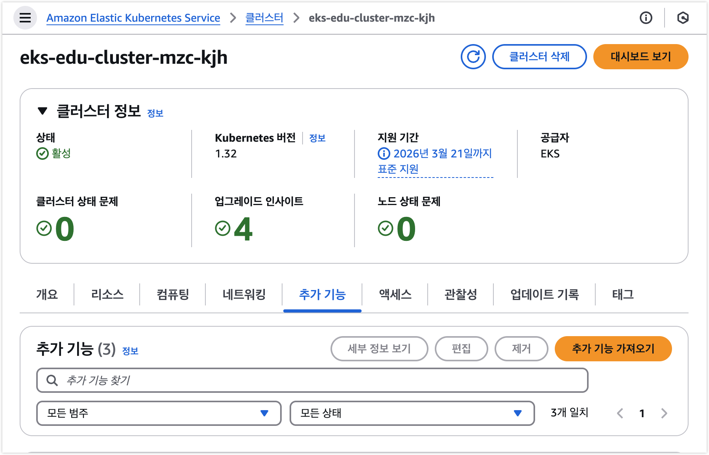
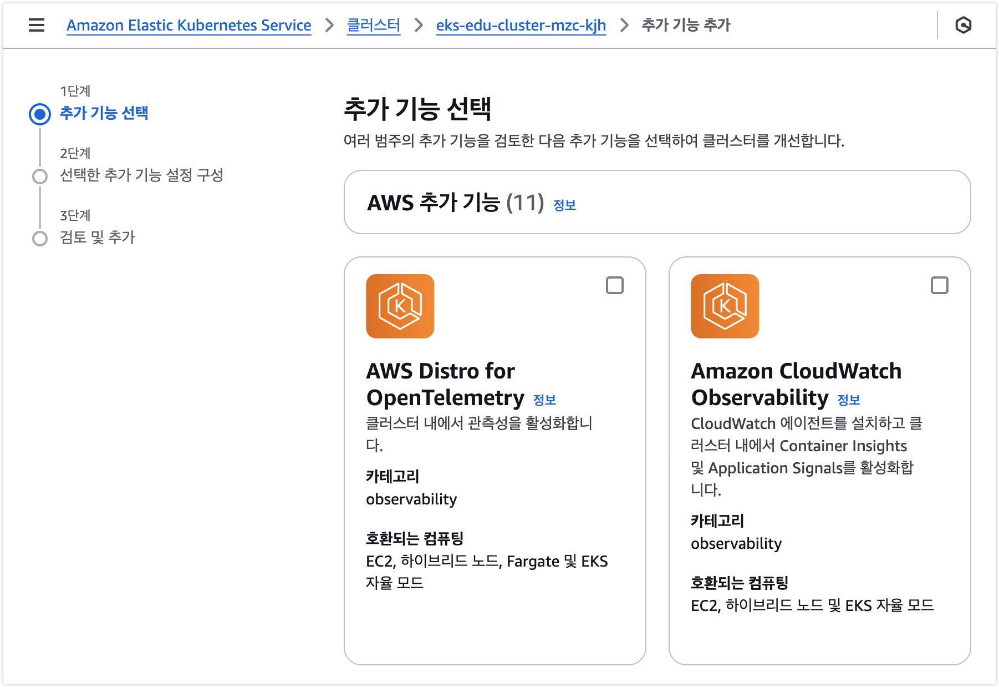
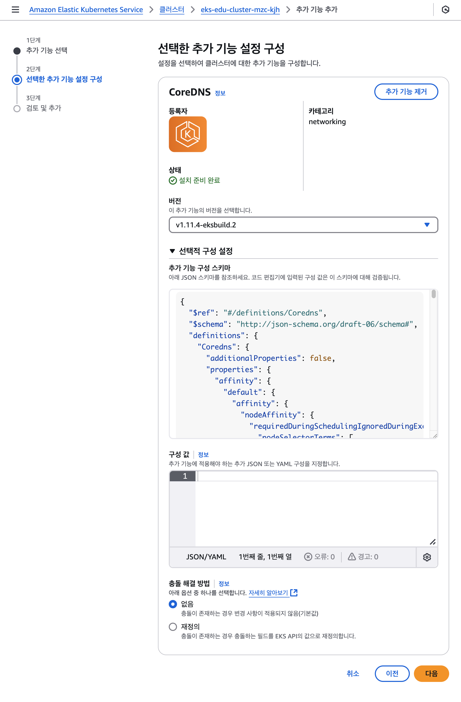

# EKS 추가 기능 (Add-on) - 기본
## 1. 목표
- Addon들을 설치하는 방법을 숙지한다.

## 2. 개요
EKS 추가 기능(Add-on)은 EKS 클러스터 생성 후, EKS 관리를 위해 다양한 Application을 손쉽게 설치 및 관리할 수 있도록 해주는 기능입니다.

AWS에서는 EKS 추가 기능을 다음의 3가지 유형으로 구분하여 제공합니다.

| 유형                      | 설명                                            |
|---------------------------|-------------------------------------------------|
| AWS 추가 기능             | AWS에서 관리하며 EKS를 완벽하게 지원합니다.     |
| AWS Marketplace 추가 기능 | 독립 AWS 파트너가 관리하고 AWS가 검증합니다.    |
| 커뮤니티 추가 기능        | 오픈 소스 커뮤니티가 관리하고 AWS가 검증합니다. |

다음은 각 추가 기능 유형에 대한 AWS가 지원하는 범위입니다.

| 범주       | Feature                                 | AWS 추가 기능 | AWS Marketplace 추가 기능 | 커뮤니티 추가 기능 |
|-----------|------------------------------------------|---------------|---------------------------|--------------------|
| 개발      | AWS가 빌드함                             | 예            | 아니요                    | 예                 |
| 개발      | AWS가 검증함                             | 예            | 아니요                    | 예*                |
| 개발      | AWS 파트너가 검증함                      | 아니요        | 예                        | 아니요             |
| 유지 관리 | AWS가 스캔함                             | 예            | 예                        | 예                 |
| 유지 관리 | AWS가 패치를 적용함                      | 예            | 아니요                    | 예                 |
| 유지 관리 | AWS 파트너가 패치를 적용함               | 아니요        | 예                        | 아니요             |
| 배포      | AWS가 게시함                             | 예            | 아니요                    | 예                 |
| 배포      | AWS 파트너가 게시함                      | 아니요        | 예                        | 아니요             |
| 지원      | AWS가 기본 설치 지원을 제공함            | 예            | 예                        | 예                 |
| 지원      | 전체 AWS 지원                            | 예            | 아니요                    | 아니요             |
| 지원      | 전체 AWS 파트너 지원                     | 아니요        | 예                        | 아니요             |

`*`: 커뮤니터 추가 기능에 대한 검증시 AWS는 EKS 클러스터의 Kubernetes 버전과 호환되는지만 확인함.

이러한 EKS 추가 기능의 관리는 아래 3가지 방식으로 관리할 수 있습니다.
- AWS Management Console
- AWS CLI
- eksctl

## 3. AWS 추가 기능

다음은 AWS가 직접 관리하는 추가 기능들입니다.

| 추가 기능                                 | 종류 | 설명                                                                                                 | 호환되는 컴퓨팅 유형                          |
|-------------------------------------------|------|------------------------------------------------------------------------------------------------------|-----------------------------------------------|
| **[Amazon VPC CNI](https://docs.aws.amazon.com/ko_kr/eks/latest/userguide/workloads-add-ons-available-eks.html#add-ons-vpc-cni)** \*                            | **Network** | **클러스터를 위한 네이티브 VPC 네트워킹 제공**                                                           | **EC2**                                           |
| **[CoreDNS](https://docs.aws.amazon.com/ko_kr/eks/latest/userguide/workloads-add-ons-available-eks.html#add-ons-coredns)** \*                                   | **DNS** | **Kubernetes 클러스터 DNS로 사용할 수 있는 유연하고 확장 가능한 DNS 서버**                               | **EC2, Fargate, EKS Auto Mode, EKS Hybrid Nodes** |
| **[Kube-proxy](https://docs.aws.amazon.com/ko_kr/eks/latest/userguide/workloads-add-ons-available-eks.html#add-ons-kube-proxy)** \*                                | **Network** | **각 Amazon EC2 노드에서 네트워크 규칙 유지 관리**                                                       | **EC2, EKS Hybrid Nodes**                         |
| [Amazon EBS CSI 드라이버](https://docs.aws.amazon.com/ko_kr/eks/latest/userguide/workloads-add-ons-available-eks.html#add-ons-aws-ebs-csi-driver)                   | Storage | 클러스터에 Amazon EBS 스토리지 제공                                                                  | EC2                                           |
| [Amazon EFS CSI 드라이버](https://docs.aws.amazon.com/ko_kr/eks/latest/userguide/workloads-add-ons-available-eks.html#add-ons-aws-efs-csi-driver)                   | Storage | 클러스터에 Amazon EFS 스토리지 제공                                                                  | EC2, EKS Auto Mode                            |
| [Mountpoint for Amazon S3 CSI 드라이버](https://docs.aws.amazon.com/ko_kr/eks/latest/userguide/workloads-add-ons-available-eks.html#mountpoint-for-s3-add-on)     | Storage | 클러스터에 Amazon S3 스토리지 제공                                                                   | EC2, EKS Auto Mode                            |
| [노드 모니터링 에이전트](https://docs.aws.amazon.com/ko_kr/eks/latest/userguide/workloads-add-ons-available-eks.html#add-ons-eks-node-monitoring-agent)                    | Observability | 추가 노드 상태 문제 감지                                                                             | EC2, EKS Hybrid Nodes                         |
| [CSI 스냅샷 컨트롤러](https://docs.aws.amazon.com/ko_kr/eks/latest/userguide/workloads-add-ons-available-eks.html#addons-csi-snapshot-controller)                       | Storage | Amazon EBS CSI 드라이버와 같은 호환되는 CSI 드라이버에서 스냅샷 기능의 사용을 활성화                 | EC2, Fargate, EKS Auto Mode, EKS Hybrid Nodes |
| [Amazon SageMaker HyperPod 작업 거버넌스](https://docs.aws.amazon.com/ko_kr/eks/latest/userguide/workloads-add-ons-available-eks.html#addons-hyperpod)   | Governance | 여러 팀 간 컴퓨팅 리소스 할당 및 사용을 최적화하여 작업 우선순위 지정 및 리소스 공유의 비효율성 해소 | EC2, EKS Auto Mode                            |
| [AWS Network Flow Monitor Agent](https://docs.aws.amazon.com/ko_kr/eks/latest/userguide/workloads-add-ons-available-eks.html#addons-network-flow)            | Observability | 네트워크 흐름 데이터를 수집하여 Amazon CloudWatch에 보고. 클러스터 노드 간 TCP 연결 모니터링 가능    | EC2, EKS Auto Mode                            |
| [AWS Distro for OpenTelemetry](https://docs.aws.amazon.com/ko_kr/eks/latest/userguide/workloads-add-ons-available-eks.html#add-ons-adot)              | Observability | 안전하고 프로덕션 준비가 완료된 AWS 지원 OpenTelemetry 프로젝트 배포                                 | EC2, Fargate, EKS Auto Mode, EKS Hybrid Nodes |
| [Amazon GuardDuty 에이전트](https://docs.aws.amazon.com/ko_kr/eks/latest/userguide/workloads-add-ons-available-eks.html#add-ons-guard-duty)                 | Security | Kubernetes 감사 로그, 런타임 모니터링 포함 보안 모니터링 서비스                                      | EC2, EKS Auto Mode                            |
| [Amazon CloudWatch Observability 에이전트](https://docs.aws.amazon.com/ko_kr/eks/latest/userguide/workloads-add-ons-available-eks.html#amazon-cloudwatch-observability)  | Observability | CloudWatch 에이전트를 설치하고 CloudWatch Application Signals와 Container Insights 활성화            | EC2, EKS Auto Mode, EKS Hybrid Nodes          |
| [EKS Pod Identity 에이전트](https://docs.aws.amazon.com/ko_kr/eks/latest/userguide/workloads-add-ons-available-eks.html#add-ons-pod-id)                 | Security | 애플리케이션에 대한 자격 증명을 관리 (EC2 인스턴스 프로필 방식과 유사)                               | EC2, EKS Hybrid Nodes                         |

`*`: `eksctl` 의 Default Addon 설치(`addonsConfig.disableDefaultAddons=false`) 를 활성화하면 설치되는 기본 추가 기능들입니다.

## 4. 커뮤니티 추가 기능

다음은 오픈소스 커뮤니티가 관리하고, AWS에서 EKS 로 설치가 가능한 추가 기능들입니다.

| 추가 기능                 | 설치 시 이름               | 네임스페이스               | Service Account 이름 | 관리형 IAM 정책                                                                                                                 | 설명                                                                                 |
|---------------------------|----------------------------|----------------------------|----------------------|---------------------------------------------------------------------------------------------------------------------------------|--------------------------------------------------------------------------------------|
| **[지표 서버](https://github.com/kubernetes-sigs/metrics-server)** \*                 | `metrics-server`           | `kube-system`              | **없음**                 | **없음**                                                                                                                            | **Kubernetes 클러스터의 리소스 사용량(metrics)를 수집하고 API로 제공하는 핵심 컴포넌트** |
| [Kube State Metrics](https://kubernetes.io/docs/concepts/cluster-administration/kube-state-metrics/)        | `kube-state-metrics`       | `kube-state-metrics`       | 없음                 | 없음                                                                                                                            | Kubernetes 클러스터의 리소스 사용량(metrics)를 수집하고 API로 제공하는 핵심 컴포넌트 |
| [Prometheus Node Exporter](https://prometheus.io/docs/guides/node-exporter/#monitoring-linux-host-metrics-with-the-node-exporter)  | `prometheus-node-exporter` | `prometheus-node-exporter` | 없음                 | 없음                                                                                                                            | Kubernetes 클러스터의 리소스 사용량(metrics)를 수집하고 API로 제공하는 핵심 컴포넌트 |
| [Cert Manager](https://cert-manager.io/docs/)              | `cert-manager`             | `cert-manager`             | 없음                 | 없음                                                                                                                            | Kubernetes 클러스터의 리소스 사용량(metrics)를 수집하고 API로 제공하는 핵심 컴포넌트 |
| [External DNS](https://github.com/kubernetes-sigs/external-dns)              | `external-dns`             | `external-dns`             | `external-dns`       | [AmazonRoute53FullAccess](https://docs.aws.amazon.com/ko_kr/aws-managed-policy/latest/reference/AmazonRoute53FullAccess.html) | Kubernetes 클러스터의 리소스 사용량(metrics)를 수집하고 API로 제공하는 핵심 컴포넌트 |

`*`: 위 `eksctl`을 통해 EKS 클러스터 생성 시, 기본으로 추가 기능들입니다.

커뮤니티 추가 기능은 위 목록이외에도 현재 지속적으로 추가 되고 있기 때문에, EKS 클러스터 구축 또는 관리 시에 신규 추가 기능이 있는지 확인하는 것이 좋습니다.

## 5. AWS MarketPlace 추가 기능

Marketplace 추가 기능은 독립 소프트웨어 공급업체가 직접 제공합니다. 자세한 내용은 아래 문서 및 EKS 클러스터 생성 후 "추가 기능(Add-ons)" 메뉴를 통해 확인해 보세요.
- [AWS Marketplace 추가 기능](https://docs.aws.amazon.com/ko_kr/eks/latest/userguide/workloads-add-ons-available-vendors.html)

## 6. IAM 역할 필요

일부 추가 기능들은 IAM 역할이 필요하며 다음과 같습니다.

| 추가 기능                                | IAM 역할 필요? |
| ---------------------------------------- | -------------- |
| Amazon VPC CNI                           | ◯              |
| CoreDNS                                  |                |
| Kube-proxy                               |                |
| Amazon EBS CSI 드라이버                  | ◯              |
| Amazon EFS CSI 드라이버                  | ◯              |
| Mountpoint for Amazon S3 CSI 드라이버    | ◯              |
| 노드 모니터링 에이전트                   |                |
| CSI 스냅샷 컨트롤러                      |                |
| Amazon SageMaker HyperPod 작업 거버넌스  |                |
| AWS Network Flow Monitor Agent           | ◯              |
| AWS Distro for OpenTelemetry             | ◯ <sup>*</sup>            |
| Amazon GuardDuty 에이전트                |                |
| Amazon CloudWatch Observability 에이전트 | ◯              |
| EKS Pod Identity 에이전트                | ◯              |

`*`: 고급 구성을 통해 옵트인할 수 있는 사전 구성된 사용자 지정 리소스 중 하나를 사용하는 경우에만 IAM 권한 필요.

## 7. 설치 방법

EKS 추가 기능은 아래 3가지 방법으로 설치 및 관리할 수 있습니다.

- AWS Management Console
- `eksctl`
- AWS CLI

### 7-1. AWS Management Console

1. 생성된 클러스터의 **추가 기능** 탭에서 **추가 기능 가져오기** 버튼 클릭
   
2. 추가할 추가 기능 선택 후, **다음** 버튼 클릭
   
3. 선택한 추가 기능 설정 구성
   - 설치할 추가 기능의 `버전`, 추가 기능의 `선택적 구성 설정`을 적용할 수 있습니다.
   - `버전` 목록에는 현재 EKS 클러스터에서 사용 가능한 버전 목록을 표시하며, 가장 최신 버전을 선택하시는 것이 좋습니다.
   - `선택적 구성 설정`의 `구성 값`은 각 추가기능마다 사용자 정의가 가능한 환경 설정을 적용할 수 있으며, JSON 포맷을 사용합니다.
     - `구성 값`은 `추가 기능 구성 스키마`를 참고하여 사용자 정의한 JSON 데이터를 입력하면 됩니다.
   - `충돌 해결 방법`은 `없음(Preserve)`, `재정의(Override)` 중에서 선택할 수 있습니다.

   


## 3. 사전 조건
```
# EKS 구축
cd ../02_Default_Environment
bash ./01_default_vpc.sh
bash ./02_get_output.sh
bash ./03_make_eksctl_template.sh
bash ./04_eksctl_install.sh
```
## 4. 실습
## 5. 정리