= 8. 네트워크 관리-1
ifdef::env-github[]
:tip-caption: :bulb: Tip
:note-caption: :information_source: Note
:important-caption: :heavy_exclamation_mark: Important
:caution-caption: :fire: Caution
:warning-caption: :warning: Warning
endif::[]
:sectnums:

## 사전 조건

1. link:../00_Setup/[0. 교육 환경 구성하기]를 이용해 기본 실습 환경 생성이 되어 있어야 합니다.
2. link:../00_Setup/[0. 교육 환경 구성하기]를 이용해 생성된 `code-server`에 접속한 상태여야 합니다.
3. link:../03_Default_Environment[3. 기본 환경 생성]을 참고하여 아래와 같이 vpc와 eks를 배포해야 합니다.
+
[source,shell]
----
cd ~/environment/eks-edu/03_Default_Environment/01_create_vpc
sh 01_default_vpc.sh

cd ../02_create_eks
sh 01-3_make_eksctl_cluster_nodegroup_pod_identity_template.sh
sh 02_eksctl_install.sh
----
CAUTION: `01-3_make_eksctl_cluster_nodegroup_pod_identity_template.sh` 사용 필수!!

== 학습 목표

* Amazon EKS 클러스터의 기본 네트워크에 대해 알 수 있습니다.
* Amazon VPC CNI를 이용한 사용자 지정 네트워킹과 대해 알 수 있습니다.

== VPC

아래 요구사항들은 IPv4 기준으로 설명합니다. IPv6에 대한 부분은 Amazon EKS의 https://docs.aws.amazon.com/ko_kr/eks/latest/userguide/network-reqs.html[VPC 및 서브넷 요구 사항, window=_blank]을 참고 바랍니다.

=== VPC 요구사항

* 이미 생성된 VPC의 CIDR 블록보다 많은 IP 주소가 필요한 경우, VPC에 https://docs.aws.amazon.com/vpc/latest/userguide/working-with-vpcs.html#add-ipv4-cidr[CIDR 블록을 추가, window=_blank]하여 사용 가능.
+
CAUTION: *_VPC CIDR 블록을 추가/제거 등의 변화가 생길 경우, EKS 클러스터는 VPC CIDR 블록이 변경된 것을 인식할때까지 최대 5시간이 걸릴 수 있습니다._*
* 클러스터 생성 전,후에 프라이빗(https://datatracker.ietf.org/doc/html/rfc1918[RFC 1918]) 및 퍼블릭(non-RFC 1918) CIDR 블록을 VPC에 연결 가능
* Kubernetes가 IPv6 주소를 포드와 서비스에 할당하게 하려는 경우 IPv6 CIDR 블록을 VPC와 연결.
* VPC는 **DNS 호스트 이름**과 **DNS 확인**을 모두 활성화 되어 있어야 함.
+
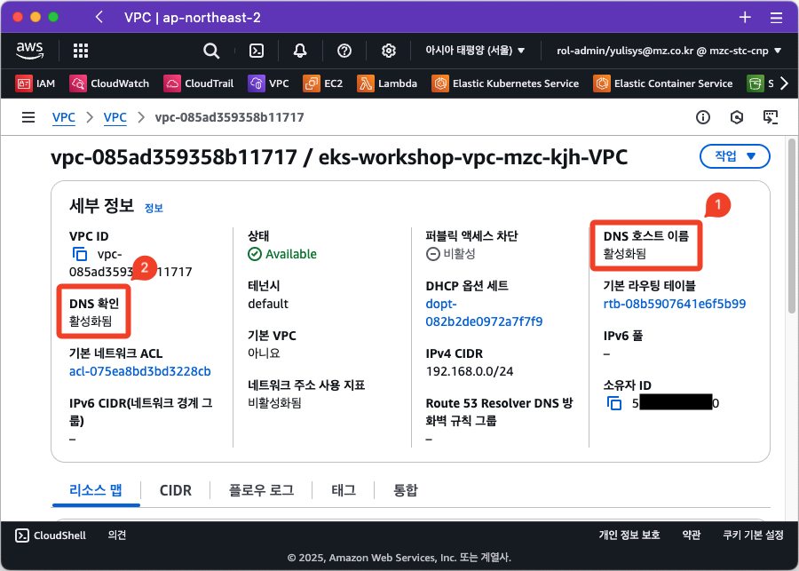
* 프라이빗 EKS 클러스터 환경을 위해 AWS 프라이빗 링크를 사용하는 VPC 엔드포인트가 필요할 수 있음.
+
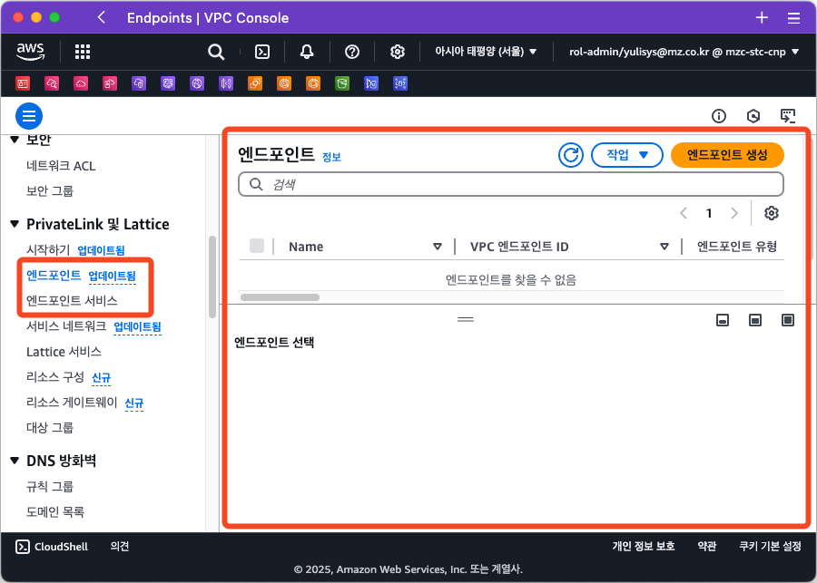

== Subnet

=== Subnet 요구사항

* *최소 2개 이상*의 서로 다른 가용 영역(Availability Zone)에 있는 서브넷 필요
* 각 서브넷에는 _최소 6개 이상 IP 주소 필요_. **16개 이상 IP 주소 권고**.
* 프라이빗 서브넷 또는 퍼블릿 서브넷에 클러스터 생성 가능하지만, 가능하면 프라이빗 서브넷 사용 권고.
* 아래 가용 영역에 생성된 서브넷에는 클러스터 생성 불가
+
[%header%footer%autowidth]
|===
|AWS 리전 |리전 이름| 가용 영역 ID
|`us-east-1` |미국 동부(버지니아 북부) |use1-az3
|`us-west-1` |미국 서부(캘리포니아 북부) |usw1-az2
|`ca-central-1` |캐나다(중부) |cac1-az3
|===
* 노드를 퍼블릿 서브넷에 배포하려는 경우 서브넷은 `IPv4` 퍼블릭 주소 또는 `IPv6` 주소를 자동 할당해야 함.
+
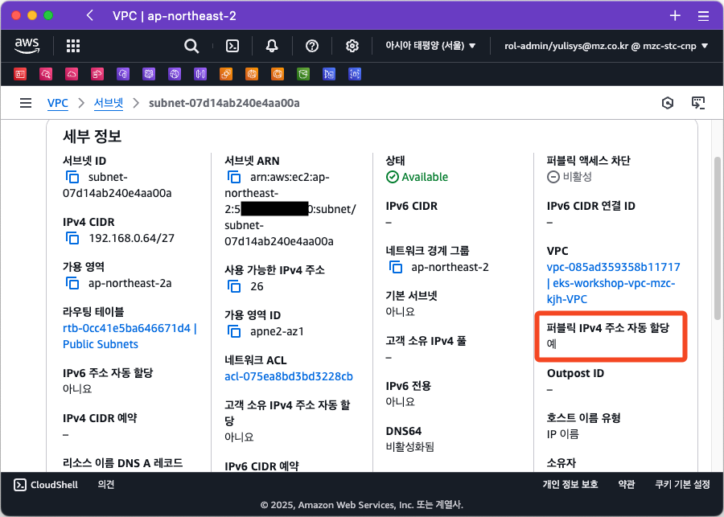
* 노드를 배포하는 서브넷이 프라이빗 서브넷이고, 외부 네트워크가 차단되어 있는 경우, 필요에 따라 다음 VPC 엔드포인트들이 생성되어 있어야 함.
** ex) Amazon ECR, ELB, CloudWatch, STS(Secrets Token Service) 등
** 참고) https://docs.aws.amazon.com/ko_kr/eks/latest/userguide/private-clusters.html[인터넷 액세스가 제한된 프라이빗 클러스터 배포, window=_blank]
* 서브넷에 로드 밸런서를 배포하려는 경우, 해당 서브넷에는 아래 태그가 반드시 생성되어야 함.
+
[%header%footer%autowidth]
|===
| Subnet Type| Tag Key | Tag Value
| Private Subnet |`kubernetes.io/role/internal-elb` |`1`
| Public Subnet |`kubernetes.io/role/elb` | `1`
|===

=== Subnet 고려사항

* EKS 클러스터 생성 시 EKS 클러스터를 위한 ENI(Elastic Network Interface)가 2~4개 생성되어, VPC와 EKS 클러스터간에 통신을 가능하게 함.
+
.(노드그룹을 생성하지 않고 순수 EKS 클러스터만 생성시의 ENI 목록)
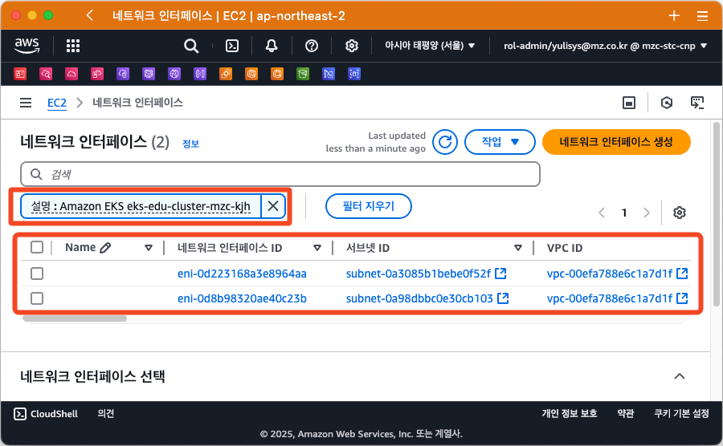
* **Fargate 노드가 사용할 Subnet을 지정하려면 Fargate 프로파일을 이용해야 합니다.**

== 보안 그룹

=== 보안 그룹 요구사항

* 클러스터 생성 시, $\text{eks-cluster-sg-}\color{red}{\text{(cluster-name)}}\color{black}{\text{-}}\color{red}{\text{(uniqueID)}}$ 라는 보안 그룹(클러스터 보안 그룹)이 자동 생성됨.
+
[%header%footer%autowidth]
|===
|규칙 타입 |프로토콜 |포트 |소스 |대상
|Inbound | All | All | Self |-
|Outbound | All | All | - | 0.0.0.0/0(`IPv4`) or ::/0 (`IPv6`)
|===
+
.(예시1: 클러스터 보안 그룹의 인바운드 규칙)
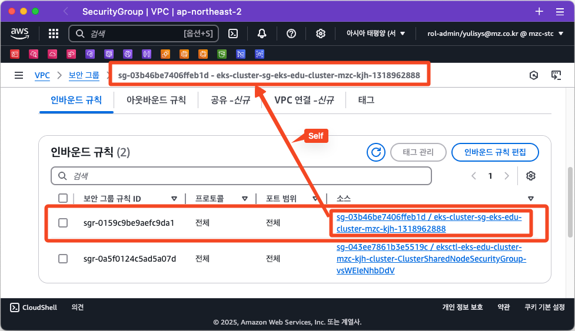
+
.(예시2: 클러스터 보안 그룹의 아웃바운드 규칙)
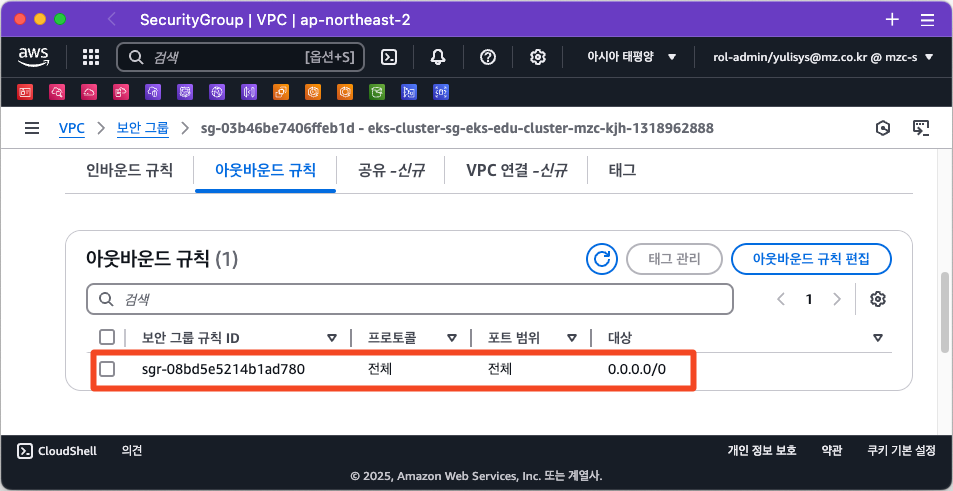
* 클러스터 보안 그룹의 Outbound 규칙은 삭제 가능하지만, 최소한의 Outbound 규칙이 필요합니다.
+
[%header%footer%autowidth]
|===
|규칙 타입 |프로토콜  | 포트
|Outbound |TCP |443
|Outbound |TCP |10250
|Outbound(DNS) |TCP / UDP |53
|===

=== 보안 그룹 고려사항

* 클러스터 보안 그룹에서 <<보안 그룹 요구사항>>에서 생성된 규칙을 제거하면 클러스터가 업데이트될 때마다 해당 규칙을 다시 생성됩니다.
* 클러스터 보안 그룹에는 아래의 태그가 자동으로 추가되며, 태그가 삭제되더라도 클러스터가 업데이트될때마다 자동으로 추가됩니다.
+
[%header%footer%autowidth]
|===
|Tag Key |Tag Value
|`kubernetes.io/cluster/[.replaceable]``cluster_name``` |`owned`
|`aws:eks:cluster-name` |`cluster_name`
|`Name` |`eks-cluster-sg-[.replaceable]``cluster_name``-``uniqueid```
|===
+
.(예시3: 클러스터 보안 그룹의 태그로 자동 생성된 내용)
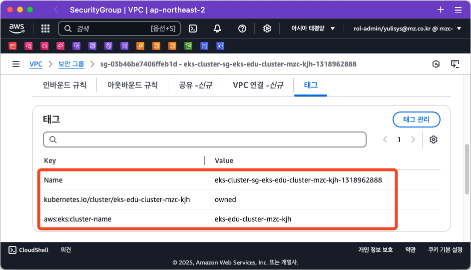
* 클러스터 보안 그룹은 아래 리소스에 자동으로 할당됩니다.
** 클러스터 생성시 자동으로 생성되는 2~4개의 ENI(Elastic Network Interface)
** 관리형 노드 그룹을 통해 생성되는 모드 노드(EC2)의 네트워크 인터페이스(ENI)

=== 클러스터 트래픽 제한

클러스터 보안 그룹에서 기존 생성되는 규칙을 사용하지 않고 세밀하고 규칙을 조정하려면 다음을 고려해야 합니다.

* 노드에서 노드간 통신에 사용할 것으로 예상하는 모든 프로토콜 및 포트 (In/Out)
* 노드 실행 시 클러스터 내부 검사 및 노드 등록을 위해 Amazon EKS API에 액세스할 수 있는 Outbound 인터넷 액세스.
* Amazon S3 접근을 위한 IP 주소.
* 컨테이너 이미지를 가져오는데 필요한 AWS 내,외부 시스템의 IP 주소 범위
+
> ex) Amazon ECR, DockerHub, Kubernetes(registry.k8s.io), GitHub(ghcr.io), GCR(gcr.io)

참고) AWS 의 전체 IP 주소 범위 - https://docs.aws.amazon.com/ko_kr/vpc/latest/userguide/aws-ip-ranges.html

== Amazon EKS를 위한 네트워킹용 추가 기능

이전 추가 기능 부분에서 확인했던것처럼, Amazon EKS에서 기본으로 제공되는 추가 기능은 아래 3가지입니다.

[%header%footer%autowidth]
|===
|추가 기능 |설명
|Amazon VPC CNI for Kubernetes |* ENI(Elastic Network Interface)를 이용하여 Amazon EC2 노드를 EKS 클러스터에 연결 +
* VPC의 IPv4,IPv6 주소를 Pod에 할당
|CoreDNS |Kubernetes 클러스터 DNS로 사용할 수 있는 유연하고 확장 가능한 DNS 서버
|kube-proxy |Amazon EC2 노드의 네트워크 규칙을 유지하고 포드와의 네트워크 통신을 활성화
|===

아래는 EKS에서 추가 기능으로 제공하지는 않지만, 거의 필수적으로 설치가 필요한 Application입니다.

[%header%footer%autowidth]
|===
|Name |설명
|AWS Load Balancer Controller |* Kubernetes의 `Service`의 `loadBalancer` type, `Ingress` 등을 이용하여 AWS ELB(Elastic Load Balancer)를 생성하고 관리 +
* AWS 환경에서 EKS에서 생성되는 Pod, Service 들을 EKS 외부에 노출할 때 주로 사용 (Helm으로 설치)
|===

NOTE: "AWS Load Balancer Controller"는 "11. 네트워킹 2" 챕터에서 자세히 다룰 예정입니다.

== Amazon EC2를 Amazon EKS의 노드로 사용하기 위한 기본 특성

Amazon EKS는 EKS 노드로 사용할 수 있는 컴퓨팅 자원으로써 Amazon EC2를 이용할 수 있으며, EC2를 EKS 노드로 사용하기 전에 먼저 네트워크 특성에 대해 파악해 두는 것이 좋기 때문에 이에 대해 먼저 확인해 보겠습니다.

=== Amazon EC2의 인스턴스 타입별 ENI 수 및 IPv4 주소 개수가 다름

Amazon EC2에서는 네트워크 관리를 위해 탄력적 네트워크 인터페이스(ENI: Elastic Network Interface)라고 불리는 가상 네트워크 카드를 사용합니다.

기본적으로 EC2 인스턴스를 하나 생성하면 ENI 가 하나 자동으로 할당되며, 이후 필요에 따라서 ENI를 추가할 수 있습니다.

하지만, EC2에 연결할 수 있는 ENI 수는 무한대는 아니며 EC2의 인스턴스 타입에 따라 최대 사용 가능한 ENI 수와 IPv4 주소 개수가 정해져 있습니다.

* 확인 방법 1 (AWS Management Console)
+
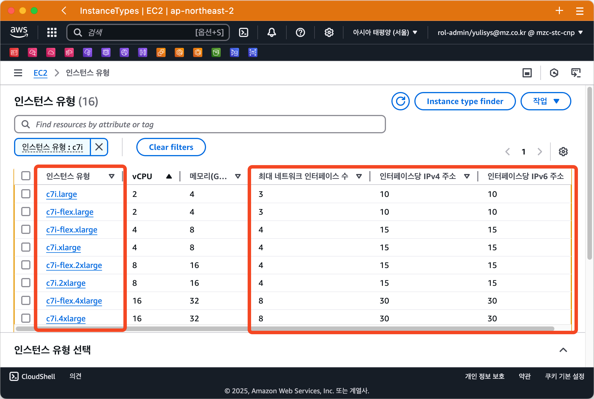
* 확인 방법 2 (AWS CLI)
+
[source,shell]
----
aws ec2 describe-instance-types \
  --filters "Name=instance-type,Values=c7i.*" \
  --query "InstanceTypes[].{ \
      Type: InstanceType, \
      MaxENI: NetworkInfo.MaximumNetworkInterfaces, \
      IPv4addr: NetworkInfo.Ipv4AddressesPerInterface}" \
  --output table --no-cli-pager
----
+
[%header%footer%autowidth]
|===
|Instance Type |Max ENI |Max IPv4 Address Per ENI
|c7i.large |3 |10
|c7i.xlarge |4 |15
|c7i.2xlarge |4 |15
|c7i.4xlarge |8 |30
|c7i.8xlarge |8 |30
|c7i.12xlarge |8 |30
|c7i.16xlarge |15 |50
|c7i.24xlarge |15 |50
|c7i.48xlarge |15 |50
|===

=== IP 주소 부족 해결 방법-1

인스턴스 별로 사용 가능한 IP 주소가 한정되어 있어, 경우에 따라 IP 주소가 부족한 경우가 발생하게 됩니다.

이러한 문제를 해결하기 위해 ENI에서는 IP 주소를 필요한 만큼 추가하여 사용이 가능하지만, 위의 내용처럼 인스턴스별, ENI별 사용 가능한 IP주소는 한정되어 있습니다.

이처럼, 단위 IP 주소를 할당하는데는 한계가 있기 때문에, ENI의 https://docs.aws.amazon.com/ko_kr/AWSEC2/latest/UserGuide/ec2-prefix-eni.html[접두사 위임(Prefix Delegation)기능,window=_blank]을 사용하여, 개별 IP 주소단위 관리가 아닌 IP 주소 블록(IPv4: `/28` (16개), IPv6: `/80` ) 단위로 IP 주소를 할당할 수 있습니다.

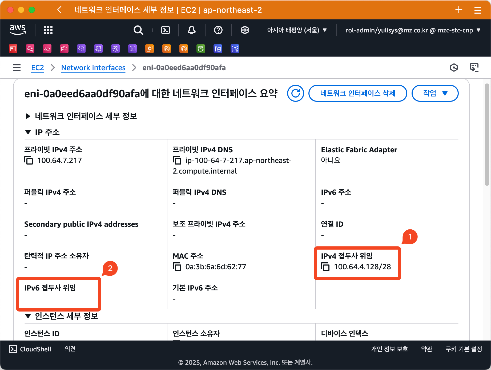

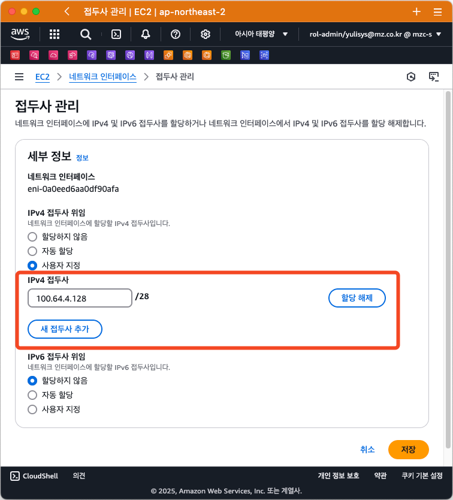

Amazon EKS 에서는 VPC CNI를 이용하여 접두사 위임 기능을 사용할 수 있습니다. 이에 대해서는 다음 <<Amazon VPC CNI>> 에서 설명하겠습니다.

=== IP 주소 부족 해결 방법-2

EKS 에서 사용하는 Subnet에 할당된 IP 주소가 절대적으로 부족할 경우에는 Amazon VPC CNI에서 제공하는 *사용자 지정 네트워킹* 기능을 사용하여 Pod가 사용할 Subnet을 지정하여 IP를 할당할 수 있습니다.

이에 대해서는 아래에서 설명합니다.

== Amazon VPC CNI

Amazon EKS는 Amazon VPC CNI(Container Network Interface) Plugin을 통해 클러스터 네트워킹을 구현합니다.

Amazon VPC CNI는 Amazon VPC의 탄력적 네트워크 인터페이스(Elastic Network Interface:ENI)를 생성하여 Amazon EC2 노드에 연결하며 프라이빗 IPv4 또는 IPv6 주소를 VPC에서 각 Pod에 할당합니다.

Amazon VPC CNI의 설치는 EKS에서 사용하는 노드 유형에 따라 아래와 같이 달라집니다.

[%header%footer%autowidth]
|===
|노드 유형 |설치 방식
|EC2 |EKS 추가기능으로 https://docs.aws.amazon.com/ko_kr/eks/latest/userguide/workloads-add-ons-available-eks.html#add-ons-vpc-cni[Amazon VPC CNI, window=_blank] 설치 필요
|Fargate |* "Amazon VPC CNI" 추가 기능 설치 불필요. +
* Fargate 노드 실행 시 자동으로 설치됨. +
* Fargate 노드에서는 버전 업데이트가 자동으로 안되기 때문에, + 
  버전 업데이트가 필요할 경우에는 직접 Fargate 노드를 재시작해야 함(==Pod 재시작)
|===

=== Amazon VPC CNI의 구성 요소

[%header%footer%autowidth]
|===
|Component |Description
| https://kubernetes.io/docs/concepts/cluster-administration/network-plugins/#cni[CNI Plugin] | 호스트와 Pod의 Network stack을 연결
| `ipamd` | IP 주소 관리 데몬(IP Address Management Daemon, L-IPAMD(Local-IPAMD)라고도 함) +
* 사용 가능한 IP 주소들의 Pool 관리 +
* Pod 에 IP 주소 할당
|===


=== Amazon VPC CNI 사용을 위한 사전 조건

1. AWS IAM OIDC Provider 설정이 되어 있어야 함 (https://docs.aws.amazon.com/ko_kr/eks/latest/userguide/authenticate-oidc-identity-provider.html#associate-oidc-identity-provider[참고^])
2. VPC CNI에서 사용할 IAM 정책 확인 및 역할 생성
+
[%header%footer%autowidth]
|===
|IP 주소 유형 |IAM 정책 이름
|IPv4 |https://docs.aws.amazon.com/aws-managed-policy/latest/reference/AmazonEKS_CNI_Policy.html[AmazonEKS_CNI_Policy^] 관리형 정책 사용
|IPv6 |https://docs.aws.amazon.com/ko_kr/eks/latest/userguide/cni-iam-role.html#cni-iam-role-create-ipv6-policy[IPv6 패밀리를 사용하는 클러스터에 대한 IAM 정책 생성^] 내용 참고하여 직접 생성
|===

=== Amazon VPC CNI 생성하기

Amazon VPC CNI는 EKS의 추가 기능을 이용해 설치가 가능하며, IAM 역할을 생성하여 AMazon VPC CNI에 연결해 주어야 정상 동작합니다.

Amazon VPC CNI 생성 절차는 다음과 같습니다.

. VPC CNI가 사용할 IAM 정책확인 및 역할 생성
. Amazon VPC CNI 설치
. EKS Node Group 생성

<<1-사전-조건>> 에서 안내한대로 EKS 클러스터를 생성하였다면, Amazon VPC CNI가 자동으로 설치되면 아래 화면과 같습니다.

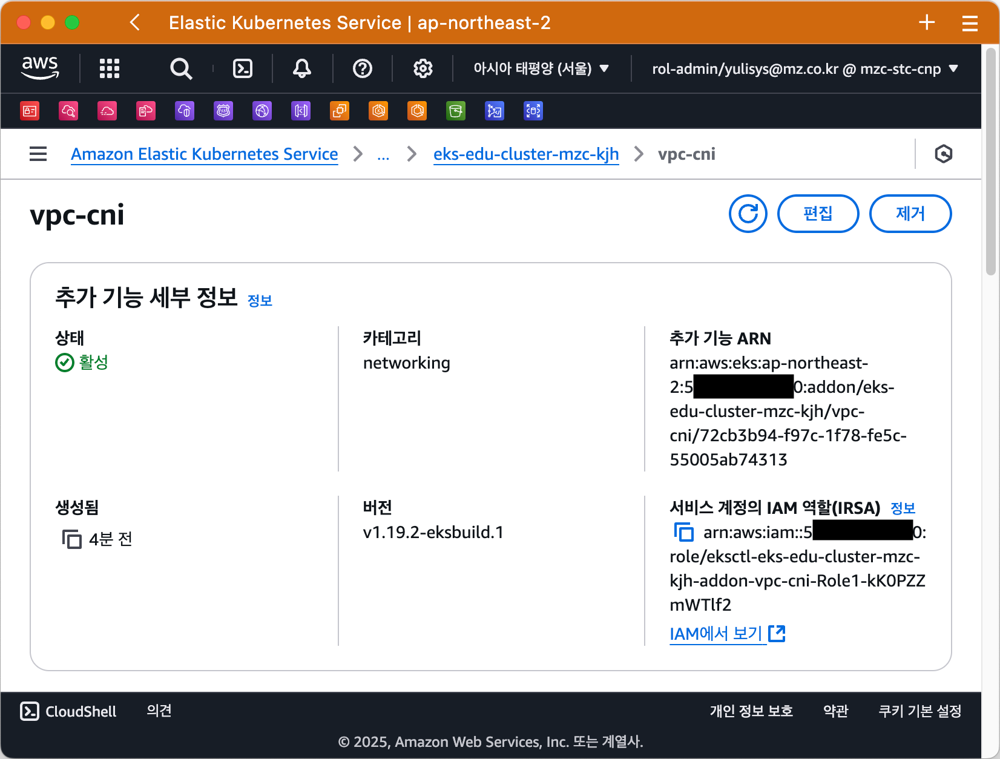

link:../07_Addons/[7. 추가 기능 관리]에서 안내한 것처럼, `eksctl` 을 이용해 직접 설치를 하려면 다음과 같습니다.

[source,shell]
----
eksctl create addon --cluster <클러스터이름> --name vpc-cni
----

이와 같이 실행한다면, Amazon VPC CNI를 설치하기 전에 IAM Role을 자동으로 생성하면서 IRSA 방식으로 설치를 해줍니다.

만약, Pod Identity를 사용하고자 한다면 다음과 같이 실행할 수 있습니다.

[source,shell]
----
eksctl create addon --cluster <클러스터이름> --name vpc-cni --auto-apply-pod-identity-associations
----

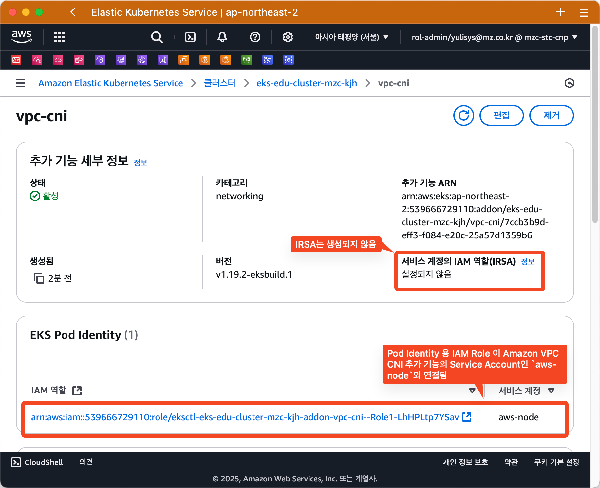

위 명령을 eksctl 용 Config 파일로 구성한다면 다음과 같습니다.

[source,yaml]
----
apiVersion: eksctl.io/v1alpha5
kind: ClusterConfig
metadata:
  name: $CLUSTER_NAME
  region: $AWS_REGION

addons:
  - name: vpc-cni

addonsConfig:
  autoApplyPodIdentityAssociations: true    # default: false
----


== 맞춤형 네트워킹 (Custom Networking)

1. 기본적으로 Kubernetes용 Amazon VPC CNI 플러그인이 Amazon EC2 노드에 대한 보조 탄력적 네트워크 인터페이스 (네트워크 인터페이스)를 생성할 때 노드의 기본 네트워크 인터페이스와 동일한 서브넷에 이를 생성합니다
2. 또한 기본 네트워크 인터페이스에 연결된 동일한 보안 그룹을 보조 네트워크 인터페이스에 연결합니다. 
3. 다음 중 하나 이상의 이유로 플러그 인이 다른 서브넷에서 보조 네트워크 인터페이스를 생성하거나 다른 보안 그룹을 보조 네트워크 인터페이스에 연결하거나, 둘 다 하려고 할 수 있습니다.
    - 기본 네트워크 인터페이스가 있는 서브넷에서 사용할 수 있는 IPv4 주소의 수는 제한되어 있습니다. 이렇게 하면 서브넷에서 생성할 수 있는 포드 수가 제한될 수 있습니다. 보조 네트워크 인터페이스에 다른 서브넷을 사용하면 포드에 사용 가능한 IPv4 주소 수를 늘릴 수 있습니다.
    - 보안상의 이유로 포드는 노드의 기본 네트워크 인터페이스와 다른 서브넷 또는 보안 그룹을 사용해야 할 수 있습니다.
    - 노드는 퍼블릭 서브넷에서 구성되며, 포드를 프라이빗 서브넷에 배치할 수 있습니다. 퍼블릭 서브넷과 연결된 라우팅 테이블에는 인터넷 게이트웨이로 가는 경로가 포함됩니다. 프라이빗 서브넷과 연결된 라우팅 테이블에는 인터넷 게이트웨이로 가는 경로가 포함되지 않습니다.

=== 맞춤형 네트워킹 고려 사항

* 사용자 지정 네트워킹을 사용 설정하면 기본 네트워크 인터페이스에 할당된 IP 주소가 포드에 할당되지 않습니다. 보조 네트워크 인터페이스의 IP 주소만 포드에 할당됩니다.
* 클러스터에서 **IPv6 패밀리를 사용하는 경우 사용자 지정 네트워킹을 사용할 수 없습니다.**
* 사용자 지정 네트워킹을 사용하여 IPv4 주소 소모를 완화하려는 경우 대신 IPv6 패밀리를 사용하여 클러스터를 생성할 수 있습니다.
* 보조 네트워크 인터페이스에 지정된 서브넷에 배포된 포드는 노드의 기본 네트워크 인터페이스와 다른 서브넷 및 보안 그룹을 사용할 수 있다고 해도 **서브넷과 보안 그룹은 노드와 동일한 VPC에 있어야 합니다.**

== IP 주소 늘리기

== 사전 조건

== 실습
=== VPC에 Secondary Cidr에 추가하기
```
sh 01_get_output.sh
```
== 5. 정리