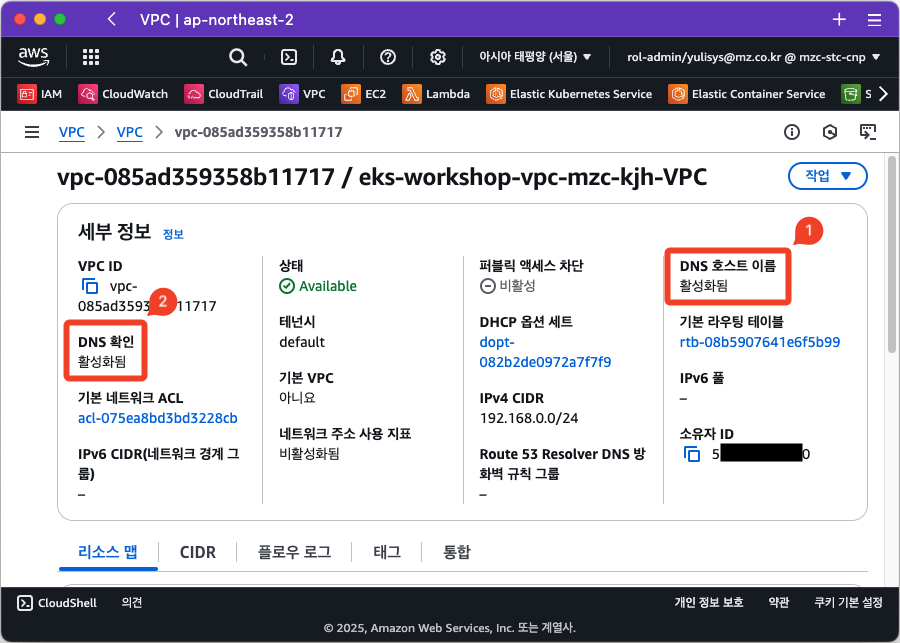
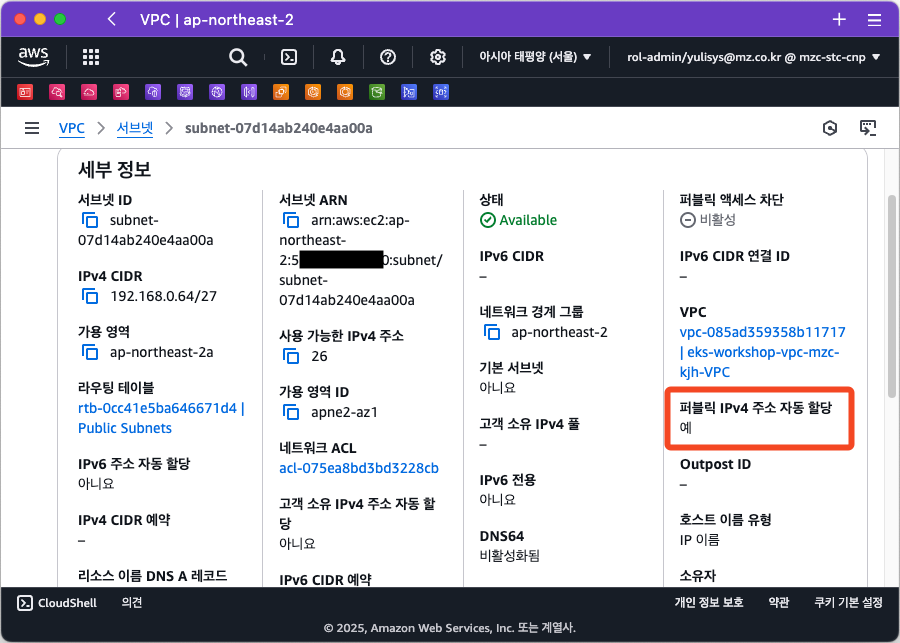

# 1. 목표

## 2. VPC

아래 요구사항들은 IPv4 기준으로 설명합니다. IPv6에 대한 부분은 Amazon EKS의 [VPC 및 서브넷 요구 사항](https://docs.aws.amazon.com/ko_kr/eks/latest/userguide/network-reqs.html)을 참고 바랍니다.

### 2-1. VPC 요구사항

- 이미 생성된 VPC의 CIDR 블록보다 많은 IP 주소가 필요한 경우, VPC에 [CIDR 블록을 추가](https://docs.aws.amazon.com/vpc/latest/userguide/working-with-vpcs.html#add-ipv4-cidr)하여 사용 가능.
> [!CAUTION]
> **<ins>클러스터가 VPC와 연결된 CIDR 블록을 인식하는 데 최대 5시간이 걸릴 수 있습니다.</ins>**
- 클러스터 생성 전,후에 프라이빗([RFC 1918](https://datatracker.ietf.org/doc/html/rfc1918)) 및 퍼블릭(non-RFC 1918) CIDR 블록을 VPC에 연결 가능
- Kubernetes가 IPv6 주소를 포드와 서비스에 할당하게 하려는 경우 IPv6 CIDR 블록을 VPC와 연결.
- VPC는 **DNS 호스트 이름**과 **DNS 확인**을 모두 지원해야 함.
  
- VPC에는 AWS 프라이빗 링크를 사용하는 VPC 엔드포인트가 필요할 수 있음.
  

## 3. Subnet

### 3-1. Subnet 요구사항

- *최소 2개 이상*의 서로 다른 가용 영역(Availability Zone)에 있는 서브넷 필요
- 각 서브넷에는 <ins>최소 6개 이상 IP 주소 필요</ins>. **16개 이상 IP 주소 권고**.
- 프라이빗 서브넷 또는 퍼블릿 서브넷에 클러스터 생성 가능하지만, 가능하면 프라이빗 서브넷 사용 권고.
- 아래 가용 영역의 서브넷에는 클러스터 생성 불가

  | AWS 리전       | 리전 이름                  | 가용 영역 ID |
  | -------------- | -------------------------- | ------------ |
  | `us-east-1`    | 미국 동부(버지니아 북부)   | use1-az3     |
  | `us-west-1`    | 미국 서부(캘리포니아 북부) | usw1-az2     |
  | `ca-central-1` | 캐나다(중부)               | cac1-az3     |

- 노드를 퍼블릿 서브넷에 배포하려는 경우 서브넷은 `IPv4` 퍼블릭 주소 또는 `IPv6` 주소를 자동 할당해야 함.
  
- 노드를 배포하는 서브넷이 프라이빗 서브넷이고, 외부 네트워크가 차단되어 있는 경우, 필요에 따라 다음 VPC 엔드포인트들이 생성되어 있어야 함.
  - ex) Amazon ECR, ELB, CloudWatch, STS(Secrets Token Service) 등
  - 참고) [인터넷 액세스가 제한된 프라이빗 클러스터 배포](https://docs.aws.amazon.com/ko_kr/eks/latest/userguide/private-clusters.html)
- 서브넷에 로드 밸런서를 배포하려는 경우, 해당 서브넷에는 아래 태그가 반드시 생성되어야 함.
  - 프라이빗 서브넷
    | Tag Key                           | Tag Value |
    | --------------------------------- | --------- |
    | `kubernetes.io/role/internal-elb` | `1`       |
  - 퍼블릭 서브넷
    | Tag Key                           | Tag Value |
    | --------------------------------- | --------- |
    | `kubernetes.io/role/elb`          | `1`       |

### 3-2. Subnet 고려사항

- EKS 클러스터 생성 시 EKS 클러스터를 위한 ENI(Elastic Network Interface)가 2~4개 생성되어, VPC와 EKS 클러스터간에 통신을 가능하게 함.
  
  (위 이미지는 노드그룹을 생성하지 않고 순수 EKS 클러스터만 생성시의 ENI 목록)

## 4. 보안 그룹

### 4-1. 보안 그룹 요구사항

- 클러스터 생성 시, `eks-cluster-sg-my-cluster-uniqueID` 라는 보안 그룹(클러스터 보안 그룹)이 자동 생성됨.
  | 규칙 타입   | 프로토콜  | 포트 | 소스 | 대상                               |
  | ----------- | --------- | ---- | ---- | ---------------------------------- |
  | Inbound     | All       | All  | Self |                                    |
  | Outbound    | All       | All  |      | 0.0.0.0/0(`IPv4)` or ::/0 (`IPv6`) |
- 클러스터 보안 그룹의 Outbound 규칙은 삭제 가능하지만, 최소한의 Outbound 규칙이 필요함.
  | 규칙 타입     | 프로토콜  | 포트   |
  | -----------   | --------- | ------ |
  | Outbound      | TCP       | 443    |
  | Outbound      | TCP       | 10250  |
  | Outbound(DNS) | TCP / UDP | 53     |
  
### 4-2. 보안 그룹 고려사항

- 클러스터 보안 그룹에서 [기본 인바운드 규칙](#4-1-보안-그룹-요구사항)을 제거하면 클러스터가 업데이트될 때마다 해당 규칙을 다시 생성.
- 클러스터 보안 그룹에는 아래의 태그가 자동으로 추가되며, 태그가 삭제되더라도 클러스터가 업데이트될때마다 자동으로 추가됨
  | Tag Key                                | Tag Value                            |
  | -------------------------------------- | ------------------------------------ |
  | `kubernetes.io/cluster/my-cluster`     | `owned`                              |
  | `aws:eks:cluster-name`                 | `my-cluster`                         |
  | `Name`                                 | `eks-cluster-sg-my-cluster-uniqueid` |
- 클러스터 보안 그룹은 아래 리소스에 자동으로 할당됨
  - 클러스터 생성시 자동으로 생성되는 2~4개의 ENI(Elastic Network Interface)
  - 관리형 노드 그룹을 통해 생성되는 모드 노드(EC2)의 네트워크 인터페이스(ENI)

### 4-3. 클러스터 트래픽 제한

클러스터 보안 그룹에서 기존 생성되는 규칙을 사용하지 않고 세밀하고 규칙을 조정하려면 다음을 고려해야 합니다.

- 노드에서 노드간 통신에 사용할 것으로 예상하는 모든 프로토콜 및 포트 (In/Out)
- 노드 실행 시 클러스터 내부 검사 및 노드 등록을 위해 Amazon EKS API에 액세스할 수 있는 Outbound 인터넷 액세스.
- Amazon S3 접근을 위한 IP 주소.
- 컨테이너 이미지를 가져오는데 필요한 AWS 내,외부 시스템의 IP 주소 범위
  > ex) Amazon ECR, DockerHub, Kubernetes(registry.k8s.io), GitHub(ghcr.io), GCR(gcr.io)

참고) AWS 의 전체 IP 주소 범위 - https://docs.aws.amazon.com/general/latest/gr/aws-ip-ranges.html


## 2-2. 맞춤형 네트워킹
1. 기본적으로 Kubernetes용 Amazon VPC CNI 플러그인이 Amazon EC2 노드에 대한 보조 탄력적 네트워크 인터페이스 (네트워크 인터페이스)를 생성할 때 노드의 기본 네트워크 인터페이스와 동일한 서브넷에 이를 생성합니다
2. 또한 기본 네트워크 인터페이스에 연결된 동일한 보안 그룹을 보조 네트워크 인터페이스에 연결합니다. 
3. 다음 중 하나 이상의 이유로 플러그 인이 다른 서브넷에서 보조 네트워크 인터페이스를 생성하거나 다른 보안 그룹을 보조 네트워크 인터페이스에 연결하거나, 둘 다 하려고 할 수 있습니다.
    - 기본 네트워크 인터페이스가 있는 서브넷에서 사용할 수 있는 IPv4 주소의 수는 제한되어 있습니다. 이렇게 하면 서브넷에서 생성할 수 있는 포드 수가 제한될 수 있습니다. 보조 네트워크 인터페이스에 다른 서브넷을 사용하면 포드에 사용 가능한 IPv4 주소 수를 늘릴 수 있습니다.
    - 보안상의 이유로 포드는 노드의 기본 네트워크 인터페이스와 다른 서브넷 또는 보안 그룹을 사용해야 할 수 있습니다.
    - 노드는 퍼블릭 서브넷에서 구성되며, 포드를 프라이빗 서브넷에 배치할 수 있습니다. 퍼블릭 서브넷과 연결된 라우팅 테이블에는 인터넷 게이트웨이로 가는 경로가 포함됩니다. 프라이빗 서브넷과 연결된 라우팅 테이블에는 인터넷 게이트웨이로 가는 경로가 포함되지 않습니다.
### 2-3. 고려 사항
- 사용자 지정 네트워킹을 사용 설정하면 기본 네트워크 인터페이스에 할당된 IP 주소가 포드에 할당되지 않습니다. 보조 네트워크 인터페이스의 IP 주소만 포드에 할당됩니다.
- 클러스터에서 **IPv6 패밀리를 사용하는 경우 사용자 지정 네트워킹을 사용할 수 없습니다.**
- 사용자 지정 네트워킹을 사용하여 IPv4 주소 소모를 완화하려는 경우 대신 IPv6 패밀리를 사용하여 클러스터를 생성할 수 있습니다.
- 보조 네트워크 인터페이스에 지정된 서브넷에 배포된 포드는 노드의 기본 네트워크 인터페이스와 다른 서브넷 및 보안 그룹을 사용할 수 있다고 해도 **서브넷과 보안 그룹은 노드와 동일한 VPC에 있어야 합니다.**
- **Fargate의 경우 서브넷은 Fargate 프로필을 통해 제어**됩니다.
## 2-4. IP 주소 늘리기

# 3. 사전 조건

# 4. 실습
## 4.1 VPC에 Secondary Cidr에 추가하기
```
sh 01_get_output.sh
```
# 5. 정리