= 9. 컴퓨팅 관리 1
// Settings:
:experimental:
:icons: font
:sectnums:
// :!sectids:
// Github?
ifdef::env-github[]
:tip-caption: :bulb:
:note-caption: :information_source:
:important-caption: :heavy_exclamation_mark:
:caution-caption: :fire:
:warning-caption: :warning:
endif::[]
// No Github?
ifndef::env-github[]
:toc: left
:toclevels: 4
endif::[]
:revealjsdir: https://cdn.jsdelivr.net/npm/reveal.js
:revealjs_showSlideNumber: all
:revealjs_hash: true
// Presentation 변환 참고용
// - https://asciidoc-slides.8vi.cat/
// - https://zenika.github.io/adoc-presentation-model/reveal-my-asciidoc.html

// [#goals]
== 학습 목표
* EKS 노드 그룹의 개념과 유형을 이해합니다.
* 관리형과 비관리형 노드 그룹의 차이점을 설명할 수 있습니다.
* 노드 관리를 위한 모범 사례를 파악합니다.

// [#prerequisite]
== 사전 조건
1. link:../00_Setup/[0. 교육 환경 구성하기]를 이용해 기본 실습 환경 생성이 되어 있어야 합니다.
2. link:../00_Setup/[0. 교육 환경 구성하기]를 이용해 생성된 `code-server`에 접속한 상태여야 합니다.
3. link:../03_Default_Environment[3. 기본 환경 생성]을 참고하여 아래와 같이 vpc와 eks를 배포해야 합니다.
+
[source,shell]
----
cd ~/environment/eks-edu/03_Default_Environment/01_create_vpc
sh 01_default_vpc.sh

cd ../02_create_eks
sh 01-1_make_eksctl_cluster_only_template.sh <1>
sh 02_eksctl_install.sh
----
<1> `#01-1_make_eksctl_cluster_only_template.sh#` 사용 필수!!

== Kubernetes 노드 구성 요소
// [%header%footer%autowidth]
[%autowidth,cols="1s,a"]
|===
|구성 요소 |설명

|kubelet
|* 각 노드에서 실행되는 *노드 에이전트*
* 컨테이너가 제공된 Pod 스펙(PodSpec)에 따라 정상 실행되도록 관리

|kube-proxy
|* 각 노드에서 실행되는 네트워크 프록시
* 노드의 네트워크 규칙을 관리
* 내/외부 네트워크 세션에 대한 포워딩을 처리

|Container Runtime
|* 컨테이너 실행을 담당하는 소프트웨어
* *containerd*, CRI-O, Docker 등이 대표적 footnote:[`Docker` 는 Kubernetes 1.24 부터 https://kubernetes.io/blog/2022/02/17/dockershim-faq/[지원 중단됨]]
* 컨테이너 이미지를 다운로드하고 실행하는 역할 수행
|===

== Amazon EKS 노드 관리 개요

Amazon EKS 클러스터는 다음 5가지 유형으로 노드를 관리할 수 있습니다.

. 관리형 노드 그룹 (Managed Node Groups)
. 자체 관리형 노드 (Self-managed nodes)
. AWS Fargate
. EKS Auto Mode
. Amazon EKS Hybrid Nodes

=== 관리형 노드 그룹 (Managed Node Groups)
관리형 노드 그룹은 Amazon EKS에서 Kubernetes 노드로 사용하는 Amazon EC2 인스턴스를 논리적으로 구분한 개념으로 노드 그룹을 통해 워크로드에 맞는 컴퓨팅 리소스 구성이 가능합니다.

.관리형 노드 그룹 특징
[%autowidth,cols="1s,a"]
|===
|특징 | 설명

|간편한 노드 관리
|* AWS가 노드의 프로비저닝과 수명 주기를 관리
* 여러개의 관리형 노드 그룹 사용 가능
* Auto Scaling 그룹(ASG) 기반으로 동작

|손쉬운 업그레이드
|* 노드 업데이트 및 패치 자동화 지원
* 손쉬운 버전 업그레이드 기능 제공
|===

=== https://docs.aws.amazon.com/ko_kr/eks/latest/userguide/worker.html[자체 관리형 노드 (Self-managed nodes)]
자체 관리형 노드는 사용자가 노드의 프로비저닝과 수명 주기를 직접 관리하는 방식으로, 관리형 노드 그룹보다 사용자 정의가 가능하지만 [.underline]*운영 부담이 큽니다.*

즉, 노드 업데이트, 스케일링, 복구 등을 직접 관리해야 하기 때문에 운영 비용과 복잡성이 증가할 수 있어, *관리형 노드 그룹* 또는 *Fargate* 를 사용하는 것이 일반적입니다.

이 방식은 GPU나 커스텀 AMI 등 특별한 요구사항이 있는 워크로드에 적합합니다.

.자체 관리형 노드 특징
[%autowidth,cols="1s,a"]
|===
|특징 | 설명

|세밀한 노드 관리
|* 사용자가 직접 노드를 관리
* 원하는 형태로 노드를 직접 구성 가능

|적합한 워크 로드
|* GPU 기반 머신러닝/딥러닝 워크로드
* 특정 커널 버전이나 드라이버가 필요한 워크로드
* 특수한 네트워킹 구성이 필요한 워크로드
* 커스텀 AMI가 필요한 워크로드
* 규제 준수를 위해 특별한 보안 설정이 필요한 워크로드

|사용자 정의 옵션 사용 가능
|* 보안 그룹 구성
* IAM 역할 및 정책 적용
* kubelet 구성
* 시작 템플릿 사용
* 스토리지 구성
* 네트워킹 설정(CNI 플러그인)
* 노드 레이블 및 테인트 설정
|===

=== AWS Fargate

* AWS Fargate는 컨테이너에 대한 적정 규모의 온디맨드 컴퓨팅 용량을 제공하는 기술
* 서버리스 컴퓨팅 엔진으로 컨테이너가 실행되어 인프라 관리 불필요
* Pod 단위로 리소스 할당 및 과금이 되어 사용한 만큼만 비용 지불

.AWS Fargate 주요 특징
[%autowidth,cols="1s,3a"]
|===
|특징 |설명

|간편한 노드 관리
|* AWS가 노드의 프로비저닝과 수명 주기를 관리
* https://docs.aws.amazon.com/ko_kr/eks/latest/userguide/horizontal-pod-autoscaler.html[HPA(Horizontal Pod Autoscaler)], https://github.com/kubernetes/autoscaler/tree/master/vertical-pod-autoscaler#quick-start[VPA(Vertical Pod Autoscaler)]를 이용한 자동 확장/축소 가능 +
(AutoScaling Group 불필요)

|보안
|* Pod 격리 +
-> Pod마다 하나의 Fargate Node로 실행되어 보안에 유리
* 보안 패치 자동화

|비용 효율성
|* 사용한 만큼만 지불

|적합한 워크로드
|* 가변적인 워크로드
* 마이크로서비스
* 배치 처리
* 개발/테스트 환경
|===

=== EKS Auto Mode
* EKS 클러스터의 노드를 자동으로 관리하는 모드
* 워크로드 요구사항에 따라 자동으로 노드 수를 조정

.EKS Auto Mode 주요 특징
[cols="1s,4a"]
|===
|특징 |설명

| 클러스터 관리 간소화
|
* 운영 오버헤드를 최소화하면서 프로덕션 지원 클러스터를 제공
* EKS에 대한 전문 지식 없이도 까다롭고 동적인 워크로드를 안정적으로 실행

| 애플리케이션 가용성
|
* 애플리케이션의 요구에 따라 노드를 동적으로 추가하거나 제거 가능
* Manual 용량 계획의 필요성을 최소화하고 애플리케이션 가용성 보장

| 관리형 컴포넌트 +
(핵심 Addon 불필요)
|
* Kubernetes 및 AWS 클라우드 기능 사용을 위한 추가 기능(Addon) 관리 자동화 (VPC,CoreDNS,EBS, ELB)

| 효율성
|
* https://karpenter.sh/docs/[Kerpenter]가 기본 탑재되어 NodePool 및 워크로드 요구 사항에 정의된 유연성을 주수하여 비용을 최적화하도록 설계
* 미사용 인스턴스를 종료하고 워크로드를 다른 노드로 통합하여 비용 효율성 개선

| 자동 업그레이드
| * 포드 중단 예산(PDB:Pod Disruption Budget) 및 +
NodePool 중단 예산(NodePool Disruption Budget)을 준수하면서 최신 패치를 사용하여 최신 상태로 유지

| 보안
| * 노드에 대해 변경 불가능한 AMI를 사용.
* SELinux 필수 접근 제어 활성화 및 읽기 전용 루트 파일 시스템 제공.
* EKS Auto Mode로 시작된 노드의 최대 수명은 21일(조정 가능)이며, 그 후에는 새 노드로 자동 대체됨

|적합한 워크로드
|
** 변동성이 큰 워크로드
** 다양한 컴퓨팅 요구사항
** 비용 효율성이 중요한 워크로드
|===

== 관리형 노드 그룹 (Managed Node Groups)

=== Check List

// .노드 그룹 사전 조건
[cols="1s,4a"]
|===
|분류 |내용

|Subnet
|* Public Subnet, Private Subnet 모두에서 시작 가능
* Public Subnet에서 관리형 노드 그룹을 시작하는 경우, 해당 Subnet에서 `MapPublicIpOnLaunch` (퍼블릭 IPv4 주소 자동 할당)가 `true` 로 설정되어야 함.
+
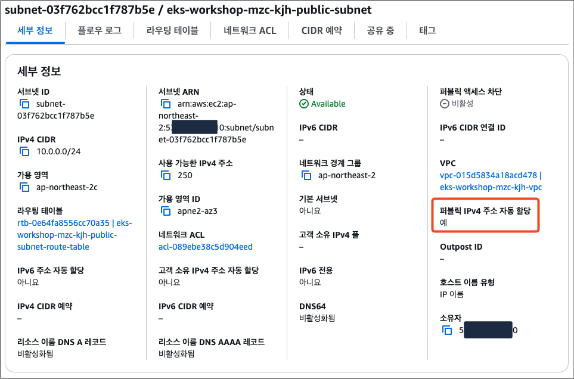

|VPC Endpoint
|Private Subnet(Pirvate Cluster)에 생성되는 노드/Pod들은 상황에 따라 AWS 서비스 접근이 필요하기 때문에 아래 VPC Interface Endpoint가 필요함

[%header,cols="1s,3a"]
!===
! Service ! Endpoint

!EKS Auth
!* com.amazonaws.[.replaceable]`_#region-code#_`.eks-auth

(Pod Identity 연결 사용시 필요)

!EKS
!* com.amazonaws.[.replaceable]`_#region-code#_`.eks

!CloudWatch Logs
!* com.amazonaws.[.replaceable]`_#region-code#_`.logs

!STS (Security Token Service)
!* com.amazonaws.[.replaceable]`_#region-code#_`.sts

(IRSA 사용 시 필요)
!EC2
!* com.amazonaws.[.replaceable]`_#region-code#_`.ec2

(EKS 최적화 AMI 사용 시 필요)
!ECR
!* com.amazonaws.[.replaceable]`_#region-code#_`.ecr.api
* com.amazonaws.[.replaceable]`_#region-code#_`.ecr.dkr
* com.amazonaws.[.replaceable]`_#region-code#_`.s3

(컨테이너 이미지 가져오기용)

!ALB/NLB
!* com.amazonaws.[.replaceable]`_#region-code#_`.elasticloadbalancing

!X-Ray
!* com.amazonaws.[.replaceable]`_#region-code#_`.xray
!===

|노드 수량 조정
|* 관리형 노드 그룹을 업데이트하면 Pod에 대해 설정한 Pod Disruption Budget을 준수함.
* 노드를 종료하거나 원하는 노드 수를 줄이는 경우 Pod Disruption Budget(PDB)은 적용되지 않음.
* 노드 종료를 위해 Pod를 퇴거(Evict)시키려 시도하지만, 15분동안 종료되지 않으면 무시하고 노드를 강제 종료함.

|EBS 볼륨 암호화
|* EC2 시작 템플릿(Launch Template)을 사용하여 암호화가 필요한 EBS에 KMS를 지정한 후, EBS 노드 배포 필요.

|===

=== 관리형 노드 그룹 용량 유형

관리형 노드 그룹을 통해 생성되는 노드의 유형을 다음 2가지 중에서 선택 가능.

* 온디맨드
* Spot

자세한 내용은 EKS 사용자 가이드의 https://docs.aws.amazon.com/ko_kr/eks/latest/userguide/managed-node-groups.html#managed-node-group-capacity-types[관리형 노드 그룹 용량] 참고.

== AWS Fargate

=== AWS Fargate 고려사항

AWS Fargate는 Serverless로 관리되는 노드이기 때문에 Fargate 노드를 사용하기 전에 아래 내용에 대해 반드시 숙지하여야 합니다.

. 인프라 관련
** Host OS 접근이 불가능한 Serverless 서비스이기 때문에 ssh등을 이용해 Node에 직접 접속 불가
** Pod 단위로 Node가 실행되기 때문에 각 Pod들은 고유한 CPU/메모리 리소스, 기본 커널, Network Interface를 할당 받음
** Load Balancer 사용을 위해 ALB, NLB를 사용할 수 있음
** Fargate 기반으로 Pod를 실행하기 위해 Fargate profile을 생성해야 함
** 생성가능한 최대 Fargate profile은 기본으로 10개까지이며, Service Quota를 통해 증가 요청 가능
+
-> https://docs.aws.amazon.com/eks/latest/userguide/service-quotas.html
** Fargate profile에 지정된 Pod Selector(namespace, label)에 포함하지 않는 Pod를 배포할 경우, Pending 상태로 보류될 수 있음
. DaemonSet 지원 안함
+
-> Daemon이 필요한 경우, Pod에 Sidecar 컨테이너를 구성해야 함.
. Privileged Container 지원 안함
. Pod manifest에서 HostPort 또는 HostNetwork를 지정할 수 없음.
. nofile, nproc의 soft limit 해제를 위해서는 Container image 빌드 시 직접 해제해야 함 (ulimit)
. Fargate Autoscaling을 위해 VPA(Vertical Pod Autoscaler) 및 HPA(Horizontal Pod Autoscaler)를 사용하여 포드의 규모를 조정 가능
+
-> Pod Running 까지 약 3~5분 정도 소요되기 때문에, Autoscaling 기준을 Pod Running 소요 시간을 고려하여 설정 필요
. AWS에서 제공하는 CNI인 VPC CNI 외에 다른 CNI를 사용할 수 없음 (ex: Calico, Flannel)
. EBS 연결 불가
. Fargate 비용은 Pod의 CPU, Memory를 기준으로 부과됨
. Fargate VM의 OS 패치가 AWS가 자동으로 수행하기 때문에 OS 패치 도중 Pod 가 재시작 될 수 있음
** Kubernetes PDB(Pod Disruption Budget) 설정을 통해 반드시 실행되어야 하는 최소 Pod 수를 지정하여 해결해야 함  <1> <2>
+
<1> Fargate OS 패치
+
-> https://docs.aws.amazon.com/ko_kr/eks/latest/userguide/fargate-pod-patching.html
<2> Kubernetes – PodDisruptionBudget 예시
+
-> https://kubernetes.io/ko/docs/concepts/workloads/pods/disruptions/#pdb-example

== 실습

=== 관리형 노드 그룹 생성

==== 클러스터 추가 기능 설치.

link:../08_Network[08_Network] 에서 실습한 내용을 기반으로 먼저, VPC CNI를 이용한 사용자 지정 네트워킹 활성화합니다.

.*cluster-addons.yaml*
[source,yaml]
----
apiVersion: eksctl.io/v1alpha5
kind: ClusterConfig

metadata:
  name: $CLUSTER_NAME
  region: $AWS_REGION

addons:
  - name: vpc-cni # no version is specified so it deploys the default version
    version: latest # auto discovers the latest available
    attachPolicyARNs:
      - arn:aws:iam::aws:policy/AmazonEKS_CNI_Policy
    configurationValues: |-
      env:
        AWS_VPC_K8S_CNI_CUSTOM_NETWORK_CFG: "true"
        ENI_CONFIG_LABEL_DEF: "topology.kubernetes.io/zone"
        ENABLE_PREFIX_DELEGATION: "true"
        WARM_PREFIX_TARGET: "1"
        WARM_ENI_TARGET: "1"
        WARM_IP_TARGET: "2"
      eniConfig:
        create: true
        region: ${AWS_REGION}
        subnets:
          ${AWS_AZ1}:
            id: "${AWS_POD_SUBNET1}"
            securityGroups:
              - "${EKS_CLUSTER_SG}"
              - "${EKS_ADDITIONAL_SG}"
          ${AWS_AZ2}:
            id: "${AWS_POD_SUBNET2}"
            securityGroups:
              - "${EKS_CLUSTER_SG}"
              - "${EKS_ADDITIONAL_SG}"
  - name: coredns
    version: latest # auto discovers the latest available
  - name: kube-proxy
    version: latest
  - name: aws-ebs-csi-driver
    version: latest
    wellKnownPolicies:      # add IAM and service account
      ebsCSIController: true

----

위 파일을 이용해 아래처럼 Addon을 설치합니다.
[source,shell]
----
cd ~/environment/eks-edu/09_Computing_1
source ../env.sh
source ../vpc_env.sh

export EKS_CLUSTER_SG=$(eksctl get cluster -n $CLUSTER_NAME -o json | jq -r '.[0].ResourcesVpcConfig.ClusterSecurityGroupId')

envsubst < cluster-addons.yaml | eksctl create addon -f -
----
<1> 클러스터 보안 그룹 ID 조회 (VPC CNI 설치 시 사용자 지정 네트워킹 구성에 사용)
<2> 클러스터 Addon 설치 (VPC CNI 설치 시 Custom Networking 활성화)

==== 관리형 노드 그룹 생성
관리형 노드 그룹을 생성합니다.

`eksctl` 을 이용해 관리형 노드 그룹을 손쉽게 생성할 수 있습니다.

.*cluster-mng-1.yaml*
[source,yaml]
----
apiVersion: eksctl.io/v1alpha5
kind: ClusterConfig

metadata:
  name: $CLUSTER_NAME
  region: $AWS_REGION

managedNodeGroups:
  - name: managed-ng-1 <1>
    instanceType: t3.large <2>
    spot: true <3>
    desiredCapacity: 2 <4>
    minSize: 2 <5>
    maxSize: 2 <6>
    volumeSize: 30 <7>
    privateNetworking: true <8>
----
<1> 생성할 Managed Node Group 이름
<2> Managed Node group을 통해 생성되는 Node 인스턴스 유형
<3> Spot 인스턴스 생성 여부
<4> 노드가 생성되기를 원하는 크기
<5> 노드가 생성될 수 있는 최소 크기
<6> 노드가 생성될 수 있는 최대 크기
<7> 노드에 사용할 스토리지인 EBS 용량 (기가바이트 단위)
<8> Private Networking 활성화 여부
+
(true로 설정하면 EKS Cluster 생성시 지정한 Private Subnet에 노드 생성)

위의 cluster-mng-1.yaml 파일을 이용해 eksctl 을 통해 관리형 노드 그룹을 생성합니다.

[source,shell]
----
envsubst < cluster-mng-1.yaml | eksctl create nodegroup -f -
----
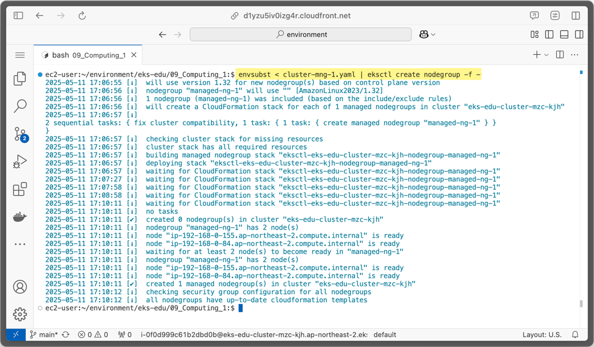

`eksctl` 실행이 정상적으로 실행되었다면, AWS Management Console에서 관리형 노드 그룹이 생성된 것을 확인합니다.
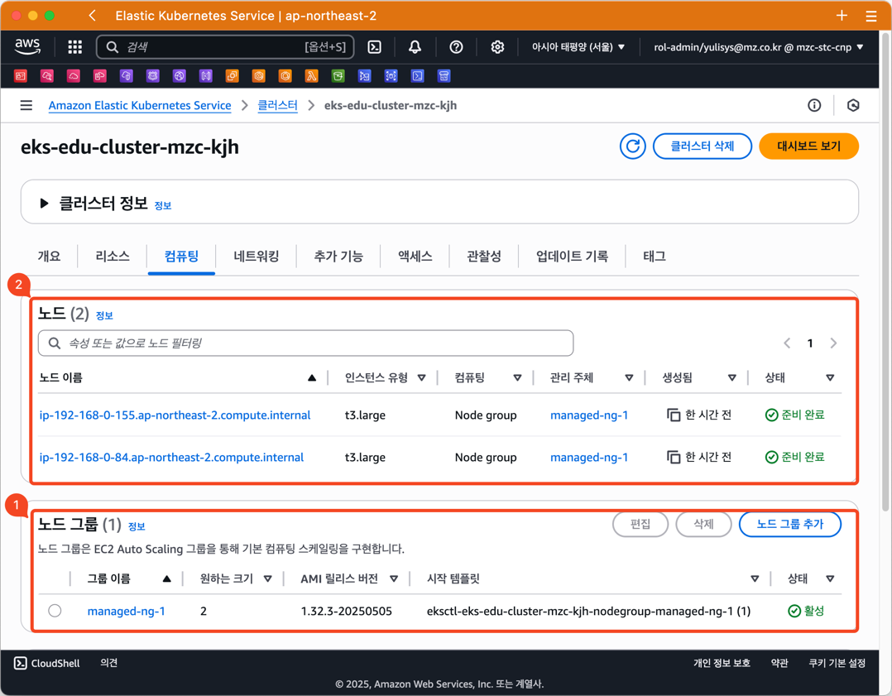

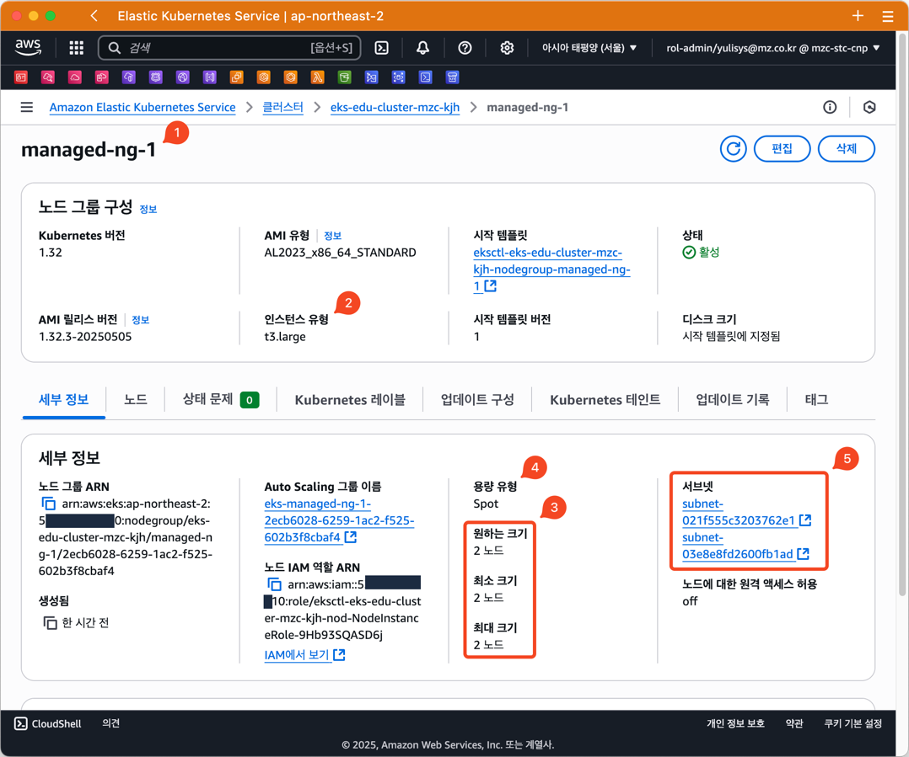

<1> Managed Node Group 이름
<2> 인스턴스 유형
<3> 생성할 노드 크기
<4> 용량 유형: Spot 인스턴스
<5> `privateNetworking: true` 로 지정하였기 때문에 노드가 생성될 때 Private Subnet을 사용

.노드 탭을 선택하면 생성된 노드 목록을 볼 수 있습니다.
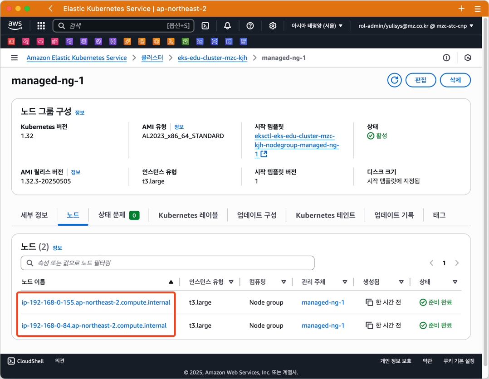

.노드를 선택하면 노드에 대한 여러 가지 정보를 확인할 수 있습니다.
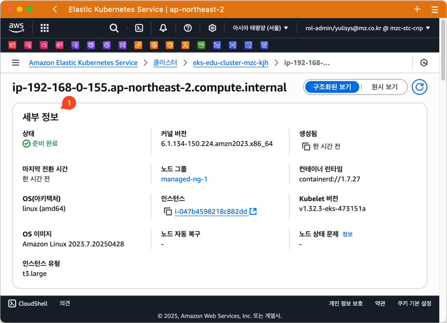

<1> 선택한 노드에 대한 세부 정보를 확인할 수 있습니다.

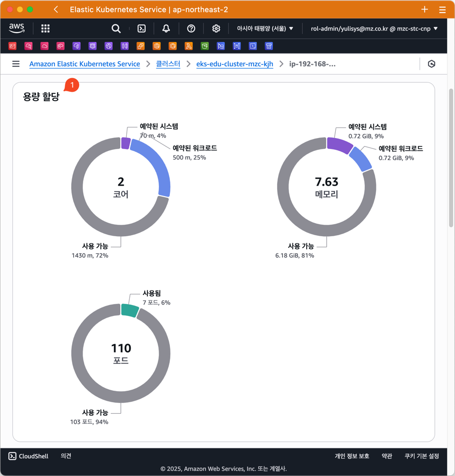

<1> 현재 노드에 할당된 시스템 자원 및 소비 내용을 확인할 수 있습니다.

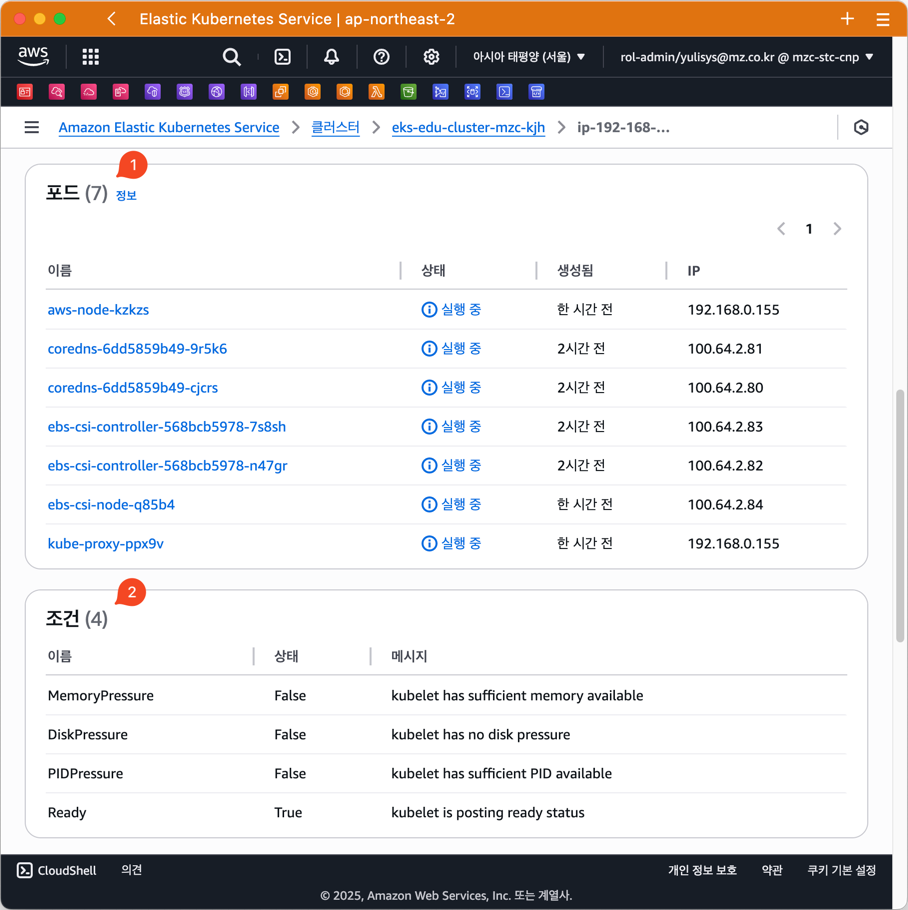

<1> 현재 노드에 배포된 포드 목록을 확인할 수 있습니다.
<2> 현재 노드의 상태(Condition)을 확인할 수 있습니다.
+
Kubernetes 에서 정의한 https://kubernetes.io/docs/reference/node/node-status/#condition[노드의 상태(Condition)]는 다음과 같습니다.
+
[cols="1s,4a"]
|===
|Node Condition |Description

|Ready
|* `True`: 노드가 정상이고 파드를 수락할 준비가 됨
* `False`: 노드가 정상적이지 않고 파드를 수락하지 않음
* `Unknown`: 노드 컨트롤러가 마지막 `node-monitor-grace-period` (기본값은 50초) 동안 노드로부터 응답을 받지 못함.

|DiskPressure
|* `True`: 디스크 용량이 부족함
* `False`: 디스크 용량이 충분함

|MemoryPressure
|* `True`: 노드 메모리가 부족
* `False`: 노드 메모리가 충분함

|PIDPressure
|* `True`: 노드에 프로세스가 너무 많음
* `False`: 노드에 프로세스가 적절함
|===

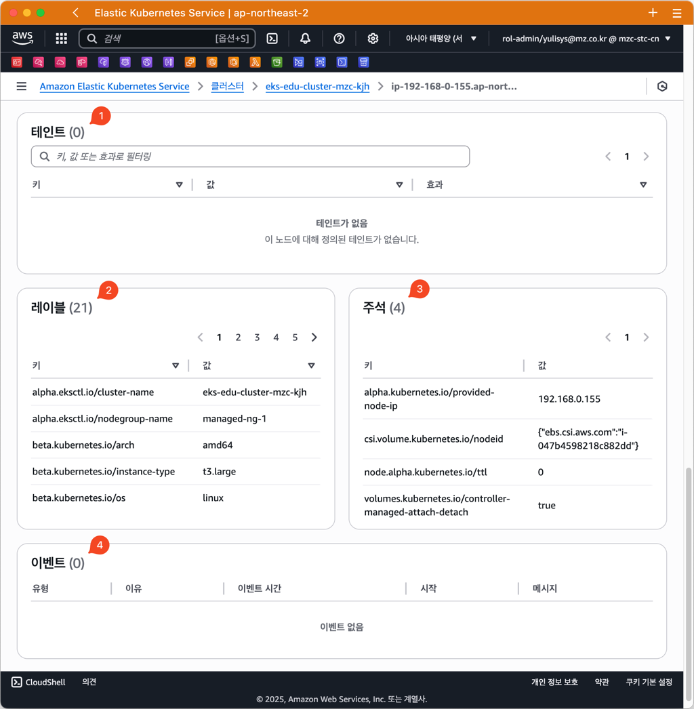

<1> 노드에 적용된 Taint 목록
<2> 노드에 적용된 Label 목록
<3> 노드에 적용된 Annotation 목록
<4> 노드에 발생한 이벤트 목록

=== AWS Fargate 노드 생성

==== Fargate 프로파일 생성

Fargate 노드 생성을 위해서는 Fargate 프로파일을 생성하면 조건에 맞는 Pod는 선택한 Subnet에 Fargate node를 만들어 Pod가 자동으로 배포됩니다.

AWS Management Console을 이용해 Fargate 프로파일 생성 실습을 해보겠습니다.

. 먼저, Fargate 프로파일에서 사용할 IAM Role을 생성합니다.
+
편의상 미리 준비한 스크립트를 이용해 아래와 같이 생성합니다.
+
[source,shell]
----
cd ~/environment/eks-edu/09_Computing_1

sh 01_create_fargate_profile_iam_role.sh
----
+
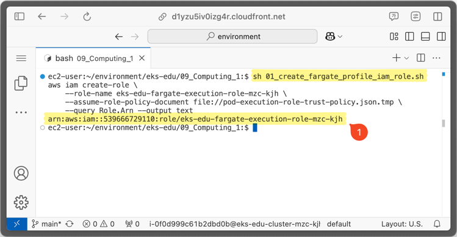
+
<1> 생성되는 IAM Role의 이름 유형은 `eks-edu-fargate-execution-role-#${IDE_NAME}#` 입니다.
+
자세한 내용은 https://docs.aws.amazon.com/ko_kr/eks/latest/userguide/pod-execution-role.html[Amazon EKS 포드 실행 IAM 역할] 내용을 참고해 주세요.

. 이전에 관리형 노드 그룹 생성시 사용했던 EKS 클러스터에 Fargate 프로필을 생성합니다.
+
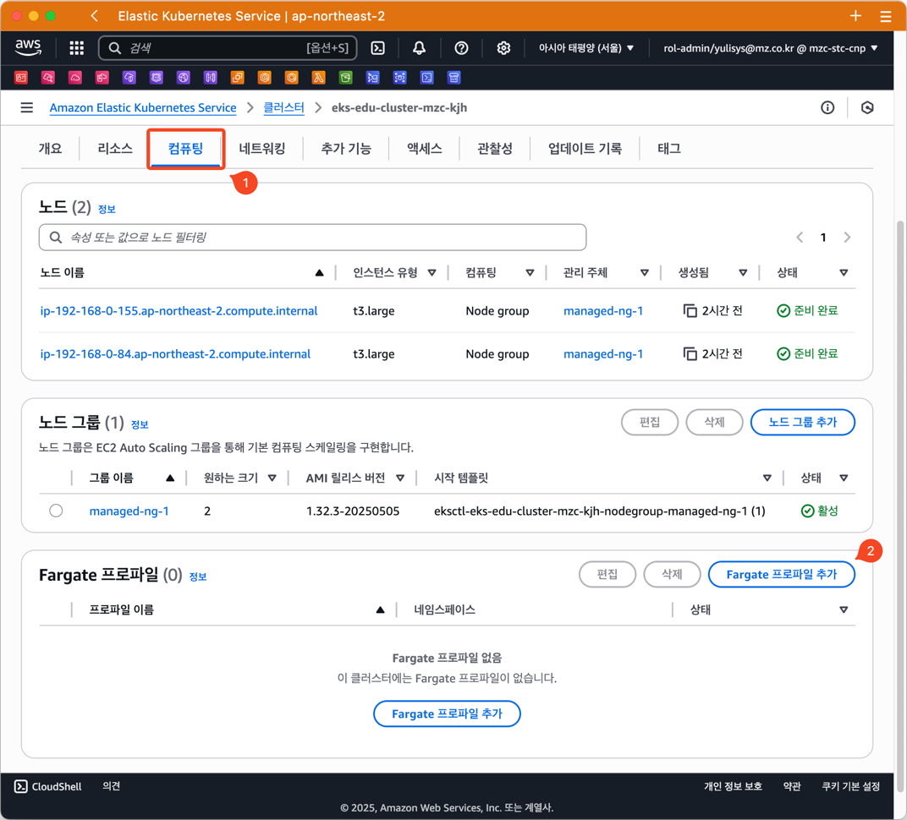

. 생성할 Fargate 프로파일 정보를 입력합니다.
+
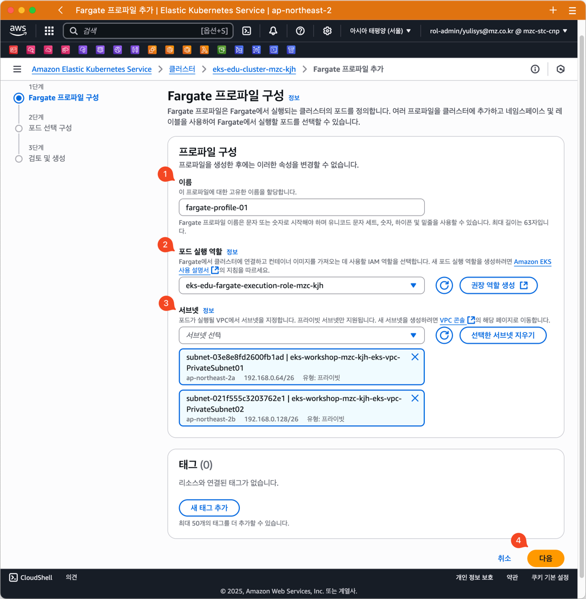
+
<1> 생성할 프로파일 이름을 입력합니다.
+
ex) `fargate-profile-01`
<2> Fargate 노드가 실행될때 사용할 IAM Role을 지정합니다.
+
-> 위에서 생성한 Fargate 프로파일용 실행 IAM 역할을 선택해 줍니다. (`eks-edu-fargate-execution-role-#${IDE_NAME}#`)
<3> Fargate 노드가 생성될 때 사용할 서브넷을 지정합니다.
+
-> Fargate 노드는 프라이빗 서브넷만 지정 가능합니다. (프라이빗 서브넷이 자동으로 선택된 것을 확인할 수 있습니다.)
<4> btn:[다음] 버튼을 클릭합니다.

. 포드 선택 구성을 입력합니다.
+
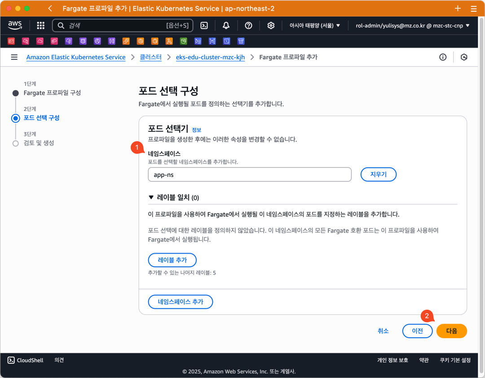
+
<1> Fargate 노드로 실행할 포드의 정보를 선택합니다.
+
Kubernetes의 네임스페이스(Namespace)와 레이블(Label)을 복합적으로 지정할 수 있습니다.
+
이번 실습에서는 `app-ns` 라는 네임스페이스에 배포되는 Pod를 대상으로 합니다.

. 생성할 Fargate 프로파일에 대해 검토한 후, btn:[생성] 버튼을 클릭합니다.
+
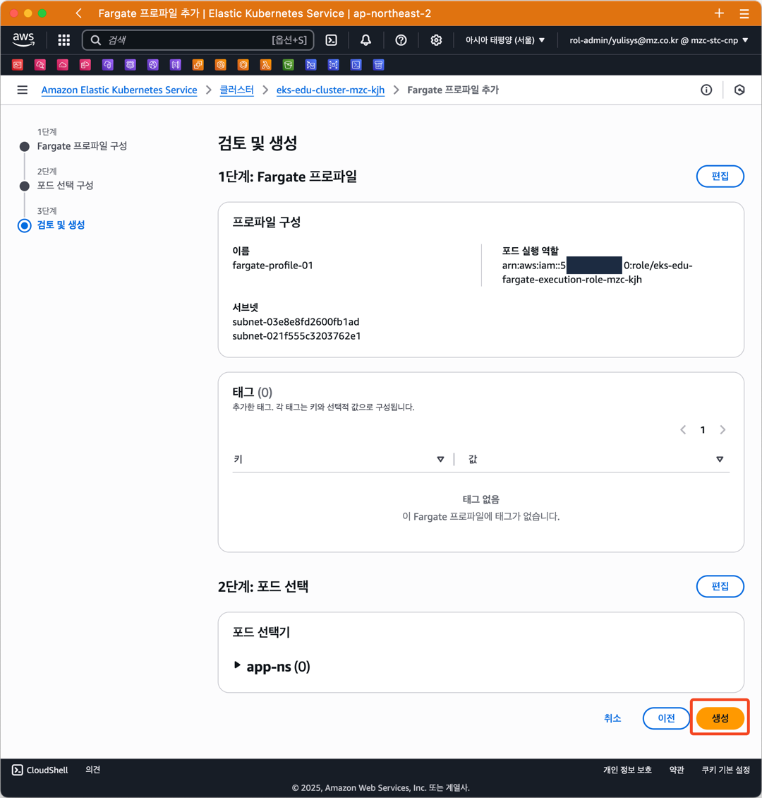

. 프로파일이 생성됩니다.
+
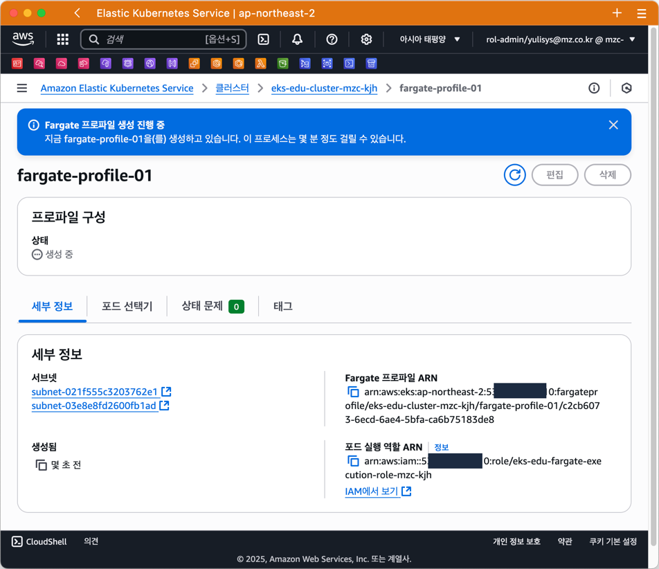
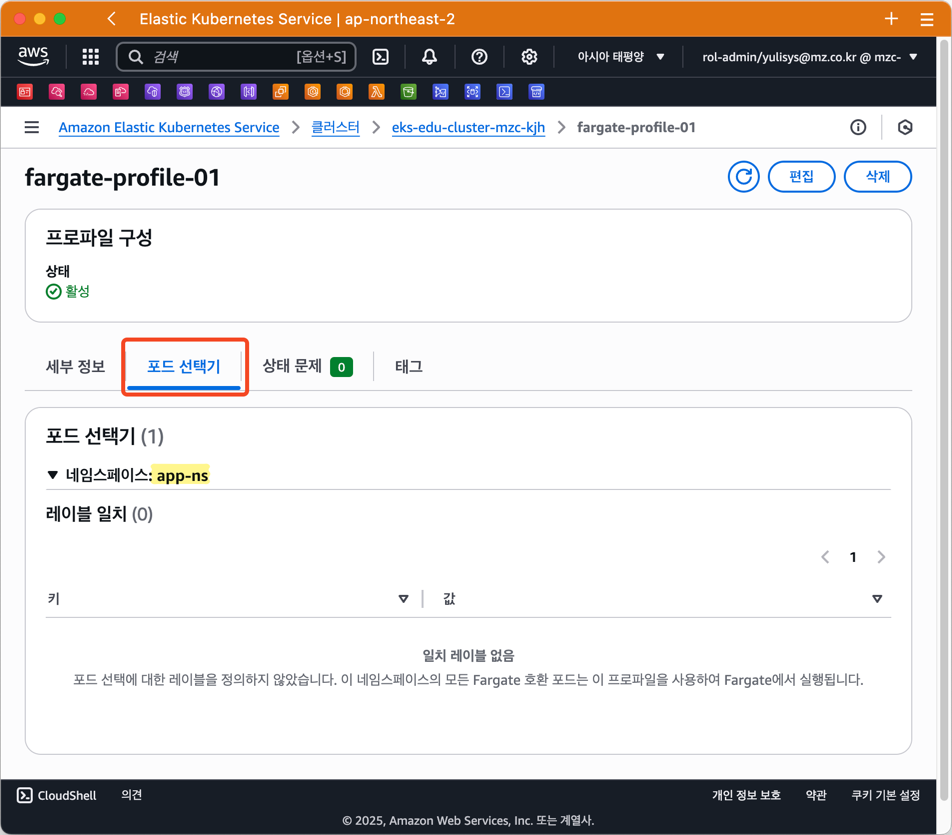

==== Fargate 배포 확인

생성된 Fargate 프로파일을 통해 Pod가 배포된때 Fargate 노드로 실행되는지 확인해 봅니다.

. 테스트용 App(nginx)을 배포합니다.
+
[source,shell]
----
cd ~/environment/eks-edu/09_Computing_1

kubectl apply -f k8s-nginx.yaml
----
+
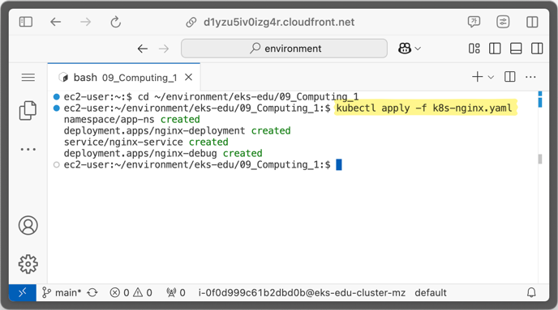

. 테스트용 Pod 3개가 정상적으로 구동되었는지 확인합니다.
+
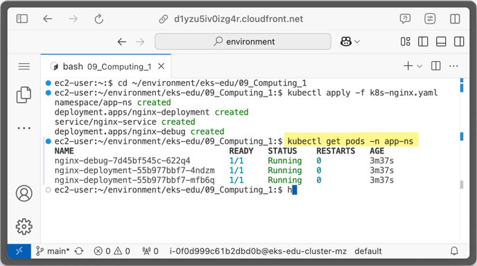

. AWS Management Console에서 Fargate 노드 3개가 생성되었는지 확인합니다.
+
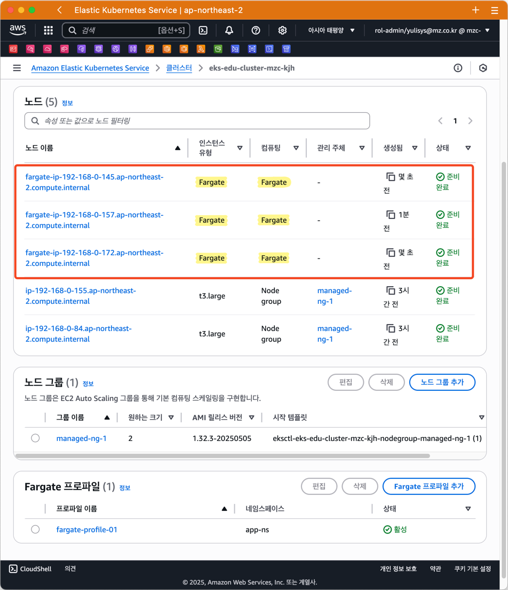

== 정리

[source,shell]
----
cd ~/environment/eks-edu/09_Computing_1

sh 99_clean.sh
----

////
== 노드 관리 모범 사례
* 적절한 인스턴스 유형 선택
* 가용성 영역 분산 배치
* 리소스 모니터링 설정
* 정기적인 업데이트 계획 수립
////

