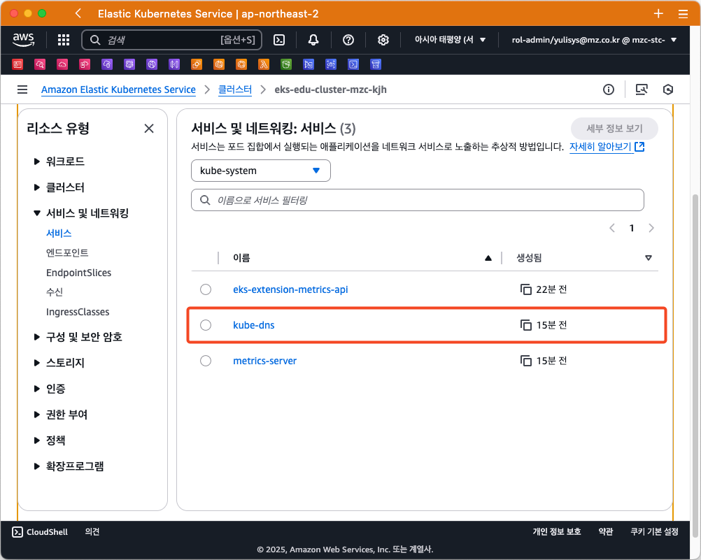
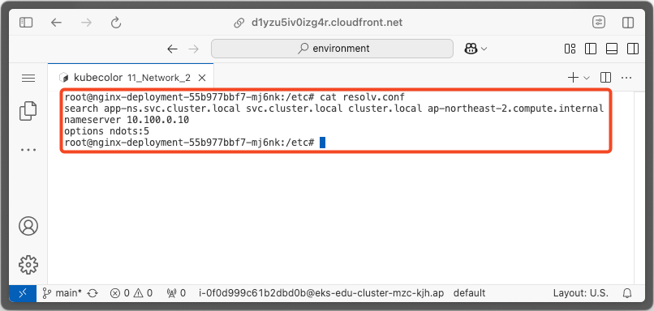
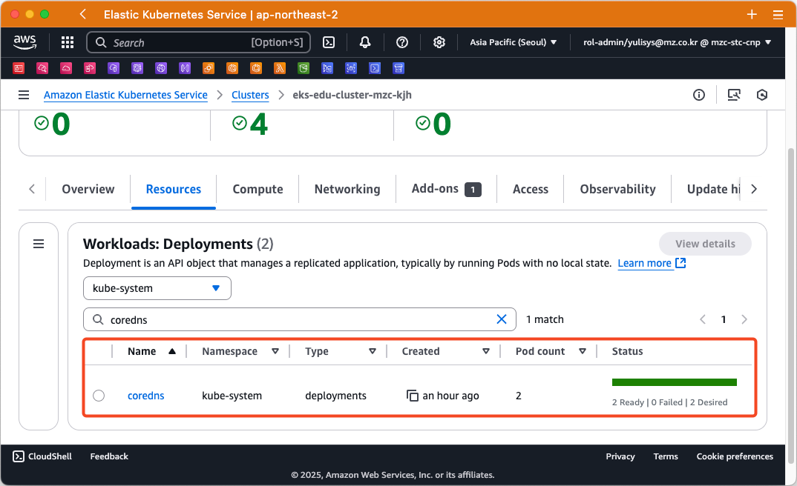
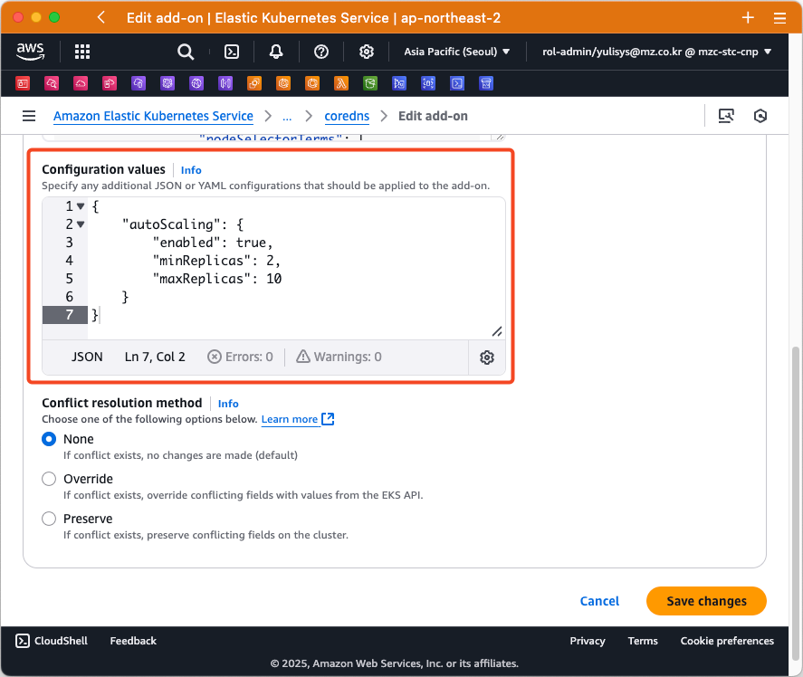
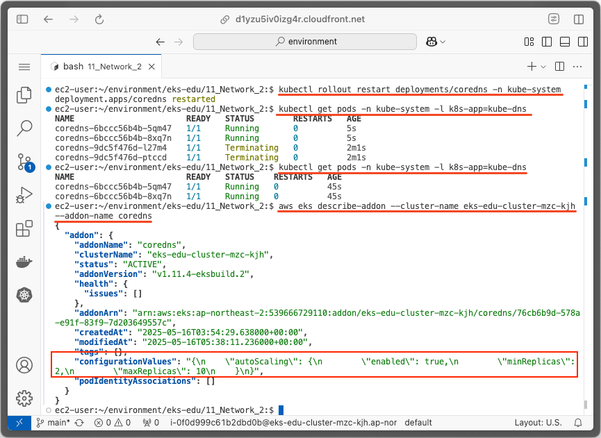

= 10. 네트워크 관리-2
// Settings:
:experimental:
:icons: font
:sectnums:
// :!sectids:
// Github?
ifdef::env-github[]
:tip-caption: :bulb:
:note-caption: :information_source:
:important-caption: :heavy_exclamation_mark:
:caution-caption: :fire:
:warning-caption: :warning:
endif::[]
// No Github?
ifndef::env-github[]
:toc: left
:toclevels: 4
:source-highlighter: highlight.js
endif::[]
:revealjsdir: https://cdn.jsdelivr.net/npm/reveal.js
:revealjs_showSlideNumber: all
:revealjs_hash: true
// Presentation 변환 참고용
// - https://asciidoc-slides.8vi.cat/
// - https://zenika.github.io/adoc-presentation-model/reveal-my-asciidoc.html

== 목표
- Kubernetes DNS 서비스, CoreDNS, kube-proxy에 대해서 배우고 실습
- AWS Load Balancer Controller에 대해서 배우고 실습

== Kubernetes DNS

CoreDNS는 Kubernetes 클러스터 DNS로 사용할 수 있는 유연하고 확장 가능한 DNS 서버입니다.

Kubernetes 1.12 버전 이전에는 `kube-dns` 가 Kubernetes 기본 DNS 서버였지만, 1.12 이후부터는 CoreDNS 가 표준으로 채택되었습니다.

이러한 특성때문에 CoreDNS를 Kubernetes에 배포하면 CoreDNS용 Service 이름은 여전히 `kube-dns` 로 표시됩니다.



=== DNS 기반 서비스 디스커버리

Kubernetes 클러스터에는 `Service` 라고 불리는 Network Model이 있습니다.

이 Service는 클러스터에서 하나 이상의 `Pod` 로 실행되는 네트워크 응용 프로그램을 노출시키는 방법으로서, 여러개의 Pod로 분산되어 있는 애플리케이션을 단일 엔드포인트로 만들어 접근할 수 있게 해 줍니다.

이를 위해, Kubernetes는 Pod와 Service를 위한 DNS 레코드를 생성하며, Pod IP 주소 대신 일관된 DNS 이름으로 Service 또는 Pod 에 접근할 수 있습니다.

NOTE: `kube-proxy` 에서 `Service` 리소스에 정의된 로드 밸런싱 및 네트워크 연결을 처리합니다.

.유형별 DNS 레코드
[%autowidth,cols="1s,,a,"]
|===
|Object |Record Type |Format |Example

|Service
|A/AAAA
|`#<svc>#.#<namespace>#.*svc*.cluster.local`
|`#my-svc#.#my-namespace#.*svc*.cluster.local`

|Pod
|A/AAAA
|`#<pod-ip-address>#.#<namespace>#.*pod*.cluster.local`
|`#172-17-0-3#.#my-namespace#.*pod*.cluster.local`
|===

*#이 DNS 레코드들은 CoreDNS에 의해 관리됩니다.#*

=== DNS Name Resolution

Pod에서 DNS Query를 수행하면 Pod의 `/etc/resolv.conf` 에 정의된 Search list를 기준으로 Query를 수행합니다.

.`/etc/resolv.conf` 예시 (General Kubernetes)
ifdef::env-github[]
[source,elm]
endif::[]
// No Github?
ifndef::env-github[]
[source,apache]
endif::[]
----
nameserver 10.32.0.10
search <namespace>.svc.cluster.local svc.cluster.local cluster.local
options ndots:5
----

Amazon EKS 에서는 다음과 같이 적용됩니다.

.`/etc/resolv.conf` 예시 (EKS)
ifdef::env-github[]
[source,elm]
endif::[]
// No Github?
ifndef::env-github[]
[source,apache]
endif::[]
----
nameserver 10.100.0.10
search <namespace>.svc.cluster.local svc.cluster.local cluster.local <region>.compute.internal
options ndots:5
----



:search_order: {counter:search_order}
.Search Order
[%autowidth,1,a]
|===
|Order |Domain name

|{search_order}
|#<namespace>#.svc.cluster.local

|{counter:search_order}
|svc.cluster.local

|{counter:search_order}
|cluster.local

|{counter:search_order}
|#<region>#.compute.internal

|{counter:search_order}
|최초 요청했던 DNS

|===

==== 예시

ifdef::env-github[]
[,mermaid]
endif::[]
// No Github?
ifndef::env-github[]
[mermaid]
endif::[]
----
flowchart LR
    A["<< ops-ns >>
    op-pod-1"]
    B["<< apps-ns >>
    my-service"]
    A -->|DNS Query| B
----

`ops-ns` 라는 Namespace에 있는 `op-pod-1` 이라는 Pod에서 `app-ns` 라는 Namespace에 있는 `my-service` 라는 서비스를 DNS Query한다면 다음과 같은 순서로 조회가 됩니다.

:query_order: {counter:query_order}
.Query `my-service` from `op-pod-1` in `ops-ns`
[%autowidth,1,a]
|===
|Order |Query Name|Match Result

|{query_order}
|#my-service#.*ops-ns*.svc.cluster.local
|X

|{counter:query_order}
|#my-service#.svc.cluster.local
|X

|{counter:query_order}
|#my-service#.cluster.local
|X

|{counter:query_order}
|#my-service#.ap-northeast-2.compute.internal
|X

|{counter:query_order}
|#my-service#
|X
|===

:query_order: {counter2:query_order}
.Query `my-service.app-ns` from `op-pod-1` in `ops-ns`
[%autowidth,1,a]
|===
|Order |Query Name|Match Result

|{counter:query_order}
|#my-service._app-ns_#.*ops-ns*.svc.cluster.local
|X

|{counter:query_order}
|#my-service._app-ns_#.svc.cluster.local
|O
|===

=== Troubleshooting

1. Amazon EKS를 사용해 DNS 장애 문제를 해결하려면 어떻게 해야 하나요? - https://repost.aws/ko/knowledge-center/eks-dns-failure[link]

== CoreDNS

=== CoreDNS 설치

CoreDNS는 EC2 node 및 Fargate 모두에 설치 가능합니다.

설치 방법에 대해서는 link:../07_Addons/[7. 추가기능 관리] 부분을 참고해 주세요.

=== CoreDNS 구성

하나 이상의 노드가 있는 Amazon EKS 클러스터를 시작하면 클러스터에 배포된 **노드 수에 관계없이 CoreDNS 이미지의 복제본 2개가 기본적으로 배포**됩니다.



=== CoreDNS Scaling (General Kubernetes)

대규모 클러스터에서 CoreDNS의 메모리 사용량은 클러스터 내 Pod 및 서비스 수에 따라 크게 영향을 받습니다.

다른 요인으로 DNS 응답 캐시 크기, CoreDNS 인스턴스당 수신된 쿼리 속도(QPS:Query per seconds) 등이 있습니다.

==== 필요한 메모리 양 계산 공식

[TIP]
*필요한 MB(기본 설정) = (Pod 수 + 서비스 수) / 1000 + 54*

image:https://camo.githubusercontent.com/c114381719421bb31e38690aa22d2968e01c5926f318167803d8f372ed77cab8/68747470733a2f2f646f63732e676f6f676c652e636f6d2f7370726561647368656574732f642f652f32504143582d3176533764324d6c674e31674d72724f485861375a6e3653335671756a5354354c2d34504858376a723449556856635469306775585652436774495972744c6d3371785a57466c4d48542d5874396e332f70756263686172743f6f69643d31393137373533383926666f726d61743d696d616765[CoreDNS in Kubernetes Memory Use]

자세한 내용은 아래 문서에서 확인하시기 바랍니다.

- https://github.com/coredns/deployment/blob/master/kubernetes/Scaling_CoreDNS.md[Scaling CoreDNS in Kubernetes Clusters]

=== CoreDNS Autoscaling (Amazon EKS)

Amazon EKS의 추가기능(Addon)을 통해 CoreDNS를 설치하면 Auto Scaling 기능을 사용할 수 있습니다.

이 CoreDNS Auto Scailer는 Node 수와 CPU 코어 수를 포함하여 클러스터 상태를 지속적으로 모니터링하여 해당 정보를 기반으로 CoreDNS 복제본 수를 동적으로 조정합니다.

==== CoreDNS Auto Scaling 사용을 위한 사전 조건

- EKS 추가 기능(Addon)을 통해 CoreDNS 설치
- 최소 클러스터 버전(1.25) 및 플랫폼 버전 조건 충족
- EKS에서 사용 가능한 최소 CoreDNS Addon 버전

.Kubernetes 버전별 EKS 플랫폼 버전
[%header,%autowidth,cols="1,a"]
|===
|Kubernets 버전 |플랫폼 버전
|`1.30` 이상 | 모두 지원
|`1.29.3` |`eks.7`
|`1.28.8` |`eks.13`
|`1.27.12` |`eks.17`
|`1.26.15` |`eks.18`
|`1.25.16` |`eks.19`
|===

.EKS 버전별 CoreDNS 최소 버전

[%header,%autowidth,cols=">1s,a"]
|===
|Kubernetes 버전 | CoreDNS 버전
|1.29 |`v1.11.1-eksbuild.9`
|1.28 |`v1.10.1-eksbuild.11`
|1.27 |`v1.10.1-eksbuild.11`
|1.26 |`v1.9.3-eksbuild.15`
|1.25 |`v1.9.3-eksbuild.15`
|===

==== CoreDNS Configuration Value

.Auto Scaling 활성화
[source,json]
----
{
  "autoScaling": {
    "enabled": true
  }
}
----

.min, max 복제본 수 지정
[source,json]
----
{
  "autoScaling": {
    "enabled": true,
    "minReplicas": 2,
    "maxReplicas": 10
  }
}
----

==== 변경 사항 적용

CoreDNS의 선택적 구성 설정에서 값을 위와 같이 적용한 후, btn:[변경 사항 저장(Save changes)] 버튼을 눌러 적용해 줍니다.



추가 기능 상에서 값이 적용되었어도 이미 실행중인 CoreDNS Pod는 재시작이 필요합니다.

[source,shell]
----
kubectl rollout deployment/coredns -n kube-system
----

]

=== 관련 링크
https://docs.aws.amazon.com/ko_kr/eks/latest/userguide/managing-coredns.html[Amazon EKS 클러스터에서 DNS에 대한 CoreDNS 관리]

== kube-proxy
=== kube-proxy란?
kube-proxy 추가 기능은 Amazon EKS 클러스터의 각 Amazon EC2 노드에 배포됩니다. 노드에 대한 네트워크 규칙을 유지하고 포드와의 네트워크 통신을 가능하게 합니다.

이 추가 기능은 클러스터의 Fargate 노드에 배포되지 않습니다.

자체 관리형 추가 기능 유형을 사용하는 대신 클러스터에 Amazon EKS 유형의 추가 기능을 추가하는 것이 좋습니다.

=== 관련 링크

- https://docs.aws.amazon.com/ko_kr/eks/latest/userguide/managing-kube-proxy.html[Amazon EKS 클러스터에서 kube-proxy 관리]
- https://velog.io/@yieon/CoreDNS-%EB%AC%B8%EC%A0%9C-%ED%95%B4%EA%B2%B0%ED%95%98%EA%B8%B0[CoreDNS 문제 해결하기]

== AWS Load Balancer Controller
=== AWS Load Balancer Controller이란?

AWS 로드 밸런서 컨트롤러는 Kubernetes 클러스터의 AWS Elastic Load Balancer를 관리합니다.

컨트롤러를 사용하여 클러스터 앱을 인터넷에 노출할 수 있습니다. 컨트롤러는 클러스터 Service 또는 Ingress 리소스를 가리키는 AWS 로드 밸런서를 프로비저닝합니다.

다시 말해 컨트롤러는 클러스터의 여러 포드를 가리키는 단일 IP 주소 또는 DNS 이름을 생성합니다.


=== https://kubernetes-sigs.github.io/aws-load-balancer-controller/v2.7/guide/ingress/annotations/[Ingress에 적용할 수 있는 주석]

=== https://kubernetes-sigs.github.io/aws-load-balancer-controller/v2.7/guide/service/annotations/[Service에 적용할 수 잇는 주석]

=== 관련 링크
- https://docs.aws.amazon.com/ko_kr/eks/latest/userguide/aws-load-balancer-controller.html[AWS 로드 밸런서 컨트롤러를 통해 인터넷 트래픽 라우팅]
- https://github.com/kubernetes-sigs/aws-load-balancer-controller[AWS Load Balancer Controller GitHub]

== 실습
=== 사전 설치
```shell
cd 00_pre_setup
sh 01_install.sh
```

=== hosts 추가
1. coredns configmap 백업
```shell
cd 01_coredns
sh 01_coredns_configmap_backup.sh
```

2. coredns 내용을 수정하기
```shell
sh 02_coredns_edit_configmap.sh
=============================================
apiVersion: v1
data:
  Corefile: |
    .:53 {
        ....
        reload
        loadbalance

        >>>>>>>>>>>>>>>>>>>>>>>>>>>>>>>>>>>>>>>>>
        hosts {                        
            10.43.0.1 myapp.local
            fallthrough
        }
        >>>>>>>>>>>>>>>>>>>>>>>>>>>>>>>>>>>>>>>>>
    }
    ....
kind: ConfigMap
=============================================
```
3. coredns deployment 재시작
```shell
sh 03_coredns_restart_deployment.sh
```
4. Pod에서 nslookup 실행
```shell
sh 04_pod_exec.sh
kubectl run test-pod --image=busybox --restart=Never --rm -it -- /bin/sh 
terminal에서 아래와 같이 조회하세요
# nslookup myapp.local

If you don't see a command prompt, try pressing enter.
/ # nslookup myapp.local
Server:		10.100.0.10
Address:	10.100.0.10:53

Name:	myapp.local
Address: 10.43.0.1
```

=== C Name 등록 ( 설명 )
1. CoreDNS에 특정 도메인을 Internal ALB에 매핑 작업
```shell
sh 02_coredns_edit_configmap.sh
=============================================
apiVersion: v1
data:
  Corefile: |
    .:53 {
        ....
        ready
        rewrite stop {
            name exact working.dot.com internal-alb.ap-northeast-2.elb.amazonaws.com
            answer name internal-alb.ap-northeast-2.elb.amazonaws.com working.dot.com
        }
        kubernetes cluster.local in-addr.arpa ip6.arpa {
          pods insecure
          fallthrough in-addr.arpa ip6.arpa
        }
    }
    ....
kind: ConfigMap
=============================================
```

=== https://docs.aws.amazon.com/ko_kr/eks/latest/userguide/lbc-helm.html[AWS LoadBalancer Controller 설치]

=== Ingress 배포
=== Target Group Binding 배포

== 정리
```shell
cd 99_delete
# TargetGroupBinding 삭제
bash 01_delete_target_group_binding.sh

# NLB Resource 삭제
bash 02_delete_nlb_resource.sh

# Ingress 삭제
bash 03_delete_ingress.sh

# AWS Load Balancer Controller Helm Chart 삭제
bash 04_delete_aws_lbc.sh

# EKS Cluster 및 VPC 삭제
bash 99_delete_cluster.sh
```