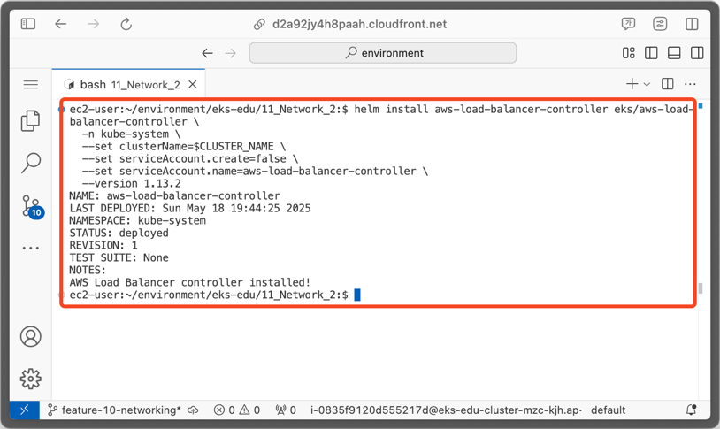

= 10. 네트워크 관리-2
// Settings:
:experimental:
:icons: font
:sectnums:
// :!sectids:
// Github?
ifdef::env-github[]
:tip-caption: :bulb:
:note-caption: :information_source:
:important-caption: :heavy_exclamation_mark:
:caution-caption: :fire:
:warning-caption: :warning:
endif::[]
// No Github?
ifndef::env-github[]
:toc: left
:toclevels: 4
:source-highlighter: highlight.js
endif::[]
:revealjsdir: https://cdn.jsdelivr.net/npm/reveal.js
:revealjs_showSlideNumber: all
:revealjs_hash: true
// Presentation 변환 참고용
// - https://asciidoc-slides.8vi.cat/
// - https://zenika.github.io/adoc-presentation-model/reveal-my-asciidoc.html

== 목표
- Kubernetes DNS 서비스, CoreDNS에 대해서 배우고 실습
- AWS Load Balancer Controller에 대해서 배우고 실습

== Kubernetes DNS

CoreDNS는 Kubernetes 클러스터 DNS로 사용할 수 있는 유연하고 확장 가능한 DNS 서버입니다.

Kubernetes 1.12 버전 이전에는 `kube-dns` 가 Kubernetes 기본 DNS 서버였지만, 1.12 이후부터는 CoreDNS 가 표준으로 채택되었습니다.

이러한 특성때문에 CoreDNS를 Kubernetes에 배포하면 CoreDNS용 Service 이름은 여전히 `kube-dns` 로 표시됩니다.


=== DNS 기반 서비스 디스커버리

Kubernetes 클러스터에는 `Service` 라고 불리는 Network Model이 있습니다.

이 Service는 클러스터에서 하나 이상의 `Pod` 로 실행되는 네트워크 응용 프로그램을 노출시키는 방법으로서, 여러개의 Pod로 분산되어 있는 애플리케이션을 단일 엔드포인트로 만들어 접근할 수 있게 해 줍니다.

이를 위해, Kubernetes는 Pod와 Service를 위한 DNS 레코드를 생성하며, Pod IP 주소 대신 일관된 DNS 이름으로 Service 또는 Pod 에 접근할 수 있습니다.

NOTE: `kube-proxy` 에서 `Service` 리소스에 정의된 로드 밸런싱 및 네트워크 연결을 처리합니다.

.유형별 DNS 레코드
[%autowidth,cols="1s,,a,"]
|===
|Object |Record Type |Format |Example

|Service
|A/AAAA
|`#<svc>#.#<namespace>#.*svc*.cluster.local`
|`#my-svc#.#my-namespace#.*svc*.cluster.local`

|Pod
|A/AAAA
|`#<pod-ip-address>#.#<namespace>#.*pod*.cluster.local`
|`#172-17-0-3#.#my-namespace#.*pod*.cluster.local`
|===

*#이 DNS 레코드들은 CoreDNS에 의해 관리됩니다.#*

=== DNS Name Resolution

Pod에서 DNS Query를 수행하면 Pod의 `/etc/resolv.conf` 에 정의된 Search list를 기준으로 Query를 수행합니다.

.`/etc/resolv.conf` 예시 (General Kubernetes)
ifdef::env-github[]
[source,elm]
endif::[]
// No Github?
ifndef::env-github[]
[source,apache]
endif::[]
----
nameserver 10.32.0.10
search <namespace>.svc.cluster.local svc.cluster.local cluster.local
options ndots:5
----

Amazon EKS 에서는 다음과 같이 적용됩니다.

.`/etc/resolv.conf` 예시 (EKS)
ifdef::env-github[]
[source,elm]
endif::[]
// No Github?
ifndef::env-github[]
[source,apache]
endif::[]
----
nameserver 10.100.0.10
search <namespace>.svc.cluster.local svc.cluster.local cluster.local <region>.compute.internal
options ndots:5
----

image::images/eks-pod-resolve-conf.png[/etc/resolve.conf on Amazon EKS]

:search_order: {counter:search_order}
.Search Order
[%autowidth,1,a]
|===
|Order |Domain name

|{search_order}
|#<namespace>#.svc.cluster.local

|{counter:search_order}
|svc.cluster.local

|{counter:search_order}
|cluster.local

|{counter:search_order}
|#<region>#.compute.internal

|{counter:search_order}
|최초 요청했던 DNS

|===

==== 예시

ifdef::env-github[]
[,mermaid]
endif::[]
// No Github?
ifndef::env-github[]
[mermaid]
endif::[]
----
flowchart LR
    A["<< ops-ns >>
    op-pod-1"]
    B["<< apps-ns >>
    my-service"]
    A -->|DNS Query| B
----

`ops-ns` 라는 Namespace에 있는 `op-pod-1` 이라는 Pod에서 `app-ns` 라는 Namespace에 있는 `my-service` 라는 서비스를 DNS Query한다면 다음과 같은 순서로 조회가 됩니다.

:query_order: {counter:query_order}
.Query `my-service` from `op-pod-1` in `ops-ns`
[%autowidth,1,a]
|===
|Order |Query Name|Match Result

|{query_order}
|#my-service#.*ops-ns*.svc.cluster.local
|X

|{counter:query_order}
|#my-service#.svc.cluster.local
|X

|{counter:query_order}
|#my-service#.cluster.local
|X

|{counter:query_order}
|#my-service#.ap-northeast-2.compute.internal
|X

|{counter:query_order}
|#my-service#
|X
|===

:query_order: {counter2:query_order}
.Query `my-service.app-ns` from `op-pod-1` in `ops-ns`
[%autowidth,1,a]
|===
|Order |Query Name|Match Result

|{counter:query_order}
|#my-service._app-ns_#.*ops-ns*.svc.cluster.local
|X

|{counter:query_order}
|#my-service._app-ns_#.svc.cluster.local
|O
|===

=== Troubleshooting

1. https://repost.aws/ko/knowledge-center/eks-dns-failure[Amazon EKS를 사용해 DNS 장애 문제를 해결하려면 어떻게 해야 하나요?]

== CoreDNS

=== CoreDNS 설치

CoreDNS는 EC2 node 및 Fargate 모두에 설치 가능합니다.

설치 방법에 대해서는 link:../07_Addons/[7. 추가기능 관리] 부분을 참고해 주세요.

=== CoreDNS 구성

하나 이상의 노드가 있는 Amazon EKS 클러스터를 시작하면 클러스터에 배포된 **노드 수에 관계없이 CoreDNS 이미지의 복제본 2개가 기본적으로 배포**됩니다.

image::images/coredns-deployment-count.png[CoreDNS default pods count]

==== CoreDNS 설정 파일 확인

CoreDNS의 설정은 ConfigMap 에 저장되어 있습니다.

아래의 명령을 실행하여 기본으로 적용된 설정 내용을 확인할 수 있습니다.

[source,shell]
----
kubectl get configmap coredns -n kube-system -o yaml
----

.실행 결과
[%collapsible]
====
[source,yaml]
----
$ kubectl get configmap coredns -n kube-system -o yaml

apiVersion: v1
data:
  Corefile: |
    .:53 {
        errors
        health {
            lameduck 5s
          }
        ready
        kubernetes cluster.local in-addr.arpa ip6.arpa {
          pods insecure
          fallthrough in-addr.arpa ip6.arpa
        }
        prometheus :9153
        forward . /etc/resolv.conf
        cache 30
        loop
        reload
        loadbalance
    }
kind: ConfigMap
metadata:
  creationTimestamp: "2025-05-18T10:48:43Z"
  labels:
    eks.amazonaws.com/component: coredns
    k8s-app: kube-dns
  name: coredns
  namespace: kube-system
  resourceVersion: "27114"
  uid: 10e09535-85d5-4be5-a936-f09d0406fdd5
----
image::images/coredns-configmap.png[CoreDNS ConfigMap]
====

==== host 추가

일반적으로 도메인 네임을 상황에 맞게 변형해 사용하는 경우가 많습니다.

이를 위해 보통 Linux 운영체제에서는 `/etc/hosts` 파일에 아래와 같이 적용하여 사용할 수 있습니다.

[source,text]
----
127.0.0.1   localhost localhost.localdomain localhost4 localhost4.localdomain4
::1         localhost6 localhost6.localdomain6
# 설정 추가
192.168.1.10    dev.test.com    dev
----

CoreDNS에서는 `host` plugin을 이용하여 아래와 같이 설정할 수 있습니다.
[source,yaml]
----
apiVersion: v1
data:
  Corefile: |
    .:53 {
      .... 생략
      hosts {
        192.168.1.10  dev.test.com  dev
        fallthrough
      }
    }
----

위의 내용은 아래 명령어를 이용해 내용을 편집하여 반영할 수 있습니다.
[source,shell]
----
kubectl edit configmap coredns -n kube-system
----

반영한 후에는 아래와 같이 CoreDNS를 재시작해 주어야 합니다.
[source,shell]
----
kubectl rollout restart deployment/coredns -n kube-system
----

TIP: https://coredns.io/plugins/hosts/[CoreDNS - #hosts# plugin]

==== CNAME 설정

CNAME 적용은 CoreDNS의 `rewrite` plugin을 이용해 설정할 수 있습니다.
[source,yaml]
----
apiVersion: v1
data:
  Corefile: |
    .:53 {
      .... 생략
      rewrite {
        name exact working.dot.com internal-alb.ap-northeast-2.elb.amazonaws.com
        answer name internal-alb.ap-northeast-2.elb.amazonaws.com working.dot.com
      }
    }
----

TIP: https://coredns.io/plugins/rewrite/#cname-field-rewrites[CoreDNS - #rewrite# plugin]

=== CoreDNS Scaling

==== 적절한 Replica 수 적용

대규모 클러스터에서 CoreDNS의 메모리 사용량은 클러스터 내 Pod 및 서비스 수에 따라 크게 영향을 받습니다.

다른 요인으로 DNS 응답 캐시 크기, CoreDNS 인스턴스당 수신된 쿼리 속도(QPS:Query per seconds) 등이 있습니다.

[TIP]
.*CoreDNS 1개 Pod 당 필요한 메모리 크기*
====
메모리 크기(MB) = (Pod 수 + 서비스 수) / 1000 + 54
====

.예시-1
image::https://camo.githubusercontent.com/c114381719421bb31e38690aa22d2968e01c5926f318167803d8f372ed77cab8/68747470733a2f2f646f63732e676f6f676c652e636f6d2f7370726561647368656574732f642f652f32504143582d3176533764324d6c674e31674d72724f485861375a6e3653335671756a5354354c2d34504858376a723449556856635469306775585652436774495972744c6d3371785a57466c4d48542d5874396e332f70756263686172743f6f69643d31393137373533383926666f726d61743d696d616765[CoreDNS in Kubernetes Memory Use]

.예시-2
[%header,%autowidth,cols="1,a"]
|===
|Item |Description

|Pod 수 |59 개
|Service 수 |37 개
|필요한 메모리 Size | 54.096 MB ( =(59 + 37) / 1000 + 54 )
|===

자세한 내용은 아래 문서에서 확인하시기 바랍니다.

- https://github.com/coredns/deployment/blob/master/kubernetes/Scaling_CoreDNS.md[Scaling CoreDNS in Kubernetes Clusters]

==== `ndots` 설정 줄이기

CoreDNS 성능 향상을 위해 `ndots` 설정을 줄여 외부 쿼리를 줄이는 방법을 적용할 수 있습니다.

`ndots` 란 도메인 이름에 점이 몇개 포함되어 있는지를 지정하는 것으로, ndots 값이 5(기본값)로 설정된 경우, 도메인 이름에 점이 5이하일 경우 Search list를 순회하면서 DNS Query를 수행합니다.

만약, `api.example.com` 이라는 도메인에 대해 DNS Query를 할 경우, 위 `DNS Name Resolution` 에 정의되어 있는 Search list 순서에 맞게 다음과 같이 DNS Query가 수행됩니다.


:query_order: {counter2:query_order}
.Query `my-service.app-ns` from `op-pod-1` in `ops-ns`
[%autowidth,1,a]
|===
|Order |Query Name|Match Result

|{counter:query_order}
|#api.example.com#.<namespace>.svc.cluster.local
|X

|{counter:query_order}
|#api.example.com#.svc.cluster.local
|X

|{counter:query_order}
|#api.example.com#.cluster.local
|X

|{counter:query_order}
|#api.example.com#.<region>.comput.internal
|X

|{counter:query_order}
|#api.example.com#
|O
|===

이와 같이 의도하지 않은 DNS Query가 많을 경우, 빈번한 DNS 조회등이 많은 시스템일 경우, CoreDNS 성능에 영향을 줄 수 있습니다.

Pod가 DNS를 통해 외부 서비스에 주로 연결하는 경우, 불필요한 클러스터 내 DNS Query를 수행하지 않도록 `ndots` 값을 기본값인 `5` 에서 `2` 로 설정하는 것이 좋습니다.

ndots 설정을 줄이기 위해서는 Pod의 `dnsConfig` 설정을 아래와 같이 설정합니다.

[source,yaml]
----
apiVersion: v1
kind: Pod
metadata:
  name: nginx
spec:
  containers:
  - name: nginx
    image: nginx
  dnsConfig:
    options:
    - name: ndots
      value: "2"
----

////
위 설정은 Pod 또는 Deployment의 Manifest 설정을 적용해야 하는 불편함이 있어, EKS 내에 실행되는 Application 종류가 많다면 일일이 반영하는데에 불편함이 있습니다.

이를 해소하기 위해 일반적인 Kubernetes Cluster에서는 모든 Pod 들을 대상으로 일괄 적용하기 위해서, 아래와 같이 Admission controller의 mutation 기능을 활용할 수 있습니다.

[source,yaml]
----
apiVersion: admissionregistration.k8s.io/v1alpha1
kind: MutatingAdmissionPolicy
metadata:
  name: default-dns-ndots
spec:
  matchConstraints:
    resourceRules:
      - apiGroups: ["apps"]
        apiVersions: ["v1"]
        resources: ["deployments", "statefulsets", "daemonsets"]
        operations:  ["CREATE", "UPDATE"]
  reinvocationPolicy: IfNeeded
  mutations:
    - patchType: "JSONPatch"
      jsonPatch:
        expression: >
          [
            JSONPatch{
              op: "add",
              path: "/spec/template/spec/dnsConfig",
              value: {
                "options": [
                  {
                    "name": "ndots",
                    "value": "1"
                  }
                ]
               }
            }
          ]
---
apiVersion: admissionregistration.k8s.io/v1alpha1
kind: MutatingAdmissionPolicyBinding
metadata:
  name: default-dns-ndots
spec:
  policyName: default-dns-ndots
  matchResources:
    <적용 조건 지정>
----

CAUTION: 위 설정은 `MutatingAdmissionPolicy` API를 사용해야 하는데, 현재(25년 5월) 최신 EKS 버전인 `1.32` 에서는 지원하지 않는 기능이기 때문에 아직은 사용할 수 없는 점을 참고 바랍니다.
////


////
// 아래 Auto Scaling 관련된 내용은 제대로 테스트가 안되어 내용을 주석처리함.
// https://docs.aws.amazon.com/ko_kr/eks/latest/userguide/coredns-autoscaling.html
//
=== CoreDNS Autoscaling (Amazon EKS)

Amazon EKS의 추가기능(Addon)을 통해 CoreDNS를 설치하면 Auto Scaling 기능을 사용할 수 있습니다.

이 CoreDNS Auto Scailer는 Node 수와 CPU 코어 수를 포함하여 클러스터 상태를 지속적으로 모니터링하여 해당 정보를 기반으로 CoreDNS 복제본 수를 동적으로 조정합니다.

==== CoreDNS Auto Scaling 사용을 위한 사전 조건

- EKS 버전 v1.25 이상 및 EKS 플랫폼 버전 조건 충족
- EKS 추가 기능(Addon)을 통해 CoreDNS 설치 및 CoreDNS v1.9 이상 버전

.Kubernetes 버전별 EKS 플랫폼 버전
[%header,%autowidth,cols="1,a"]
|===
|Kubernets 버전 |플랫폼 버전
|`1.30` 이상 | 모두 지원
|`1.29.3` |`eks.7`
|`1.28.8` |`eks.13`
|`1.27.12` |`eks.17`
|`1.26.15` |`eks.18`
|`1.25.16` |`eks.19`
|===

.EKS 버전별 CoreDNS 최소 버전

[%header,%autowidth,cols=">1s,a"]
|===
|Kubernetes 버전 | CoreDNS 버전
|1.29 |`v1.11.1-eksbuild.9`
|1.28 |`v1.10.1-eksbuild.11`
|1.27 |`v1.10.1-eksbuild.11`
|1.26 |`v1.9.3-eksbuild.15`
|1.25 |`v1.9.3-eksbuild.15`
|===

==== CoreDNS Configuration Value

.Auto Scaling 활성화
[source,json]
----
{
  "autoScaling": {
    "enabled": true
  }
}
----

.min, max 복제본 수 지정
[source,json]
----
{
  "autoScaling": {
    "enabled": true,
    "minReplicas": 2,
    "maxReplicas": 10
  }
}
----

==== 변경 사항 적용

CoreDNS의 선택적 구성 설정에서 값을 위와 같이 적용한 후, btn:[변경 사항 저장(Save changes)] 버튼을 눌러 적용해 줍니다.


추가 기능 상에서 값이 적용되었어도 이미 실행중인 CoreDNS Pod는 재시작이 필요합니다.

[source,shell]
----
kubectl rollout deployment/coredns -n kube-system
----

image::images/coredns-rollout-restart.png[CoreDNS Rollout restart]]
////

=== 실습

지금까지 설명한 내용을 토대로 실습을 진행해 보겠습니다.

. 먼저, Corefile 에 아래의 내용을 적용합니다.
+
[source,yaml]
----
apiVersion: v1
data:
  Corefile: |
    .:53 {
        ..생략..
        loadbalance
        hosts {
          10.43.0.1  myapp.local
          fallthrough
        }
    }
kind: ConfigMap
metadata:
  ...
----
+
. CoreDNS를 재시작합니다.
+
[source,shell]
----
kubectl rollout restart deployment/coredns -n kube-system
----
+
. Test용 Pod를 실행합니다.
+
[source,shell]
----
kubectl run test-pod --image=busybox --restart=Never --rm -it -- /bin/sh
----
+
. `nslookup myapp.local` 을 실행하여 결과를 확인합니다.
+
[source,shell]
----
nslookup myapp.local
----
+
.결과 확인
[%collapsible]
====
[source,shell]
----
$ kubectl run test-pod --image=busybox --restart=Never --rm -it -- /bin/sh
If you don't see a command prompt, try pressing enter.
/ # nslookup myapp.local
Server:         10.100.0.10
Address:        10.100.0.10:53


Name:   myapp.local
Address: 10.43.0.1
----
====

=== 관련 링크
https://docs.aws.amazon.com/ko_kr/eks/latest/userguide/managing-coredns.html[Amazon EKS 클러스터에서 DNS에 대한 CoreDNS 관리]

== AWS Load Balancer Controller

=== AWS Load Balancer Controller 란?

AWS Load Balancer Controller(이하 LBC)는 Amazon EKS 클러스터에서 AWS ELB(Elastic Load Balancer)를 관리합니다.

AWS LBC를 사용하여 Amazon EKS Cluster에 배포된 App을 인터넷에 노출할 수 있습니다. AWS LBC는 클러스터 `Service` 또는 `Ingress` 리소스를 가리키는 AWS ELB를 프로비저닝합니다.

다시 말해 AWS LBC는 클러스터의 여러 Pod를 가리키는 단일 IP 주소 또는 DNS 이름을 생성합니다.

.AWS LBC Overview
image::https://docs.aws.amazon.com/ko_kr/eks/latest/userguide/images/lbc-overview.png[AWS LBC Overview,700]

=== AWS LBC Design

아래 이미지는 AWS LBC가 `Ingress` 에 대해 어떻게 동작하는지 보여줍니다.

.AWS LBC Design
image::https://kubernetes-sigs.github.io/aws-load-balancer-controller/v2.7/assets/images/controller-design.png[AWS LBC Design]

. API Server에서 https://kubernetes.io/docs/concepts/services-networking/ingress/#ingress-controllers[`ingress 이벤트`] 를 감시합니다.
+
-> 요구 사항을 충족하는 Ingress 리소스를 감지한 경우, AWS ELB 또는 관련 리소스 생성을 시작합니다.
. 새로운 Ingress 리소스를 위해 https://docs.aws.amazon.com/elasticloadbalancing/latest/application/introduction.html[ALB]가 만들어집니다.
+
-> ALB는 인터넷 또는 `인터넷 경계(Internet-facing)` 또는 `내부(Internal)` 중에 선택할 수 있습니다.
. Ingress 리소스에 설정된 각 고유한 Kubernetes Service에 대해 AWS에 http://docs.aws.amazon.com/elasticloadbalancing/latest/application/load-balancer-target-groups.html[대상 그룹(Target group)]이 생성됩니다.
. Ingress 리소스의 Annotation에 명시된 모든 포트에 대해 http://docs.aws.amazon.com/elasticloadbalancing/latest/application/load-balancer-listeners.html[Listener]가 생성됩니다.
+
-> 포트를 지정하지 않으면, 기본값(80 또는 443)이 사용됩니다.
. Ingress 리소스에 지정된 각 경로(Path)에 맞는 http://docs.aws.amazon.com/elasticloadbalancing/latest/application/listener-update-rules.html[Listener 규칙]이 생성됩니다.

=== https://kubernetes-sigs.github.io/aws-load-balancer-controller/v2.7/guide/ingress/annotations/[Ingress에 적용할 수 있는 Annotation]

=== https://kubernetes-sigs.github.io/aws-load-balancer-controller/v2.7/guide/service/annotations/[Service에 적용할 수 잇는 Annotation]

=== AWS LBC 설치

==== AWS LBC용 IRSA용 생성

AWS LBC는 AWS ELB 및 그와 관련된 AWS 리소스를 관리해야 하기 때문에 적절한 IAM Policy 및 Role이 생성되어야 합니다.

AWS LBC에서는 미리 사용 가능한 IAM Policy용 JSON 파일을 제공하고 있어, 이 파일을 이용하여 IAM Policy 및 IAM Role을 생성할 수 있습니다.

- AWS LBC용 IAM Policy: https://raw.githubusercontent.com/kubernetes-sigs/aws-load-balancer-controller/v2.13.2/docs/install/iam_policy.json

.AWS LBC 용 Service Account 생성 (`create-aws-lbc-irsa.sh`)
[,shell]
----
cd ~/environment/eks-edu/11_Network_2
source ../env.sh

# AWS CLI 실행을 위한 환경변수 설정
export ADDON_NAME="aws-lbc"
export ADDON_VERSION="v2.13.2"
export OIDC_ID=$(aws eks describe-cluster --name ${CLUSTER_NAME} --query "cluster.identity.oidc.issuer" --output text ${PROFILE_STRING} --no-cli-pager | cut -d '/' -f 5)
export ADDON_IAM_POLICY_NAME=${CLUSTER_NAME}-addon-${ADDON_NAME}-iam-pol
export ADDON_IAM_ROLE_NAME=${CLUSTER_NAME}-addon-${ADDON_NAME}-iam-rol
export IRSA_NAME=aws-lbc-sa

# AWS LBC 용 IAM Policy 다운로드
curl -o aws-lbc-iam-policy.json https://raw.githubusercontent.com/kubernetes-sigs/aws-load-balancer-controller/${ADDON_VERSION}/docs/install/iam_policy.json

# IAM Policy 생성
export ADDON_IAM_POLICY_ARN=$(aws iam create-policy --policy-name ${ADDON_IAM_POLICY_NAME} --policy-document file://aws-lbc-iam-policy.json --output text --no-cli-pager --query "Policy.Arn")

# IAM Role 생성 (eksctl 사용)
eksctl create iamserviceaccount \
    --cluster=${CLUSTER_NAME} \
    --namespace=kube-system \
    --name=${IRSA_NAME} \
    --role-name=${ADDON_IAM_ROLE_NAME} \
    --attach-policy-arn=${ADDON_IAM_POLICY_ARN} \
    --override-existing-serviceaccounts \
    --region $AWS_REGION \
    --approve
----

위 명령들을 일괄 실행할 수 있도록 제공된 스크립트 파일을 아래와 같이 실행할 수 있습니다.

[,shell]
----
sh create-aws-lbc-irsa.sh
----

==== AWS LBC 설치

. AWS LBC가 포함되어 있는 `eks-charts` Helm 리포지토리를 추가합니다.
+
[,shell]
----
helm repo add eks https://aws.github.io/eks-charts
----
. 추가된 리포지토리를 업데이트합니다.
+
[,shell]
----
helm repo update eks
----
. HELM을 이용하여 AWS LBC를 설치합니다.
+
[,shell]
----
cd ~/environment/eks-edu/11_Network_2
source ../env.sh

helm install aws-load-balancer-controller eks/aws-load-balancer-controller \
  -n kube-system \
  --set clusterName=$CLUSTER_NAME \
  --set serviceAccount.create=false \
  --set serviceAccount.name=aws-lbc-sa \
  --version 1.13.2
----
+
Fargate 또는 EKS Hybrid Node에 배포할 경우에는 다음 파라메터 지정을 반드시 해주어야 합니다.
+
- `--set region=#region-code#`
- `--set vpcId=#vpc-xxxxxxxx#`
+


=== 실습

==== Ingress 배포

AWS LBC가 설치된 후 아래 스크립트를 순서대로 실행하여 간단한 Ingress 환경을 구축합니다.

. ALB용 보안 그룹 생성
[
,shell]
----
bash 01_aws_lbc_ingress/01_create_security_group_for_alb.sh
----

. 기본 Ingress 리소스 배포 (ALB 생성 확인)
[
,shell]
----
bash 01_aws_lbc_ingress/02_create_default_ingress.sh
----

. 샘플 서비스와 Ingress 배포
[
,shell]
----
bash 01_aws_lbc_ingress/03_create_service.sh
bash 01_aws_lbc_ingress/04_create_nginx_ingress.sh
----

실행 후 생성된 ALB의 DNS 주소로 접속하여 Nginx 페이지가 보이는지 확인합니다.

==== Target Group Binding 배포

<구두 설명>

=== 관련 링크
- https://docs.aws.amazon.com/ko_kr/eks/latest/userguide/aws-load-balancer-controller.html[AWS 로드 밸런서 컨트롤러를 통해 인터넷 트래픽 라우팅]
- https://kubernetes-sigs.github.io/aws-load-balancer-controller/latest/[AWS Load Balancer Controller Documentation]
- https://github.com/kubernetes-sigs/aws-load-balancer-controller[AWS Load Balancer Controller GitHub]
- https://artifacthub.io/packages/helm/aws/aws-load-balancer-controller[ArtifactHUB: aws-load-balancer-controller]

== 정리
```shell
cd 99_delete
# TargetGroupBinding 삭제
bash 01_delete_target_group_binding.sh

# NLB Resource 삭제
bash 02_delete_nlb_resource.sh

# Ingress 삭제
bash 03_delete_ingress.sh

# AWS Load Balancer Controller Helm Chart 삭제
bash 04_delete_aws_lbc.sh

# EKS Cluster 및 VPC 삭제
bash 99_delete_cluster.sh
```