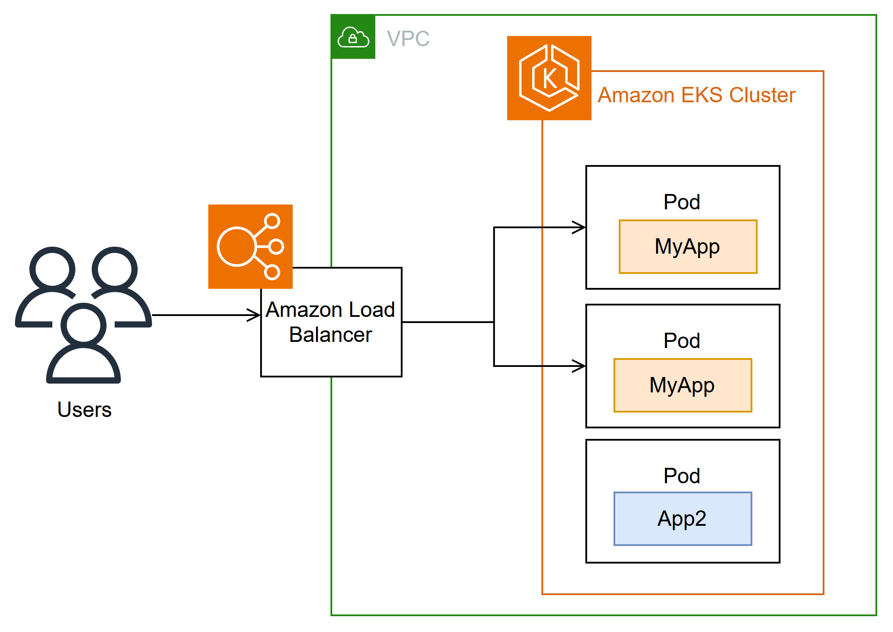

# 1. 목표
- CoreDNS, kube-proxy에 대해서 배우고 실습
- AWS Load Balancer Controller에 대해서 배우고 실습

# 2. 이론
## 2-1. CoreDNS
### 2-1-1. CoreDNS란?
CoreDNS는 Kubernetes 클러스터 DNS로 사용할 수 있는 유연하고 확장 가능한 DNS 서버입니다. 

하나 이상의 노드가 있는 Amazon EKS 클러스터를 시작하면 클러스터에 배포된 노드 수에 관계없이 CoreDNS 이미지의 복제본 2개가 기본적으로 배포됩니다.

CoreDNS 포드는 클러스터의 모든 포드에 대한 이름 확인을 제공합니다.
- Service : service-name.namespace-name.svc.cluster.local
- Pod : pod-ip.namespace-name.pod.cluster.local

### 2-1-2. 관련 링크
[Amazon EKS 클러스터에서 DNS에 대한 CoreDNS 관리](https://docs.aws.amazon.com/ko_kr/eks/latest/userguide/managing-coredns.html)

## 2-2. kube-proxy
### 2-2-1. kube-proxy란?
kube-proxy 추가 기능은 Amazon EKS 클러스터의 각 Amazon EC2 노드에 배포됩니다. 노드에 대한 네트워크 규칙을 유지하고 포드와의 네트워크 통신을 가능하게 합니다.

이 추가 기능은 클러스터의 Fargate 노드에 배포되지 않습니다.

자체 관리형 추가 기능 유형을 사용하는 대신 클러스터에 Amazon EKS 유형의 추가 기능을 추가하는 것이 좋습니다.
### 2-2-2. 관련 링크
[Amazon EKS 클러스터에서 kube-proxy 관리](https://docs.aws.amazon.com/ko_kr/eks/latest/userguide/managing-kube-proxy.html)
## 2-3. AWS Load Balancer Controller
### 2-3-1. AWS Load Balancer Controller이란?
AWS 로드 밸런서 컨트롤러는 Kubernetes 클러스터의 AWS Elastic Load Balancer를 관리합니다.

컨트롤러를 사용하여 클러스터 앱을 인터넷에 노출할 수 있습니다. 컨트롤러는 클러스터 Service 또는 Ingress 리소스를 가리키는 AWS 로드 밸런서를 프로비저닝합니다.

다시 말해 컨트롤러는 클러스터의 여러 포드를 가리키는 단일 IP 주소 또는 DNS 이름을 생성합니다.



### 2-3-2. [Ingress에 적용할 수 있는 주석](https://kubernetes-sigs.github.io/aws-load-balancer-controller/v2.7/guide/ingress/annotations/)
### 2-3-3 [Service에 적용할 수 잇는 주석](https://kubernetes-sigs.github.io/aws-load-balancer-controller/v2.7/guide/service/annotations/)

### 2-3-3. 관련 링크
- [AWS 로드 밸런서 컨트롤러를 통해 인터넷 트래픽 라우팅](https://docs.aws.amazon.com/ko_kr/eks/latest/userguide/aws-load-balancer-controller.html)
- [AWS Load Balancer Controller GitHub](https://github.com/kubernetes-sigs/aws-load-balancer-controller)

# 3. 사전 조건
- VPC 설치
- EKS 설치
- Addon 설치
# 4. 실습
## 4-0. 사전 설치
```shell
cd 00_pre_setup
sh 01_install.sh
```

## 4-1. hosts 추가
1. coredns configmap 백업
```shell
cd 01_coredns
sh 01_coredns_configmap_backup.sh
```

2. coredns 내용을 수정하기
```shell
sh 02_coredns_edit_configmap.sh
=============================================
apiVersion: v1
data:
  Corefile: |
    .:53 {
        ....
        reload
        loadbalance

        >>>>>>>>>>>>>>>>>>>>>>>>>>>>>>>>>>>>>>>>>
        hosts {                        
            10.43.0.1 myapp.local
            fallthrough
        }
        >>>>>>>>>>>>>>>>>>>>>>>>>>>>>>>>>>>>>>>>>
    }
    ....
kind: ConfigMap
=============================================
```
3. coredns deployment 재시작
```shell
sh 03_coredns_restart_deployment.sh
```
4. Pod에서 nslookup 실행
```shell
sh 04_pod_exec.sh
kubectl run test-pod --image=busybox --restart=Never --rm -it -- /bin/sh 
terminal에서 아래와 같이 조회하세요
# nslookup myapp.local

If you don't see a command prompt, try pressing enter.
/ # nslookup myapp.local
Server:		10.100.0.10
Address:	10.100.0.10:53

Name:	myapp.local
Address: 10.43.0.1
```
## 4-2. C Name 등록 ( 설명 )
1. CoreDNS에 특정 도메인을 Internal ALB에 매핑 작업
```shell
sh 02_coredns_edit_configmap.sh
=============================================
apiVersion: v1
data:
  Corefile: |
    .:53 {
        ....
        ready
        rewrite stop {
            name exact working.dot.com internal-alb.ap-northeast-2.elb.amazonaws.com
            answer name internal-alb.ap-northeast-2.elb.amazonaws.com working.dot.com
        }
        kubernetes cluster.local in-addr.arpa ip6.arpa {
          pods insecure
          fallthrough in-addr.arpa ip6.arpa
        }
    }
    ....
kind: ConfigMap
=============================================
```
## 4-3. [AWS LoadBalancer Controller 설치](https://docs.aws.amazon.com/ko_kr/eks/latest/userguide/lbc-helm.html)
## 4-3. Ingress 배포
## 4-4. Target Group Binding 배포
# 5. 정리 
```shell
cd 99_delete
# TargetGroupBinding 삭제
bash 01_delete_target_group_binding.sh

# NLB Resource 삭제
bash 02_delete_nlb_resource.sh

# Ingress 삭제
bash 03_delete_ingress.sh

# AWS Load Balancer Controller Helm Chart 삭제
bash 04_delete_aws_lbc.sh

# EKS Cluster 및 VPC 삭제
bash 99_delete_cluster.sh
```