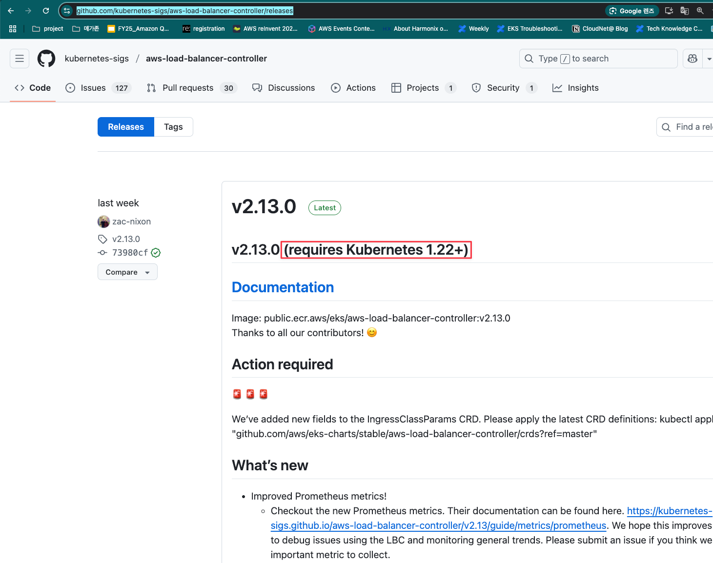
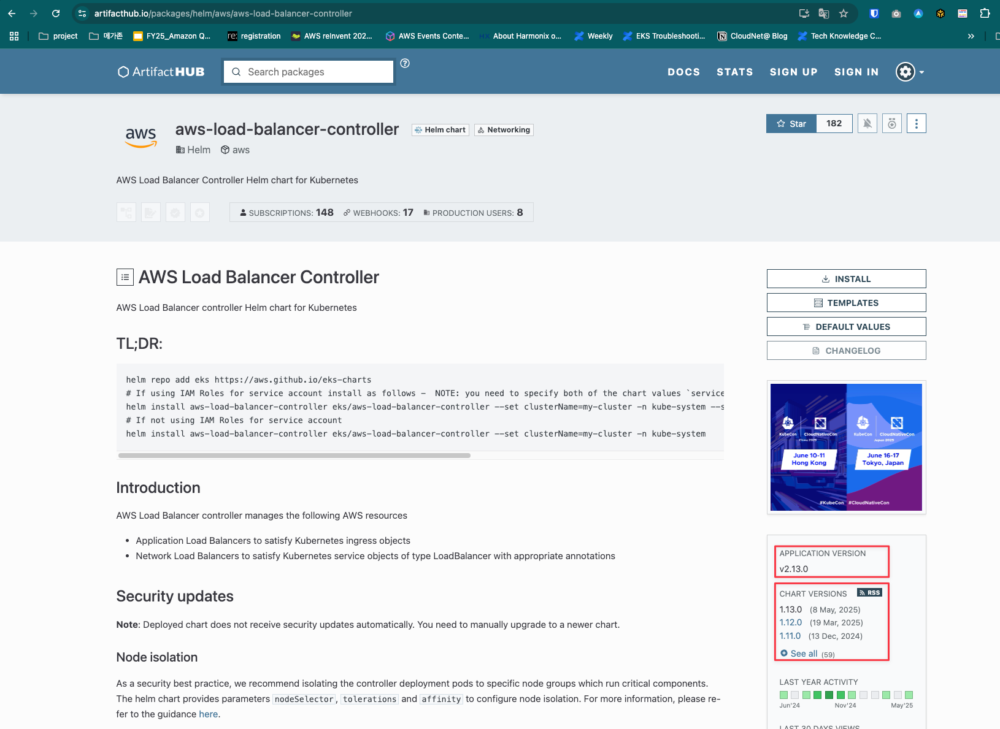

# aws loadbalancer controller Helm Chart 업그레이드

## 1. IRSA 연동 Role 확인
```shell
kubectl get sa -A -o yaml | grep eks.amazonaws.com/role-arn | grep -e 'alb'
```

## 2. Role에 연동된 Policy 와 최신 aws-loadbalancer-controller가 필요로한 Policy 확인
1. AWS Management Console > IAM > Role > 1번에서 조회된 IRSA의 Role 선택
2. 최신 권장 Role : https://github.com/kubernetes-sigs/aws-load-balancer-controller/blob/main/docs/install/iam_policy.json

## 3. aws-loadbalancer-controller 와 EKS 버전 호환 버전 확인
1. [Release 페이지에서 확인](https://github.com/kubernetes-sigs/aws-load-balancer-controller/releases)

   

## 4. Helm Chart 버전 확인

1. [Artifact Hub 페이지에서 업그레이드 Image/Helm Chart 버전 확인](https://artifacthub.io/packages/helm/aws/aws-load-balancer-controller)

   

##  5. 최신 Image를 ECR에 업로드

1. 04장 참조

## 6. Helm Upgrade

### 6.1 기존 Helm Value Backup
```
helm get values aws-load-balancer-controller \
    -n kube-system | tee aws-load-balancer-controller-values.yaml
```
### 6.2 aws-load-balancer-controller-values.yaml 에서 repository 경로 및 tag에 최신 Image 정보로 변경
```
예)
repository: 539666729110.dkr.ecr.ap-northeast-1.amazonaws.com/eks/aws-load-balancer-controller
tag: v2.11.0
```

### 6.3 현재 Helm History 확인

```shell
helm history aws-load-balancer-controller -n kube-system

# 롤백이 필요로한 경우 현재 구동된 버전이 필요로 하므로 기록함
```

### 6.4 Helm Upgrade

```
HELM_VERSION=<4번에서 설치하고자 하는 Helm Version을 기록>

helm upgrade aws-load-balancer-controller \
	eks/aws-load-balancer-controller \
	-n kube-system \
	-f aws-load-balancer-controller-values.yaml \
	--version ${HELM_VERSION}
```

## 7 Rollback이 필요로한 경우
```shell
helm rollback aws-load-balancer-controller <6.3에서 기록한 이전 버전> -n kube-system
```