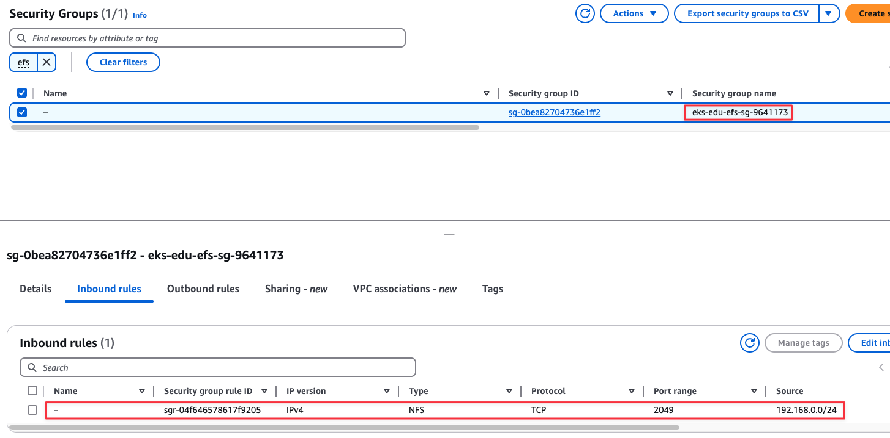
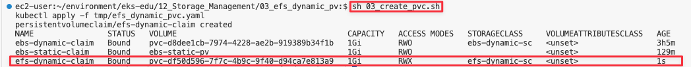
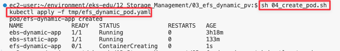

= 10. 네트워크 관리-2
// Settings:
:experimental:
:icons: font
:sectnums:
// :!sectids:
// Github?
ifdef::env-github[]
:tip-caption: :bulb:
:note-caption: :information_source:
:important-caption: :heavy_exclamation_mark:
:caution-caption: :fire:
:warning-caption: :warning:
endif::[]
// No Github?
ifndef::env-github[]
:toc: left
:toclevels: 4
:source-highlighter: highlight.js
endif::[]
:revealjsdir: https://cdn.jsdelivr.net/npm/reveal.js
:revealjs_showSlideNumber: all
:revealjs_hash: true
// Presentation 변환 참고용
// - https://asciidoc-slides.8vi.cat/
// - https://zenika.github.io/adoc-presentation-model/reveal-my-asciidoc.html

== 목표
- Storage Class, Persistence Volume, Persistence Volume Claim 에 학습
- Dynamic PV와 Static PV에 대해 학습 및 구축 실습

== 사전 조건

1. link:00_Setup/[0. 교육 환경 구성하기]를 이용해 기본 실습 환경 생성이 되어 있어야 합니다.
2. link:00_Setup/[0. 교육 환경 구성하기]를 이용해 생성된 `code-server`에 접속한 상태여야 합니다.
3. link:12_Storage_Management/[12. Storage 관리]에 00_pre_setup/01_install.sh 를 실행하여 EBS CSI DRiver/EFS CSI Driver Addon이 같이 설치된 EKS를 구축합니다.

[source,shell]
----
cd ~/environment/eks-edu/12_Storage_Management/00_pre_setup
sh 01_install.sh
----

.결과 화면


== 볼륨이 중요한 이유
- 데이터 지속성 : **컨테이너의 디스크 파일은 임시적이기 때문에 컨테이너에서 실행되는 애플리케이션에 몇 가지 문제가 발생**할 수 있습니다. **컨테이너가 충돌하거나 중지되면 컨테이너 상태가 저장되지 않아 컨테이너 수명 동안 생성되거나 수정된 모든 파일이 손실되는 문제가 발생**합니다. 충돌 후 kubelet은 컨테이너를 깨끗한 상태로 다시 시작합니다.
- 공유 스토리지: 여러 컨테이너가 실행 중이고 Pod 파일을 공유해야 할 때 또 다른 문제가 발생합니다. 모든 컨테이너에서 공유 파일 시스템을 설정하고 액세스하는 것은 어려울 수 있습니다.

=== 임시 볼륨 설명
- 추가 스토리지가 필요하지만, 재시작 시에도 데이터가 영구적으로 저장되는지는 중요하지 않는 경우

    예)  캐싱 서비스는 메모리 크기에 제한을 받는 경우가 많으며, 전체 성능에 거의 영향을 주지 않으면서 자주 사용되지 않는 데이터를 메모리보다 느린 스토리지로 옮길 수 있습니다

- Pod의 수명 주기를 따르고 Pod와 함께 생성 및 삭제되므로, 영구 볼륨을 사용할 수 있는 위치에 제한받지 않고 Pod를 중지하고 다시 시작할 수 있습니다.

==== 종류
- emptyDir : Pod 시작 시 비어 있음, 저장소는 kubelet 기본 디렉토리(일반적으로 루트 디스크) 또는 RAM에서 로컬로 제공됨
+
[,yaml]
----
apiVersion: v1
kind: Pod
metadata:
  name: counter
spec:
  containers:
  - name: count
    image: busybox:1.28
    args:
    - /bin/sh
    - -c
    - >
      i=0;
      while true;
      do
        echo "$i: $(date)" >> /var/log/1.log;
        echo "$(date) INFO $i" >> /var/log/2.log;
        i=$((i+1));
        sleep 1;
      done
    volumeMounts:
    - name: varlog
      mountPath: /var/log
  - name: count-log-1
    image: busybox:1.28
    args: [/bin/sh, -c, 'tail -n+1 -F /var/log/1.log']
    volumeMounts:
    - name: varlog
      mountPath: /var/log
  - name: count-log-2
    image: busybox:1.28
    args: [/bin/sh, -c, 'tail -n+1 -F /var/log/2.log']
    volumeMounts:
    - name: varlog
      mountPath: /var/log
  volumes:
  - name: varlog
    emptyDir: {}
----
- configMap, secret : 다양한 종류의 Kubernetes 데이터를 Pod에 주입합니다.
+
[,yaml]
----
apiVersion: v1
kind: Pod
metadata:
  name: mypod
spec:
  containers:
  - name: mypod
    image: redis
    volumeMounts:
    - name: foo
      mountPath: "/etc/foo"
      readOnly: true
  volumes:
  - name: foo
    configMap:
      name: myconfigmap
---
apiVersion: v1
kind: ConfigMap
metadata:
  name: myconfigmap
data:
  username: k8s-admin
  access_level: "1"
----

== EBS CSI Driver

Amazon Elastic Block Store(Amazon EBS) CSI(Container Storage Interface) 드라이버에서는 **Amazon EBS 볼륨의 수명 주기를 사용자가 생성하는 Kubernetes 볼륨의 스토리지로 관리**합니다.

Amazon EBS CSI 드라이버는 Amazon EBS 볼륨을 Kubernetes 볼륨 유형인 일반 임시 볼륨 및 **영구 볼륨**에 사용할 수 있도록 만듭니다.

=== 고려 사항

* Amazon **EBS CSI 컨트롤러를 EKS Auto Mode 클러스터에 설치할 필요가 없습**니다.
* Amazon **EBS 볼륨을 Fargate 포드에 탑재할 수 없습**니다.
* Amazon EBS CSI 컨트롤러는 Fargate 노드에서 실행할 수 있지만 **Amazon EBS CSI 노드 DaemonSet은(는) Amazon EC2 인스턴스에서만 실행**할 수 있습니다.
* Amazon EBS 볼륨 및 Amazon EBS CSI 드라이버는 **Amazon EKS Hybrid Nodes와 호환되지 않습**니다.
* 최신 추가 기능 버전과 하나의 이전 버전에 대한 지원이 제공됩니다. 최신 버전에서 발견된 버그나 취약성은 새 마이너 버전의 이전 릴리스로 백포트됩니다.
* **ebs.csi.eks.amazonaws.com을 프로비저너로 사용하여 스토리지 클래스에서 생성된 플랫폼 버전만 EKS 자동 모드에서 생성한 노드에 탑재**할 수 있습니다. 볼륨 스냅샷을 사용하여 기존 플랫폼 버전을 새 스토리지 클래스로 마이그레이션해야 합니다.

== EFS CSI Driver

Amazon Elastic File System(Amazon EFS)은 완전히 탄력적인 서버리스 파일 스토리지를 제공하므로 **스토리지 용량과 성능을 프로비저닝하거나 관리하지 않고도 파일 데이터를 공유**할 수 있습니다.

=== 고려 사항

* Amazon EFS CSI 드라이버는 **Windows 기반 컨테이너 이미지와 호환되지 않습**니다.
* **Fargate 노드에는 영구 볼륨에 대해 동적 프로비저닝을 사용할 수 없지**만 정적 프로비저닝은 사용할 수 있습니다.
* 동적 프로비저닝은 1.2 이상의 드라이버가 필요합니다. 모든 지원되는 Amazon EKS 클러스터 버전에서 드라이버 버전 1.1을 사용하여 영구 볼륨에 대해 정적 프로비저닝을 사용할 수 있습니다.
* 이 드라이버의 버전 **1.3.2 이상은 Amazon EC2 Graviton 기반 인스턴스를 포함하여 Arm64 아키텍처를 지원**합니다.
* 이 드라이버의 버전 **1.4.2 이상은 파일 시스템 탑재에 FIPS 사용**을 지원합니다.
* Amazon EFS의 리소스 할당량을 기록해 둡니다. 예를 들어, 각 **Amazon EFS 파일 시스템에 대해 생성할 수 있는 액세스 포인트 할당량은 1,000개**입니다.
* 버전 2.0.0부터 이 드라이버는 TLS 연결에 stunnel를 사용하던 것을 efs-proxy로 전환했습니다. efs-proxy를 사용하면 실행 중인 노드의 코어 수에 1을 더한 것과 같은 수의 스레드가 열립니다.
* Amazon EFS CSI 드라이버는 **Amazon EKS Hybrid Nodes와 호환되지 않습**니다.

== Static Provisioning

image::image/Static_Provisioning_draw.svg[Static Provisioning]

== Dynamic Provisioning

image::image/Dynamic_Provisioning_draw.svg[Dynamic Provisioning]

== 실습

=== EBS Dynamic Provisioning
. EBS StorageClass 생성
+
[,shell]
----
cd ~/environment/eks-edu/12_Storage_Management/01_ebs_dynamic_pv
sh 01_create_storageclass.sh
----

. 위 ``01_create_storageclass.sh```를 실행하면 ``tmp/ebs_dynamic_storageclass.yaml```를 만들어서 배포를 합니다.(참고용)
+
[,yaml]
----
apiVersion: storage.k8s.io/v1
kind: StorageClass
metadata:
 name: ebs-dynamic-sc
provisioner: ebs.csi.aws.com
reclaimPolicy: Retain
volumeBindingMode: WaitForFirstConsumer
----
+
[,shell]
----
# 배포
kubectl apply -f tmp/ebs_dynamic_storageclass.yaml
----
+
.실행 화면

+
`kubectl get storageclass` 실행 시
+
.생성 결과 화면


. EBS PVC 생성
+
[,shell]
----
cd ~/environment/eks-edu/12_Storage_Management/01_ebs_dynamic_pv
sh 02_create_pvc.sh
----
+
위 ``02_create_pvc.sh``를 실행하면 ``tmp/ebs_dynamic_pvc.yaml``를 만들어서 배포를 합니다.(참고용)
+
[,yaml]
----
apiVersion: v1
kind: PersistentVolumeClaim
metadata:
 name: ebs-dynamic-claim
spec:
 accessModes:
   - ReadWriteOnce
 storageClassName: ebs-dynamic-sc
 resources:
   requests:
     storage: 1Gi
----
+
.실행 화면

+
``kubectl get pvc`` 실행 시
.생성 결과 화면


. Pod 생성
+
[,shell]
----
cd ~/environment/eks-edu/12_Storage_Management/01_ebs_dynamic_pv
sh 03_create_pod.sh
----
+
위 ``03_create_pod.sh``를 실행하면 ``tmp/ebs_dynamic_pod.yaml``를 만들어서 배포를 합니다.(참고용)
+
[,yaml]
----
apiVersion: v1
kind: Pod
metadata:
 name: ebs-dynamic-app
spec:
 containers:
 - name: app
   image: public.ecr.aws/amazonlinux/amazonlinux
   command: ["/bin/sh"]
   args: ["-c", "while true; do echo Fri Apr  4 04:15:34 UTC 2025 >> /data/out.txt; sleep 5; done"]
   volumeMounts:
   - name: persistent-storage
     mountPath: /data
 volumes:
 - name: persistent-storage
   persistentVolumeClaim:
     claimName: ebs-dynamic-claim
----
+
[,shell]
----
# 배포
kubectl apply -f tmp/ebs_dynamic_pod.yaml
----
+
.실행 화면
image::image/ebs_dynamic_pv_creating_pod.png[1743740263503]
+
``kubectl get pods`` 실행 시
+
.생성 결과 화면

+
``kubectl get pv`` 실행 시
+
image::image/ebs_dynamic_pv_result_creating_pv.png[1743740621150]
- NAME : 자동으로 생성된 Volume이름으로 매핑
- STATUS : Pod가 생성시 Attach되어 Bound 상태
- CLAIM : 네임스페이스/PVC 이름
- STORAGECLASS : 1번단계에서 만들어진 Storageclass 이름

. Volume 체크
+
[,shell]
----
cd ~/environment/eks-edu/12_Storage_Management/01_ebs_dynamic_pv
sh 04_check.sh
----
+
위 `04_check.sh`를 실행하면 아래 kubectl 명령을 실행합니다..(참고용)
+
[,shell]
----
kubectl exec ebs-dynamic-app -- cat /data/out.txt
----
+
.실행 결과 화면
image::image/ebs_dynamic_pv_result_exec.png[1743740797263]

. Pod가 삭제되어도 유지가 되는지 확인
+
[,shell]
----
kubectl delete pod app

kubectl get pv

date
sh 03_create_pod.sh

sh 04_check.sh
----

=== EBS Static Provisioning

. EBS Volume 생성
+
[,shell]
----
cd ~/environment/eks-edu/12_Storage_Management/02_ebs_static_pv
sh 01_create_volume.sh
----
+
위 ``01_create_volume.sh``를 실행하면 아래 aws cli 명령을 수행하여 EBS Volume을 생성 합니다.(참고용)
+
[,shell]
----
aws ec2 create-volume \
   --volume-type gp3 \
   --size 1 \
   --availability-zone ap-northeast-1a \
   --tag-specifications "ResourceType=volume,Tags=[{Key=Name,Value=eks-ebs-volume-9641173},{Key=kubernetes.io/cluster/eks-edu-cluster-9641173,Value=owned}]" \
   --query "VolumeId" \
   --output text
----
+
.실행 화면

+
.생성 결과 화면


. EBS Static PV 생성
+
[,shell]
----
cd ~/environment/eks-edu/12_Storage_Management/02_ebs_static_pv
sh 02_create_pv.sh
----
+
위 ``02_create_pv.sh``를 실행하면 ``tmp/ebs_static_pv.yaml``를 만들어서 배포를 합니다.(참고용)
+
[,yaml]
----
apiVersion: v1
kind: PersistentVolume
metadata:
 name: ebs-static-pv
spec:
 accessModes:
 - ReadWriteOnce
 capacity:
   storage: 1Gi
 csi:
   driver: ebs.csi.aws.com
   fsType: ext4
   volumeHandle: vol-0eecb37dc650000cb
 nodeAffinity:
   required:
     nodeSelectorTerms:
       - matchExpressions:
           - key: topology.kubernetes.io/zone
             operator: In
             values:
               - ap-northeast-1a
----
+
[,shell]
----
# 배포
kubectl apply -f tmp/ebs_static_pv.yaml
----
+
.실행 화면

+
``kubectl get pv`` 실행 시
+
.생성 결과 화면


. EBS Static PVC 생성
+
[,shell]
----
cd ~/environment/eks-edu/12_Storage_Management/02_ebs_static_pv
sh 03_create_pvc.sh
----
+
위 ``03_create_pvc.sh``를 실행하면 ``tmp/ebs_static_pvc.yaml``를 만들어서 배포를 합니다.(참고용)
+
[,yaml]
----
apiVersion: v1
kind: PersistentVolumeClaim
metadata:
 name: ebs-static-claim
spec:
 storageClassName: "" # Empty string must be explicitly set otherwise default StorageClass will be set
 volumeName: ebs-static-pv
 accessModes:
   - ReadWriteOnce
 resources:
   requests:
     storage: 1Gi
----
+
[,shell]
----
# 배포
kubectl apply -f tmp/ebs_static_pvc.yaml
----
+
.실행 화면

+
`kubectl get pvc` 실행 시
+
.생성 결과 화면


. Pod 생성
+
[,shell]
----
cd ~/environment/eks-edu/12_Storage_Management/02_ebs_static_pv
sh 04_create_pod.sh
----
+
위 ``04_create_pod.sh``를 실행하면 ``tmp/ebs_dynamic_pod.yaml``를 만들어서 배포를 합니다.(참고용)
+
[,yaml]
----
apiVersion: v1
kind: Pod
metadata:
  name: ebs-static-app
spec:
  containers:
  - name: app
    image: public.ecr.aws/amazonlinux/amazonlinux
    command: ["/bin/sh"]
    args: ["-c", "while true; do echo Fri Apr  4 05:20:55 UTC 2025 >> /data/out.txt; sleep 5; done"]
    volumeMounts:
    - name: persistent-storage
      mountPath: /data
  volumes:
  - name: persistent-storage
    persistentVolumeClaim:
      claimName: ebs-static-claim
----
+
[,shell]
----
# 배포
kubectl apply -f tmp/ebs_static_pod.yaml
----
+
.실행 화면

+
`kubectl get pods` 실행 시
+
.생성 결과 화면
image::image/result_ebs_static_pv_creating_pod.png[1743744268949]

=== EFS Dynamic PV Provisioning

. EFS Volume 생성
+
[,shell]
----
cd ~/environment/eks-edu/12_Storage_Management/03_efs_dynamic_pv
sh 01_create_filesystem.sh
----
+
위 ``01_create_filesystem.sh``를 실행하면 아래 aws cli 명령을 수행하여 EFS FileSystem을 생성 합니다.(참고용)
+
[,shell]
----
# EFS Filesystem에서 사용할 Security Group 값을 생성
aws ec2 create-security-group \
  --group-name eks-edu-efs-sg-9641173 \
  --description "Security group for EFS in EKS" \
  --vpc-id vpc-08e8baa7184e84f70 \
  --query "GroupId" \
  --output text

# 생성된 Security Group에 VPC Cidr에 NFS Port을 허용 등록
aws ec2 authorize-security-group-ingress \
  --group-id sg-0bea82704736e1ff2 \
  --protocol tcp \
  --port 2049 \
  --cidr 192.168.0.0/24

# File System Id를 등록
aws efs create-file-system \
  --performance-mode generalPurpose \
  --throughput-mode bursting \
  --encrypted \
  --tags Key=Name,Value=eks-edu-efs-id-9641173 \
  --query "FileSystemId" \
  --output text

# File System 에 Network에 SG 등록 (AZ1)
aws efs create-mount-target \
  --file-system-id fs-002c6492a5482f394 \
  --subnet-id subnet-0299cae5ee766caa8 \
  --security-groups sg-0bea82704736e1ff2

# File System 에 Network에 SG 등록 (AZ2)
aws efs create-mount-target \
  --file-system-id fs-002c6492a5482f394 \
  --subnet-id subnet-0838f6d3cec5cb929 \
  --security-groups sg-0bea82704736e1ff2

----
+
.실행 화면

+
Security Group 생성
+
.생성 결과 화면

+
.EFS FileSystem Id 생성


. EFS Dynamic PV용 Storageclass 생성
+
[,shell]
----
cd ~/environment/eks-edu/12_Storage_Management/03_efs_dynamic_pv
sh 02_create_storageclass.sh
----
+
위 ``02_create_storageclass.sh``를 실행하면 ``tmp/efs_dynamic_storageclass.yaml``를 만들어서 배포를 합니다.(참고용)
+
[,yaml]
----
apiVersion: storage.k8s.io/v1
kind: StorageClass
metadata:
 name: efs-dynamic-sc
provisioner: efs.csi.aws.com
parameters:
 provisioningMode: efs-ap
 fileSystemId: fs-002c6492a5482f394
 directoryPerms: "700"
 gidRangeStart: "1000" # optional
 gidRangeEnd: "2000" # optional
 basePath: "/dynamic_provisioning" # optional
 subPathPattern: "${.PVC.namespace}/${.PVC.name}" # optional
 ensureUniqueDirectory: "true" # optional
 reuseAccessPoint: "false" # optional
----
+
[,shell]
----
# 배포
kubectl apply -f tmp/efs_dynamic_storageclass.yaml
----
+
.실행 화면

+
``kubectl get storageclass`` 실행 시
+
.생성 결과 화면


. EFS Dynamic PV용 PVC 생성
+
[,shell]
----
cd ~/environment/eks-edu/12_Storage_Management/03_efs_dynamic_pv
sh 03_create_pvc.sh
----
+
위 ``03_create_pvc.sh``를 실행하면 ``tmp/efs_dynamic_pvc.yaml``를 만들어서 배포를 합니다.(참고용)
+
[,yaml]
----
apiVersion: v1
kind: PersistentVolumeClaim
metadata:
 name: efs-dynamic-claim
spec:
 accessModes:
   - ReadWriteMany
 storageClassName: efs-dynamic-sc
 resources:
   requests:
     storage: 1Gi
----
+
[,shell]
----
# 배포
kubectl apply -f tmp/efs_dynamic_pvc.yaml
----
+
.실행 화면

+
``kubectl get pvc`` 실행 시
+
.생성 결과 화면


. EFS Dynamic PV용 Pod 생성
+
[,shell]
----
cd ~/environment/eks-edu/12_Storage_Management/03_efs_dynamic_pv
sh 04_create_pod.sh
----
+
위 ``04_create_pod.sh``를 실행하면 ``tmp/efs_dynamic_pod.yaml``를 만들어서 배포를 합니다.(참고용)
+
[,yaml]
----
apiVersion: v1
kind: Pod
metadata:
  name: efs-dynamic-app
spec:
  containers:
    - name: app
      image: public.ecr.aws/amazonlinux/amazonlinux
      command: ["/bin/sh"]
      args: ["-c", "while true; do echo Fri Apr  4 07:30:45 UTC 2025 >> /data/out; sleep 5; done"]
      volumeMounts:
        - name: persistent-storage
          mountPath: /data
  volumes:
    - name: persistent-storage
      persistentVolumeClaim:
        claimName: efs-dynamic-claim
----
+
[,shell]
----
# 배포
kubectl apply -f tmp/efs_dynamic_pod.yaml
----
+
.실행 화면

+
``kubectl get pod`` 실행 시
+
.생성 결과 화면


=== EFS Static PV Provisioning

. EFS Static PV용 StorageClass 생성
+
[,shell]
----
cd ~/environment/eks-edu/12_Storage_Management/04_efs_static_pv
sh 01_create_storageclass.sh
----
+
위 ``01_create_storageclass.sh``를 실행하면 ``tmp/efs_static_storageclass.yaml``를 만들어서 배포를 합니다.(참고용)
+
[,yaml]
----
apiVersion: storage.k8s.io/v1
kind: StorageClass
metadata:
 name: efs-static-sc
provisioner: efs.csi.aws.com
----
+
[,shell]
----
# 배포
kubectl apply -f tmp/efs_static_storageclass.yaml
----
+
.실행 화면

+
``kubectl get storageclass`` 실행 시
+
.생성 결과 화면
image::image/result_efs_static_creating_storage_class.png[1743753704451]

. EFS Static PV용 PersistentVolume 생성
+
[,shell]
----
cd ~/environment/eks-edu/12_Storage_Management/04_efs_static_pv
sh 02_create_pv.sh
----
+
위 ``02_create_pv.sh``를 실행하면 ``tmp/efs_static_pv.yaml`` 를 만들어서 배포를 합니다.(참고용)
+
[,yaml]
----
apiVersion: v1
kind: PersistentVolume
metadata:
  name: efs-static-pv
spec:
  capacity:
    storage: 1Gi
  volumeMode: Filesystem
  accessModes:
    - ReadWriteOnce
  storageClassName: efs-static-sc
  persistentVolumeReclaimPolicy: Retain
  csi:
    driver: efs.csi.aws.com
    volumeHandle: fs-002c6492a5482f394
----
+
[,shell]
----
# 배포
kubectl apply -f tmp/efs_static_pv.yaml
----
+
.실행 화면

+
`kubectl get storageclass` 실행 시
+
.생성 결과 화면
image::image/result_efs_static_creating_pv.png[1743754468171]

. EFS Static PV용 PVC 생성
+
[,shell]
----
cd ~/environment/eks-edu/12_Storage_Management/04_efs_static_pv
sh 03_create_pvc.sh
----
+
위 ``03_create_pvc.sh``를 실행하면 ``tmp/efs_static_pvc.yaml`` 를 만들어서 배포를 합니다.(참고용)
+
[,yaml]
----
apiVersion: v1
kind: PersistentVolumeClaim
metadata:
  name: efs-static-pvc
spec:
  accessModes:
    - ReadWriteOnce
  storageClassName: efs-static-sc
  resources:
    requests:
      storage: 1Gi
----
+
[,shell]
----
# 배포
kubectl apply -f tmp/efs_static_pvc.yaml
----
+
.실행 화면

+
``kubectl get pvc`` 실행 시
+
.생성 결과 화면


. EFS Static PV용 Pod 생성
+
[,shell]
----
cd ~/environment/eks-edu/12_Storage_Management/04_efs_static_pv
sh 04_create_pod.sh
----
+
위 ``04_create_pod.sh``를 실행하면 ``tmp/efs_static_pod.yaml`` 를 만들어서 배포를 합니다.(참고용)
+
[,yaml]
----
apiVersion: v1
kind: Pod
metadata:
  name: efs-static-app
spec:
  containers:
  - name: app
    image: public.ecr.aws/amazonlinux/amazonlinux
    command: ["/bin/sh"]
    args: ["-c", "while true; do echo Fri Apr  4 08:26:57 UTC 2025 >> /data/out.txt; sleep 5; done"]
    volumeMounts:
    - name: persistent-storage
      mountPath: /data
  volumes:
  - name: persistent-storage
    persistentVolumeClaim:
      claimName: efs-static-claim
----
+
[,shell]
----
# 배포
kubectl apply -f tmp/efs_static_pod.yaml
----
+
.실행 화면

+
``kubectl get pod`` 실행 시
+
.생성 결과 화면


== 숙제
. EFS Dynamic PV 를 신규 EKS에 PV로 사용하고 싶다면 어떻게 해야 하는가?

== 리소스 정리

. 리소스 삭제 ( 15분 소요 )
+
[,shell]
----
cd ~/environment/eks-edu/12_Storage_Management/99_delete
sh 99_delete.sh
----
+
위 `99_delete.sh`를 실행하면 아래 항목을 삭제합니다.
+
* App 삭제
* EBS Volume 삭제
* EFS File System 삭제
* Security Group 삭제

== 관련 링크

- [Amazon EBS에 Kubernetes 볼륨 저장](https://docs.aws.amazon.com/ko_kr/eks/latest/userguide/ebs-csi.html)
- [Amazon EFS를 사용한 탄력적 파일 시스템 저장](https://docs.aws.amazon.com/ko_kr/eks/latest/userguide/efs-csi.html)
- [Dynamic Volume Provisioning](https://github.com/kubernetes-sigs/aws-ebs-csi-driver/blob/master/examples/kubernetes/dynamic-provisioning/README.md)
- [StorageClass 파라미터 참조](https://docs.aws.amazon.com/ko_kr/eks/latest/userguide/create-storage-class.html#_storageclass_parameters_reference)