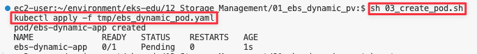
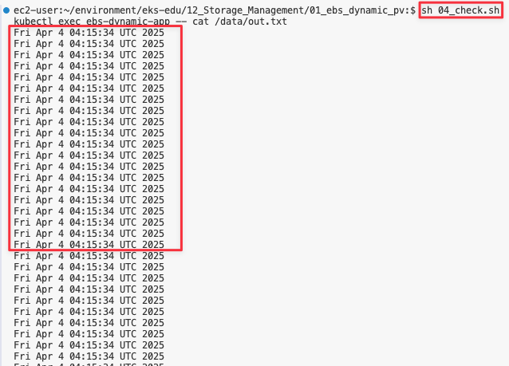

# Storage 관리

## 사전 조건

1. [0. 교육 환경 구성하기](00_Setup/)를 이용해 기본 실습 환경 생성이 되어 있어야 합니다.
2. [0. 교육 환경 구성하기](00_Setup/)를 이용해 생성된 `code-server`에 접속한 상태여야 합니다.
3. [12. Storage 관리](12_Storage_Management/)에 00_pre_setup/01_install.sh 를 실행하여 EBS CSI DRiver/EFS CSI Driver Addon이 같이 설치된 EKS를 구축합니다.

   ```shell
   cd ~/environment/eks-edu/12_Storage_Management/00_pre_setup
   sh 01_install.sh
   ```

   - 결과 화면

   

## 학습 목표

- Storage Class, Persistence Volume, Persistence Volume Claim 에 학습
- Dynamic PV와 Static PV에 대해 학습 및 구축 실습

## 이론

### EBS CSI Driver란?

Amazon Elastic Block Store(Amazon EBS) CSI(Container Storage Interface) 드라이버에서는 Amazon EBS 볼륨의 수명 주기를 사용자가 생성하는 Kubernetes 볼륨의 스토리지로 관리합니다.

Amazon EBS CSI 드라이버는 Amazon EBS 볼륨을 Kubernetes 볼륨 유형인 일반 임시 볼륨 및 영구 볼륨에 사용할 수 있도록 만듭니다.

#### 고려 사항

- Amazon **EBS CSI 컨트롤러를 EKS Auto Mode 클러스터에 설치할 필요가 없습**니다.
- Amazon **EBS 볼륨을 Fargate 포드에 탑재할 수 없습**니다.
- Amazon EBS CSI 컨트롤러는 Fargate 노드에서 실행할 수 있지만 **Amazon EBS CSI 노드 DaemonSet은(는) Amazon EC2 인스턴스에서만 실행**할 수 있습니다.
- Amazon EBS 볼륨 및 Amazon EBS CSI 드라이버는 **Amazon EKS Hybrid Nodes와 호환되지 않습**니다.
- 최신 추가 기능 버전과 하나의 이전 버전에 대한 지원이 제공됩니다. 최신 버전에서 발견된 버그나 취약성은 새 마이너 버전의 이전 릴리스로 백포트됩니다.
- **ebs.csi.eks.amazonaws.com을 프로비저너로 사용하여 스토리지 클래스에서 생성된 플랫폼 버전만 EKS 자동 모드에서 생성한 노드에 탑재**할 수 있습니다. 볼륨 스냅샷을 사용하여 기존 플랫폼 버전을 새 스토리지 클래스로 마이그레이션해야 합니다.

### EFS CSI Driver란?

Amazon Elastic File System(Amazon EFS)은 완전히 탄력적인 서버리스 파일 스토리지를 제공하므로 **스토리지 용량과 성능을 프로비저닝하거나 관리하지 않고도 파일 데이터를 공유**할 수 있습니다.

#### 고려 사항

- Amazon EFS CSI 드라이버는 **Windows 기반 컨테이너 이미지와 호환되지 않습**니다.
- **Fargate 노드에는 영구 볼륨에 대해 동적 프로비저닝을 사용할 수 없지**만 정적 프로비저닝은 사용할 수 있습니다.
- 동적 프로비저닝은 1.2 이상의 드라이버가 필요합니다. 모든 지원되는 Amazon EKS 클러스터 버전에서 드라이버 버전 1.1을 사용하여 영구 볼륨에 대해 정적 프로비저닝을 사용할 수 있습니다.
- 이 드라이버의 버전 **1.3.2 이상은 Amazon EC2 Graviton 기반 인스턴스를 포함하여 Arm64 아키텍처를 지원**합니다.
- 이 드라이버의 버전 **1.4.2 이상은 파일 시스템 탑재에 FIPS 사용**을 지원합니다.
- Amazon EFS의 리소스 할당량을 기록해 둡니다. 예를 들어, 각 **Amazon EFS 파일 시스템에 대해 생성할 수 있는 액세스 포인트 할당량은 1,000개**입니다.
- 버전 2.0.0부터 이 드라이버는 TLS 연결에 stunnel를 사용하던 것을 efs-proxy로 전환했습니다. efs-proxy를 사용하면 실행 중인 노드의 코어 수에 1을 더한 것과 같은 수의 스레드가 열립니다.
- Amazon EFS CSI 드라이버는 **Amazon EKS Hybrid Nodes와 호환되지 않습**니다.

## 실습

## EBS Dynamic PV
1. EBS StorageClass 생성
   ```shell
   cd ~/environment/eks-edu/12_Storage_Management/01_dynamic_ebs_pv
   sh 01_create_storageclass.sh
   ```

   위 `01_create_storageclass.sh`를 실행하면 tmp/ebs_storageclass.yaml를 만들어서 배포를 합니다.(참고용)

   ```yaml
   apiVersion: storage.k8s.io/v1
   kind: StorageClass
   metadata:
     name: ebs-sc
   provisioner: ebs.csi.aws.com
   volumeBindingMode: WaitForFirstConsumer
   ```

   ```shell
   # 배포
   kubectl apply -f tmp/ebs_storageclass.yaml
   ```

2. 실행 화면

   

3. 생성 결과 화면

   `kubectl get storageclass` 실행 시 
   

4. EBS PVC 생성

   ```shell
   cd ~/environment/eks-edu/12_Storage_Management/01_dynamic_ebs_pv
   sh 02_create_pvc.sh
   ```

   위 `02_create_pvc.sh`를 실행하면 tmp/ebs_pvc.yaml를 만들어서 배포를 합니다.(참고용)

   ```yaml
   apiVersion: v1
   kind: PersistentVolumeClaim
   metadata:
     name: ebs-claim
   spec:
     accessModes:
       - ReadWriteOnce
     storageClassName: ebs-sc
     resources:
       requests:
         storage: 1Gi
   ```

5. 실행 화면

   

6. 생성 결과 화면

   `kubectl get pvc` 실행 시
   

7. Pod 생성

   ```shell
   cd ~/environment/eks-edu/12_Storage_Management/01_dynamic_ebs_pv
   sh 03_create_pod.sh
   ```

   위 `03_create_pod.sh`를 실행하면 tmp/ebs_pod.yaml를 만들어서 배포를 합니다.(참고용)

   ```yaml
   apiVersion: v1
   kind: Pod
   metadata:
     name: app
   spec:
     containers:
     - name: app
       image: public.ecr.aws/amazonlinux/amazonlinux
       command: ["/bin/sh"]
       args: ["-c", "while true; do echo Thu Apr  3 08:53:33 UTC 2025 >> /data/out.txt; sleep 5; done"]
       volumeMounts:
       - name: persistent-storage
         mountPath: /data
     volumes:
     - name: persistent-storage
       persistentVolumeClaim:
         claimName: ebs-claim
   ```

   ```shell
   # 배포
   kubectl apply -f tmp/ebs_pod.yaml
   ```

8. 실행 화면

   

9. 생성 결과 화면

   `kubectl get pods` 실행 시
   

   `kubectl get pv` 실행 시
   
   - NAME : 자동으로 생성된 Volume이름으로 매핑
   - STATUS : Pod가 생성시 Attach되어 Bound 상태
   - CLAIM : 네임스페이스/PVC 이름
   - STORAGECLASS : 1번단계에서 만들어진 Storageclass 이름

8. Volume 체크

   ```shell
   cd ~/environment/eks-edu/12_Storage_Management/01_dynamic_ebs_pv
   sh 04_check.sh
   ```

   위 `04_check.sh`를 실행하면 아래 kubectl 명령을 실행합니다..(참고용)

   ```shell
   kubectl exec app -- cat /data/out.txt
   ```

9. 실행 결과 화면
   

10. 미션
   ```shell
   kubectl delete pod app

   kubectl get pv

   date
   sh 03_create_pod.sh

   sh 04_check.sh
   ```
## 4-1. EBS Dynamic PV

## 4-2. EBS Static PV

## 4-3. EFS Dynamic PV

## 4-3. EFS Static PV

# 5. 정리

## 관련 링크

- [Amazon EBS에 Kubernetes 볼륨 저장](https://docs.aws.amazon.com/ko_kr/eks/latest/userguide/ebs-csi.html)
- [Amazon EFS를 사용한 탄력적 파일 시스템 저장](https://docs.aws.amazon.com/ko_kr/eks/latest/userguide/efs-csi.html)
- [Dynamic Volume Provisioning](https://github.com/kubernetes-sigs/aws-ebs-csi-driver/blob/master/examples/kubernetes/dynamic-provisioning/README.md)
- [StorageClass 파라미터 참조](https://docs.aws.amazon.com/ko_kr/eks/latest/userguide/create-storage-class.html#_storageclass_parameters_reference)