= 13. 어플리케이션
// Settings:
:experimental:
:icons: font
:sectnums:
// :!sectids:
// Github?
ifdef::env-github[]
:tip-caption: :bulb:
:note-caption: :information_source:
:important-caption: :heavy_exclamation_mark:
:caution-caption: :fire:
:warning-caption: :warning:
endif::[]
// No Github?
ifndef::env-github[]
:toc: left
:toclevels: 4
:source-highlighter: highlight.js
endif::[]
:revealjsdir: https://cdn.jsdelivr.net/npm/reveal.js
:revealjs_showSlideNumber: all
:revealjs_hash: true
// Presentation 변환 참고용
// - https://asciidoc-slides.8vi.cat/
// - https://zenika.github.io/adoc-presentation-model/reveal-my-asciidoc.html

== 목표
- Kubernetes의 Object에 대해서 학습
- Deployment 전략 ( Blue/Green, Rolling ) 에 대해서 학습
- PDB에 대해서 학습
- Helm 생성 하는 방법에 대해서 학습

== 사전 조건

. link:00_Setup/[0. 교육 환경 구성하기]를 이용해 기본 실습 환경 생성이 되어 있어야 합니다.
. link:00_Setup/[0. 교육 환경 구성하기]를 이용해 생성된 `code-server`에 접속한 상태여야 합니다.
. link:13_Application/[13. Application 배포 - 기본]에 00_pre_setup/01_install.sh 를 실행하여 EBS CSI DRiver/EFS CSI Driver Addon이 같이 설치된 EKS를 구축합니다.
[source,shell]
----
cd ~/environment/eks-edu/13_Application/00_pre_setup
sh 01_install.sh
----

== 이론

=== Kubernetes의 Object란
쿠버네티스 오브젝트는 *하나의 의도를 담은 레코드* 이다.

오브젝트를 생성하게 되면 쿠버네티스 시스템은 그 오브젝트 생성을 보장하기 위해 지속적으로 작동할 것이다.

==== App 전체 구성도

image::image/K8S_App_구성도.svg[K8S App 구성도]

==== 관리 기법
- 명령형 커맨드
+
[source,shell]
----
kubectl create deployment nginx --image nginx
----

- 명령형 커맨드 오브젝트 구성
+
[source,shell]
----
kubectl create -f nginx.yaml
----

=== Object 종류

==== 명령어
[source,shell]
----
# namespace 목록
kubectl api-resources
----

.오브젝트 종류
[%autowidth,cols="1s,,a,"]
|===
|이름 |설명 |조회 명령어

|Namespaces
|단일 클러스터 내에서의 리소스 그룹 격리 메커니즘을 제공
|kubectl get namespace

|Ingress
|정의한 규칙에 기반하여 트래픽을 다른 백엔드에 매핑할 수 있게 해준다.
|kubectl get ingress -n <namespace>

|Service
|파드 집합에서 실행중인 애플리케이션을 네트워크 서비스로 노출하는 추상화 방법
|kubectl get service -n <namespace>

|Pod
|Kubernetes에서 만들고 관리할 수 있는 가장 작은 배포 가능 컴퓨팅 단위
|kubectl get pods -n <namespace>

|Deployment
|현재 상태에서 의도하는 상태로 비율을 조정하며 변경
|kubectl get deployment -n <namespace>

|StatefulSets
|Pod 그룹을 실행하고 각 Pod에 대해 고정된 ID를 유지합니다. 상태 저장 애플리케이션을 관리하는 데 사용되는 워크로드 API 객체
|kubectl get deploy -n <namespace>

|DaemonSet
|모든(또는 일부) 노드가 파드의 사본을 실행
|kubectl get ds -n <namespace>

|Job
|하나 이상의 파드를 생성하고 지정된 수의 파드가 성공적으로 종료될 때까지 계속해서 파드의 실행을 재시도
|kubectl get job -n <namespace>

|CronJob
|반복 일정에 따라 잡을 만든다
|kubectl get cj -n <namespace>

|Persistent Volume Claim
|볼륨에 대한 요청
|kubectl get pvc -n <namespace>

|Persistent Volume
|볼륨 리소스
|kubectl get pv

|Service Accounts
| Kubernetes에서 비인간 사용자(non-human account) 유형 중 하나로, Kubernetes 클러스터 내에서 고유한 신원(identity) 을 제공
|kubectl get serviceaccount -n <namespace>

|ConfigMaps
|키-값 쌍으로 비밀이 아닌 데이터를 저장하는 데 사용되는 API 객체
|kubectl get cm -n <namespace>

|Secret
|비밀번호, 토큰, 키와 같은 소량의 민감한 데이터를 포함하는 객체
|kubectl get secret -n <namespace>
|===

==== 파이널라이저
파이널라이저는 쿠버네티스가 오브젝트를 완전히 삭제하기 이전, 삭제 표시를 위해 특정 조건이 충족될 때까지 대기하도록 알려주기 위한 네이스페이스에 속한 키이다.

리소스를 삭제하려 할 때는 삭제 요청을 처리하는 API 서버가 ``finalizers`` 필드의 값을 인식하고 다음을 수행
- 삭제를 시작한 시간과 함께 ``metadata.deletionTimestamp`` 필드를 추가하도록 오브젝트를 수정한다.
- 오브젝트의 ``metadata.finalizers`` 필드가 비워질 때까지 오브젝트가 제거되지 않도록 한다.

파이널라이저의 일반적인 예로 ``퍼시스턴트 볼륨`` 오브젝트가 실수로 삭제되는 것을 방지하는 ``kubernetes.io/pv-protection`` 가 있다.
파드가 ``퍼시스턴트 볼륨`` 오브젝트를 사용 중일 때 쿠버네티스틑 ``pv-protection`` 파이널라이저를 추가한다.
``퍼시스턴트 볼륨``을 삭제하려 하면 ``Terminating`` 상태가 되지만 파이널라이저가 존재하기 때문에 컨트롤러가 삭제할 수 없다. 파드가 ``퍼시스턴트 볼륨``의 사용을 중지하면 쿠버네티스가 ``pv-protection`` 파이널 라이저를 해제하고 컨트롤러는 볼륨을 삭제한다.

===== 프로브 종류
- livenessProbe : 컨테이너가 동작 중인지 여부를 나타낸다. liveness probe가 실패한다면, kubelet은 컨테이너를 죽이고, 해당 컨테이너는 재시작 정책 대상이 된다.
- readinessProbe : 컨테이너가 요청을 처리할 준비가 되었는지 여부를 나타낸다. 만약 readiness probe가 실패한다면, 엔드포인트 컨트롤러는 파드에 연관된 모든 서비스들의 엔드포인트에서 파드의 IP주소를 제거한다.
- startupProbe : 컨터에너 내의 애플리케이션이 시작되었는지를 나타낸다. startup probe가 주어진 경우, 성공할 때까지 다른 나머지 프로브는 활성화 되지 않는다. 만약 스타트업 프로브가 실패하면, kubelet이 컨테이너를 죽이고, 컨테이너는 재시작 정책에 따라 처리된다. ( 대량의 데이터 로딩, 구성 파일 또는 마이그레이션에 대한 작업 수행 )

==== 컨테이너 프로브 체크 종류
- exec : 컨테이너 내에서 지정된 명령어를 실행한다. 명령어가 상태 코드 0으로 종료되면 진단이 성공한 것으로 간주한다.
- grpc : gRPC를 사용하여 원격 프로시저 호출을 수행한다. 체크 대상이 gRPC 헬스 체크를 구현해야 한다.
- httpGet : 지정한 포트 및 경로에서 컨테이너의 IP주소에 대한 HTTP GET 요청을 수행한다. 응답의 상태 코드가 200이상 400미만이면 진단이 성공한 것으로 간주한다.
- tcpSocket : 지정된 포트에서 컨테이너의 IP주소에 대해 TCP 검사를 수행한다. 포트가 활성화되어 있다면 진단이 성공한 것으로 간주한다.

==== Pod Distruption Budgets
애플리케이션이 **동시에 겪는 중단 수를 제한하여 가용성을 높이는 방법**을 보여준다.

Kubernetes 서버는 버전 v1.21 이상이어야 한다.

===== 예시
https://kubernetes.io/ko/docs/concepts/workloads/pods/disruptions/#pdb-example

=== 실습
==== deploy 배포
===== deployment에 nginx 버전 업그레이드

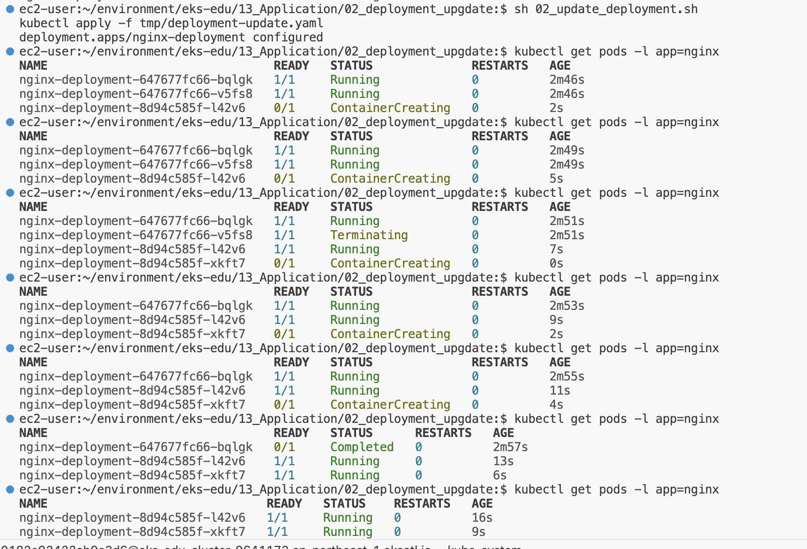

==== 관련 명령어
[source,shell]
----
# 이미지 업데이트
kubectl set image deployment/nginx-deployment nginx=nginx:1.16.1
# replicas 상태
kubectl get rs

# 롤아웃 기록 확인
kubectl rollout history deployment/nginx-deployment

# 이전 개정판으로 롤백
kubectl rollout undo deployment/nginx-deployment

# 배포 확장
kubectl scale deployment/nginx-deployment --replicas=10
----

==== PDB 실습

. my-pod Deployment 배포
+
[source,shell]
----
cd ~/environment/eks-edu/13_Application/03_pdb
sh 01_create_deployment.sh
----
+
위 ``01_create_deployment.sh``를 실행하면 nginx Pod 3개를 배포합니다.
+
.실행 화면
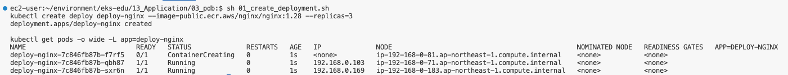

. PDB 설정
+
[source,shell]
----
cd ~/environment/eks-edu/13_Application/03_pdb
sh 03_pod_distruption_budget.sh
----
+
위 ``03_pod_distruption_budget.sh``를 실행하면 ``min-available=2`` 인 PDB를 생성한다. ( Pod가 2대는 Available 되어야 한다.)
+
.실행 화면
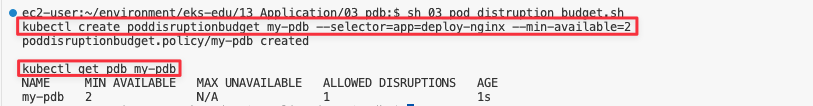

. 같은 노드에 Pod 두대가 존재하는 Node Instance를 Drain 처리
+
[source,shell]
----
cd ~/environment/eks-edu/13_Application/03_pdb
sh 02_get_pods.sh

sh 06_node_drain.sh <<Node Name>>

----
+
만약 한 대의 Node에 두개의 Pod가 존재하지 않는 경우 한번 더 Drain 작업을 수행한다.
min-available 값이 2이므로 동시에 Evicting이 되지 않지만 한대는 Retry 시도를 해서 Evicting에 성공한다.
+
.실행 화면
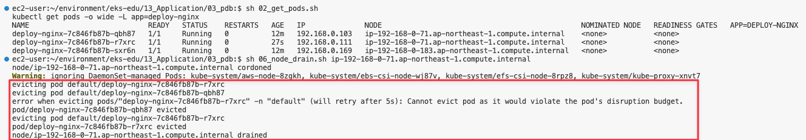
+
문제가 되는 상황은 1대의 Pod에 min-available 값이 50% 인 경우

==== Helm 실습

. Nginx Helm Repo 등록
+
[,shell]
----
cd ~/environment/eks-edu/13_Application/04_helm/
sh 01_nginx_helm_repo_add.sh
----
+
위 ``01_nginx_helm_repo_add.sh``를 실행하면 Bitnami Nginx Repo를 등록합니다.
+
.실행 화면
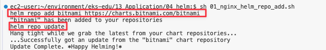

. Container 이미지를 변경하기 위해서 Values 값을 뽑아내기
+
[,shell]
----
cd ~/environment/eks-edu/13_Application/04_helm/
sh 02_nginx_get_values.sh
----
+
위 ``02_nginx_get_values.sh``를 실행하면 tmp/ 에 ``values.yaml`` 이 생성이 된다.
+
.실행 화면

. values.yaml 에 public ecr 정보로 변경하기
+
[,shell]
----
cd ~/environment/eks-edu/13_Application/04_helm/
sh 03_change_public_ecr.sh
----
+
위 ``03_change_public_ecr.sh``를 실행하면 tmp/ 에 ``custom_values.yaml`` 이 생성이 된다.
+
[,yaml]
----
global:
  security:
    allowInsecureImages: true
image:
  registry: public.ecr.aws
  repository: bitnami/nginx
  tag: 1.28.0-debian-12-r3
----

. Helm Chart 버전 확인
+
[,shell]
----
cd ~/environment/eks-edu/13_Application/04_helm/
sh 04_nginx_helm_version.sh
----
+
위 ``04_nginx_helm_version.sh``를 실행하면 Chart의 버전 정보를 확인할 수 있다.
+
.실행 화면
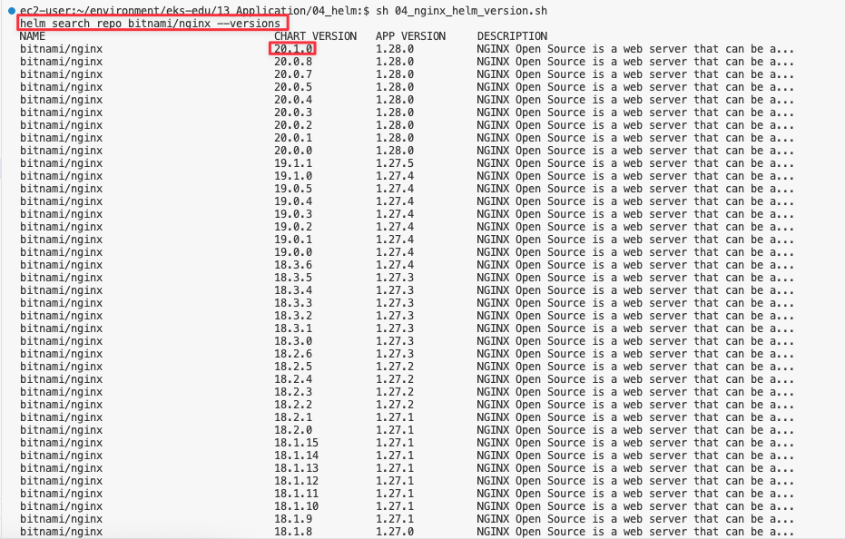

. 잘 수정되었는지 template 파일 생성해서 확인하기
+
[,shell]
----
cd ~/environment/eks-edu/13_Application/04_helm/
sh 05_nginx_template.sh <<Chart Version>>
----
+
위 ``05_nginx_template.sh``를 실행하면 ``tmp/custom_values.yaml`` 를 이용해서 배포할 yaml 정보를 보여준다.
+
.실행 화면
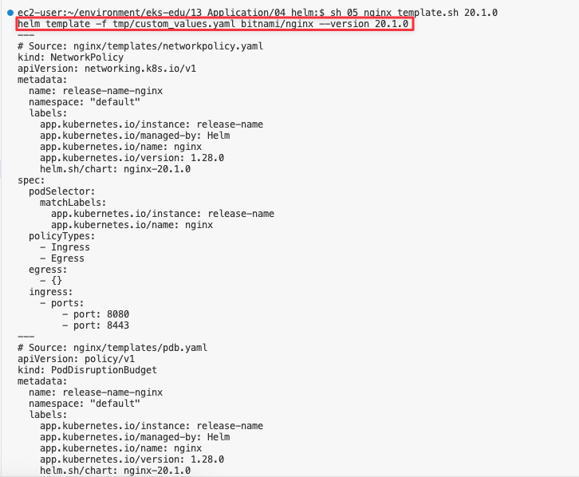

. Bitnami Nginx Helm Chart 설치
+
[,shell]
----
cd ~/environment/eks-edu/13_Application/04_helm/
sh 06_nginx_helm_install.sh <<Chart Version>>
----
+
.실행 화면
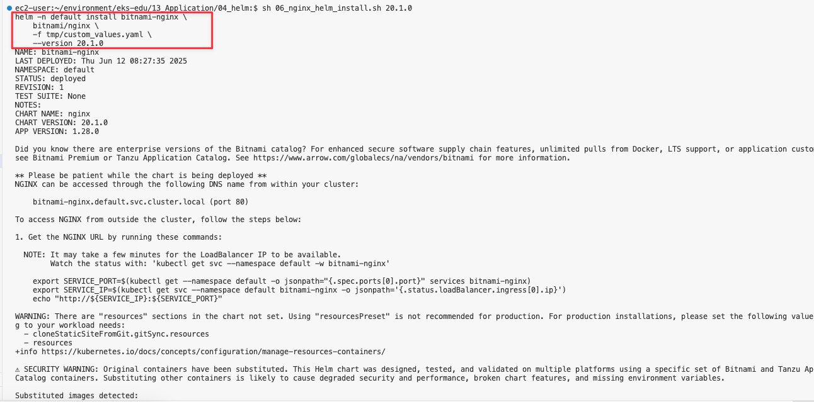

==== Blue/Green 배포 실습

. Blue deployment 배포
+
[,shell]
----
cd ~/environment/eks-edu/13_Application/05_blue_green/
sh 01_create_blue_deployment.sh
----
+
위 ``01_create_blue_deployment.sh``를 실행하면 Blue deployment를 배포한다.
+
.실행 화면
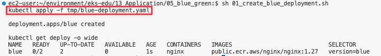

. Service 배포
+
[,shell]
----
cd ~/environment/eks-edu/13_Application/05_blue_green/
sh 03_create_service.sh
----
+
위 ``03_create_service.sh``를 실행하면 Blue deployment 연결된 Service를 배포한다.
+
.실행 화면
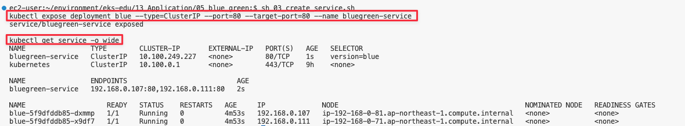

. Green Deployment 배포
+
[,shell]
----
cd ~/environment/eks-edu/13_Application/05_blue_green/
sh 06_create_green_deployment.sh
----
+
위 ``06_create_green_deployment.sh``를 실행하면 Green deployment를 배포한다.
+
.실행 화면
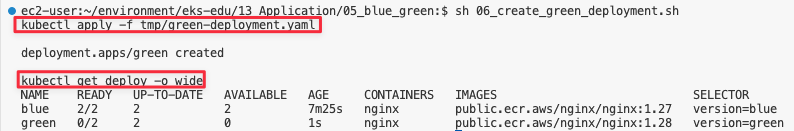

. Green Deployment로 트래픽 전환
+
[,shell]
----
cd ~/environment/eks-edu/13_Application/05_blue_green/
sh 06_create_green_deployment.sh
----
+
위 ``06_create_green_deployment.sh``를 실행하면 Green deployment를 배포한다.
+
.실행 화면
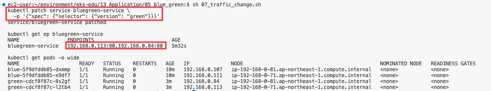

== 관련 링크

- [Kubernetes Object](https://kubernetes.io/docs/concepts/)