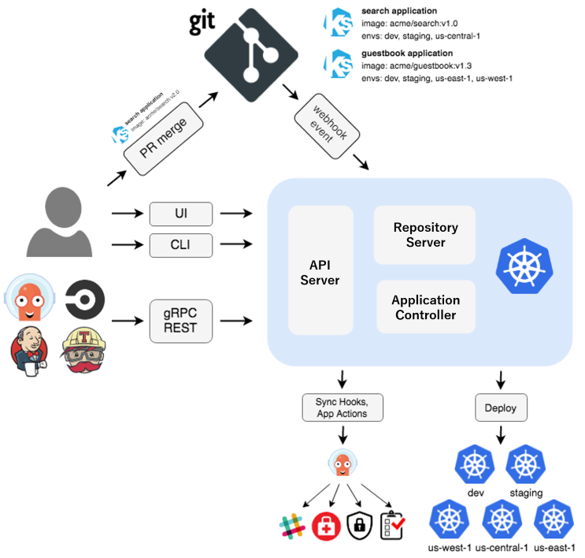

= 14. ArgoCD
// Settings:
:experimental:
:icons: font
:sectnums:
// :!sectids:
// Github?
ifdef::env-github[]
:tip-caption: :bulb:
:note-caption: :information_source:
:important-caption: :heavy_exclamation_mark:
:caution-caption: :fire:
:warning-caption: :warning:
endif::[]
// No Github?
ifndef::env-github[]
:toc: left
:toclevels: 4
:source-highlighter: highlight.js
endif::[]
:revealjsdir: https://cdn.jsdelivr.net/npm/reveal.js
:revealjs_showSlideNumber: all
:revealjs_hash: true
// Presentation 변환 참고용
// - https://asciidoc-slides.8vi.cat/
// - https://zenika.github.io/adoc-presentation-model/reveal-my-asciidoc.html

== 목표
- ArgoCD에 대해서 배우고, ArgoCD를 설치합니다.
- ArgoCD에 Application을 배포 실습 합니다.

== 사전 조건
. link:00_Setup/[0. 교육 환경 구성하기]를 이용해 기본 실습 환경 생성이 되어 있어야 합니다.
. link:00_Setup/[0. 교육 환경 구성하기]를 이용해 생성된 `code-server`에 접속한 상태여야 합니다.
. link:14_Application/[14. ArgoCD]에 00_pre_setup/01_install.sh 를 실행하여 EBS CSI DRiver/EFS CSI Driver Addon이 같이 설치된 EKS를 구축합니다.
[source,shell]
----
cd ~/environment/eks-edu/14_ArgoCD/00_pre_setup
sh 01_install.sh
----
. link:11_Network_2/[11. Network_2]에 `create-aws-lbc-irsa.sh`를 실행하여 AWS LBC Controller를 설치합니다.
[source,shell]
----
cd ~/environment/eks-edu/11_Network_2/
sh create-aws-lbc-irsa.sh

helm repo add eks https://aws.github.io/eks-charts
helm repo update eks

source ../env.sh

helm install aws-load-balancer-controller eks/aws-load-balancer-controller \
  -n kube-system \
  --set clusterName=$CLUSTER_NAME \
  --set serviceAccount.create=false \
  --set serviceAccount.name=aws-lbc-sa \
  --version 1.13.2
----
== 이론

=== Architecture

=== ArgoCD 기능
- 지정된 대상 환경으로의 애플리케이션 자동 배포
- Kustomize, Helm, Jsonnet, plain YAML 등 다양한 설정 관리 및 템플릿 도구 지원
- 여러 클러스터에 대한 관리 및 배포 기능
- OIDC, OAuth2, LDAP, SAML 2.0, GitHub, GitLab, Microsoft, LinkedIn 등과의 SSO(싱글 사인온) 연동
- 멀티 테넌시 및 RBAC(역할 기반 접근 제어) 정책을 통한 권한 관리
- Git 저장소에 커밋된 애플리케이션 구성으로의 롤백 및 임의 버전 롤포워드 지원
- 애플리케이션 리소스의 상태 및 헬스 분석 기능
- 구성 드리프트 자동 감지 및 시각화
- 애플리케이션을 원하는 상태로 자동 또는 수동 동기화
- 실시간 애플리케이션 활동을 확인할 수 있는 웹 UI 제공
- 자동화 및 CI 통합을 위한 CLI(Command Line Interface) 지원
- GitHub, BitBucket, GitLab과의 웹훅 연동
- 자동화를 위한 액세스 토큰 제공
- PreSync, Sync, PostSync 훅을 통한 블루/그린, 카나리 배포 등 복잡한 롤아웃 전략 지원
- 애플리케이션 이벤트 및 API 호출에 대한 감사 로그 제공
- Prometheus 기반의 모니터링 지표 제공
- Git 내 Helm 파라미터를 재정의할 수 있는 파라미터 오버라이드 기능 지원

=== Argo CD Component

.Component 종류
[%autowidth,cols="1s,a"]
|===
|이름 |설명

|Application Controller
|어플리케이션의 상태와 타켓 클러스터 상태 모니터링

|ApplicationSet Controller
|멀티 타겟용 어플리케이션 셋 관리

|Argo CD Server
|gRPC / Rest API 서버

|Repo Server
|Git Repo 동기화

|Dex Server
|OIDC 인증 관리

|Redis
|리소스 Caching

|Notifications Controller
|알림 관리
|===

== 실습
=== ArgoCD 서버 설치

=== User 등록

=== Repository 등록

=== Application 등록

== 관련 링크

- [ArgoCD 공식 문서](https://argo-cd.readthedocs.io/en/stable/)