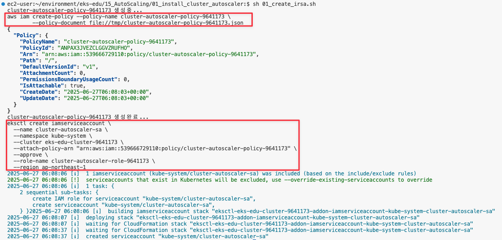
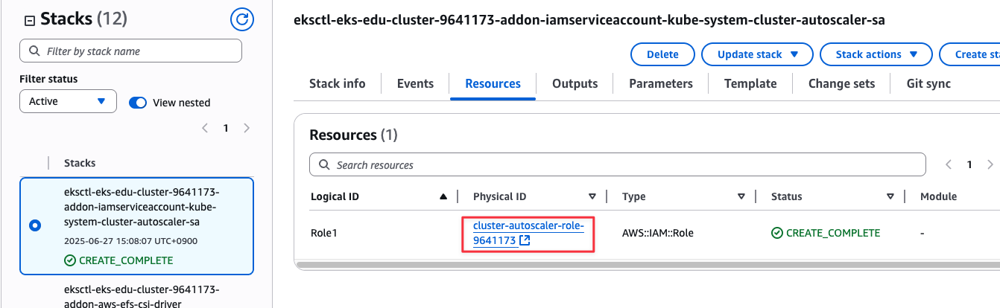
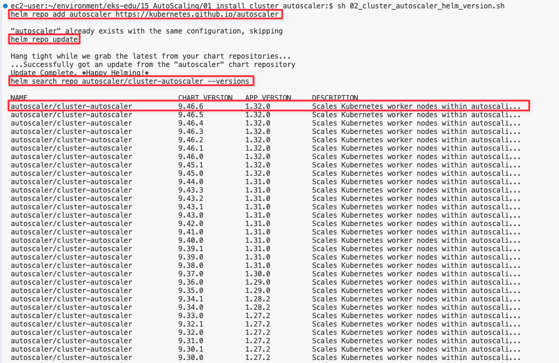

= 14. ArgoCD
// Settings:
:experimental:
:icons: font
:sectnums:
// :!sectids:
// Github?
ifdef::env-github[]
:tip-caption: :bulb:
:note-caption: :information_source:
:important-caption: :heavy_exclamation_mark:
:caution-caption: :fire:
:warning-caption: :warning:
endif::[]
// No Github?
ifndef::env-github[]
:toc: left
:toclevels: 4
:source-highlighter: highlight.js
endif::[]
:revealjsdir: https://cdn.jsdelivr.net/npm/reveal.js
:revealjs_showSlideNumber: all
:revealjs_hash: true
// Presentation 변환 참고용
// - https://asciidoc-slides.8vi.cat/
// - https://zenika.github.io/adoc-presentation-model/reveal-my-asciidoc.html

== 목표
- Cluster AutoScaler에 대해서 배웁니다.
- Horizontal Pod Autoscaler에 대해서 배웁니다.
- Vertical Pod Autoscaler에 대해서 배웁니다.

== 사전 조건
. link:00_Setup/[0. 교육 환경 구성하기]를 이용해 기본 실습 환경 생성이 되어 있어야 합니다.
. link:00_Setup/[0. 교육 환경 구성하기]를 이용해 생성된 `code-server`에 접속한 상태여야 합니다.
. link:14_Application/[14. ArgoCD]에 00_pre_setup/01_install.sh 를 실행하여 EBS CSI DRiver/EFS CSI Driver Addon이 같이 설치된 EKS를 구축합니다.
[source,shell]
----
cd ~/environment/eks-edu/15_AutoScaling/00_pre_setup
sh 03_install.sh
----

== 이론

=== Cluster AutoScaler
* Kubernetes Cluster Autoscaler는 SIG Autoscaling에서 유지 관리하는 인기 있는 클러스터 Autoscaling 솔루션
* Kubernetes Cluster Autoscaler는 다음 조건 중 하나가 충족될 때 Kubernetes 클러스터의 크기를 자동으로 조정합니다.
** 리소스가 부족하여 클러스터에서 실행에 실패하는 Pod가 있습니다.
** 클러스터 내에 장기간 활용도가 낮은 노드가 있는데, 해당 노드의 Pod를 다른 기존 노드에 배치할 수 있습니다.
* AWS용 Cluster Autoscaler는 Auto Scaling 그룹과의 통합을 제공

image::images/Cluster_Autoscaler_flow.png[Cluster AutoScaler 순서도]

CAUTION: `01-3_make_eksctl_cluster_nodegroup_pod_identity_template.sh` 사용 필수!!

=== Horizontal Pod Autoscaler

=== Vertical Pod Autoscaler

=== Karpenter

== 관련 링크
* Cluster Autoscaler : https://docs.aws.amazon.com/ko_kr/eks/latest/best-practices/cas.html
* AWS Cluster Autoscaler github : https://github.com/kubernetes/autoscaler/tree/master/cluster-autoscaler/cloudprovider/aws
* Scale with CA : https://www.eksworkshop.com/docs/autoscaling/compute/cluster-autoscaler/test-ca

== 실습

=== Cluster AutoScaler 설치
. IRSA Role 설정
+
[,shell]
----
cd ~/environment/eks-edu/15_AutoScaling/01_install_cluster_autoscaler
sh 01_create_irsa.sh
----
+
위 ``01_create_irsa.sh``를 실행하면 IRSA Role을 생성한다.(참고용)
+
[,shell]
----
aws iam create-policy --policy-name cluster-autoscaler-policy-9641173 \
        --policy-document file://tmp/cluster-autoscaler-policy-9641173.json

eksctl create iamserviceaccount \
  --name cluster-autoscaler-sa \
  --namespace kube-system \
  --cluster eks-edu-cluster-9641173 \
  --attach-policy-arn "arn:aws:iam::539666729110:policy/cluster-autoscaler-policy-9641173" \
  --approve \
  --role-name cluster-autoscaler-role-9641173 \
  --region ap-northeast-1
----
+
.실행 화면

+
.생성 결과 화면

. Helm Version 체크
+
[,shell]
----
cd ~/environment/eks-edu/15_AutoScaling/01_install_cluster_autoscaler
sh 02_helm_version.sh
----
+
위 ``01_create_irsa.sh``를 실행하면 IRSA Role을 생성한다.(참고용)
+
[,shell]
----
helm repo add autoscaler https://kubernetes.github.io/autoscaler

helm repo update

helm search repo autoscaler/cluster-autoscaler --versions
----
+
.실행 화면

CAUTION: App Version이 EKS의 버전과 매칭되어야 한다.

. Cluster Autoscaler Helm Chart 설치
+
[,shell]
----
cd ~/environment/eks-edu/15_AutoScaling/01_install_cluster_autoscaler
sh 03_install.sh
----
+
위 ``03_install.sh``를 실행하면 ``tmp/cluster_autoscaler_value.yaml`` 를 생성해서 ``helm install``을 수행한다. +
아래 내용이 value 내용이다.
+
[,yaml]
----
autoDiscovery:
  clusterName: eks-edu-cluster-9641173
awsRegion: ap-northeast-1
containerSecurityContext:
  capabilities:
    drop:
    - ALL
extraArgs:
  logtostderr: true
  stderrthreshold: info
  v: 4
  skip-nodes-with-local-storage: false
  expander: least-waste
extraVolumeMounts:
- mountPath: /etc/ssl/certs/ca-certificates.crt
  name: ssl-certs
  readOnly: true
extraVolumes:
- hostPath:
    path: /etc/ssl/certs/ca-bundle.crt
  name: ssl-certs
fullnameOverride: cluster-autoscaler
image:
  repository: registry.k8s.io/autoscaling/cluster-autoscaler
  tag: v1.32.0
rbac:
  create: true
  pspEnabled: false
  serviceAccount:
    annotations:
      eks.amazonaws.com/role-arn: arn:aws:iam::539666729110:role/cluster-autoscaler-role-9641173
    automountServiceAccountToken: true
    create: false
    name: cluster-autoscaler-sa
replicaCount: 1
resources:
  limits:
    cpu: 100m
    memory: 600Mi
  requests:
    cpu: 100m
    memory: 600Mi
securityContext:
  runAsGroup: 1001
  runAsNonRoot: true
  runAsUser: 1001
serviceMonitor:
  enabled: false
  interval: 15s
  namespace: kube-system
  path: /metrics

----
+
.실행 화면

+
.생성 결과 화면

