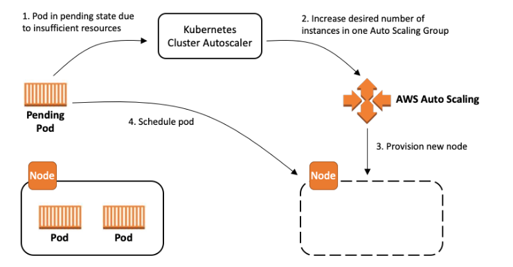

= 14. ArgoCD
// Settings:
:experimental:
:icons: font
:sectnums:
// :!sectids:
// Github?
ifdef::env-github[]
:tip-caption: :bulb:
:note-caption: :information_source:
:important-caption: :heavy_exclamation_mark:
:caution-caption: :fire:
:warning-caption: :warning:
endif::[]
// No Github?
ifndef::env-github[]
:toc: left
:toclevels: 4
:source-highlighter: highlight.js
endif::[]
:revealjsdir: https://cdn.jsdelivr.net/npm/reveal.js
:revealjs_showSlideNumber: all
:revealjs_hash: true
// Presentation 변환 참고용
// - https://asciidoc-slides.8vi.cat/
// - https://zenika.github.io/adoc-presentation-model/reveal-my-asciidoc.html

== 목표
- Cluster AutoScaler에 대해서 배웁니다.
- Horizontal Pod Autoscaler에 대해서 배웁니다.
- Vertical Pod Autoscaler에 대해서 배웁니다.

== 사전 조건
. link:00_Setup/[0. 교육 환경 구성하기]를 이용해 기본 실습 환경 생성이 되어 있어야 합니다.
. link:00_Setup/[0. 교육 환경 구성하기]를 이용해 생성된 `code-server`에 접속한 상태여야 합니다.
. link:14_Application/[14. ArgoCD]에 00_pre_setup/01_install.sh 를 실행하여 EBS CSI DRiver/EFS CSI Driver Addon이 같이 설치된 EKS를 구축합니다.
[source,shell]
----
cd ~/environment/eks-edu/15_AutoScaling/00_pre_setup
sh 02_install.sh
----

== 이론

=== Cluster AutoScaler
* Kubernetes Cluster Autoscaler는 SIG Autoscaling에서 유지 관리하는 인기 있는 클러스터 Autoscaling 솔루션
* Kubernetes Cluster Autoscaler는 다음 조건 중 하나가 충족될 때 Kubernetes 클러스터의 크기를 자동으로 조정합니다.
** 리소스가 부족하여 클러스터에서 실행에 실패하는 Pod가 있습니다.
** 클러스터 내에 장기간 활용도가 낮은 노드가 있는데, 해당 노드의 Pod를 다른 기존 노드에 배치할 수 있습니다.
* AWS용 Cluster Autoscaler는 Auto Scaling 그룹과의 통합을 제공

CAUTION: `01-3_make_eksctl_cluster_nodegroup_pod_identity_template.sh` 사용 필수!!

=== Horizontal Pod Autoscaler

=== Vertical Pod Autoscaler

== 관련 링크
* Cluster Autoscaler : https://docs.aws.amazon.com/ko_kr/eks/latest/best-practices/cas.html
* AWS Cluster Autoscaler github : https://github.com/kubernetes/autoscaler/tree/master/cluster-autoscaler/cloudprovider/aws
* Scale with CA : https://www.eksworkshop.com/docs/autoscaling/compute/cluster-autoscaler/test-ca

== 실습

=== Cluster AutoScaler 설치
