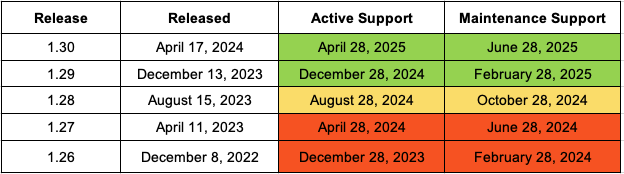
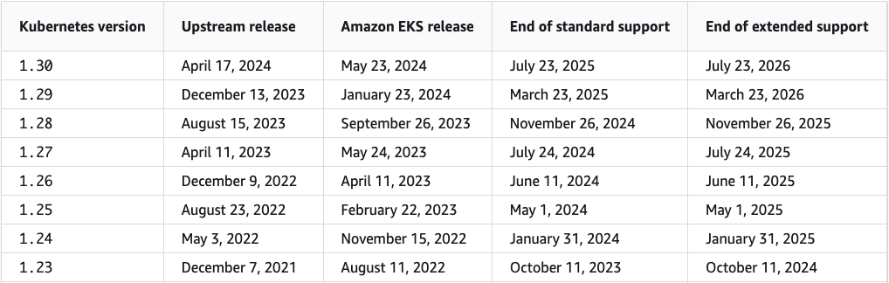

= 17. EKS Upgrade
// Settings:
:experimental:
:icons: font
:sectnums:
// :!sectids:
// Github?
ifdef::env-github[]
:tip-caption: :bulb:
:note-caption: :information_source:
:important-caption: :heavy_exclamation_mark:
:caution-caption: :fire:
:warning-caption: :warning:
endif::[]
// No Github?
ifndef::env-github[]
:toc: left
:toclevels: 4
:source-highlighter: highlight.js
endif::[]
:revealjsdir: https://cdn.jsdelivr.net/npm/reveal.js
:revealjs_showSlideNumber: all
:revealjs_hash: true
// Presentation 변환 참고용
// - https://asciidoc-slides.8vi.cat/
// - https://zenika.github.io/adoc-presentation-model/reveal-my-asciidoc.html

== 목표
- In-place 클러스터 업그레이드 전략과 Blue-Green 클러스터 업그레이드 전략의 차이점을 숙지
- In-place 클러스터 업그레이드를 실습

== 사전 조건

1. link:00_Setup/[0. 교육 환경 구성하기]를 이용해 기본 실습 환경 생성이 되어 있어야 합니다.
2. link:00_Setup/[0. 교육 환경 구성하기]를 이용해 생성된 `code-server`에 접속한 상태여야 합니다.
3. link:12_Storage_Management/[12. Storage 관리]에 00_pre_setup/01_install.sh 를 실행하여 EBS CSI Driver/EFS CSI Driver Addon이 같이 설치된 EKS를 구축합니다.

[source,shell]
----
cd ~/environment/eks-edu/12_Storage_Management/00_pre_setup
sh 01_install.sh
----

== 이론
=== 쿠퍼네티스 릴리스 주기
* 쿠버네티스 프로젝트는 새로운 기능, 최신 보안 패치 및 버그 수정으로 지속적으로 업데이트됩니다.
* 쿠버네티스 버전 시맨틱을 처음 접하시는 분들을 위해 시맨틱 버전 관리(Semantic Versioning)를 소개합니다. +
용어이며 일반적으로 xyz 로 표현됩니다 . +
여기서 x 는 주 버전, y 는 부 버전, z는 패치 버전입니다.
* 새로운 쿠버네티스 **부 버전( y )은 약 4개월마다 출시되며, v1.19 이상의 모든 버전은 12개월 동안 표준 지원을 제공**합니다. 즉, 한 번에 최소 3개의 부 버전에 대한 표준 지원을 제공합니다. 쿠버네티스 프로젝트는 최근 3개의 부 릴리스에 대한 릴리스 브랜치를 유지 관리됩니다.



== Amazon EKS 출시 일정 및 지원
* Amazon Elastic Kubernetes Service(EKS)는 쿠버네티스 프로젝트 릴리스 주기를 따르지만, **Amazon EKS에서 처음 출시된 후 14개월 동안 한 번에 4개의 마이너 버전에 대한 표준 지원을 제공**합니다.
* 최신 EKS 버전의 릴리스가 Kubernetes 버전보다 몇 주 정도 늦어지는 이유가 궁금하시다면, Amazon이 새로운 Kubernetes 버전을 Amazon EKS에 출시하기 전에 안정성과 다른 AWS 서비스 및 도구와의 호환성을 철저히 테스트하기 때문입니다.
* Amazon EKS는 표준 지원 외에도 최근 확장 지원 기능을 출시했습니다. 장 지원은 표준 지원 종료 직후 자동으로 시작되어 12개월 더 연장되어 각 쿠버네티스 마이너 버전에 대한 지원 기간이 총 26개월로 늘어납니다. ( 클러스터당 시간당 $0.10 -> $0.60 )



== 고려해야 하는 사항
* PodDisruptionBudget
* [토폴로지 스프레드 제약 조건](https://kubernetes.io/docs/concepts/scheduling-eviction/topology-spread-constraints/)
* EKS AutoMode
** 자동으로 제공되는 기능
*** pod networking
*** service networking
*** Cluster DNS
*** Autoscaling
*** Block storage
*** Load balancer controller
*** Pod Identity agent
*** Node monitoring agent
** 자동 제공되는 Addon
*** Amazon VPC CNI
*** kube-proxy
*** coreDNS
*** Amazon EBS CSI Driver
*** EKS Pod Id agent

== 업그레이드 전략
=== In-place 클러스터 업그레이드
=== Blue-green 클러스터 업그레이드

== EKS 업그레이드 절차
. 준비
.. 표준 지원에 대한 Kubernetes 버전에 대한 릴리스 노트 검토 ( https://docs.aws.amazon.com/eks/latest/userguide/kubernetes-versions-standard.html )
.. 사용 중단 정책 이해 ( https://kubernetes.io/docs/reference/using-api/deprecation-policy/ )
.. Kubernetes 변경 로그 검토 ( https://github.com/kubernetes/kubernetes/tree/master/CHANGELOG )
.. 클러스터 addon 기능 호환성 평가 ( https://docs.aws.amazon.com/eks/latest/userguide/eks-add-ons.html#updating-an-add-on )
.. 제어 플레인 로깅 활성화 ( 제어 플레인 로깅을 활성화하여 업그레이드 프로세스 중 발생할 수 있는 로그, 오류 또는 문제를 캡처하세요.)
.. 클러스터 관리를 위해 eksctl을 탐색하세요.
.. AutoMode 또는 관리형 노드 그룹을 선택하세요.
.. kubectl convert 플러그인 활용 ( https://kubernetes.io/docs/tasks/tools/install-kubectl-linux/#install-kubectl-convert-plugin )
. 사전 백업
.. Velero 로 기존 클러스터의 백업 수행
. EKS Control Plane 업그레이드
. Add on 업그레이드
. EKS Data Plane 업그레이드

== EKS 업그레이드 실습

=== 사전 체크 사항

==== Golden Image가 존재하는지 체크 ( Nodegroup )
. <GOLDEN-AMI-ID> 가 존재하는지 체크를 한다.
```
cd 00_resource_check
sh 04_find_golden_image.sh <GOLDEN-AMI-ID>
```

== 관련 링크
- [Amazon EKS 업그레이드](https://eks-upgrades-workshop.netlify.app/docs/upgrading-control-plane)
- [Amazon EKS Upgrades:Strategies and Best Practics](https://catalog.us-east-1.prod.workshops.aws/workshops/693bdee4-bc31-41d5-841f-54e3e54f8f4a/en-US)