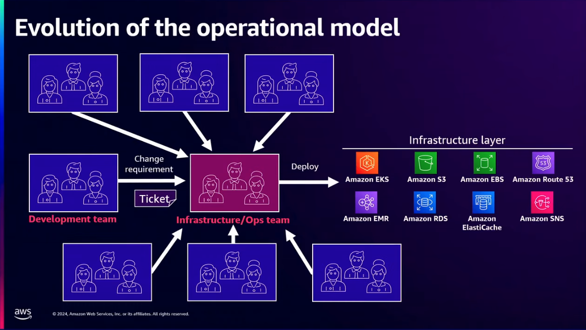
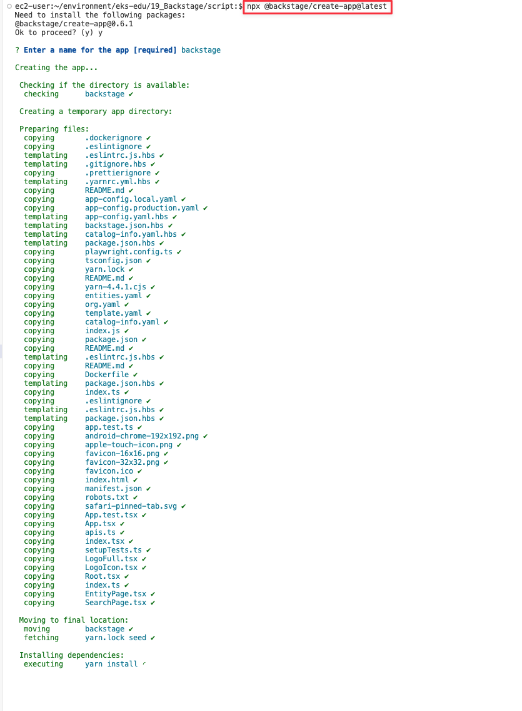

= 19. Backstage
// Settings:
:experimental:
:icons: font
:sectnums:
// :!sectids:
// Github?
ifdef::env-github[]
:tip-caption: :bulb:
:note-caption: :information_source:
:important-caption: :heavy_exclamation_mark:
:caution-caption: :fire:
:warning-caption: :warning:
endif::[]
// No Github?
ifndef::env-github[]
:toc: left
:toclevels: 4
endif::[]
:revealjsdir: https://cdn.jsdelivr.net/npm/reveal.js
:revealjs_showSlideNumber: all
:revealjs_hash: true
// Presentation 변환 참고용
// - https://asciidoc-slides.8vi.cat/
// - https://zenika.github.io/adoc-presentation-model/reveal-my-asciidoc.html

// [#goals]
== 학습 목표
* Backstage의 개념을 이해합니다.
* Backstage에 Github 인증 처리를 할수 있습니다.
* 간단한 FastAPI Python App을 Backstage의 Backstage Software Template / Backstage Software Catalog 를 구축하여 자동 배포환경을 생성하는 법을 배웁니다.

// [#prerequisite]
== 사전 조건
1. link:../00_Setup/[0. 교육 환경 구성하기]를 이용해 기본 실습 환경 생성이 되어 있어야 합니다.
2. link:../00_Setup/[0. 교육 환경 구성하기]를 이용해 생성된 `code-server`에 접속한 상태여야 합니다.
3. link:../03_Default_Environment[3. 기본 환경 생성]을 참고하여 아래와 같이 vpc와 eks를 배포해야 합니다.
4. link:../11_Network_2[11. 네트워크 관리 2]을 참고하여 AWS Loadbalancer Controller가 설치되어 있어야 합니다.
5. link:../14_Application[[14. Application 배포 - 고급]을 참고하여 Argo CD가 설치되어 있어야 합니다.
+
[source,shell]
----
cd ~/environment/eks-edu/03_Default_Environment/01_create_vpc
sh 01_default_vpc.sh

cd ../02_create_eks
sh 01-3_make_eksctl_cluster_nodegroup_pod_identity_template.sh
sh 02_eksctl_install.sh
----

== Backstage 란?

=== Backstage가 필요로한 이유

Backstage의 혜택

. 엔지니어링 매니저에게는, 조직 전체에서 표준과 모범 사례를 유지할 수 있게 해주며, 마이그레이션부터 테스트 인증에 이르기까지 **전체 기술 생태계를 관리하는 데 도움**이 됩니다.
. 최종 사용자(개발자)에게는, 소프트웨어 구성 요소를 표준화된 방식으로 빠르고 간편하게 구축할 수 있도록 해주며, 모든 프로젝트와 문서를 중앙에서 관리할 수 있는 공간을 제공합니다.
. 플랫폼 엔지니어에게는, 새로운 도구와 서비스를 플러그인 형태로 쉽게 통합하거나 기존 기능을 확장할 수 있어 확장성과 유연성을 제공합니다.
. 모든 사용자에게는, 인프라 도구, 리소스, 표준, 소유자, 기여자, 관리자 등을 하나의 장소에서 통합하는 일관된 사용자 경험을 제공합니다.

=== Backstage의 주요 요소
. 모든 소프트웨어(마이크로서비스, 라이브러리, 데이터 파이프라인, 웹사이트, ML 모델 등)를 관리하기 위한 *Backstage 소프트웨어 카탈로그*
. 조직의 모범 사례에 맞춰 새로운 프로젝트를 빠르게 시작하고 툴을 표준화하기 위한 Backstage *소프트웨어 템플릿*
. "코드와 같은 문서" 접근 방식을 사용하여 기술 문서를 쉽게 만들고, 유지 관리하고, 찾고, 사용할 수 있도록 해주는 *Backstage TechDocs*
. Backstage의 사용자 정의 가능성과 기능을 더욱 확장하는 https://backstage.io/docs/overview/what-is-backstage[오픈 소스 플러그인] 의 성장하는 생태계

== Backstage 설치

Backstage Standalone 앱 설치
[source,shell]
----
npx @backstage/create-app@latest
----

=== 개발 환경 사전 요건

. Linux, macOS 또는 Windows Subsystem for Linux 와 같은 Unix 기반 운영 체제에 대한 액세스
. curl 또는 wget 설치됨
. Node 20 설치 ( nvm 이용 )
. yarn 설치
. docker 설치
. git 설치

=== 관련 링크
. Creating your Backstage App : https://backstage.io/docs/getting-started/

== Backstage 인증

=== 지원 인증 공급자
. https://backstage.io/docs/auth/auth0/provider/[AuthO]
. https://backstage.io/docs/auth/atlassian/provider/[Atlassian]
. https://backstage.io/docs/auth/microsoft/provider/[Azure]
. https://backstage.io/docs/auth/microsoft/easy-auth/[Azure Easy Auth]
. https://backstage.io/docs/auth/bitbucket/provider/[Bitbucket]
. https://backstage.io/docs/auth/bitbucketServer/provider/[Bitbucket Server]
. https://backstage.io/docs/auth/cloudflare/provider/[Cloudflare Access]
. https://backstage.io/docs/auth/github/provider/[GitHub]
. https://backstage.io/docs/auth/gitlab/provider/[GitLab]
. https://backstage.io/docs/auth/google/provider/[Google]
. https://backstage.io/docs/auth/google/gcp-iap-auth/[Google IAP]
. https://backstage.io/docs/auth/okta/provider/[Okta]
. https://backstage.io/docs/auth/oauth2-proxy/provider/[OAuth 2 Custom Proxy]
. https://backstage.io/docs/auth/onelogin/provider/[OneLogin]
. https://backstage.io/docs/auth/vmware-cloud/provider/[VMWare Cloud]

=== GitHub 연동

=== 관련 링크

. Authentication : https://backstage.io/docs/getting-started/config/authentication/
. Authentication in Backstage : https://backstage.io/docs/auth/

== Backstage Software Catalog

== Backstage TechDocs

== Backstage Software Template

== Kubernets에 Backstage 배포

-=-=-=-=-=-=-=-=-=-=-=-=-=-=-=-=-=-=-=-=-=-=-=-=-=-=-=-=-=-=-=-=-=-=-=-=-=-=-=-=-=-=
== Kubernetes 노드 구성 요소
// [%header%footer%autowidth]
[%autowidth,cols="1s,a"]
|===
|구성 요소 |설명

|kubelet
|* 각 노드에서 실행되는 *노드 에이전트*
* 컨테이너가 제공된 Pod 스펙(PodSpec)에 따라 정상 실행되도록 관리

|kube-proxy
|* 각 노드에서 실행되는 네트워크 프록시
* 노드의 네트워크 규칙을 관리
* 내/외부 네트워크 세션에 대한 포워딩을 처리

|Container Runtime
|* 컨테이너 실행을 담당하는 소프트웨어
* *containerd*, CRI-O, Docker 등이 대표적 footnote:[`Docker` 는 Kubernetes 1.24 부터 https://kubernetes.io/blog/2022/02/17/dockershim-faq/[지원 중단됨]]
* 컨테이너 이미지를 다운로드하고 실행하는 역할 수행
|===

== Amazon EKS 노드 관리 개요

Amazon EKS 클러스터는 다음 5가지 유형으로 노드를 관리할 수 있습니다.

. 관리형 노드 그룹 (Managed Node Groups)
. 자체 관리형 노드 (Self-managed nodes)
. AWS Fargate
. EKS Auto Mode
. Amazon EKS Hybrid Nodes

=== 관리형 노드 그룹 (Managed Node Groups)
관리형 노드 그룹은 Amazon EKS에서 Kubernetes 노드로 사용하는 Amazon EC2 인스턴스를 논리적으로 구분한 개념으로 노드 그룹을 통해 워크로드에 맞는 컴퓨팅 리소스 구성이 가능합니다.

.관리형 노드 그룹 특징
[%autowidth,cols="1s,a"]
|===
|특징 | 설명

|노드 관리 방식
|* AWS가 노드의 프로비저닝과 수명 주기를 관리
* 여러개의 관리형 노드 그룹 사용 가능
* Auto Scaling 그룹(ASG) 기반으로 동작

| 손쉬운 관리
|* 노드 업데이트 및 패치 자동화 지원
* 손쉬운 버전 업그레이드 기능 제공
|===

=== https://docs.aws.amazon.com/ko_kr/eks/latest/userguide/worker.html[자체 관리형 노드 (Self-managed nodes)]
자체 관리형 노드는 사용자가 노드의 프로비저닝과 수명 주기를 직접 관리하는 방식으로, 관리형 노드 그룹보다 사용자 정의가 가능하지만 [.underline]*운영 부담이 큽니다.*

즉, 노드 업데이트, 스케일링, 복구 등을 직접 관리해야 하기 때문에 운영 비용과 복잡성이 증가할 수 있어, *관리형 노드 그룹* 또는 *Fargate* 를 사용하는 것이 일반적입니다.

이 방식은 GPU나 커스텀 AMI 등 특별한 요구사항이 있는 워크로드에 적합합니다.

.자체 관리형 노드 특징
[%autowidth,cols="1s,a"]
|===
|특징 | 설명

|노드 관리 방식
|* 사용자가 직접 노드를 관리

|적합한 워크 로드
|* GPU 기반 머신러닝/딥러닝 워크로드
* 특정 커널 버전이나 드라이버가 필요한 워크로드
* 특수한 네트워킹 구성이 필요한 워크로드
* 커스텀 AMI가 필요한 워크로드
* 규제 준수를 위해 특별한 보안 설정이 필요한 워크로드

|사용자 정의 옵션 사용 가능
|* 보안 그룹 구성
* IAM 역할 및 정책 적용
* kubelet 구성
* 시작 템플릿 사용
* 스토리지 구성
* 네트워킹 설정(CNI 플러그인)
* 노드 레이블 및 테인트 설정
|===

=== AWS Fargate

AWS Fargate는 컨테이너에 대한 적정 규모의 온디맨드 컴퓨팅 용량을 제공하는 기술입니다.

서버리스 컴퓨팅 엔진으로 컨테이너가 실행되어 인프라 관리가 필요없으며, Pod 단위로 리소스 할당 및 과금이 되어 사용한 만큼만 비용이 측정됩니다.

.AWS Fargate 주요 특징
[%autowidth,cols="1s,2a"]
|===
|특징 |설명

| 노드 관리
|* 자동 확장/축소

|보안
|* Pod 격리
* 보안 패치 자동화

|비용 효율성
|* 사용한 만큼만 지불

|적합한 워크로드
|* 가변적인 워크로드
* 마이크로서비스
* 배치 처리
* 개발/테스트 환경
|===

=== EKS Auto Mode
* EKS 클러스터의 노드를 자동으로 관리하는 모드
* 워크로드 요구사항에 따라 자동으로 노드 수를 조정

.EKS Auto Mode 주요 특징
[cols="1s,4a"]
|===
|특징 |설명

| 클러스터 관리 간소화
|
* 운영 오버헤드를 최소화하면서 프로덕션 지원 클러스터를 제공
* EKS에 대한 전문 지식 없이도 까다롭고 동적인 워크로드를 안정적으로 실행

| 애플리케이션 가용성
|
* 애플리케이션의 요구에 따라 노드를 동적으로 추가하거나 제거 가능
* Manual 용량 계획의 필요성을 최소화하고 애플리케이션 가용성 보장

| 관리형 컴포넌트 +
(핵심 Addon 불필요)
|
* Kubernetes 및 AWS 클라우드 기능 사용을 위한 추가 기능(Addon) 관리 자동화 (VPC,CoreDNS,EBS, ELB)

| 효율성
|
* https://karpenter.sh/docs/[Kerpenter]가 기본 탑재되어 NodePool 및 워크로드 요구 사항에 정의된 유연성을 주수하여 비용을 최적화하도록 설계
* 미사용 인스턴스를 종료하고 워크로드를 다른 노드로 통합하여 비용 효율성 개선

| 자동 업그레이드
| * 포드 중단 예산(PDB:Pod Disruption Budget) 및 +
NodePool 중단 예산(NodePool Disruption Budget)을 준수하면서 최신 패치를 사용하여 최신 상태로 유지

| 보안
| * 노드에 대해 변경 불가능한 AMI를 사용.
* SELinux 필수 접근 제어 활성화 및 읽기 전용 루트 파일 시스템 제공.
* EKS Auto Mode로 시작된 노드의 최대 수명은 21일(조정 가능)이며, 그 후에는 새 노드로 자동 대체됨

|적합한 워크로드
|
** 변동성이 큰 워크로드
** 다양한 컴퓨팅 요구사항
** 비용 효율성이 중요한 워크로드
|===

=== 노드 관리 모범 사례
* 적절한 인스턴스 유형 선택
* 가용성 영역 분산 배치
* 리소스 모니터링 설정
* 정기적인 업데이트 계획 수립
