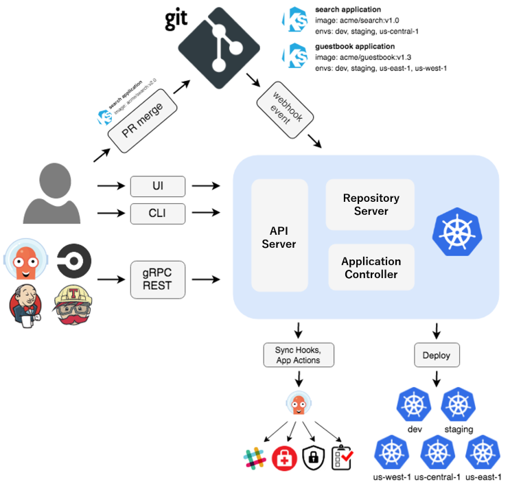
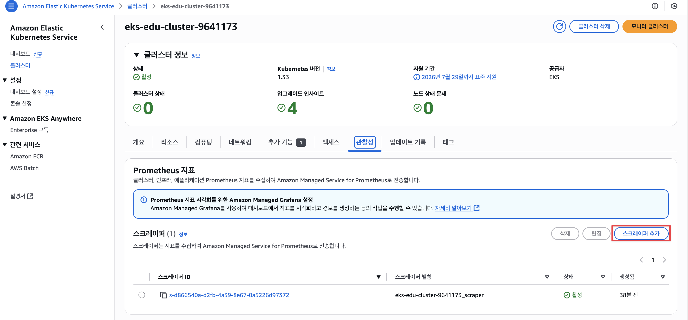

= 12장 ~ 20장 요약
// Settings:
:experimental:
:icons: font
:sectnums:
// :!sectids:
// Github?
ifdef::env-github[]
:tip-caption: :bulb:
:note-caption: :information_source:
:important-caption: :heavy_exclamation_mark:
:caution-caption: :fire:
:warning-caption: :warning:
endif::[]
// No Github?
ifndef::env-github[]
:toc: left
:toclevels: 4
:source-highlighter: highlight.js
endif::[]
:revealjsdir: https://cdn.jsdelivr.net/npm/reveal.js
:revealjs_showSlideNumber: all
:revealjs_hash: true
// Presentation 변환 참고용
// - https://asciidoc-slides.8vi.cat/
// - https://zenika.github.io/adoc-presentation-model/reveal-my-asciidoc.html

== 12장 Storage 관리

=== 볼륨이 중요한 이유
- 데이터 지속성 : **컨테이너의 디스크 파일은 임시적이기 때문에 컨테이너에서 실행되는 애플리케이션에 몇 가지 문제가 발생**할 수 있습니다. +
  **컨테이너가 충돌하거나 중지되면 컨테이너 상태가 저장되지 않아 컨테이너 수명 동안 생성되거나 수정된 모든 파일이 손실되는 문제가 발생**합니다. 충돌 후 kubelet은 컨테이너를 깨끗한 상태로 다시 시작합니다.
- 공유 스토리지: 여러 컨테이너가 실행 중이고 Pod 파일을 공유해야 할 때 또 다른 문제가 발생합니다. 모든 컨테이너에서 공유 파일 시스템을 설정하고 액세스하는 것은 어려울 수 있습니다.

=== 볼륨의 종류
==== 임시 볼륨 설명
- 추가 스토리지가 필요하지만, 재시작 시에도 데이터가 영구적으로 저장되는지는 중요하지 않는 경우

    예)  캐싱 서비스는 메모리 크기에 제한을 받는 경우가 많으며, 전체 성능에 거의 영향을 주지 않으면서 자주 사용되지 않는 데이터를 메모리보다 느린 스토리지로 옮길 수 있습니다

- Pod의 수명 주기를 따르고 Pod와 함께 생성 및 삭제되므로, 영구 볼륨을 사용할 수 있는 위치에 제한받지 않고 Pod를 중지하고 다시 시작할 수 있습니다.

==== 영구 볼륨
===== 영구 볼륨이란?
- 개별 Pod와는 별개로 독립적인 수명주기를 가지고 있다.

===== 영구 볼륨 종류
* EBS CSI Driver
** AZ에 종속성
* EFS CSI Driver
** 성능 이슈
* Mountpoint for Amazon S3
** Read Only 용

==== Static Provisioning 과 Dynamic Provisioning
- static Provisioning

image::../12_Storage_Management/image/Static_Provisioning_draw.svg[Static Provisioning]

- dynamic Provisining

image::../12_Storage_Management/image/Dynamic_Provisioning_draw.svg[Dynamic Provisioning]

=== 과제
* EBS Dynamic Provisioning을 설정할 수 있는가?
* EBS Static Provisioning을 설정할 수 있는가?
* EFS Dynamic Provisioning을 설정할 수 있는가?
* EFS Static Provisioning을 설정할 수 있는가?
* Dynamic Provisioning으로 만들어진 EBS Volume을 신규 EKS에 이전할 수 있는가?

== 13장 Application

=== 파이널라이저
파이널라이저는 쿠버네티스가 오브젝트를 완전히 삭제하기 이전, 삭제 표시를 위해 특정 조건이 충족될 때까지 대기하도록 알려주기 위한 네이스페이스에 속한 키이다.

리소스를 삭제하려 할 때는 삭제 요청을 처리하는 API 서버가 ``finalizers`` 필드의 값을 인식하고 다음을 수행
- 삭제를 시작한 시간과 함께 ``metadata.deletionTimestamp`` 필드를 추가하도록 오브젝트를 수정한다.
- 오브젝트의 ``metadata.finalizers`` 필드가 비워질 때까지 오브젝트가 제거되지 않도록 한다.

파이널라이저의 일반적인 예로 ``퍼시스턴트 볼륨`` 오브젝트가 실수로 삭제되는 것을 방지하는 ``kubernetes.io/pv-protection`` 가 있다.
파드가 ``퍼시스턴트 볼륨`` 오브젝트를 사용 중일 때 쿠버네티스틑 ``pv-protection`` 파이널라이저를 추가한다.
``퍼시스턴트 볼륨``을 삭제하려 하면 ``Terminating`` 상태가 되지만 파이널라이저가 존재하기 때문에 컨트롤러가 삭제할 수 없다. 파드가 ``퍼시스턴트 볼륨``의 사용을 중지하면 쿠버네티스가 ``pv-protection`` 파이널 라이저를 해제하고 컨트롤러는 볼륨을 삭제한다.

=== 프로브 종류
- livenessProbe : 컨테이너가 동작 중인지 여부를 나타낸다. liveness probe가 실패한다면, kubelet은 컨테이너를 죽이고, 해당 컨테이너는 재시작 정책 대상이 된다.
- readinessProbe : 컨테이너가 요청을 처리할 준비가 되었는지 여부를 나타낸다. 만약 readiness probe가 실패한다면, 엔드포인트 컨트롤러는 파드에 연관된 모든 서비스들의 엔드포인트에서 파드의 IP주소를 제거한다.
- startupProbe : 컨터에너 내의 애플리케이션이 시작되었는지를 나타낸다. startup probe가 주어진 경우, 성공할 때까지 다른 나머지 프로브는 활성화 되지 않는다. 만약 스타트업 프로브가 실패하면, kubelet이 컨테이너를 죽이고, 컨테이너는 재시작 정책에 따라 처리된다. ( 대량의 데이터 로딩, 구성 파일 또는 마이그레이션에 대한 작업 수행 )

=== 컨테이너 프로브 체크 종류
- exec : 컨테이너 내에서 지정된 명령어를 실행한다. 명령어가 상태 코드 0으로 종료되면 진단이 성공한 것으로 간주한다.
- grpc : gRPC를 사용하여 원격 프로시저 호출을 수행한다. 체크 대상이 gRPC 헬스 체크를 구현해야 한다.
- httpGet : 지정한 포트 및 경로에서 컨테이너의 IP주소에 대한 HTTP GET 요청을 수행한다. 응답의 상태 코드가 200이상 400미만이면 진단이 성공한 것으로 간주한다.
- tcpSocket : 지정된 포트에서 컨테이너의 IP주소에 대해 TCP 검사를 수행한다. 포트가 활성화되어 있다면 진단이 성공한 것으로 간주한다.

=== Pod Distruption Budgets
애플리케이션이 **동시에 겪는 중단 수를 제한하여 가용성을 높이는 방법**을 보여준다.

Kubernetes 서버는 버전 v1.21 이상이어야 한다.

- 예시

https://kubernetes.io/ko/docs/concepts/workloads/pods/disruptions/#pdb-example

== ArgoCD

=== Architecture

=== ArgoCD 기능
- **지정된 대상 환경으로의 애플리케이션 자동 배포**
- **Kustomize, Helm, plain YAML**,Jsonnet 등 다양한 설정 관리 및 템플릿 도구 지원
- **여러 클러스터에 대한 관리 및 배포** 기능
- OIDC, OAuth2, LDAP, SAML 2.0, GitHub, GitLab, Microsoft, LinkedIn 등과의 **SSO(싱글 사인온) 연동**
- 멀티 테넌시 및 **RBAC(역할 기반 접근 제어) 정책을 통한 권한 관리**
- Git 저장소에 커밋된 애플리케이션 구성으로의 롤백 및 임의 버전 롤포워드 지원
- **애플리케이션 리소스의 상태 및 헬스 분석** 기능
- 구성 드리프트 자동 감지 및 시각화
- 애플리케이션을 원하는 상태로 자동 또는 수동 동기화
- 실시간 애플리케이션 활동을 확인할 수 있는 웹 UI 제공
- 자동화 및 CI 통합을 위한 CLI(Command Line Interface) 지원
- GitHub, BitBucket, GitLab과의 웹훅 연동
- 자동화를 위한 액세스 토큰 제공
- PreSync, Sync, PostSync 훅을 통한 블루/그린, 카나리 배포 등 복잡한 롤아웃 전략 지원
- 애플리케이션 이벤트 및 API 호출에 대한 감사 로그 제공
- Prometheus 기반의 모니터링 지표 제공
- **Git 내 Helm 파라미터를 재정의할 수 있는 파라미터 오버라이드 기능 지원**

=== Argo CD Component

.Component 종류
[%autowidth,cols="1s,a"]
|===
|이름 |설명

|Argo CD Server
|gRPC / Rest API 서버

|Application Controller
|어플리케이션의 상태와 타켓 클러스터 상태 모니터링

|ApplicationSet Controller
|멀티 타겟용 어플리케이션 셋 관리

|Repo Server
|Git Repo 동기화

|Dex Server
|OIDC 인증 관리

|Redis
|리소스 Caching

|Notifications Controller
|알림 관리
|===

=== 과제
* ArgoCD를 설치할 수 있는가?
* ArgoCD에 계정을 추가할 수 있는가?
* ArgoCD에 Application을 등록할 수 있는가?
* ArgoCD에 다른 EKS에 App을 배포할 수 있는가?

== 15장 AutoScaling

=== Cluster AutoScaler
* Kubernetes Cluster Autoscaler는 SIG Autoscaling에서 유지 관리하는 인기 있는 클러스터 Autoscaling 솔루션
* Kubernetes Cluster Autoscaler는 다음 조건 중 하나가 충족될 때 Kubernetes 클러스터의 크기를 자동으로 조정합니다.
** 리소스가 부족하여 클러스터에서 실행에 실패하는 Pod가 있습니다.
** 클러스터 내에 장기간 활용도가 낮은 노드가 있는데, 해당 노드의 Pod를 다른 기존 노드에 배치할 수 있습니다.
* AWS용 Cluster Autoscaler는 Auto Scaling 그룹과의 통합을 제공

image::../15_AutoScaling/images/Cluster_Autoscaler_flow.png[Cluster AutoScaler 순서도]

=== Karpenter

Karpenter는 AWS로 구축된 유연한 오픈 소스의 고성능 Kubernetes 클러스터 오토스케일러이다. +
**애플리케이션 로드의 변화에 대응하여 적절한 크기의 컴퓨팅 리소스를 신속하게 실행**함 으로써 애플리케이션 가뇽성과 클러스터 효율성을 개선할 수 있다.

==== 관련 링크
* link:https://aws.amazon.com/ko/blogs/korea/introducing-karpenter-an-open-source-high-performance-kubernetes-cluster-autoscaler/[Karpenter 소개 - 오픈 소스 고성능 Kubernetes 클러스터 오토스케일러]
* link:https://karpenter.sh/docs/getting-started/[Getting Started]
* link:https://docs.aws.amazon.com/ko_kr/eks/latest/best-practices/karpenter.html[Karpenter]

=== Horizontal Pod Autoscaler
배포, 복제 컨트롤러 또는 복제본 집합에 있는 **포드의 수를 해당 리소스의 CPU 사용률에 따라 자동으로 조정**한다.
이를 통해 애플리케이션은 증가된 수요를 충족하기 위해 규모를 확장하거나 리소스가 필요 없을 때 규모를 축소할 수 있어 다른 애플리케이션을 위한 노드를 확보할 수 있다. +
* Metrics Server가 설치 필요

==== 관련 링크
* link:https://docs.aws.amazon.com/ko_kr/eks/latest/userguide/horizontal-pod-autoscaler.html[Horizontal Pod Autoscaler를 사용하여 포드 배포 확장]

=== Vertical Pod Autoscaler
포드에 대한 **CPU 및 메모리 예약을 자동으로 조정하**여 애플리케이션의 '크기를 적절히 조정' 할 수 있게 지원한다. +
이러한 조정을 통해 클러스터 리소스 사용률을 개선하고 다른 포드를 위한 CPU와 메모리를 확보할 수 있게 한다.

- 기존 Pod는 삭제되고 새로 생성된다.
- Kubernetes Metrics Server가 설치되어 있어야 한다.
- OpenSSL 1.1.1 이상이 디바이스에 설치되어 있어야 한다.

==== 관련 링크
* link:https://docs.aws.amazon.com/ko_kr/eks/latest/userguide/vertical-pod-autoscaler.html[Vertical Pod Autoscaler를 사용하여 포드 리소스 조정]

== 16장 Observability

=== 관찰성 대시보드
Amazon EKS 콘솔에는 클러스터의 성능에 대한 가시성을 제공하는 관찰성 대시보드가 포함되어 있다.

* 요약 : 상태 및 성능 요약에는 다양한 범주의 항목 수량이 나열된다. 각 숫자는 해당 범주의 목록이 있는 관찰성 대시보드의 위치에 대한 하이퍼링크 역할을 한다.

* 클러스터 상태 : 중요한 알림을 제공하며, 그 중 일부는 가능한 한 빨리 조치가 필요할 수 있다. 이 목록을 사용하면 설명과 영향을 받는 리소스를 볼수 있다. 클러스터 상태에는 상태 문제와 구성 인사이트라는 2개의 테이블이 포함된다. 상태 문제의 상태를 새로 고치려면 새로 고침 버튼을 선택한다. 구성 인사이트는 24시간마다 한 번씩 자동으로 업데이트되며 수동으로 새로 고칠 수 없다.

* 컨트롤 플레인 모니터링 +
컨트롤 플레인 모니터링 탱은 세 개의 세셕으로 나뉘며, 각 섹션은 클러스터의 컨트롤 플레인을 모니터링하고 문제를 해결하는 데 도움이 된다.
** Metrics

.종류
[%autowidth,cols="1s,a"]
|===
|지표 |설명

|APIServer 요청
|API 서버에 대한 분당 요청 수

|APIServer 총 요청 4XX
|HTTP 4XX 응답 코드(클라이언트 측 오류)가 있는 분당 API 서버 요청 수

|APIServer 총 요청 5XX
|HTTP 5XX 응답 코드(서버 측 오류)가 있는 분당 API 서버 요청 수

|APIServer 총 요청 429
|HTTP 429 응답 코드(요청이 너무 많음)가 있는 분당 API 서버 요청 수

|스토리지 크기
|스토리지 데이터베이스(etcd) 크기

|스케줄러 시도
|'예약 불가' '오류', '예약됨' 결과를 기준으로 포드를 예약하려는 시도 횟수

|보류 중인 포드
|'활성', '백오프', '예약 불가', '제한적'의 대기 유형별로 구분한 대기 중인 포드 수

|API 서버 요청 지연 시간
|API 서버 요청의 지연 시간

|API 서버 현재 진행 중인 요청
|API 서버에 대한 현재 전송 중 요청

|웹후크 요청
|분당 웹후크 요청 수

|웹후크 요청 거부
|거부된 웹후크 요청 수

|웹후크 요청 지연 시간 P99
|외부 타사 웹후크 요청의 99번째 백분위수 지연 시간
|===

** CloudWatch Log Insights +
CloudWatch Log Insights 섹션에는 컨트롤 플레인 감사 로그를 기반으로 하는 다양한 목록이 표시된다. 이 기능을 사용하려면 CloudWatch의 컨트롤 플레인 로그 보기 섹션에서 Amazon EKS 컨트롤 플레인 로그를 활성화해야 한다. +
데이터를 수집하는 데 충분한 시간이 경과하면 모든 쿼리를 실행하거나, 한 번에 단일 목록에 대한 쿼리 실행을 할 수 있다. 쿼리를 실행할 때마다 CloudWatch에서 추가 비용이 발생한다.

** 클러스터 인사이트 +
업그레이드 인사이트 표는 문제를 모두 표시하고 수정 조치를 권장하며, 새 Kubernetes 버전으로 업그레이드하기 위한 검증 프로세스를 가속화한다. Amazon EKS는 문제에 영향을 미치는 가능한 Kubernetes 버전 업그레이드 목록을 대상으로 클러스터를 자동으로 스캔한다. 업그레이드 인사이트 표에는 이 클러스터에 대해 Amazon EKS에서 수행한 인사이트 ㅗ학인과 관련 상태가 나열된다. +
Amazon EKS는 Kubernetes 프로젝트의 변경 사항 및 새 버전과 연결된 Amazon EKS 서비스 변경 사항에 대한 평가를 수행할 인사이트 검사 목록을 유지 관리하고 주기적으로 새로 고침한다.

** 노드 상태 문제 +
Amazon EKS 노드 모니터링 에이전트는 노드 로그를 자동으로 읽어 상태 문제를 감지한다. 자동 복구 설정과 관계없이 필요에 따라 조사할 수 있도록 모든 노드 상태 문제가 보고된다. +
페이지를 새로 고침 하면 해결된 문제가 목록에서 사라진다. 자동 복구가 활성화된 경우 일부 상태 문제가 일시적으로 표시될 수 있으며, 이 문제는 사용자의 조치 없이 해결된다. 자동 복구로 지원되지 않는 문제는 유형에 따라 수동 작업이 필요하다. +
**노드 상태 문제를 보고하려면 클러스터가 Amazon EKS Auto Mode를 사용하거나 노드 모니터링 에이전트 추가 기능이 있어**야 한다.

==== 관련 링크

link:https://docs.aws.amazon.com/ko_kr/eks/latest/userguide/cluster-insights.html[클러스터 인사이트를 사용한 Kubernetes 버전 업그레이드 준비 및 잘못된 구성 문제 해결]

=== Prometheus 지표 모니터링
Prometheus는 엔드포인트를 스크레이프하는 모니터링 시계열 데이터베이스이다. 수집된 데이터를 쿼리, 집계 및 저장하는 기능을 제공한다. 알림 및 알림 집계에도 사용할 수 있다. +

==== Amazon Managed Service for Prometheus
지표의 수집, 스토리지, 쿼리 및 알림을 **자동으로 확장하는 완전관리형 서비스**이다. 또한 AWS 보안 서비스와 통합되어 데이터에 빠르고 안전하게 액세스 할 수 있다. 또한 Prometheus용 Amazon 관리형 서비스의 알림 관리자를 사용하여 중요한 알림에 대한 알림 규칙을 설정할 있어 **중요한 알림을 Amazon SNS 주제에 대한 알림으로 보낼 수** 있다.

* 워크스페이스에 수집된 지표는 기본적으로 150일 동안 저장되고 그 후에 자동으로 삭제됩니다. 워크스페이스를 최대 3년까지 구성하여 보존 기간을 조정할 수 있습니다.

==== 스크레이퍼
Amazon Managed Service for Prometheus 수집기는 Amazon EKS 클러스터에서 지표를 검색하고 수집하는 스크레이퍼로 구성된다. Amazon Managed Service for Promethes가 스크레이퍼를 관리하므로 인스턴스, 에이전트 또는 스크레이퍼를 직접 관리할 필요 없이 필요한 확장성, 보안 및 신뢰성을 제공한다.

===== 설치 방법
* Amazon EKS 콘솔을 통해 Amazon EKS 클러스터를 생성하고, Prometheus 지표를 활성화하도록 선택하면 스크레이퍼가 자동으로 생성된다.
* Amazon EKS 콘솔에서 기존 클러스터에 대한 스크레이퍼를 생성할 수 있다. Amazon EKS 콘솔에서 클러스터를 연 다음 관찰성 탭에서 스크레이프 추가를 선택한다.

* AWS API 또는 AWS CLI를 사용하여 스크레이퍼를 생성할 수 있다.

===== 스크레이퍼를 만들기 위한 사전 조건
* Amazon EKS 클러스터가 생성되어 있어야 한다.
* Amazon EKS 클러스터에 클러스터 엔드포인트 엑세스 제어가 프라이빗 액세스를 포함하도록 설정되어 있어야 한다. 프라이빗 및 퍼블릭을 포함할 수 있지만 프라이빗은 반드시 포함해야 한다.
* Amazon EKS 클러스터가 상주하는 Amazon VPC에는 DNS가 활성화되어 있어야 한다.

==== 관련 링크
* link:https://docs.aws.amazon.com/ko_kr/prometheus/latest/userguide/AMP-collector-how-to.html#AMP-collector-create[스크레이퍼 생성]

=== Amazon CloudWatch
Amazon CloudWatch는 클라우드 리소스에서 지표와 로그를 수집하는 모니터링 서비스이다. EKS 버전 1.28 이상의 새 클러스터를 사용할 때 몇가지 기본 Amazon EKS 지표를 무료로 제공한다. 그러나 **CloudWatch Observility Operator를 Amazon EKS 추가 기능으로 사용하면 향상된 관찰성 기능을 이용**할 수 있다.