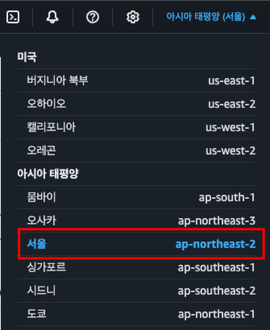
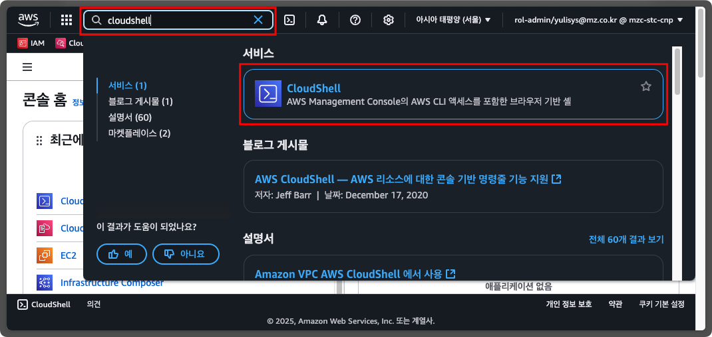
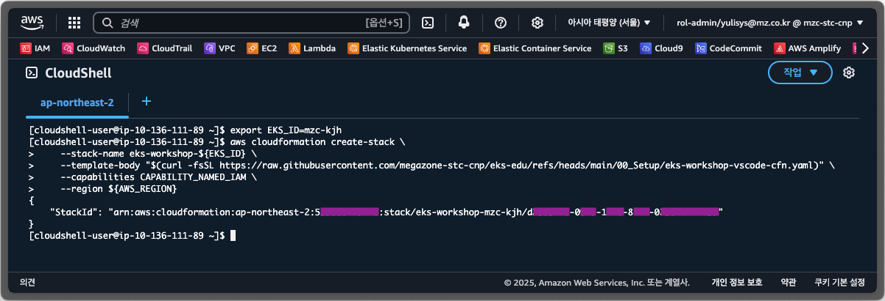
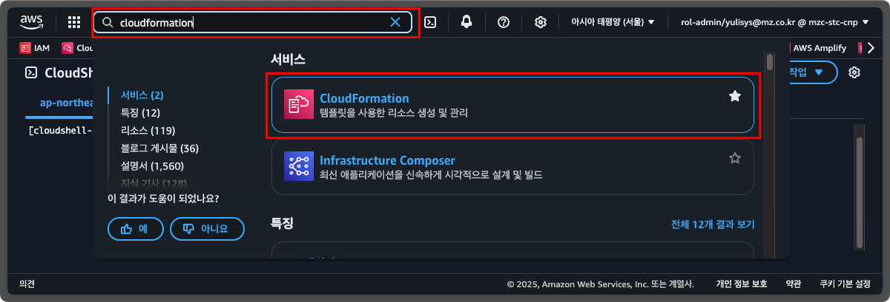
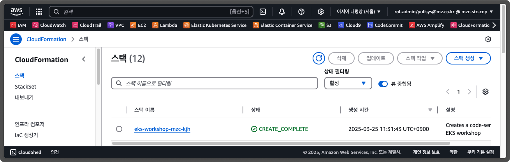
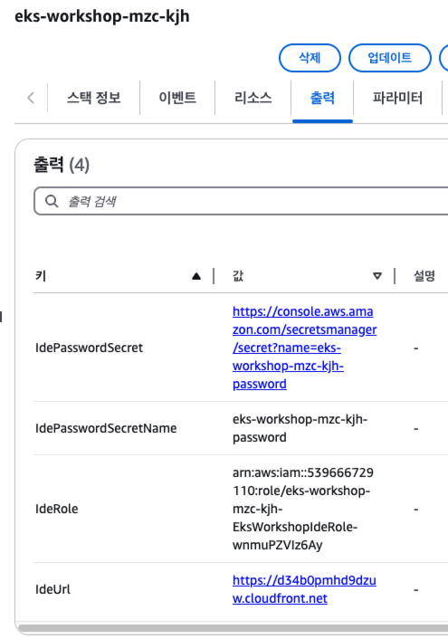
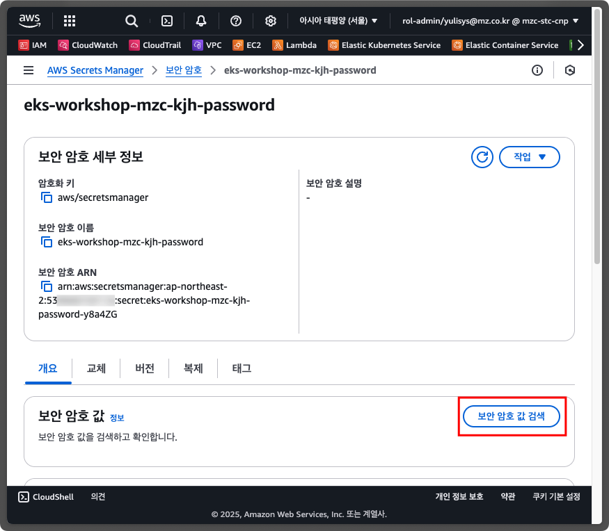
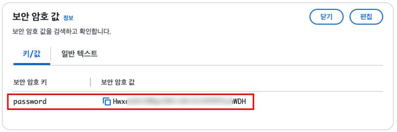
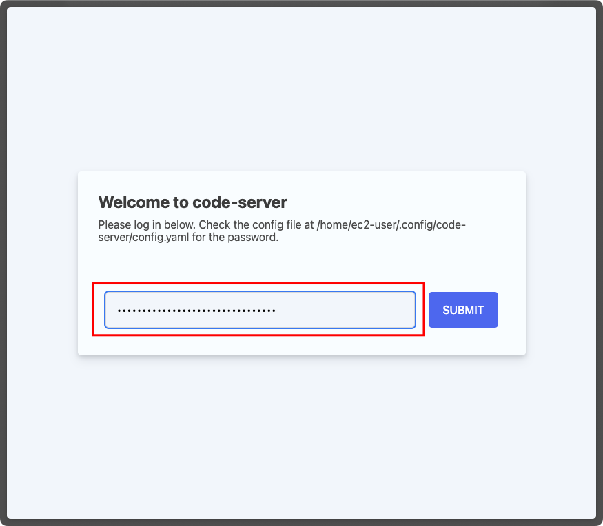
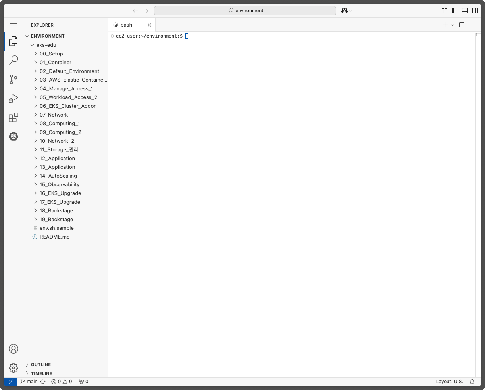

# AWS EKS 교육

<!-- 
## 문서 작성 포맷
1. 목표
2. 이론
3. 사전 조건
4. 실습
5. 정리 
-->

AWS EKS에 대해 기초부터 고급주제까지 학습하실 수 있도록 교육 자료를 제공합니다.

## 0. 교육 환경 구성하기

EKS 교육 진행을 위해 먼저, 사용하실 AWS 계정에 `code-server` 및 관련 기초 인프라를 생성해야 합니다.

AWS에 로그인 한 후, CloudShell로 이동하여 다음 명령어를 입력해 주세요.

1. 지역 선택
   
   

2. CloudShell 검색해 이동
   
   

3. `code-server` 생성용 CloudFormation 실행

   `EKS_ID` 환경 변수에 사용하기를 원하는 ID를 지정합니다.
   `EKS_ID` 변수는 `code-server` 생성용 CloudFormation에 사용됩니다.
   ```shell
   export EKS_ID=mzc-kjh
   ```

   CloudShell 에서 아래 명령을 실행하여 `code-server` 생성을 위한 CloudFormation Stack을 생성합니다. (대략 10분 정도 소요됩니다.)

   ```shell
   aws cloudformation create-stack \
       --stack-name eks-workshop-${EKS_ID} \
       --template-body "$(curl -fsSL https://raw.githubusercontent.com/megazone-stc-cnp/eks-edu/refs/heads/main/00_Setup/eks-workshop-vscode-cfn.yaml)" \
       --capabilities CAPABILITY_NAMED_IAM \
       --region ${AWS_REGION}
   ```
   

   CloudFormation으로 이동하여 'eks-workshop-${EKS_ID}' 스택의 상태를 확인하여 `CREATE_COMPLETE`가 될때까지 기다립니다.

   
   
   
   CloudFormation의 출력(Outputs) 탭에서 code-server 접속을 위한 정보를 확인할 수 있습니다.

   

   - `IdeUrl`에는 `code-server` IDE를 접속할 수 있는 URL입니다.
   
   - `IdePasswordSecret`에는 `code-server` IDE 접속 시 사용할 비밀번호가 저장된 AWS Secrets Manager의 보안 암호를 확인할 수 있는 링크입니다.

4. `code-server` 접속
   
   `code-server` 접속 비밀번호를 얻기위해 `IdePasswordSecret` 링크를 클릭하여 AWS Secrets Manager로 이동한 후, `개요` 탭에서 `보안 암호 값 검색`(Retrieve secret value) 버튼을 클립합니다.
   

   화면에 표시된 비밀번호를 복사합니다.
   

   CloudFormation의 `IdeUrl` 링크를 클릭한 후, 비밀번호에 이전에 복사한 비밀번호를 붙여넣기 한 후, `SUBMIT` 버튼을 클릭합니다.
   

   접속 후, 아래와 같은 화면이 뜨면 실습 환경이 정상적으로 생성된 것입니다.🎉🎉🎉
   

## 1. Container 기술 일반
1. 

## 2. 기본 환경 생성

## 3. AWS Elasic Container Registry

## 4. 보안 1

## 5. 보안 2

## 6. EKS Cluster 추가 기능 관리

## 7. 네트워크 관리

## 8. 컴퓨팅 관리 1

## 9. 컴퓨팅 관리 2

## 10. 네트워크 관리 2

## 11. Storage 관리

## 12. Application 배포 이론 및 실습

## 13. Application 배포 고급

## 14. AutoScaling

## 15. Observability

## 16. EKS Upgrade 이론

## 17. EKS Upgrade 실습

## 18. Backstage 이론

## 19. Backstage 실습
