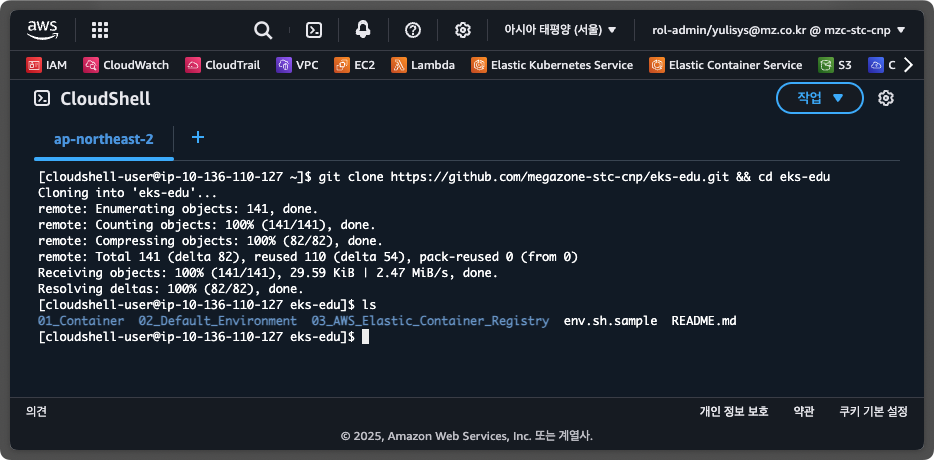

# AWS EKS 교육

## 문서 작성 포맷
1. 목표
2. 이론
3. 사전 조건
4. 실습

AWS EKS에 대해 기초부터 고급주제까지 학습하실 수 있도록 교육 자료를 제공합니다.

## 문서 작성
## 0. 교육 환경 구성하기

EKS 교육 진행을 위해 먼저, 사용하실 AWS 계정에 `code-server` 및 관련 기초 인프라를 생성해야 합니다.

AWS에 로그인 한 후, CloudShell로 이동하여 다음 명령어를 입력해 주세요.

1. 지역 선택

   

2. CloudShell 검색해 이동

   

3. Git Clone 후 `eks-edu`로 이동

   ```$ git clone https://github.com/megazone-stc-cnp/eks-edu.git && cd eks-edu```
   

4. `code-server` 생성용 CloudFormation 실행

    `EKS_ID` 환경 변수에 사용하기를 원하는 ID를 지정합니다.
    ```shell
    export EKS_ID=mzc-kjh
    ```
    (`code-server` 생성용 CloudFormation에 사용할 'suffix' 입니다.)

    `code-server` 설치용 CloudFormation 파일을 다운로드 받습니다.
    ```
    curl
    ```

    ```shell
    aws cloudformation create-stack \
        --stack-name eks-workshop-${EKS_ID} \
        --template-body $(curl -fsSL https://raw.githubusercontent.com/megazone-stc-cnp/eks-edu/refs/heads/main/01_Container/eks-workshop-vscode-cfn.yaml) \
        --capabilities CAPABILITY_NAMED_IAM \
        --region ${AWS_REGION}
    ```

## 1. Container 기술 일반
1. 

## 2. 기본 환경 생성

## 3. AWS Elasic Container Registry

## 4. 보안 1

## 5. 보안 2

## 6. EKS Cluster 추가 기능 관리

## 7. 네트워크 관리

## 8. 컴퓨팅 관리 1

## 9. 컴퓨팅 관리 2

## 10. 네트워크 관리 2

## 11. Storage 관리

## 12. Application 배포 이론 및 실습

## 13. Application 배포 고급

## 14. AutoScaling

## 15. Observability

## 16. EKS Upgrade 이론

## 17. EKS Upgrade 실습

## 18. Backstage 이론

## 19. Backstage 실습
